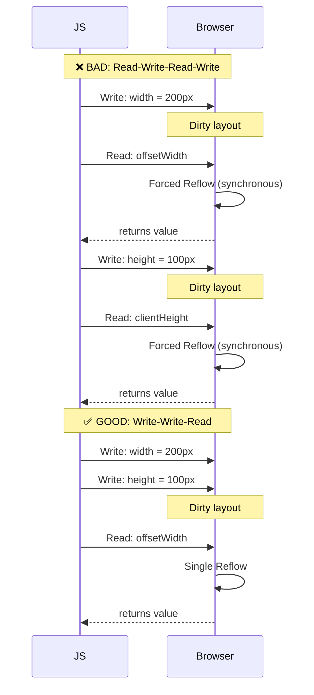

# Reflow (Layout Invalidation)

## Overview

**Reflow** (also called **layout invalidation**) is the process of recalculating the positions and geometries of elements in the document. It is triggered when a **layout-affecting property** changes. Reflow is **synchronous** and **expensive** because the browser must recompute the entire affected subtree.

## What Triggers Reflow

### 1. DOM Mutations

```javascript
// Adding/removing elements
document.body.appendChild(newDiv);        // Reflow
document.body.removeChild(oldDiv);        // Reflow

// Changing element content
el.textContent = 'New text';              // Reflow (if size changes)
el.innerHTML = '<span>New HTML</span>';   // Reflow
```

### 2. Style Changes

```javascript
// These properties ALWAYS trigger reflow:
el.style.width = '200px';                 // Reflow
el.style.height = '100px';                // Reflow
el.style.padding = '20px';               // Reflow
el.style.margin = '10px';                // Reflow
el.style.display = 'none';               // Reflow (full document)
el.style.fontSize = '18px';              // Reflow (text wrapping)
el.style.position = 'absolute';          // Reflow
el.style.top = '50px';                   // Reflow

// These properties trigger repaint but NOT reflow:
el.style.color = 'red';                  // Repaint only
el.style.backgroundColor = 'blue';       // Repaint only
el.style.visibility = 'hidden';          // Repaint only
el.style.boxShadow = '...';              // Repaint only
```

### 3. Window Resize

```javascript
window.addEventListener('resize', () => {
  // Triggers reflow for the entire document
  // Throttle or debounce this handler!
});
```

### 4. CSS Pseudo-class Activation

```css
/* :hover changing properties triggers reflow */
a:hover {
  border: 2px solid blue;   /* Reflow */
  font-size: 18px;           /* Reflow */
}
```

### 5. Reading Layout Properties (Forced Reflow)

This is the most common **unintentional** reflow trigger:

```javascript
// Reading these properties forces a synchronous reflow if layout is dirty:
el.offsetWidth
el.offsetHeight
el.offsetTop
el.offsetLeft
el.clientWidth
el.clientHeight
el.clientTop
el.clientLeft
el.scrollWidth
el.scrollHeight
el.scrollTop
el.scrollLeft

getComputedStyle(el).width
getComputedStyle(el).height
// Any getComputedStyle property that is a layout-dependent property

el.getBoundingClientRect()
el.getClientRects()
```

## Cost of Reflow

Reflow is expensive because it's **synchronous** and **cascading** — changing one element can affect many others.

### Reflow Propagation

```mermaid
graph TD
    A[Change div#main width] --> B[Reflow div#main]
    B --> C[Reflow all children]
    C --> D[Reflow descendants]
    B --> E[Reflow siblings after div#main]
    E --> F[Reflow their children]
    B --> G[Reflow ancestors (if size changed)]
    G --> H[Recalculate document layout]
    
    style A fill:#f99,stroke:#f00
    style H fill:#f66,stroke:#f00
```

### Performance Impact Example

```html
<div id="container"></div>
<script>
  const container = document.getElementById('container');
  
  // ❌ TERRIBLE: 1000 forced reflows
  console.time('bad');
  for (let i = 0; i < 1000; i++) {
    container.appendChild(document.createElement('div'));
    console.log(container.offsetHeight);  // Forces reflow on every iteration
  }
  console.timeEnd('bad');  // ~200ms
  
  // ✅ GOOD: 2 reflows (1 append, 1 read)
  console.time('good');
  for (let i = 0; i < 1000; i++) {
    container.appendChild(document.createElement('div'));
  }
  console.log(container.offsetHeight);  // Single forced reflow after all appends
  console.timeEnd('good');  // ~5ms
</script>
```

### Reflow Cost Hierarchy

```
Cost ─────────────────────────────────────────────────
│                                                      │
│  Full Document Reflow  ████████████████████████████  │
│  Subtree Reflow        ████████████████              │
│  Element Only Reflow   ████████                      │
│  Repaint Only          ████                          │
│  Composite Only        ██                            │
└──────────────────────────────────────────────────────
```

## Minimizing Reflows

### 1. Batch Style Changes

```javascript
// ❌ Multiple individual changes (3 reflows)
el.style.width = '100px';
el.style.height = '100px';
el.style.margin = '10px';

// ✅ Batch with cssText (1 reflow)
el.style.cssText = 'width: 100px; height: 100px; margin: 10px;';

// ✅ Batch with classList (1 reflow)
el.classList.add('active');
```

### 2. Read Before Write (or Write Before Read)



### 3. Off-DOM Manipulation

```javascript
// ❌ In-document manipulation (reflows on every change)
const list = document.getElementById('list');
for (let i = 0; i < 1000; i++) {
  const li = document.createElement('li');
  li.textContent = `Item ${i}`;
  list.appendChild(li);  // Reflow each time!
}

// ✅ DocumentFragment (1 reflow at the end)
const list = document.getElementById('list');
const frag = document.createDocumentFragment();
for (let i = 0; i < 1000; i++) {
  const li = document.createElement('li');
  li.textContent = `Item ${i}`;
  frag.appendChild(li);
}
list.appendChild(frag);  // Single reflow

// ✅ display: none → manipulate → display: block
const list = document.getElementById('list');
list.style.display = 'none';  // Reflow
// Do many manipulations (no reflows because element is not rendered)
const frag = document.createDocumentFragment();
for (let i = 0; i < 1000; i++) {
  const li = document.createElement('li');
  li.textContent = `Item ${i}`;
  frag.appendChild(li);
}
list.appendChild(frag);
list.style.display = 'block';  // Single reflow
```

### 4. Avoid Touch/MouseMove Handlers

```javascript
// ❌ BAD: triggers reflow on every mouse move
element.addEventListener('mousemove', () => {
  element.style.left = `${element.offsetLeft + 1}px`;  // Read + Write = Reflow
});

// ✅ GOOD: debounce, or use transform
element.addEventListener('mousemove', () => {
  // transform does NOT trigger reflow
  element.style.transform = `translateX(${x + 1}px)`;
});
```

## Forced Synchronous Layouts (FSL)

A **forced synchronous layout** happens when you read a layout property after writing to the DOM without letting the browser paint in between.

### DevTools Detection

Chrome DevTools can highlight forced reflows:

1. Open DevTools → Rendering tab
2. Enable **"Paint flashing"** and **"Layout Shift Regions"**
3. Record in **Performance** panel
4. Look for red triangles ⚠️ on Layout events

```
Performance Panel View:
┌─────────────────────────────────────────────────────┐
│ Main ───────────────────────────────────────────    │
│                                                      │
│  [Layout]  [Layout ⚠️]  [Layout ⚠️]  [Paint]       │
│           ↳ Forced reflow in app.js:42              │
│           ↳ Forced reflow in app.js:55              │
└─────────────────────────────────────────────────────┘
```

### Example: Building a Table Dynamically

```javascript
// ❌ BAD: Forced reflow in loop
const table = document.getElementById('table');
for (let row = 0; row < 100; row++) {
  const tr = document.createElement('tr');
  for (let col = 0; col < 10; col++) {
    const td = document.createElement('td');
    td.textContent = `${row},${col}`;
    tr.appendChild(td);
  }
  table.appendChild(tr);
  // ❌ FSL: reading offsetHeight after each append
  console.log('Row', row, 'height:', table.offsetHeight);
}
```

## Practical Performance Examples

### Example 1: Animation with position

```css
/* ❌ BAD: position-based animation triggers reflow */
.box {
  position: absolute;
  left: 0;
  animation: slide 2s linear infinite;
}
@keyframes slide {
  to { left: 500px; }  /* Triggers layout every frame */
}

/* ✅ GOOD: transform-based animation no reflow */
.box {
  position: absolute;
  transform: translateX(0);
  animation: slide 2s linear infinite;
}
@keyframes slide {
  to { transform: translateX(500px); }  /* Composite-only */
}
```

### Example 2: Reading Elements in a Loop

```javascript
const items = document.querySelectorAll('.item');

// ❌ BAD: Layout thrashing
for (const item of items) {
  const width = item.offsetWidth;      // Read
  item.style.width = `${width * 2}px`;  // Write → forces reflow next iteration
}

// ✅ GOOD: Batch reads then writes
const widths = [];
for (const item of items) {
  widths.push(item.offsetWidth);       // Read all
}
for (let i = 0; i < items.length; i++) {
  items[i].style.width = `${widths[i] * 2}px`;  // Write all
}
```

### Example 3: Scroll Handler

```javascript
// ❌ BAD: Forced reflow on every scroll
window.addEventListener('scroll', () => {
  const header = document.querySelector('header');
  header.style.opacity = 1 - window.scrollY / 500;  // No reflow (opacity)
  header.style.color = window.scrollY > 200 ? '#fff' : '#000';  // No reflow
  // But...
  header.style.height = `${Math.max(50, 100 - window.scrollY / 10)}px`;  // REFLOW!
});

// ✅ GOOD: Use transform and opacity only
window.addEventListener('scroll', () => {
  const header = document.querySelector('header');
  header.style.opacity = 1 - window.scrollY / 500;
  header.style.transform = `scaleY(${Math.max(0.5, 1 - window.scrollY / 1000)})`;
  // No reflow, composite only
}, { passive: true });
```

## Key Takeaways

- **Layout property reads** (`offsetHeight`, `getBoundingClientRect`) **force synchronous reflow** when layout is dirty
- **Reflow is cascading** — one element change can affect ancestors and descendants
- **Batch reads and writes** — never interleave them
- **Use `display: none`** to batch massive DOM changes off-screen
- **Use `transform` and `opacity`** for animations — they skip layout and paint
- **Detect forced layouts** in DevTools Performance panel
- **A single forced layout** is okay; **thousands in a loop** is catastrophic
