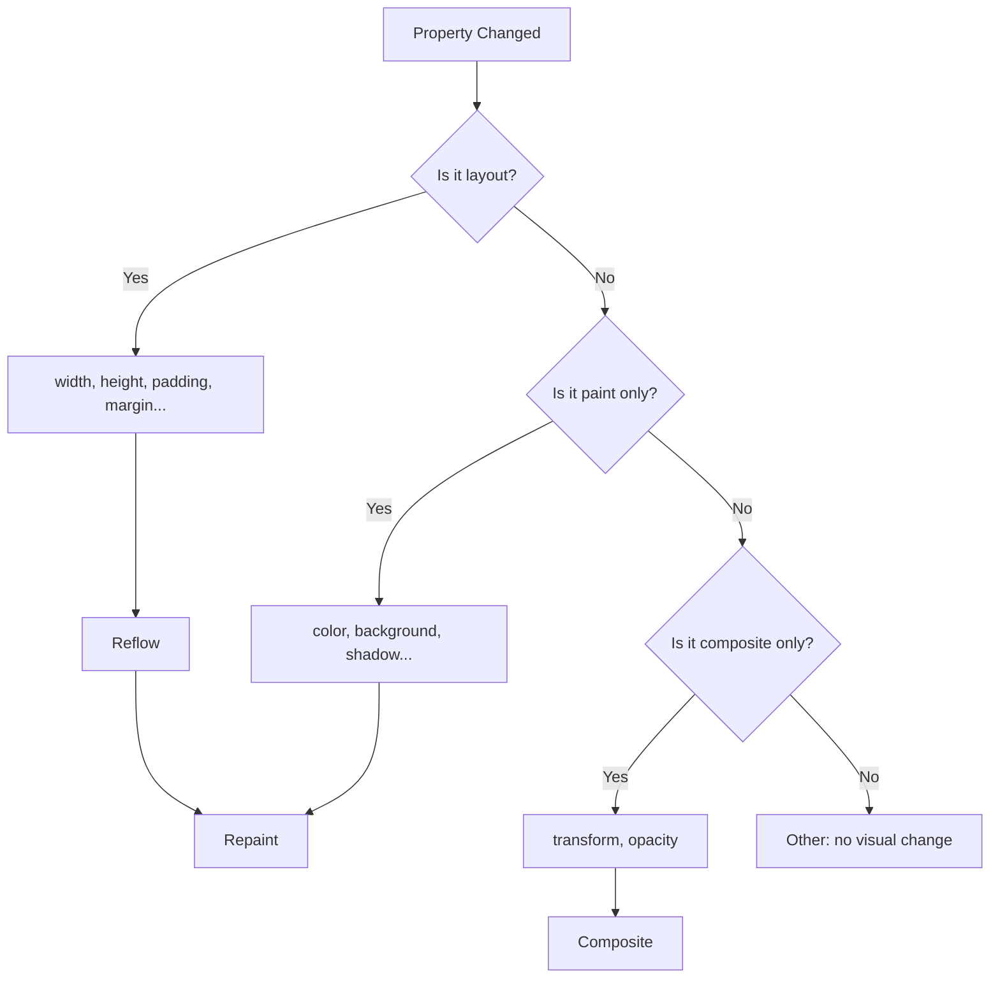

# Repaint

## Overview

**Repaint** (also called **paint invalidation**) occurs when changes to an element's **visual properties** don't affect its geometry. Repaint is cheaper than reflow but still expensive, especially for large or complex painted areas.

## What Triggers Repaint

### Visual Property Changes (No Layout Impact)

| Property | Cost |
|---|---|
| `color` | Moderate (text re-rendering) |
| `background-color` | Low (fill area) |
| `background-image` | High (image decode + paint) |
| `background-position` | Moderate |
| `box-shadow` | High (blur is expensive) |
| `text-shadow` | High (blur is expensive) |
| `outline` | Low |
| `border-color` | Low (no geometry change) |
| `border-radius` | High (clip + rounding) |
| `visibility: hidden` | Moderate (repaint area) |
| `opacity` | Low (can be composited) |

### Visual Property Change Map



## Paint Areas

When a repaint is triggered, the browser invalidates a **rectangular region** and repaints it:

```
Document:
┌────────────────────────────────────────────┐
│  ┌──────┐                                  │
│  │  A   │  Only element A's background     │
│  │      │  changed → repaint region is     │
│  └──────┘  the red rectangle               │
│                                            │
│  ┌─────────────────┐                       │
│  │       B         │  If element B changed │
│  │                 │  color, its paint     │
│  └─────────────────┘  region is yellow     │
│                                            │
│  ┌────────────────────────────────────┐    │
│  │  C (has box-shadow)               │    │
│  │  If C changes color, paint region │    │
│  │  includes shadow area (green)     │    │
│  └────────────────────────────────────┘    │
└────────────────────────────────────────────┘
```

## Paint Optimizations

### 1. Avoid Expensive Visual Properties

```css
/* ❌ EXPENSIVE: Large blur radius → slow paint */
.shadow-heavy {
  box-shadow: 0 0 50px rgba(0,0,0,0.5);
}

/* ✅ CHEAPER: Smaller blur → faster paint */
.shadow-light {
  box-shadow: 0 2px 4px rgba(0,0,0,0.2);
}

/* ❌ EXPENSIVE: Many text shadows */
.text-fancy {
  text-shadow: 2px 2px 2px #000, -2px -2px 2px #000, 0 0 4px #fff;
}

/* ✅ CHEAPER: Fewer/no shadows */
.text-simple {
  text-shadow: 1px 1px 1px #000;
}
```

### 2. Minimize Paint Area

```css
/* ❌ BAD: Full element repainted on hover */
.card {
  transition: background-color 0.3s;
}
.card:hover {
  background-color: #f0f0f0;
}

/* ✅ BETTER: Use pseudo-element overlay */
.card {
  position: relative;
}
.card::after {
  content: '';
  position: absolute;
  inset: 0;
  background-color: transparent;
  transition: background-color 0.3s;
  pointer-events: none;
}
.card:hover::after {
  background-color: rgba(0,0,0,0.05);
}
```

### 3. Promote to Own Layer (Use Carefully)

```css
/* Forces element onto its own paint layer */
.promoted {
  will-change: transform;
  /* Or: transform: translateZ(0); */
  /* Or: backface-visibility: hidden; */
}
```

This creates a **compositor layer**, so repainting this element doesn't affect the rest of the page. However, creating too many layers wastes memory.

### 4. Use Opacity Instead of Visibility

```css
/* visibility: hidden still paints the element (just invisible) */
/* display: none removes it from render tree entirely */
/* opacity: 0 is the cheapest if composited */

.hide-opacity {
  opacity: 0;       /* Can skip repaint if promoted */
}
.hide-visibility {
  visibility: hidden;  /* Triggers repaint */
}
```

## will-change Property

`will-change` hints to the browser what properties will change, so it can optimize ahead of time:

```css
.element {
  will-change: transform, opacity;
  /* Browser promotes this to a compositor layer */
}

/* 🚨 DON'T: Apply to too many elements */
.every-item {
  will-change: transform;  /* Each item gets a layer → memory bloat */
}

/* ✅ DO: Apply before the change, remove after */
.element {
  transition: transform 0.3s;
}
.element:hover {
  /* Or set will-change in JS on mouseenter, remove on mouseleave */
}
```

## translate vs position

```css
/* ❌ BAD: Triggers layout + paint every frame */
.box-animate-left {
  position: absolute;
  left: 0;
  transition: left 0.3s;
}
.box-animate-left:hover {
  left: 100px;  /* Layout → Paint → Composite */
}

/* ✅ GOOD: Composite only */
.box-animate-transform {
  transform: translateX(0);
  transition: transform 0.3s;
}
.box-animate-transform:hover {
  transform: translateX(100px);  /* Composite only */
}
```

### Performance Comparison

| Animation | Layout | Paint | Composite | Frame Budget |
|---|---|---|---|---|
| `left: 0 → 100px` | ✅ Yes | ✅ Yes | ✅ Yes | ~3ms + paint time |
| `margin-left: 0 → 100px` | ✅ Yes | ✅ Yes | ✅ Yes | ~3ms + paint time |
| `transform: translateX(100px)` | ❌ No | ❌ No | ✅ Yes | ~0.3ms |
| `opacity: 1 → 0` | ❌ No | ❌ No | ✅ Yes | ~0.2ms |
| `background-color` change | ❌ No | ✅ Yes | ✅ Yes | ~1ms + paint time |

## Paint Profiling in Chrome DevTools

### Enabling Paint Flashing

1. Open DevTools (F12)
2. Press `Ctrl+Shift+P` → type "Rendering"
3. Check **"Paint flashing"**

```
┌─────────────────────────────────────────────┐
│  [x] Paint flashing                          │
│  [ ] Layout Shift Regions                    │
│  [ ] Frame Rendering Stats                   │
│  [x] Layer borders                            │
│                                              │
│  Page shows green rectangles where paint    │
│  occurs. Flashing green = repaint area.     │
└─────────────────────────────────────────────┘
```

Green rectangles indicate repainted areas. More green = more paint work.

### Performance Panel Analysis

```javascript
// Measure specific paint operations
performance.mark('paint-start');
// ... code that triggers repaint ...
requestAnimationFrame(() => {
  performance.mark('paint-end');
  performance.measure('paint-duration', 'paint-start', 'paint-end');
});
```

In the **Performance** panel:

```
┌──────────────────────────────────────────────────┐
│ Main ────────────────────────────────────────    │
│   Layout   Paint    Paint    Composite    Paint  │
│   ──────   ─────    ─────    ─────────    ─────  │
│   [██]     [███]    [███]    [██]         [███]  │
│            ↑  ↑              ↑                   │
│            │  └─ slow paint (box-shadow)         │
│            └──── paint (background change)       │
│                                                   │
│ ❌ Problem: Large paint regions on scroll         │
│    Possible fix: promote to layer                 │
└──────────────────────────────────────────────────┘
```

### Layers Panel

DevTools → Layers panel shows which elements have their own layer:

```
┌──────────────────────────────────────────────────┐
│ Layers Panel                                      │
│  ┌────────────────────────────────────────────────┐│
│  │ Document                                       ││
│  │  └─ div#root           (size: 1920×1080)       ││
│  │     ├─ nav             (size: 1920×60)         ││
│  │     ├─ main            (size: 1920×860)        ││
│  │     └─ div.sticky-ad   (size: 300×250) 🔒     ││
│  │                                                ││
│  │ 🔒 = composited layer                         ││
│  │                                                 │
│  │ ⚠️ Warning: 15 layers found (>10 recommended)  ││
│  └────────────────────────────────────────────────┘│
└──────────────────────────────────────────────────┘
```

## Real-World Example: Paint Storm

```html
<!-- ❌ BAD: Hover triggers heavy repaint on many elements -->
<ul class="list">
  <li class="item" style="--i: 1">Item 1</li>
  <li class="item" style="--i: 2">Item 2</li>
  <!-- ... 100 items ... -->
</ul>

<style>
  .item {
    transition: all 0.3s;
  }
  .item:hover {
    background: linear-gradient(135deg, #667eea 0%, #764ba2 100%);
    box-shadow: 0 10px 30px rgba(0,0,0,0.3);
    transform: scale(1.05);
  }
</style>
```

**Problem**: Hovering triggers:
1. **Reflow** (scale changes size)
2. **Heavy repaint** (gradient background + blur shadow)
3. Layout thrashing if JS reads layout in loop

**✅ Fixed version:**

```css
.item {
  transition: transform 0.3s, opacity 0.3s;
  /* Move expensive paints to a pseudo-element */
  position: relative;
}
.item::before {
  content: '';
  position: absolute;
  inset: 0;
  background: linear-gradient(135deg, #667eea 0%, #764ba2 100%);
  opacity: 0;
  transition: opacity 0.3s;
  border-radius: inherit;
  z-index: -1;
}
.item:hover {
  transform: scale(1.05);
}
.item:hover::before {
  opacity: 1;
}
```

## Key Takeaways

- **Repaint ≠ Reflow** — repaint is only visual property changes
- **Expensive paint properties**: `box-shadow`, `text-shadow`, gradients, `border-radius` with clipping
- **will-change: transform** promotes to compositor layer but use sparingly
- **`transform` and `opacity`** are the cheapest to animate (composite only)
- **Use DevTools paint flashing** to identify excessive repaint areas
- **Layer promotion** is a trade-off: less repaint but more memory
- **Background gradients** repaint more than solid colors
