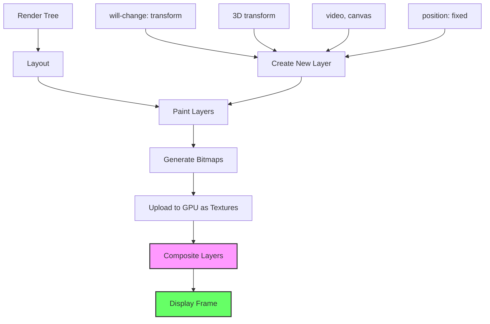
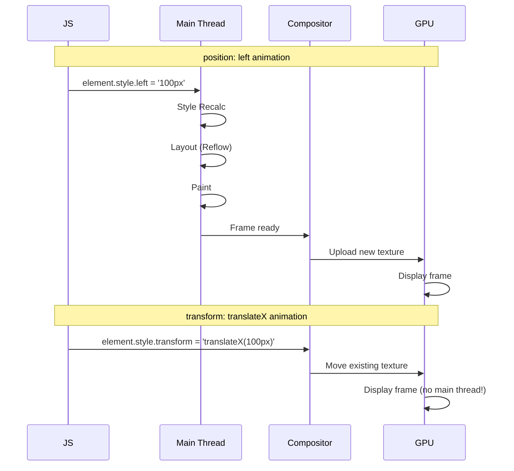

# Compositing

## Overview

**Compositing** is the final phase of the rendering pipeline where individual painted layers are combined into the final image displayed on screen. Modern browsers use the **GPU** to composite layers efficiently.

## Compositing Pipeline



## Compositing Layers

### Without Compositing Layers

All elements painted on a single bitmap:

```
┌─────────────────────────────────────────┐
│  Layer 0 (Single Bitmap)                │
│  ┌────────────────────────────────┐     │
│  │  Header                        │     │
│  ├────────────────────────────────┤     │
│  │                                │     │
│  │  Content (repaint all when     │     │
│  │  header changes)               │     │
│  │                                │     │
│  └────────────────────────────────┘     │
│  ┌────────────────────────────────┐     │
│  │  Footer                        │     │
│  └────────────────────────────────┘     │
└─────────────────────────────────────────┘
```

**Problem**: If the header changes, the entire document must be repainted.

### With Compositing Layers

```
┌─────────────────────────────────────────┐
│  Layer 0 (Background)                   │
│  ┌────────────────────────────────┐     │
│  │  (empty, shared)               │     │
│  └────────────────────────────────┘     │
├─────────────────────────────────────────┤
│  Layer 1 (Header - GPU texture)         │
│  Can animate without affecting content  │
├─────────────────────────────────────────┤
│  Layer 2 (Content scrollable area)      │
├─────────────────────────────────────────┤
│  Layer 3 (Fixed footer)                 │
├─────────────────────────────────────────┤
│  Composited Output on Screen            │
│  ┌──────────────────────────────┐       │
│  │ Layer 1 (Header)             │       │
│  ├──────────────────────────────┤       │
│  │ Layer 2 (Content)           │       │
│  ├──────────────────────────────┤       │
│  │ Layer 3 (Footer)            │       │
│  └──────────────────────────────┘       │
└─────────────────────────────────────────┘
```

**Benefit**: Header can animate with transforms without repainting content.

## How Compositing Works

### Painting Order

Elements are painted in a specific order (back to front):

```
Painting Order (specified by CSS):
1.  Background of root element
2.  Negative z-index stacking contexts
3.  Block backgrounds and borders
4.  Floats
5.  Inline content
6.  Non-positioned elements
7.  z-index: 0 stacking contexts
8.  Positive z-index stacking contexts
```

### Stacking Contexts

A stacking context is created by:

```css
/* These create a new stacking context: */
.element {
  position: relative;
  z-index: 1;                    /* Must have z-index */
  
  /* Or any of these: */
  opacity: less than 1;
  transform: not none;
  filter: not none;
  will-change: transform;
  isolation: isolate;
  mix-blend-mode: not normal;
  contain: layout | paint;
  
  /* CSS Grid/Flex children with z-index: auto */
}
```

```
Stacking Context Hierarchy:
┌─── Root Stacking Context ─────────────────────┐
│  z-index: -1  (behind everything)              │
│    └── div.background-decoration               │
│                                                 │
│  z-index: auto (normal flow)                   │
│    └── nav, main, footer                       │
│                                                 │
│  z-index: 1  (first stacking context)          │
│    └── div.modal-backdrop                      │
│         └── z-index: 2 (inside modal)          │
│              └── div.modal-content             │
│                                                 │
│  z-index: 9999 (fixed header)                  │
│    └── header.sticky                           │
└─────────────────────────────────────────────────┘
```

## GPU Compositing


### The Process

1. **CPU** paints each layer into a bitmap
2. Bitmap is **uploaded to GPU** as a texture (via WebGL or DirectX/OpenGL)
3. **GPU** composites textures together using shaders (applying transforms, opacity, etc.)
4. Result is written to the **frame buffer**
5. Display controller reads frame buffer and shows on screen

### GPU Composition Shader (simplified)

```glsl
// Simplified fragment shader for compositing
uniform sampler2D layers[4];
uniform vec2 positions[4];
uniform float opacities[4];

void main() {
  vec4 finalColor = vec4(0, 0, 0, 0);
  
  // Composite layers back to front
  for (int i = 3; i >= 0; i--) {
    vec2 uv = (gl_FragCoord.xy - positions[i]) / textureSize(layers[i], 0);
    vec4 layerColor = texture2D(layers[i], uv);
    layerColor.a *= opacities[i];
    
    // Alpha blending
    finalColor = layerColor + finalColor * (1.0 - layerColor.a);
  }
  
  gl_FragColor = finalColor;
}
```

## will-change and Layer Promotion

### Layer Creation Heuristics

The browser creates layers based on these heuristics:

| Condition | Example | Layer Created |
|---|---|---|
| 3D transform | `transform: translateZ(0)` | ✅ Yes |
| `will-change` | `will-change: transform` | ✅ Yes |
| `position: fixed` | Popup, header | ✅ Yes |
| Video/Canvas elements | `<video>`, `<canvas>` | ✅ Yes |
| CSS animation of transform/opacity | `@keyframes` | ✅ Yes |
| `backface-visibility: hidden` | CSS flip animation | ✅ Yes |
| Direct child of composited layer | if promoted | ✅ Sometimes |
| Large element with scroll | Overflow scroll | ✅ Yes |
| `opacity` < 1 | Semi-transparent | ✅ Yes (sometimes) |
| `filter` | Blur, drop-shadow | ✅ Yes (often) |

### Layer Explosion (🚨 Problem)

```css
/* ❌ BAD: Every .item gets its own layer (memory bloat) */
.items-container > * {
  will-change: transform;
}
/* This creates N layers for N items — GPU memory disaster! */

/* ✅ GOOD: Only promote the container */
.items-container {
  will-change: transform;
}
```

Layer count in DevTools (Layers panel):

```
Layers: 350          ← Too many!
├── div.item (232)   ← Each list item is its own layer
├── div.item (233)
├── div.item (234)
...
Memory: GPU 450 MB   ← Excessive memory usage
```

## Paint Order and Composite Order

```mermaid
graph TD
    subgraph "Paint Order (Document Order)"
        A[Bg: page] --> B[Bg: header]
        B --> C[Text: header]
        C --> D[Bg: sidebar]
        D --> E[Text: sidebar]
        E --> F[Bg: main]
        F --> G[Text: main]
        G --> H[Bg: footer]
        H --> I[Text: footer]
    end
    
    subgraph "Composite Order (Back to Front)"
        J[Layer: background] --> K[Layer: sidebar]
        K --> L[Layer: main content]
        L --> M[Layer: header]
        M --> N[Layer: sticky footer]
    end
```



## transform/opacity Compositing

### Why Transforms and Opacity Are Cheap



**Key insight**: `transform` and `opacity` changes **bypass the main thread** entirely once the element is on its own compositor layer.

### Animation Efficiency Comparison

```
Property Animation:              Layout    Paint    Composite   Main Thread
───────────────────────────────────────────────────────────────────────────
position: left → right           ✅ Yes    ✅ Yes    ✅ Yes     ⬆ Busy
margin-left: 0 → 100px           ✅ Yes    ✅ Yes    ✅ Yes     ⬆ Busy
width: 100 → 200px              ✅ Yes    ✅ Yes    ✅ Yes     ⬆ Busy
transform: translateX(100px)     ❌ No     ❌ No     ✅ Yes     ⬇ Idle ✓
opacity: 1 → 0.5                ❌ No     ❌ No     ✅ Yes     ⬇ Idle ✓
```

## Layer Borders in DevTools

Enable **Layer Borders** in DevTools → Rendering:

```
Layer Borders legend:
  ─── Blue outline    = Normal composited layer
  ─── Orange outline  = Layer with large size (potential problem)
  ─── Green outline   = Layer that uses GPU compositing
  ─── Red outline     = Layer that's being repainted often
  
  ═══ Solid thick     = Layer requires its own backing store
  
  ┌──────────────────────────────────────────────┐
  │  ┌────────────────────────────────────────┐  │
  │  │  Blue border = composited layer        │  │
  │  │  (Header with position: fixed)         │  │
  │  └────────────────────────────────────────┘  │
  │                                               │
  │  ┌──────────────────────────────────────┐    │
  │  │  No border = no layer promotion      │    │
  │  │  (Normal flow content)               │    │
  │  └──────────────────────────────────────┘    │
  └──────────────────────────────────────────────┘
```

## Real-World Example: Smooth 60fps Animation

```html
<!-- ❌ JANKY: Triggers layout -->
<div class="card" style="position: relative; left: 0;">
  Hover me
</div>
<style>
  .card {
    transition: left 0.3s, top 0.3s;
  }
  .card:hover {
    left: 20px;
    top: 20px;
  }
</style>

<!-- ✅ SMOOTH: Composite only -->
<div class="card" style="transform: translate(0, 0);">
  Hover me
</div>
<style>
  .card {
    transition: transform 0.3s;
    will-change: transform;
  }
  .card:hover {
    transform: translate(20px, 20px);
  }
</style>
```

## Key Takeaways

- **Compositing** combines painted layers into the final screen image
- **GPU compositing** moves bitmaps to GPU memory for fast blending
- **Layer promotion** isolates elements for independent repainting
- **`transform` and `opacity`** are the only GPU-composited properties (no main thread involvement)
- **Too many layers** causes excessive GPU memory — promote judiciously
- **Stacking contexts** determine paint order within layers
- **DevTools Layers panel** helps debug compositing issues
- **60fps animations** require avoiding layout and paint on every frame
