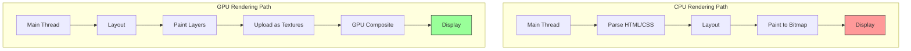
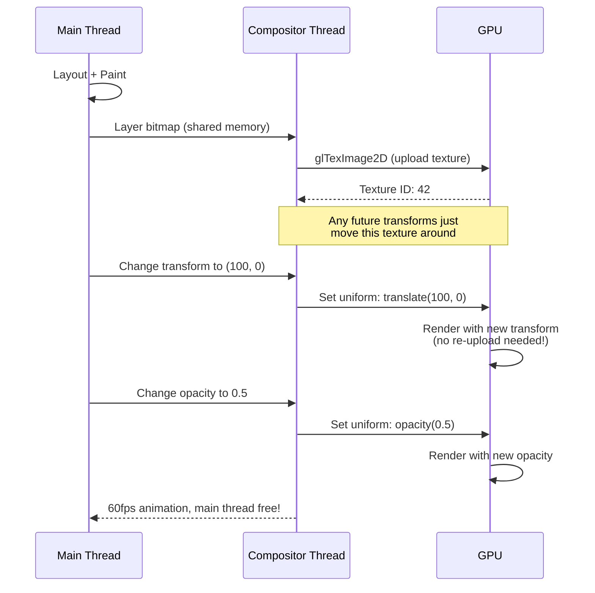
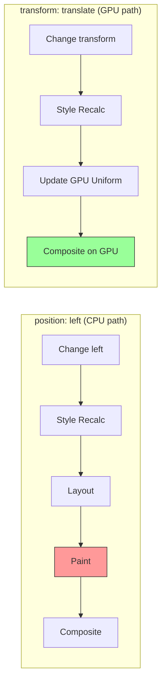

# GPU Rendering

## Overview

Modern browsers leverage the **Graphics Processing Unit (GPU)** to accelerate rendering. The GPU is specialized for parallel operations, making it ideal for compositing layers, applying transforms, and handling opacity changes.

## CPU vs GPU Rendering



### Key Differences

| Aspect | CPU Rendering | GPU Rendering |
|---|---|---|
| **Parallelism** | Limited (4-16 cores) | Massive (hundreds/thousands of cores) |
| **Memory** | System RAM | Dedicated VRAM |
| **Optimized for** | Sequential logic, branching | Parallel math, floating-point |
| **Pixel fill** | Slower (serialized) | Fast (parallel rasterization) |
| **Compositing** | Software blending | Hardware-accelerated blending |
| **Transform** | Repaints elements | Just moves texture coordinates |

## How GPU Acceleration Works

### The Rendering Pipeline with GPU

```
CPU Side:
┌─────────────────────────────────────────────┐
│  Main Thread                                 │
│  ┌─────────┐ ┌──────┐ ┌────────┐           │
│  │DOM/CSSOM│→│Layout│→│ Paint  │           │
│  └─────────┘ └──────┘ └────────┘           │
│                     │                       │
│                     ▼                       │
│              ┌──────────────┐               │
│              │Layer Bitmaps │               │
│              │ (CPU memory) │               │
│              └──────┬───────┘               │
│                     │ Upload via IPC         │
└─────────────────────┼───────────────────────┘
                      ▼
GPU Side:
┌─────────────────────────────────────────────┐
│  GPU Process                                 │
│  ┌────────────────┐                          │
│  │ GPU Textures   │← Stored in VRAM          │
│  └───────┬────────┘                          │
│          │                                   │
│          ▼                                   │
│  ┌────────────────┐                          │
│  │ Compositor     │← Applies transforms,     │
│  │ (Shader)       │   opacity, filters       │
│  └───────┬────────┘                          │
│          │                                   │
│          ▼                                   │
│  ┌────────────────┐                          │
│  │ Frame Buffer   │← Ready for display       │
│  └────────────────┘                          │
└─────────────────────────────────────────────┘
```

### The Compositor Thread

The **compositor thread** runs in the GPU process and is responsible for:

1. Receiving layer bitmaps from the main thread
2. Uploading them to GPU as textures
3. Applying visual transforms (using vertex shaders)
4. Blending layers (using fragment shaders)
5. Sending frames to display

```javascript
// Simplified compositor update (conceptual)
class Compositor {
  layers = [];
  
  updateFrame(time) {
    for (const layer of this.layers) {
      // No main thread needed for these!
      if (layer.transformAnimation) {
        layer.currentTransform = this.interpolate(layer.transformAnimation, time);
      }
      if (layer.opacityAnimation) {
        layer.currentOpacity = this.interpolate(layer.opacityAnimation, time);
      }
    }
    this.composite();
  }
  
  composite() {
    // GPU does this in parallel
    gl.clear(gl.COLOR_BUFFER_BIT);
    for (const layer of this.layers.sort((a,b) => a.zIndex - b.zIndex)) {
      this.drawLayer(layer);
    }
    gl.swapBuffers();
  }
}
```

## Composited Layers

### How Layers Reach the GPU



### Layer Types Sent to GPU

| Layer Type | Created By | GPU Benefit |
|---|---|---|
| **Document background** | Root element | Base texture |
| **Fixed position elements** | `position: fixed` | Scroll without repaint |
| **Video** | `<video>` element | Hardware video decode |
| **Canvas** | `<canvas>` + WebGL | Direct GPU access |
| **Promoted elements** | `will-change: transform` | Isolated compositing |
| **Scrollable areas** | `overflow: scroll` | GPU-accelerated scrolling |
| **CSS Animations** | `transform`, `opacity` | Offloaded to compositor |

## Why Transforms and Opacity Are Cheap

### Transform: translate vs position



**`position: left` path:**
1. Style recalculation
2. **Layout** (expensive — recalculates geometry)
3. **Paint** (expensive — re-rasterizes)
4. Composite

**`transform: translateX` path:**
1. Style recalculation
2. **GPU uniform update** (just changes a matrix value)
3. **Composite** (GPU uses the new matrix to position the texture)

### The Math Behind GPU Transforms

The GPU represents transforms as **4x4 matrices** applied via shaders:

```
Transform Matrix:
┌                      ┐
│  1   0   0  tx       │
│  0   1   0  ty       │
│  0   0   1  tz       │
│  0   0   0  1        │
└                      ┘

Vertex shader applies:
  out_position = transform_matrix * in_position
  
This is a single GPU instruction per vertex — trivially parallel.
```

## Hardware Acceleration in Browsers

### Chrome's GPU Architecture

```
┌────────────────────────────────────────────────────┐
│                  Browser Process                     │
│  ┌──────────────────────────────────────────────┐  │
│  │  Command Buffer Proxy (sends commands to GPU) │  │
│  └──────────────────────────────────────────────┘  │
├────────────────────────────────────────────────────┤
│                  GPU Process                        │
│  ┌──────────┐  ┌──────────┐  ┌──────────────────┐ │
│  │  WebGL   │  │  Skia    │  │  Angle (OpenGL    │ │
│  │  Support │  │  Renderer│  │  → DirectX)       │ │
│  └──────────┘  └──────────┘  └──────────────────┘ │
│  ┌──────────────────────────────────────────────┐  │
│  │              Display Compositor               │  │
│  └──────────────────────────────────────────────┘  │
├────────────────────────────────────────────────────┤
│                  GPU Hardware                       │
│  ┌──────────────────────────────────────────────┐  │
│  │  Vertex Shader → Rasterizer → Fragment Shader │  │
│  │  → Frame Buffer → Display                     │  │
│  └──────────────────────────────────────────────┘  │
└────────────────────────────────────────────────────┘
```

### ANGLE (Almost Native Graphics Layer Engine)

Chrome uses **ANGLE** to translate OpenGL ES calls to the platform's native graphics API:

| Platform | ANGLE Translates To |
|---|---|
| Windows | Direct3D 11 (or 9 fallback) |
| macOS | Metal (via Dawn/Vulkan) |
| Linux | Vulkan (or GLX) |
| Android | OpenGL ES (natively) |
| ChromeOS | Vulkan |

## GPU vs CPU Rendering Comparison

### Benchmark: Animating 1000 Elements

```javascript
// Create 1000 boxes
const container = document.getElementById('container');
for (let i = 0; i < 1000; i++) {
  const box = document.createElement('div');
  box.className = 'box';
  container.appendChild(box);
}

// Test 1: Animate using 'left' (CPU)
function animateCPU(boxes) {
  boxes.forEach((box, i) => {
    box.style.left = `${Math.sin(Date.now() / 1000 + i) * 200 + 200}px`;
    // Triggers: Layout → Paint → Composite
  });
}

// Test 2: Animate using 'transform' (GPU)
function animateGPU(boxes) {
  boxes.forEach((box, i) => {
    box.style.transform = `translateX(${Math.sin(Date.now() / 1000 + i) * 200 + 200}px)`;
    // Triggers: Composite only
  });
}

// Results (typical):
// CPU:  15-25 fps  ← Janky, uses main thread
// GPU:  55-60 fps  ← Smooth, compositor thread
```

### When GPU Is NOT Faster

| Scenario | Why GPU Doesn't Help |
|---|---|
| **Single element** | Overhead of layer creation > benefit |
| **Tiny repaint area** | Main thread paint is fast enough |
| **Memory-constrained device** | Layer textures consume VRAM |
| **Text-heavy page** | Text rendering is CPU-bound (font shaping) |
| **Driver overhead** | Buggy GPU drivers can slow things down |

## Checking GPU Acceleration

### In Chrome

1. Visit `chrome://gpu/` for GPU status:

```
Chrome GPU Status
─────────────────────────────────────────
Graphics Feature Status:
  Canvas:                   Hardware accelerated
  WebGL:                    Hardware accelerated
  WebGL2:                   Hardware accelerated  
  WebGPU:                   Hardware accelerated
  Rasterization:            Hardware accelerated (on GPU)
  Skia Renderer:            Hardware accelerated
  Video Decode:             Hardware accelerated
  Video Encode:             Hardware accelerated
  Vulkan:                   Disabled (fallback to GL)
─────────────────────────────────────────
```

2. In DevTools → Rendering → **"FPS Meter"** shows when compositing is used:

```
FPS Meter:
┌─────────────┐
│ FPS: 60      │
│ GPU: YES     │  ← Green when GPU compositing
│ Frame: 16.3ms│
└─────────────┘
```

## Real-World Example: Hardware-Accelerated Parallax

```html
<div class="parallax-container">
  <div class="parallax-layer layer-back">Back</div>
  <div class="parallax-layer layer-mid">Mid</div>
  <div class="parallax-layer layer-front">Front</div>
</div>

<style>
  .parallax-container {
    height: 100vh;
    overflow-x: hidden;
    overflow-y: scroll;
    perspective: 1px;
  }
  .parallax-layer {
    position: absolute;
    top: 0;
    left: 0;
    width: 100%;
    height: 100vh;
    /* Promotes to GPU layer */
    will-change: transform;
  }
  .layer-front {
    transform: translateZ(0px) scale(1);
  }
  .layer-mid {
    transform: translateZ(-1px) scale(2);
  }
  .layer-back {
    transform: translateZ(-2px) scale(3);
  }
</style>
```

**Why this works on GPU**: Each layer is a separate texture on the GPU. Scrolling just adjusts the Y offset of each texture — no repainting.

## Key Takeaways

- **GPU excels at parallel work** — compositing layers, applying matrices, blending
- **Compositor thread** handles transform/opacity animations independently of main thread
- **Layer textures** are uploaded to VRAM once and reused
- **`transform` and `opacity`** change only a GPU matrix/uniform — no CPU work
- **`position`, `width`, `height`** require CPU layout and paint — expensive
- **Too many layers** wastes VRAM — promote judiciously
- **Check `chrome://gpu/`** to see if hardware acceleration is active
- **GPU is not magic** — text and complex paint still need CPU
- **ANGLE** translates OpenGL ES to platform-native APIs for cross-platform GPU access
