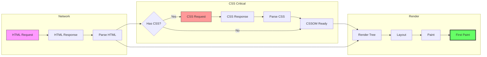
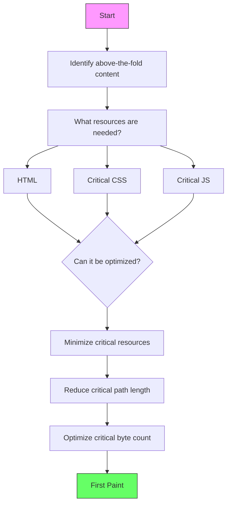
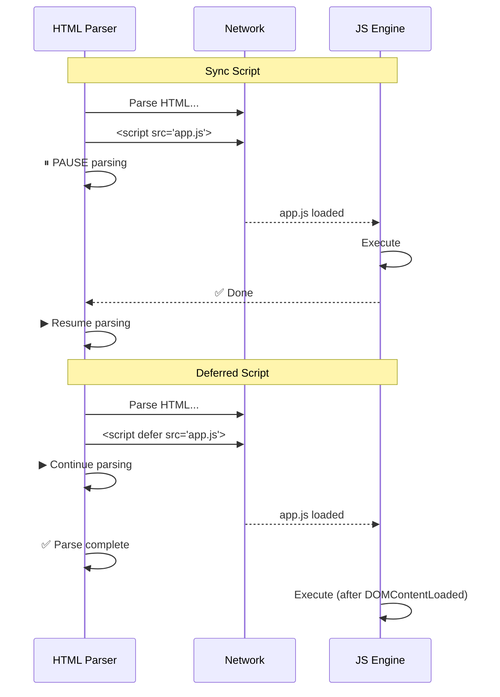
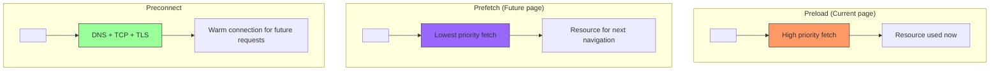
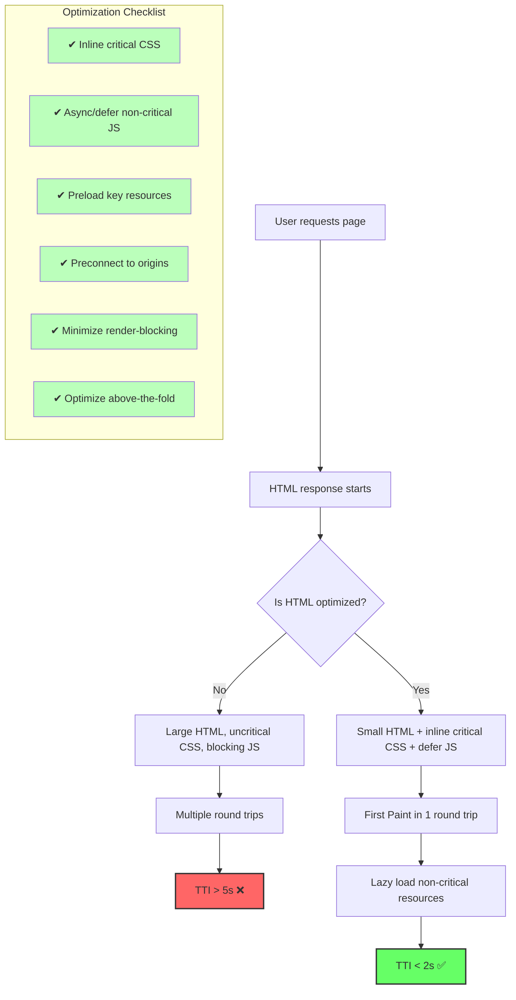

# Critical Rendering Path (CRP)

## Overview

The **Critical Rendering Path** is the sequence of steps the browser must take to render the **initial viewport** (above-the-fold content). Optimizing the CRP is the most important performance optimization for modern web applications.

## The Critical Rendering Path



## Key Metrics

| Metric | Definition | Target |
|---|---|---|
| **FP** (First Paint) | First pixel drawn | < 1s |
| **FCP** (First Contentful Paint) | First content (text, image) painted | < 1s |
| **LCP** (Largest Contentful Paint) | Largest element painted | < 2.5s |
| **TTI** (Time to Interactive) | Page fully interactive | < 3.8s |
| **FID** (First Input Delay) | Time to respond to first input | < 100ms |
| **CLS** (Cumulative Layout Shift) | Visual stability | < 0.1 |

## Identifying Critical Resources



## CRP Optimization Techniques

### 1. Minimize Critical Resources

```html
<!-- ❌ BAD: Everything is critical -->
<html>
<head>
  <link rel="stylesheet" href="bootstrap.css">           <!-- 150 KB, critical -->
  <link rel="stylesheet" href="font-awesome.css">        <!-- 60 KB, critical -->
  <link rel="stylesheet" href="animate.css">             <!-- 40 KB, critical -->
  <script src="jquery.js"></script>                      <!-- 87 KB, blocking -->
  <script src="analytics.js"></script>                   <!-- Blocking -->
</head>
<body>
  <h1>Hello World</h1>
  <!-- Above the fold content -->
</body>
</html>

<!-- ✅ GOOD: Minimal critical resources -->
<html>
<head>
  <style>
    /* Critical CSS inlined (< 14 KB for fast TCP) */
    body { font-family: sans-serif; margin: 0; }
    h1 { font-size: 2rem; color: #333; }
  </style>
  <link rel="preload" href="styles.css" as="style" onload="this.rel='stylesheet'">
  <script defer src="analytics.js"></script>
</head>
<body>
  <h1>Hello World</h1>
</body>
</html>
```

### 2. Inline Critical CSS

Critical CSS should be **inlined in `<head>`** to eliminate the CSS request round-trip:

```html
<head>
  <style>
    /* 
     * Critical CSS for above-the-fold content
     * Keep under 14 KB (TCP initial window)
     */
    * { box-sizing: border-box; }
    body { 
      font-family: system-ui, sans-serif;
      margin: 0;
      background: #fff;
      color: #333;
    }
    .header {
      display: flex;
      align-items: center;
      height: 60px;
      padding: 0 20px;
      background: #1a73e8;
      color: white;
    }
    .hero {
      font-size: clamp(1.5rem, 5vw, 3rem);
      text-align: center;
      padding: 40px 20px;
    }
  </style>
  
  <!-- Non-critical CSS loaded asynchronously -->
  <link rel="preload" href="full.css" as="style" 
        onload="this.onload=null;this.rel='stylesheet'">
  <noscript><link rel="stylesheet" href="full.css"></noscript>
</head>
```

### 3. Async and Defer Scripts

```html
<!-- ❌ BLOCKING: Parser halts until script loads and executes -->
<script src="analytics.js"></script>

<!-- ✅ DEFER: Loaded in parallel, executes after HTML parse -->
<script defer src="analytics.js"></script>

<!-- ✅ ASYNC: Loaded in parallel, executes as soon as available -->
<script async src="analytics.js"></script>

<!-- ❌ BAD: Inline script blocks parsing -->
<script>
  doSomething(); // Halts parser
</script>

<!-- ✅ GOOD: Inline script at end of body -->
<body>
  <!-- content -->
  <script>doSomething();</script>
</body>
```

### Resource Loading Behavior



### 4. Preload Critical Resources

```html
<!-- Preload key resources early -->
<link rel="preload" href="hero-image.webp" as="image">
<link rel="preload" href="critical-font.woff2" as="font" crossorigin>
<link rel="preload" href="critical.css" as="style">

<!-- Preconnect to third-party origins early -->
<link rel="preconnect" href="https://fonts.googleapis.com">
<link rel="preconnect" href="https://analytics.google.com">

<!-- DNS-prefetch (less aggressive than preconnect) -->
<link rel="dns-prefetch" href="https://cdn.example.com">
```

### 5. Preload vs Prefetch



### 6. Reduce CSS Blocking with Media Queries

```html
<!-- Always blocks render (PRINT media never matches on screen) -->
<link rel="stylesheet" href="print.css" media="print">

<!-- Only blocks render for landscape orientation -->
<link rel="stylesheet" href="landscape.css" media="orientation: landscape">

<!-- Trick: load non-critical CSS without blocking -->
<link rel="stylesheet" href="non-critical.css" media="print" 
      onload="this.media='all'">
```

### 7. HTTP/2 Server Push (Deprecated in Chrome 106+)

Server push was used to proactively send resources. It's largely replaced by **103 Early Hints**:

```http
HTTP/1.1 103 Early Hints
Link: </styles.css>; rel=preload; as=style
Link: </app.js>; rel=preload; as=script

HTTP/1.1 200 OK
Content-Type: text/html

<html>
<head>
  <link rel="stylesheet" href="styles.css">
  ...
```

## CRP Optimization Diagram



## Measuring CRP

### Using DevTools

1. Open Chrome DevTools → **Performance** → **Reload**
2. Look at the **Network** and **Main** threads

```
Performance View:
┌──────────────────────────────────────────────────┐
│ Network:                                         │
│  index.html       ──────                         │
│  critical.css     ────                           │
│  app.js            ────────                      │
│  image.jpg         ────────────────────────      │
│                                                  │
│ Main:                                            │
│  ParseHTML  ParseCSS  Layout  Paint              │
│  ────────── ───────── ────── ─────               │
│                                                  │
│ Summary:                                         │
│  FP:  1.2s    FCP:  1.4s    LCP:  2.8s          │
│  DCL: 2.1s    Load: 3.5s    TTI:  3.2s          │
└──────────────────────────────────────────────────┘
```

### Using Performance API

```javascript
// Measure CRP milestones
const observer = new PerformanceObserver((list) => {
  for (const entry of list.getEntries()) {
    if (entry.name === 'first-contentful-paint') {
      console.log(`FCP: ${entry.startTime}ms`);
    }
    if (entry.name === 'largest-contentful-paint') {
      console.log(`LCP: ${entry.startTime}ms`);
    }
  }
});

observer.observe({ type: 'paint', buffered: true });
observer.observe({ type: 'largest-contentful-paint', buffered: true });

// Custom measurement
performance.mark('crp-start');
// ... page loads ...
performance.mark('crp-end');
performance.measure('CRP Duration', 'crp-start', 'crp-end');
```

## Practical Optimization Checklist

### HTML
- [ ] Minify HTML (remove whitespace, comments)
- [ ] Send compressed (Brotli > Gzip)
- [ ] Use HTTP/2 or HTTP/3
- [ ] Enable `103 Early Hints` on server

### CSS
- [ ] Inline critical CSS (< 14 KB)
- [ ] Defer non-critical CSS with `media="print"` trick
- [ ] Avoid `@import` (serial download)
- [ ] Remove unused CSS (Chrome Coverage tab)
- [ ] Minify and compress CSS

### JavaScript
- [ ] Use `defer` for scripts that need DOM
- [ ] Use `async` for independent scripts
- [ ] Move scripts to end of `<body>`
- [ ] Code-split with dynamic `import()`
- [ ] Tree-shake unused code

### Fonts
- [ ] Preload critical fonts with `rel="preload"`
- [ ] Use `font-display: swap` (or `optional`)
- [ ] Self-host fonts to avoid extra DNS/TLS

### Images
- [ ] Use responsive images (`srcset` + `sizes`)
- [ ] Lazy-load below-fold images (`loading="lazy"`)
- [ ] Use modern formats (WebP, AVIF)
- [ ] Provide explicit dimensions to avoid CLS

## Real-World Example: CRP Before/After

### Before Optimization (3.2s FCP)

```html
<html>
<head>
  <link rel="stylesheet" href="bootstrap.min.css">      <!-- 150 KB -->
  <link rel="stylesheet" href="custom.css">             <!-- 30 KB -->
  <link href="https://fonts.googleapis.com/css2?family=Open+Sans" rel="stylesheet">
  <script src="jquery.min.js"></script>                 <!-- 87 KB -->
  <script src="main.js"></script>                       <!-- 20 KB -->
</head>
<body>
  <div class="container">
    <h1>Welcome</h1>
    <p>Content...</p>
  </div>
</body>
</html>
```

**Critical path**: HTML → CSS (x3) → JS (x2) → Render = **5 round trips**

### After Optimization (0.8s FCP)

```html
<html>
<head>
  <style>
    /* Critical CSS: ~8 KB inline */
    *, *::before, *::after { box-sizing: border-box; }
    body { font-family: 'Open Sans', sans-serif; margin: 0; }
    .container { max-width: 1200px; margin: 0 auto; padding: 20px; }
    h1 { font-size: 2.5rem; color: #333; }
  </style>
  <link rel="preconnect" href="https://fonts.googleapis.com">
  <link rel="preconnect" href="https://fonts.gstatic.com" crossorigin>
  <link rel="preload" href="custom.css" as="style" 
        onload="this.onload=null;this.rel='stylesheet'">
  <noscript><link rel="stylesheet" href="custom.css"></noscript>
  <script defer src="jquery.min.js"></script>
  <script defer src="main.js"></script>
</head>
<body>
  <div class="container">
    <h1>Welcome</h1>
    <p>Content...</p>
  </div>
</body>
</html>
```

**Critical path**: HTML (with inline CSS) → Render = **1 round trip**

## Key Takeaways

- **CRP optimization** reduces the number of round trips before first paint
- **Inline critical CSS** is the single biggest CRP win
- **`defer` and `async`** prevent JavaScript from blocking HTML parsing
- **Preload key resources** to discover them earlier
- **Preconnect to origins** to reduce DNS/TLS/TCP overhead
- **Keep critical resources under 14 KB** (TCP initial congestion window)
- **Use server push / 103 Early Hints** for server-led optimization
- **Measure with DevTools** Performance panel and Performance Observer API
