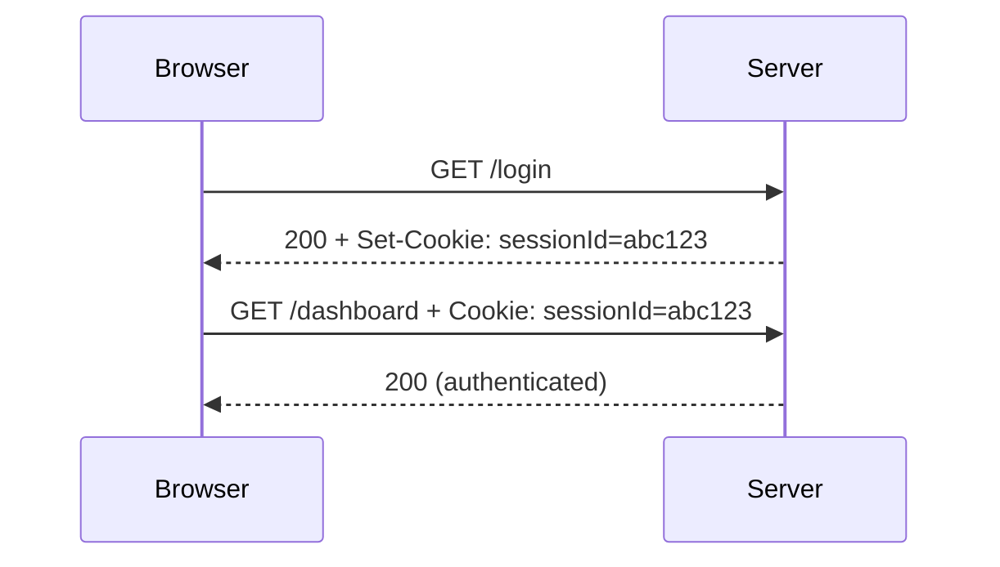
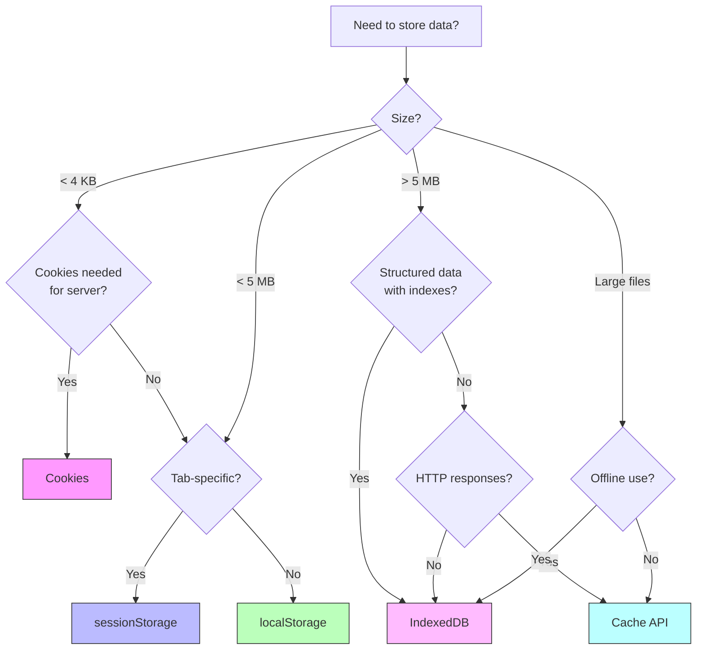

# Browser Storage

## Overview

Modern browsers provide multiple storage mechanisms, each with different characteristics for capacity, persistence, performance, and use cases. Choosing the right storage API is critical for web application performance and user experience.

## Storage Mechanisms Comparison

| Feature | Cookies | localStorage | sessionStorage | IndexedDB | Cache API |
|---|---|---|---|---|---|
| **Capacity** | 4 KB | 5-10 MB | 5-10 MB | Up to GBs | Up to GBs |
| **Persistence** | Configurable | Until cleared | Tab lifetime | Until cleared | Until cleared |
| **Async/Sync** | Sync | Sync | Sync | Async | Async |
| **Data Type** | String | String | String | Structured (any) | Request/Response |
| **Indexable** | No | No | No | Yes | No |
| **Transaction** | No | No | No | Yes | No |
| **Search** | No | No | No | Yes (indexes) | No |
| **Worker Access** | No | No | No | Yes | Yes |
| **HTTP Access** | Yes (headers) | No | No | No | Yes (SW) |

## Storage APIs in Detail

### 1. Cookies

```javascript
// Setting a cookie
document.cookie = "sessionId=abc123; path=/; max-age=3600; Secure; SameSite=Lax";

// Reading all cookies
console.log(document.cookie);  // "sessionId=abc123; theme=dark"

// Parsing cookies
function getCookie(name) {
  const match = document.cookie.match(new RegExp(`(^| )${name}=([^;]+)`));
  return match ? decodeURIComponent(match[2]) : null;
}
```

**Cookie attributes:**

```
Set-Cookie: sessionId=abc123
  ; Domain=.example.com       ← Which domains can read this
  ; Path=/app                 ← Which paths
  ; Max-Age=3600              ← Lifetime in seconds (or Expires=...)
  ; Secure                    ← Only over HTTPS
  ; HttpOnly                  ← Not accessible to JS (prevents XSS)
  ; SameSite=Lax              ← CSRF protection
  ; Priority=High             ← Eviction priority
```

**Cookie Flow:**



**Use Cases:**
- Session management (auth tokens)
- User preferences (theme, language)
- Tracking (analytics, A/B testing)

### 2. localStorage

Persists across browser sessions. Same-origin only.

```javascript
// Write
localStorage.setItem('theme', 'dark');
localStorage.setItem('preferences', JSON.stringify({ lang: 'en', fontSize: 14 }));

// Read
const theme = localStorage.getItem('theme');           // "dark"
const prefs = JSON.parse(localStorage.getItem('preferences'));

// Remove
localStorage.removeItem('theme');
localStorage.clear();  // Removes all

// Listen for changes (other tabs)
window.addEventListener('storage', (e) => {
  console.log(`${e.key} changed from ${e.oldValue} to ${e.newValue}`);
});
```

**Storage Estimation:**

```javascript
function estimateStorageUsage() {
  let total = 0;
  for (let key in localStorage) {
    if (localStorage.hasOwnProperty(key)) {
      total += key.length + localStorage[key].length;
    }
  }
  console.log(`Using ${total} bytes of localStorage`);
}
```

**Use Cases:**
- Persisted user preferences
- Cache API responses (small)
- Application state (theme, layout)

### 3. sessionStorage

Similar to localStorage but cleared when the tab is closed.

```javascript
// Tab-specific form data
sessionStorage.setItem('formData', JSON.stringify({
  name: 'John',
  email: 'john@example.com',
  step: 3
}));

// Tab-specific auth (single tab only)
sessionStorage.setItem('tempToken', 'eyJhbGci...');
```

**Use Cases:**
- Multi-step form data (tab crash recovery)
- Tab-specific state
- Sensitive data that should clear on tab close

### 4. IndexedDB

A transactional NoSQL database for structured data. Supports indexes, cursors, and large datasets.

```javascript
// Open database
const request = indexedDB.open('MyAppDB', 1);

request.onupgradeneeded = (event) => {
  const db = event.target.result;
  
  // Create object store (like a table)
  const store = db.createObjectStore('users', { keyPath: 'id' });
  
  // Create indexes for searching
  store.createIndex('email', 'email', { unique: true });
  store.createIndex('name', 'name', { unique: false });
};

request.onsuccess = (event) => {
  const db = event.target.result;
  
  // Add data (transactional)
  const tx = db.transaction('users', 'readwrite');
  const store = tx.objectStore('users');
  
  store.add({ id: 1, name: 'Alice', email: 'alice@example.com' });
  store.put({ id: 2, name: 'Bob', email: 'bob@example.com' });
  
  tx.oncomplete = () => console.log('Data saved');
  
  // Query with index
  const index = store.index('email');
  const getRequest = index.get('alice@example.com');
  getRequest.onsuccess = () => console.log(getRequest.result);
};
```

**Using IndexedDB with Promises (simplified):**

```javascript
class DB {
  constructor(name, version) {
    this.dbPromise = new Promise((resolve, reject) => {
      const req = indexedDB.open(name, version);
      req.onupgradeneeded = (e) => this.upgrade(e.target.result);
      req.onsuccess = (e) => resolve(e.target.result);
      req.onerror = (e) => reject(e.target.error);
    });
  }
  
  async add(storeName, data) {
    const db = await this.dbPromise;
    return new Promise((resolve, reject) => {
      const tx = db.transaction(storeName, 'readwrite');
      const store = tx.objectStore(storeName);
      const req = store.add(data);
      req.onsuccess = () => resolve(req.result);
      req.onerror = () => reject(req.error);
    });
  }
  
  async getAll(storeName) {
    const db = await this.dbPromise;
    return new Promise((resolve, reject) => {
      const tx = db.transaction(storeName, 'readonly');
      const store = tx.objectStore(storeName);
      const req = store.getAll();
      req.onsuccess = () => resolve(req.result);
      req.onerror = () => reject(req.error);
    });
  }
}
```

**Use Cases:**
- Offline data (entire datasets)
- User-generated content drafts
- Large media files (audio, video chunks)
- Complex querying
- Full-text search applications

### 5. Cache API

Used by Service Workers to cache HTTP responses.

```javascript
// Open a cache
caches.open('my-cache-v1').then((cache) => {
  // Add resources
  cache.addAll([
    '/',
    '/styles.css',
    '/app.js',
    '/logo.png'
  ]);
  
  // Add a specific request/response
  fetch('/api/data').then(response => {
    cache.put('/api/data', response.clone());
  });
});

// Read from cache
caches.match('/api/data').then((response) => {
  if (response) {
    return response.json();
  }
});

// Search cache
caches.open('my-cache-v1').then((cache) => {
  cache.keys().then((requests) => {
    console.log('Cached URLs:', requests.map(r => r.url));
  });
});

// Delete old cache
caches.delete('my-cache-v1');
```

**Use Cases:**
- Offline support (full app shell)
- Cache API responses (network-first or cache-first)
- Static asset caching
- Service Worker runtime caching

### 6. Storage Foundation API (Modern)

The **Storage Foundation API** provides a simple file-system-like API for persistent storage:

```javascript
// Check storage quota (Promise)
if (navigator.storage && navigator.storage.estimate) {
  const estimate = await navigator.storage.estimate();
  console.log(`Usage: ${estimate.usage} bytes`);
  console.log(`Quota: ${estimate.quota} bytes`);
  console.log(`Available: ${(estimate.quota - estimate.usage) / 1024 / 1024} MB`);
}

// Request persistent storage (user prompt)
if (navigator.storage && navigator.storage.persist) {
  const isPersisted = await navigator.storage.persist();
  console.log(`Storage will not be cleared: ${isPersisted}`);
}

// Check persistence
const isPersisted = await navigator.storage.persisted();
```

## Storage Decision Flowchart



## Storage Quotas by Browser

| Browser | localStorage | IndexedDB (per origin) | Total Storage |
|---|---|---|---|
| **Chrome** | 10 MB | Up to 60% of disk | ~6 GB for 64 GB device |
| **Firefox** | 10 MB | Up to 50% of disk | ~2 GB default |
| **Safari** | 10 MB | Up to 1 GB | ~1 GB |
| **Edge** | 10 MB | Up to 60% of disk | Same as Chrome |
| **Samsung Internet** | 10 MB | Up to 60% of disk | ~1.5 GB |

## Security Considerations

### Same-Origin Policy

Storage is isolated by **origin** (scheme + host + port):

```
https://example.com     ← can access its own storage
https://example.com:8080 ← different origin!
http://example.com      ← different origin!
https://sub.example.com ← different origin!
```

### Sensitive Data Storage

| Data Type | Recommended Storage |
|---|---|
| Auth tokens | httpOnly cookies (not accessible to JS) |
| Session IDs | httpOnly cookies |
| User preferences | localStorage or IndexedDB |
| Offline content | Cache API |
| Encryption keys | Web Crypto API (never localStorage) |
| PII (Personally Identifiable Info) | Server-side only; encrypt in IndexedDB |

### Clearing Storage

```javascript
// Clear all storage for this origin
function clearAllStorage() {
  localStorage.clear();
  sessionStorage.clear();
  
  // Clear cookies
  document.cookie.split(';').forEach(c => {
    document.cookie = c.replace(/^ +/, '')
      .replace(/=.*/, `=;expires=${new Date(0).toUTCString()};path=/`);
  });
  
  // Clear IndexedDB
  indexedDB.databases().then(dbs => {
    dbs.forEach(db => indexedDB.deleteDatabase(db.name));
  });
  
  // Clear Cache API
  caches.keys().then(names => {
    names.forEach(name => caches.delete(name));
  });
}
```

## Real-World Example: Offline-First Todo App

```javascript
// Storage strategy for offline-first todo app
class TodoStorage {
  constructor() {
    this.dbName = 'todos';
    this.cacheName = 'todo-app-v1';
  }
  
  async init() {
    // IndexedDB for structured data
    this.db = await this.openDB();
    
    // Cache API for app shell
    await caches.open(this.cacheName);
  }
  
  async openDB() {
    return new Promise((resolve, reject) => {
      const req = indexedDB.open(this.dbName, 1);
      req.onupgradeneeded = (e) => {
        const db = e.target.result;
        const store = db.createObjectStore('todos', { keyPath: 'id', autoIncrement: true });
        store.createIndex('completed', 'completed');
        store.createIndex('createdAt', 'createdAt');
      };
      req.onsuccess = () => resolve(req.result);
      req.onerror = () => reject(req.error);
    });
  }
  
  async addTodo(text) {
    const todo = { text, completed: false, createdAt: Date.now() };
    const db = await this.db;
    const tx = db.transaction('todos', 'readwrite');
    const store = tx.objectStore('todos');
    const id = await new Promise((resolve, reject) => {
      const req = store.add(todo);
      req.onsuccess = () => resolve(req.result);
      req.onerror = () => reject(req.error);
    });
    
    // Sync to server when online
    if (navigator.onLine) {
      fetch('/api/todos', {
        method: 'POST',
        body: JSON.stringify({ ...todo, id }),
        headers: { 'Content-Type': 'application/json' }
      }).catch(() => {
        // Queue for later sync
        this.queueForSync({ type: 'add', data: { ...todo, id } });
      });
    } else {
      this.queueForSync({ type: 'add', data: { ...todo, id } });
    }
    
    return id;
  }
  
  async getAllTodos() {
    const db = await this.db;
    const tx = db.transaction('todos', 'readonly');
    const store = tx.objectStore('todos');
    return new Promise((resolve, reject) => {
      const req = store.getAll();
      req.onsuccess = () => resolve(req.result);
      req.onerror = () => reject(req.error);
    });
  }
}
```

## Key Takeaways

- **Cookies** (4 KB) for server-side sessions and authentication with httpOnly flag
- **localStorage** (5-10 MB, synchronous) for simple persisted user preferences
- **sessionStorage** (5-10 MB, synchronous, tab-scoped) for tab-specific form data
- **IndexedDB** (unlimited, async, transactional) for complex structured offline data
- **Cache API** (unlimited, async) for HTTP response caching in Service Workers
- **Storage Foundation API** for quota estimation and persistence requests
- **Same-origin policy** applies to all storage mechanisms
- **HTTPS origins** get significantly more storage quota than HTTP
- Browsers can **clear storage** under storage pressure — use `navigator.storage.persist()`
