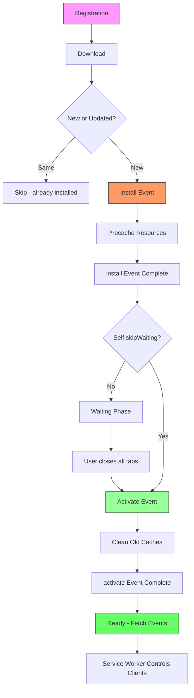

# Service Workers

## Overview

A **Service Worker** is a script that runs in the background, separate from the web page, enabling features that don't need a web page or user interaction — like **offline support**, **push notifications**, and **background sync**.

## Lifecycle



### Registration

```javascript
// Register service worker
if ('serviceWorker' in navigator) {
  navigator.serviceWorker.register('/sw.js', { scope: '/' })
    .then(reg => {
      console.log('SW registered:', reg.scope);
      
      // Check for updates
      reg.addEventListener('updatefound', () => {
        const newWorker = reg.installing;
        newWorker.addEventListener('statechange', () => {
          console.log('SW state:', newWorker.state);
          // states: 'installing', 'installed', 'activating', 'activated'
        });
      });
    })
    .catch(err => console.error('SW registration failed:', err));
}

// Check if there's a waiting worker
if (navigator.serviceWorker.controller) {
  navigator.serviceWorker.addEventListener('controllerchange', () => {
    console.log('New SW activated, reload page');
    window.location.reload();
  });
}
```

### Install Event

```javascript
// sw.js - Install event
const CACHE_NAME = 'my-app-v1';
const PRECACHE_URLS = [
  '/',
  '/styles.css',
  '/app.js',
  '/offline.html',
  '/images/logo.png'
];

self.addEventListener('install', (event) => {
  console.log('SW: Installing...');
  
  // Force the waiting service worker to become active
  self.skipWaiting();
  
  event.waitUntil(
    caches.open(CACHE_NAME).then(cache => {
      console.log('SW: Precaching resources');
      return cache.addAll(PRECACHE_URLS);
    })
  );
});
```

### Activate Event

```javascript
// sw.js - Activate event
self.addEventListener('activate', (event) => {
  console.log('SW: Activating...');
  
  event.waitUntil(
    // Claim all clients immediately
    clients.claim().then(() => {
      console.log('SW: Now controlling all clients');
    }),
    
    // Delete old caches
    caches.keys().then(cacheNames => {
      return Promise.all(
        cacheNames.map(cacheName => {
          if (cacheName !== CACHE_NAME) {
            console.log('SW: Deleting old cache:', cacheName);
            return caches.delete(cacheName);
          }
        })
      );
    })
  );
});
```

## Caching Strategies

```mermaid
graph TD
    subgraph "Cache First (Offline First)"
        A1[Request] --> B1{Cache Hit?}
        B1 -->|Yes| C1[Return from Cache]
        B1 -->|No| D1[Fetch from Network]
        D1 --> E1[Cache Response]
        E1 --> F1[Return Response]
    end
    
    subgraph "Network First (Online First)"
        A2[Request] --> B2[Fetch from Network]
        B2 -->|Success| C2[Cache Response]
        C2 --> D2[Return Response]
        B2 -->|Failure| E2{Has Cache?}
        E2 -->|Yes| F2[Return from Cache]
        E2 -->|No| G2[Return Offline Page]
    end
    
    subgraph "Stale While Revalidate"
        A3[Request] --> B3[Return from Cache<br/>immediately]
        B3 --> C3[Fetch from Network<br/>in background]
        C3 --> D3[Update Cache<br/>for next time]
    end
    
    subgraph "Network Only"
        A4[Request] --> B4[Fetch from Network]
        B4 --> C4[Return Response]
    end
    
    subgraph "Cache Only"
        A5[Request] --> B5{Cache Hit?}
        B5 -->|Yes| C5[Return from Cache]
        B5 -->|No| D5[Error]
    end
```



### Strategy Implementations

#### 1. Cache First (Offline First)

```javascript
// Use for: static assets, app shell
self.addEventListener('fetch', (event) => {
  if (event.request.url.match(/\.(css|js|png|jpg|svg|woff2)$/)) {
    event.respondWith(
      caches.match(event.request).then(cached => {
        return cached || fetch(event.request).then(response => {
          return caches.open(CACHE_NAME).then(cache => {
            cache.put(event.request, response.clone());
            return response;
          });
        });
      })
    );
  }
});
```

#### 2. Network First (Online First)

```javascript
// Use for: API calls, dynamic content
self.addEventListener('fetch', (event) => {
  if (event.request.url.includes('/api/')) {
    event.respondWith(
      fetch(event.request)
        .then(response => {
          return caches.open(CACHE_NAME).then(cache => {
            cache.put(event.request, response.clone());
            return response;
          });
        })
        .catch(() => {
          return caches.match(event.request).then(cached => {
            return cached || caches.match('/offline.html');
          });
        })
    );
  }
});
```

#### 3. Stale While Revalidate

```javascript
// Use for: content that updates frequently but is ok to show stale
self.addEventListener('fetch', (event) => {
  event.respondWith(
    caches.match(event.request).then(cached => {
      // Return cached version immediately
      const fetchPromise = fetch(event.request).then(response => {
        // Update cache in background
        return caches.open(CACHE_NAME).then(cache => {
          cache.put(event.request, response.clone());
          return response;
        });
      });
      
      return cached || fetchPromise;
    })
  );
});
```

#### 4. Network Only

```javascript
// Use for: analytics, real-time data
self.addEventListener('fetch', (event) => {
  if (event.request.url.includes('/analytics/')) {
    event.respondWith(fetch(event.request));
  }
});
```

#### 5. Cache Only

```javascript
// Use for: precached resources that never change
self.addEventListener('fetch', (event) => {
  if (event.request.url.includes('/static/')) {
    event.respondWith(caches.match(event.request));
  }
});
```

## Complete Service Worker Example

```javascript
// sw.js
const CACHE_NAME = 'my-pwa-v2';
const DYNAMIC_CACHE = 'my-pwa-dynamic-v1';
const PRECACHE_URLS = [
  '/',
  '/offline.html',
  '/styles/main.css',
  '/scripts/app.js',
  '/images/logo.svg',
  '/fonts/inter.woff2'
];

// Install: precache app shell
self.addEventListener('install', (event) => {
  self.skipWaiting();
  event.waitUntil(
    caches.open(CACHE_NAME).then(cache => cache.addAll(PRECACHE_URLS))
  );
});

// Activate: clean old caches
self.addEventListener('activate', (event) => {
  event.waitUntil(
    caches.keys().then(keys => Promise.all(
      keys.filter(k => k !== CACHE_NAME && k !== DYNAMIC_CACHE)
        .map(k => caches.delete(k))
    )).then(() => clients.claim())
  );
});

// Fetch: hybrid strategy
self.addEventListener('fetch', (event) => {
  const { request } = event;
  const url = new URL(request.url);
  
  // App shell: cache first
  if (PRECACHE_URLS.includes(url.pathname)) {
    event.respondWith(caches.match(request));
    return;
  }
  
  // API: network first with fallback
  if (url.pathname.startsWith('/api/')) {
    event.respondWith(
      fetch(request)
        .then(res => {
          const clone = res.clone();
          caches.open(DYNAMIC_CACHE).then(cache => cache.put(request, clone));
          return res;
        })
        .catch(() => caches.match(request)
          .then(cached => cached || caches.match('/offline.html'))
        )
    );
    return;
  }
  
  // Images: stale while revalidate
  if (request.destination === 'image') {
    event.respondWith(
      caches.match(request).then(cached => {
        const fetchPromise = fetch(request)
          .then(res => {
            caches.open(DYNAMIC_CACHE).then(cache => cache.put(request, res.clone()));
            return res;
          })
          .catch(() => cached || caches.match('/images/placeholder.svg'));
        return cached || fetchPromise;
      })
    );
    return;
  }
  
  // Everything else: network only (don't cache)
  event.respondWith(fetch(request).catch(() => caches.match('/offline.html')));
});
```

## Push Notifications

```javascript
// Service Worker: Push event
self.addEventListener('push', (event) => {
  const data = event.data.json();
  
  const options = {
    body: data.body,
    icon: '/images/icon-192.png',
    badge: '/images/badge.png',
    vibrate: [200, 100, 200],
    data: {
      url: data.url
    },
    actions: [
      { action: 'view', title: 'View' },
      { action: 'dismiss', title: 'Dismiss' }
    ]
  };
  
  event.waitUntil(
    self.registration.showNotification(data.title, options)
  );
});

// Click on notification
self.addEventListener('notificationclick', (event) => {
  event.notification.close();
  
  if (event.action === 'dismiss') return;
  
  event.waitUntil(
    clients.openWindow(event.notification.data.url)
  );
});

// Client-side: request permission
async function subscribeToPush() {
  const registration = await navigator.serviceWorker.ready;
  const subscription = await registration.pushManager.subscribe({
    userVisibleOnly: true,
    applicationServerKey: urlBase64ToUint8Array('YOUR_PUBLIC_VAPID_KEY')
  });
  
  // Send subscription to server
  await fetch('/api/push/subscribe', {
    method: 'POST',
    body: JSON.stringify(subscription)
  });
}
```

## Background Sync

```javascript
// Service Worker: Sync event
self.addEventListener('sync', (event) => {
  if (event.tag === 'sync-todos') {
    event.waitUntil(syncTodos());
  }
});

async function syncTodos() {
  const db = await openDB();
  const unsynced = await db.getAll('pendingTodos');
  
  for (const todo of unsynced) {
    try {
      await fetch('/api/todos', {
        method: 'POST',
        body: JSON.stringify(todo),
        headers: { 'Content-Type': 'application/json' }
      });
      await db.delete('pendingTodos', todo.id);
    } catch (e) {
      console.error('Sync failed for todo:', todo.id);
    }
  }
}

// Client-side: register sync
async function registerSync() {
  const registration = await navigator.serviceWorker.ready;
  await registration.sync.register('sync-todos');
}
```

## Debugging Service Workers

### Chrome DevTools → Application → Service Workers

```
DevTools:
┌──────────────────────────────────────────────┐
│ Application │ Service Workers                 │
├──────────────────────────────────────────────┤
│                                              │
│  🔵 Status: #5 activated and running        │
│  Source: sw.js                               │
│  Received: 2 mins ago                        │
│                                              │
│  [Update on reload] [Push] [Sync]            │
│                                              │
│  Clients:                                    │
│  ● https://example.com/ (controlled)        │
│                                              │
│  Cache Storage:                              │
│  ├─ my-pwa-v2                     (3.2 MB)  │
│  └─ my-pwa-dynamic-v1             (1.1 MB)  │
└──────────────────────────────────────────────┘
```

### Common Service Worker Gotchas

| Issue | Cause | Fix |
|---|---|---|
| SW not updating | Browser checks every 24h max | Call `registration.update()` |
| Stale content | Old SW still controlling | Use `skipWaiting()` + `clients.claim()` |
| Cache filling up | No eviction strategy | Implement cache size limits |
| CORS issues | Opaque responses in cache | Use `mode: 'cors'` or handle opaque |
| HTTPS required | Security restriction | Run on HTTPS or localhost |
| Registration fails | Path wrong or SW not found | Check SW file path and MIME type |

## Key Takeaways

- **Service Workers** are JavaScript files that run in a separate thread, intercepting network requests
- **Lifecycle**: Registration → Install → Activate → Fetch
- **`self.skipWaiting()`** and **`clients.claim()`** are needed for immediate update activation
- **Caching strategies**: Cache First (static assets), Network First (API), Stale While Revalidate (updatable content)
- **Precache app shell** during install for instant offline loading
- **Push notifications** require user permission and VAPID keys
- **Background Sync** queues failed requests for later retry
- **Always handle offline fallback** with an offline page
- **Debug** in DevTools Application panel
- **HTTPS is required** (localhost works for development)
