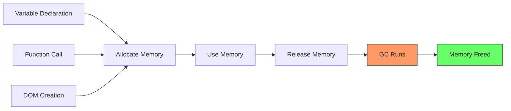

# Memory Leaks

## Overview

JavaScript memory leaks occur when the garbage collector cannot reclaim memory that is no longer needed. In browsers, this leads to **jank**, **crashes**, and **poor user experience** over time, especially in single-page applications that run for extended sessions.

## Memory Lifecycle



## Common Memory Leak Patterns

### 1. Accidental Global Variables

```javascript
// ❌ LEAK: Implicit global
function doSomething() {
  leakedVar = 'I am global';  // No let/const/var → attached to window
}
// leakedVar persists forever

// ❌ LEAK: 'this' in global context
function leak() {
  this.leaked = true;
}
leak();  // 'this' is window in non-strict mode

// ✅ FIX: Always declare variables
function doSomething() {
  const localVar = 'I am local';
}

// ✅ FIX: Use strict mode
'use strict';
function leak() {
  this.leaked = true;  // 'this' is undefined → error
}
```

### 2. Forgotten Timers and Intervals

```javascript
// ❌ LEAK: Interval keeps reference to DOM element
function startPolling() {
  const element = document.getElementById('status');
  
  setInterval(() => {
    // This closure holds reference to 'element'
    // Even if element is removed from DOM
    element.textContent = new Date().toLocaleTimeString();
  }, 1000);
}

// ✅ FIX: Clear intervals and release references
function startPolling() {
  const element = document.getElementById('status');
  
  const intervalId = setInterval(() => {
    element.textContent = new Date().toLocaleTimeString();
  }, 1000);
  
  // Return cleanup function
  return () => {
    clearInterval(intervalId);
  };
}

const stop = startPolling();
// Later, when component unmounts:
stop();

// ✅ FIX: Use WeakRef to avoid preventing GC
const element = document.getElementById('status');
const weakRef = new WeakRef(element);

const intervalId = setInterval(() => {
  const el = weakRef.deref();
  if (el) {
    el.textContent = new Date().toLocaleTimeString();
  } else {
    clearInterval(intervalId);
  }
}, 1000);
```

### 3. Detached DOM Nodes

```javascript
// ❌ LEAK: JS holds reference to removed DOM element
const parent = document.getElementById('parent');
const child = document.getElementById('child');

// Remove child from DOM
parent.removeChild(child);
// But 'child' variable still holds reference
// → DOM node (and its subtree) cannot be garbage collected

// ✅ FIX: Clear references when done
parent.removeChild(child);
child = null;  // Allow GC to reclaim

// ❌ LEAK: Event listeners on removed elements
const button = document.getElementById('btn');
button.addEventListener('click', () => {
  console.log('Clicked');
});
button.remove();  // Button removed from DOM
// But the event listener keeps a reference to button
// → Button and its subtree leaked

// ✅ FIX: Remove event listeners before removal
button.removeEventListener('click', handler);
button.remove();

// Or use AbortController (modern browsers)
const controller = new AbortController();
button.addEventListener('click', handler, { signal: controller.signal });
controller.abort();  // Removes all listeners on this signal
button.remove();
```

### 4. Closures Holding Large Data

```javascript
// ❌ LEAK: Closure retains entire scope
function createLeakyHandler(itemId) {
  const heavyData = fetchHeavyDataset();  // MBs of data
  
  return function() {
    // This closure keeps 'heavyData' alive
    // even though it only needs 'itemId'
    console.log(`Processing item: ${itemId}`);
  };
}

const handlers = [];
for (let i = 0; i < 1000; i++) {
  handlers.push(createLeakyHandler(i));
}
// 1000 closures × heavyData → massive leak!

// ✅ FIX: Only reference what's needed
function createSafeHandler(itemId) {
  return function() {
    // No reference to heavyData
    console.log(`Processing item: ${itemId}`);
  };
}

// ✅ FIX: Null out large variables after use
function createLeakyHandler(itemId) {
  const heavyData = fetchHeavyDataset();
  const result = processData(heavyData, itemId);
  heavyData = null;  // Allow GC
  // heavyData is no longer retained by closure
  
  return function() {
    console.log(`Result: ${result}`);
  };
}
```

### 5. Event Listeners Not Removed

```javascript
class Widget {
  constructor(element) {
    this.element = element;
    
    // ❌ LEAK: Arrow function creates new reference each time
    // Can't be removed with removeEventListener
    window.addEventListener('resize', () => {
      this.handleResize();
    });
    
    // ✅ FIX: Store bound reference
    this.boundResize = this.handleResize.bind(this);
    window.addEventListener('resize', this.boundResize);
  }
  
  destroy() {
    // Now we can remove it
    window.removeEventListener('resize', this.boundResize);
    this.element = null;
  }
  
  handleResize() {
    console.log('Resized:', this.element.offsetWidth);
  }
}
```

### 6. Circular References

```javascript
// ❌ LEAK: Circular reference between JS objects
function createCircular() {
  const obj1 = {};
  const obj2 = {};
  
  obj1.ref = obj2;
  obj2.ref = obj1;
  
  return { obj1, obj2 };
}
// Modern GCs can handle simple circular references
// But they CANNOT handle DOM ↔ JS circular references

// ❌ LEAK (real problem): DOM ↔ JS circular reference
const element = document.getElementById('myElement');
const data = { element };

element.userData = data;
// element ↔ data (circular)
// Neither can be GC'd
```

## Detecting Memory Leaks in Chrome DevTools

### 1. Performance Monitor

```
DevTools → Performance Monitor
┌─────────────────────────────────────────────┐
│ Performance Monitor                        │
│                                             │
│ CPU Usage:    ████████░░ 35%               │
│ JS Heap:      ████████████████████ 42.5 MB │
│              ↑ After interactions,          │
│              heap grows and never shrinks   │
│ DOM Nodes:   ██████░░░░ 1,250              │
│              ↑ Keeps growing with each     │
│                navigation/interaction       │
│ JS Event Listeners:  ██░░ 320              │
│                                             │
│ ❌ Heap trend: ▲ steadily increasing        │
│    Suggests: Memory leak                    │
└─────────────────────────────────────────────┘
```

### 2. Heap Snapshot

```
DevTools → Memory → Heap Snapshot
┌─────────────────────────────────────────────┐
│ Heap Snapshot (42.5 MB)                     │
│                                             │
│ ──── Constructor ─────────────── Size ───── │
│  (compiled code)  ██████████   12.3 MB     │
│  Array            ███████      8.1 MB      │
│  Object           ████         4.5 MB      │
│  Detached DOM     ████         4.2 MB  ⚠️  │
│  String           ███          3.8 MB      │
│  Closure          ██           2.1 MB      │
│  ...                                      │
│                                             │
│ 📌 "Detached DOM" entries = LEAK!          │
│ Click to see which DOM nodes are retained  │
└─────────────────────────────────────────────┘
```

### 3. Allocation Instrumentation

```
DevTools → Memory → Allocation Instrumentation on Timeline

┌─────────────────────────────────────────────┐
│ Timeline                                     │
│                                              │
│ Memory ████████░░░░░░░░░░░░░░░░░░░░░░       │
│        ████████░░░░░░░░░░░░░░░░░░░░░░       │
│        ████████░░░░░░░░████████░░░░░░       │
│        └───────┘        └───────┘           │
│        Click 1          Click 2             │
│        (returns)        (no return → leak) │
│                                              │
│ Select a time range to see allocations      │
│ during that period.                         │
└─────────────────────────────────────────────┘
```

## How to Check for Leaks

```javascript
// Method 1: Periodic heap size check
function monitorHeap() {
  if (performance.memory) {
    console.log(`Heap: ${(performance.memory.usedJSHeapSize / 1024 / 1024).toFixed(2)} MB`);
    console.log(`Limit: ${(performance.memory.jsHeapSizeLimit / 1024 / 1024).toFixed(2)} MB`);
  }
}

// Run every 10 seconds in development
setInterval(monitorHeap, 10000);

// Method 2: Performance observer for long tasks
const observer = new PerformanceObserver((list) => {
  for (const entry of list.getEntries()) {
    if (entry.duration > 50) {
      console.warn('Long task detected:', entry);
    }
  }
});
observer.observe({ type: 'longtask', buffered: true });
```

## Framework-Specific Leaks

### React

```javascript
// ❌ LEAK: Subscription not cleaned up in useEffect
function UserStatus({ userId }) {
  useEffect(() => {
    const subscription = api.onStatusChange(userId, (status) => {
      setStatus(status);
    });
    // ✅ FIX: Return cleanup function
    return () => subscription.unsubscribe();
  }, [userId]);
}
```

### Vue

```javascript
// ❌ LEAK: Global event bus listener not removed
export default {
  mounted() {
    EventBus.$on('user-update', this.handleUpdate);
  },
  // ✅ FIX: Remove on destroy
  beforeDestroy() {
    EventBus.$off('user-update', this.handleUpdate);
  }
};
```

### Angular

```typescript
// ❌ LEAK: Subscription not completed
@Component({...})
export class MyComponent implements OnInit, OnDestroy {
  private subscription: Subscription;
  
  ngOnInit() {
    this.subscription = this.service.getData().subscribe(data => {
      this.data = data;
    });
  }
  
  // ✅ FIX: Unsubscribe on destroy
  ngOnDestroy() {
    this.subscription?.unsubscribe();
  }
}
```

## Real-World Example: Leak Detection Script

```javascript
// Memory leak detection helper
class LeakDetector {
  constructor() {
    this.snapshots = [];
    this.intervalId = null;
  }
  
  start(intervalMs = 5000) {
    this.intervalId = setInterval(() => {
      this.takeSnapshot();
    }, intervalMs);
  }
  
  stop() {
    clearInterval(this.intervalId);
    return this.analyze();
  }
  
  takeSnapshot() {
    if (!performance.memory) {
      console.warn('performance.memory not available');
      return;
    }
    
    this.snapshots.push({
      time: Date.now(),
      heap: performance.memory.usedJSHeapSize,
      domNodes: document.querySelectorAll('*').length,
      listeners: this.getEventListenerCount()
    });
  }
  
  analyze() {
    if (this.snapshots.length < 2) return 'Not enough data';
    
    const first = this.snapshots[0];
    const last = this.snapshots[this.snapshots.length - 1];
    
    const heapGrowth = last.heap - first.heap;
    const domGrowth = last.domNodes - first.domNodes;
    
    return {
      duration: (last.time - first.time) / 1000 + 's',
      heapGrowth: (heapGrowth / 1024 / 1024).toFixed(2) + ' MB',
      domGrowth,
      heapPerMinute: ((heapGrowth / (last.time - first.time)) * 60000 / 1024 / 1024).toFixed(2) + ' MB/min',
      suspiciousLeak: heapGrowth > 5 * 1024 * 1024 || domGrowth > 100
    };
  }
  
  getEventListenerCount() {
    // Approximate count (not all listeners are accessible)
    let count = 0;
    const all = document.querySelectorAll('*');
    all.forEach(el => {
      // getEventListeners is only available in DevTools console
      // This is just a demonstration
    });
    return count;
  }
}

// Usage
const detector = new LeakDetector();
detector.start();

// ... perform actions that might leak ...

setTimeout(() => {
  const result = detector.stop();
  console.log('Leak analysis:', result);
  if (result.suspiciousLeak) {
    console.warn('⚠️ Potential memory leak detected!');
  }
}, 30000);
```

## Key Takeaways

- **Global variables** are the most common accidental leak — always use `let`/`const`
- **Forgotten timers/intervals** keep closures alive — clear them when component unmounts
- **Detached DOM nodes** are subtle — JS references prevent GC even after DOM removal
- **Closures** retain entire scope chain — only reference what's needed
- **Event listeners** must be removed — especially on window/document
- **Circular references** between DOM and JS objects prevent GC
- **Use WeakMap/WeakRef/WeakSet** for caches and references that shouldn't prevent GC
- **Monitor heap snapshots** over time — a growing heap indicates a leak
- **Always return cleanup functions** from React useEffect, Angular ngOnDestroy, Vue beforeDestroy
