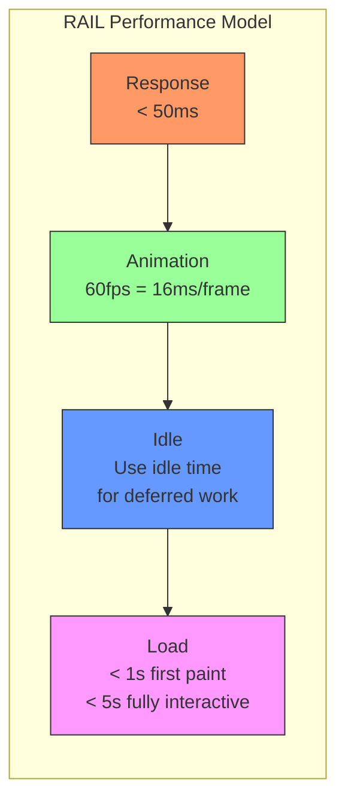

# Performance

## Overview

Web performance is about making pages load quickly and respond instantly to user interactions. This document covers the key metrics, models, APIs, and optimization techniques for building fast web applications.

## The RAIL Model

**RAIL** is a user-centric performance model: **Response, Animation, Idle, Load**.



| RAIL Phase | Target | Why |
|---|---|---|
| **Response** | < 100ms | User perceives instant feedback |
| **Animation** | < 16ms per frame (60fps) | Smooth visual updates |
| **Idle** | Use idle time chunks (50ms max) | Don't delay next user input |
| **Load** | < 1s first paint, < 5s TTI | Keep user engaged |

## Performance Metrics

```mermaid
gantt
    title Web Vitals Timeline
    dateFormat X
    axisFormat %s
    
    TTFB : 0, 0.8
    FP   : 0.8, 1.0
    FCP  : 1.0, 1.2
    LCP  : 1.0, 2.5
    FID  : 2.0, 2.1
    TTI  : 2.0, 3.5
    CLS  : 0, 4.0
    
    section User Perception
    Loading : 0, 1.0
    Interactive : 1.0, 3.5
    Stable : 3.5, 5.0
```

### Core Web Vitals

| Metric | Measures | Good | Needs Work | Poor |
|---|---|---|---|---|
| **LCP** (Largest Contentful Paint) | Loading performance | ≤ 2.5s | ≤ 4.0s | > 4.0s |
| **FID** (First Input Delay) | Interactivity | ≤ 100ms | ≤ 300ms | > 300ms |
| **CLS** (Cumulative Layout Shift) | Visual stability | ≤ 0.1 | ≤ 0.25 | > 0.25 |

### Additional Metrics

| Metric | What It Measures | Target |
|---|---|---|
| **TTFB** (Time to First Byte) | Server response time | < 800ms |
| **FP** (First Paint) | First pixel rendered | < 1s |
| **FCP** (First Contentful Paint) | First content rendered | < 1s |
| **TTI** (Time to Interactive) | Fully interactive | < 3.8s |
| **TBT** (Total Blocking Time) | Main thread blocking | < 200ms |
| **INP** (Interaction to Next Paint) | Responsiveness | < 200ms |

## Performance Measurement APIs

### performance.now()

High-resolution timestamp (sub-millisecond precision):

```javascript
const start = performance.now();

// ... expensive operation ...

const end = performance.now();
console.log(`Operation took ${end - start}ms`);
```

**Key properties:**
- Monotonically increasing (not affected by system clock changes)
- Microsecond precision (vs `Date.now()` millisecond)
- Returns time since `performance.timing.navigationStart`

### User Timing API

```javascript
// Mark specific moments
performance.mark('fetch-start');
await fetch('/api/data');
performance.mark('fetch-end');

performance.mark('process-start');
processData();
performance.mark('process-end');

// Measure between marks
performance.measure('fetch-time', 'fetch-start', 'fetch-end');
performance.measure('process-time', 'process-start', 'process-end');

// Get all measures
const measures = performance.getEntriesByType('measure');
measures.forEach(m => {
  console.log(`${m.name}: ${m.duration.toFixed(2)}ms`);
});

// Clean up
performance.clearMarks();
performance.clearMeasures();
```

### Performance Observer

The modern way to observe performance events:

```javascript
const observer = new PerformanceObserver((list) => {
  for (const entry of list.getEntries()) {
    switch (entry.entryType) {
      case 'paint':
        console.log(`${entry.name}: ${entry.startTime}ms`);
        break;
      case 'largest-contentful-paint':
        console.log(`LCP: ${entry.startTime}ms -`, entry.element);
        break;
      case 'first-input':
        console.log(`FID: ${entry.processingStart - entry.startTime}ms`);
        break;
      case 'layout-shift':
        if (!entry.hadRecentInput) {
          console.log(`CLS: ${entry.value}`);
        }
        break;
      case 'longtask':
        console.warn(`Long task: ${entry.duration}ms`);
        break;
      case 'resource':
        console.log(`${entry.name}: ${entry.duration}ms`);
        break;
    }
  }
});

observer.observe({ type: 'paint', buffered: true });
observer.observe({ type: 'largest-contentful-paint', buffered: true });
observer.observe({ type: 'first-input', buffered: true });
observer.observe({ type: 'layout-shift', buffered: true });
observer.observe({ type: 'longtask', buffered: true });
observer.observe({ type: 'resource', buffered: true });
```

## Performance Optimization Checklist

### Network

- [ ] **HTTP/2 or HTTP/3** — multiplexing, server push, header compression
- [ ] **Brotli compression** — better than gzip (20% smaller)
- [ ] **CDN** — edge caching, reduced latency
- [ ] **Preconnect to origins** — warm up connections early
- [ ] **Preload critical resources** — `<link rel="preload">`
- [ ] **Prefetch future pages** — `<link rel="prefetch">`
- [ ] **Minimize redirects** — each redirect adds RTT
- [ ] **Keep cookies small** — sent with every request

### Loading

- [ ] **Inline critical CSS** — eliminate CSS round trip
- [ ] **Async/defer non-critical JS** — don't block parsing
- [ ] **Lazy-load images** — `loading="lazy"`
- [ ] **Responsive images** — `srcset` with proper sizes
- [ ] **Code-split JavaScript** — load only what's needed
- [ ] **Tree-shake CSS/JS** — remove unused code
- [ ] **Preload fonts** — prevent FOIT/FOUT
- [ ] **Use `font-display: swap`** — show text immediately

### Rendering

- [ ] **Avoid layout thrashing** — batch DOM reads/writes
- [ ] **Use `transform` and `opacity`** for animations — composite only
- [ ] **Promote to layers** with `will-change` — but don't overuse
- [ ] **Debounce scroll/resize handlers** — or use passive listeners
- [ ] **Minimize DOM depth** — fewer nodes to calculate
- [ ] **Avoid complex CSS selectors** — keep specificity flat
- [ ] **Use `contain` property** — limit style/layout recalculation

### JavaScript

- [ ] **Avoid long tasks** (> 50ms blocks main thread)
- [ ] **Use `requestAnimationFrame`** for visual updates
- [ ] **Use `requestIdleCallback`** for non-urgent work
- [ ] **Defer parsing** — parse JSON lazily
- [ ] **Web Workers** — offload heavy computation
- [ ] **Avoid `document.write`** — blocks parser
- [ ] **Use fast DOM methods** — `getElementById` > `querySelector`

### Memory

- [ ] **Avoid global variables** — GC can't collect them
- [ ] **Clean up event listeners** — especially on removed DOM nodes
- [ ] **Clear timers and intervals** — when component unmounts
- [ ] **Release object URLs** — `URL.revokeObjectURL()`
- [ ] **Avoid closures retaining large objects** — null out references

## Bundle Analysis

### Webpack Bundle Analyzer

```javascript
// webpack.config.js
const BundleAnalyzerPlugin = require('webpack-bundle-analyzer').BundleAnalyzerPlugin;

module.exports = {
  plugins: [
    new BundleAnalyzerPlugin({
      analyzerMode: 'static',
      reportFilename: 'bundle-report.html',
      openAnalyzer: false
    })
  ]
};
```

Output visualization:

```
Bundle Report:
┌─────────────────────────────────────────────────┐
│ bundle.js (1.2 MB)                              │
│                                                  │
│ ████████████████████████████████████████ 800 KB │
│ node_modules/react-dom                          │
│                                                  │
│ ██████████████░░░░░░░░░░░░░░░░░░░░░░░░ 250 KB  │
│ node_modules/react                              │
│                                                  │
│ ██████░░░░░░░░░░░░░░░░░░░░░░░░░░░░░░░░ 120 KB  │
│ src/components/Editor                           │
│                                                  │
│ ███░░░░░░░░░░░░░░░░░░░░░░░░░░░░░░░░░░░ 50 KB   │
│ src/utils/largeLibrary.js                       │
│                                                  │
│ ⚠ Large library detected: moment.js (237 KB)   │
│   Suggestion: Switch to date-fns (17 KB)        │
└─────────────────────────────────────────────────┘
```

### Code Splitting

```javascript
// Instead of:
import { heavyFunction } from './heavyModule';

// ✅ Dynamic import (code-split)
async function loadFeature() {
  const { heavyFunction } = await import('./heavyModule');
  heavyFunction();
}

// React.lazy for component splitting
const HeavyComponent = React.lazy(() => import('./HeavyComponent'));
```

## Real-World Performance Audit

### Before Optimization

```
Lighthouse Report:
┌────────────────────────────┬───────┬──────────┐
│ Metric                     │ Score │ Value    │
├────────────────────────────┼───────┼──────────┤
│ Performance                │  45   │          │
│ First Contentful Paint     │   ❌  │ 3.2s    │
│ Largest Contentful Paint   │   ❌  │ 6.8s    │
│ Total Blocking Time        │   ❌  │ 850ms   │
│ Cumulative Layout Shift    │   ❌  │ 0.32    │
│ Speed Index                │   ❌  │ 5.1s    │
│                            │       │          │
│ Opportunities:             │       │          │
│ ─ Remove unused CSS        │       │ 250 KB  │
│ ─ Defer offscreen images   │       │ 1.2 MB  │
│ ─ Preload key requests     │       │ 3 reqs  │
│ ─ Reduce JS execution time │       │ 4.2s    │
└────────────────────────────┴───────┴──────────┘
```

### After Optimization

```
Lighthouse Report:
┌────────────────────────────┬───────┬──────────┐
│ Metric                     │ Score │ Value    │
├────────────────────────────┼───────┼──────────┤
│ Performance                │  96   │          │
│ First Contentful Paint     │   ✅  │ 0.8s    │
│ Largest Contentful Paint   │   ✅  │ 1.5s    │
│ Total Blocking Time        │   ✅  │ 120ms   │
│ Cumulative Layout Shift    │   ✅  │ 0.02    │
│ Speed Index                │   ✅  │ 1.4s    │
└────────────────────────────┴───────┴──────────┘
```

## Performance Budget

Define a performance budget and enforce it in CI:

```javascript
// performance-budget.json
{
  "budgets": [
    {
      "resourceType": "total",
      "budget": 500000  // 500 KB total JS
    },
    {
      "resourceType": "total",
      "budget": 100000  // 100 KB total CSS
    },
    {
      "resourceType": "first-paint",
      "budget": 1000    // 1s FP
    },
    {
      "resourceType": "lcp",
      "budget": 2500    // 2.5s LCP
    },
    {
      "resourceType": "tti",
      "budget": 3800    // 3.8s TTI
    }
  ]
}
```

## Key Takeaways

- **RAIL model** guides performance optimization: Response (50ms), Animation (16ms), Idle (50ms chunks), Load (1s)
- **Core Web Vitals** (LCP, FID, CLS) are Google's ranking signals
- **Performance Observer** is the modern way to measure real-user performance
- **`performance.now()`** is high-resolution (μs) and monotonic
- **User Timing API** (`mark`/`measure`) enables custom tracing
- **Bundle analysis** reveals what's making your JS/CSS large
- **Code splitting** loads JavaScript on demand, reducing initial bundle size
- **Performance budget** prevents regressions in CI/CD
- **Lighthouse** provides actionable optimization suggestions
- **Real User Monitoring (RUM)** captures actual user experiences vs lab data
