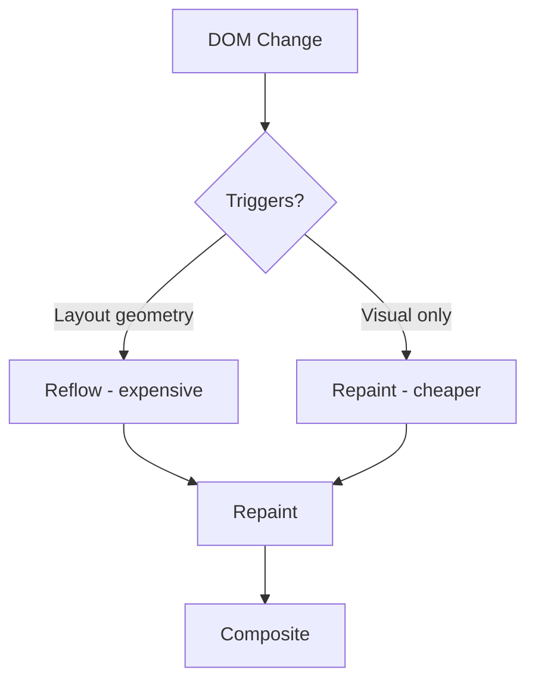

# 01 — DOM Manipulation

The **Document Object Model (DOM)** is a tree-like representation of an HTML document. JavaScript can query, create, modify, and delete nodes in this tree.

---

## 1. Selecting Elements

### `document.querySelector(selector)`
Returns the **first** element matching a CSS selector.

```js
const header = document.querySelector('.header');
const nav = document.querySelector('#main-nav > ul');
const firstBtn = document.querySelector('button.primary');
```

### `document.querySelectorAll(selector)`
Returns a **static NodeList** of all matching elements.

```js
const items = document.querySelectorAll('.list-item');
items.forEach(el => el.classList.add('highlight'));
```

### `document.getElementById(id)`
Fastest method — directly looks up by `id` attribute.

```js
const app = document.getElementById('root');
```

### `document.getElementsByClassName(name)` / `getElementsByTagName(tag)`
Return **live** HTMLCollections (updated when DOM changes).

```js
const divs = document.getElementsByTagName('div'); // live
const cards = document.getElementsByClassName('card'); // live
```

> **Prefer `querySelector` / `querySelectorAll`** — they return static NodeLists with full CSS selector support.

---

## 2. Creating & Inserting Elements

### `document.createElement(tagName)`

```js
const li = document.createElement('li');
li.textContent = 'New item';
li.className = 'list-item';
```

### `parent.appendChild(child)`
Appends as the **last child**.

```js
const ul = document.querySelector('ul');
ul.appendChild(li);
```

### `parent.insertBefore(newNode, referenceNode)`
Inserts **before** a reference node.

```js
const firstItem = ul.querySelector('li');
ul.insertBefore(li, firstItem);
```

### `parent.append(...nodes)` / `parent.prepend(...nodes)`
Modern — accepts multiple nodes **and** strings.

```js
ul.append(li, document.createElement('li'));
ul.prepend('Text node as first child');
```

### `element.insertAdjacentHTML(position, html)`
Positions: `'beforebegin'`, `'afterbegin'`, `'beforeend'`, `'afterend'`.

```js
const p = document.querySelector('p');
p.insertAdjacentHTML('afterend', '<div class="note">Note</div>');
```

---

## 3. Removing Elements

### `parent.removeChild(child)`

```js
const parent = item.parentNode;
parent.removeChild(item);
```

### `element.remove()`
Modern — no need to access parent.

```js
item.remove();
```

---

## 4. `innerHTML` vs `textContent`

```js
// ❌ Dangerous — parses HTML, XSS risk, destroys event listeners
el.innerHTML = '<span>Hello</span>';

// ✅ Safe — only text, no parsing
el.textContent = '<span>Hello</span>'; // displays literal text

// ✅ Safe HTML injection (sanitized)
el.insertAdjacentHTML('beforeend', sanitizedHtml);
```

| Method        | Parses HTML | Security Risk | Preserves listeners |
|---------------|-------------|---------------|---------------------|
| `innerHTML`   | Yes         | High (XSS)    | No (replaces all)   |
| `textContent` | No          | None          | Yes                 |
| `insertAdjacentHTML` | Yes | High | Yes (appends) |

---

## 5. Document Fragments

A lightweight container for batch DOM insertion — **avoids multiple reflows**.

```js
const fragment = document.createDocumentFragment();

for (let i = 0; i < 1000; i++) {
  const li = document.createElement('li');
  li.textContent = `Item ${i}`;
  fragment.appendChild(li);
}

// Single reflow
list.appendChild(fragment);
```


---

## 6. DOMTokenList & `classList`

```js
const el = document.querySelector('.box');

el.classList.add('active');        // add class
el.classList.remove('hidden');     // remove class
el.classList.toggle('visible');    // toggle on/off
el.classList.contains('active');   // boolean check
el.classList.replace('old', 'new');// replace class

el.classList.add('a', 'b');        // multiple at once
el.className = 'box active';       // direct string (overwrites all)
```

`classList` returns a **DOMTokenList** — array-like, live, iterable.

```js
for (const cls of el.classList) {
  console.log(cls);
}
```

---

## 7. Performance Best Practices

| Bad ❌ | Good ✅ |
|--------|---------|
| `innerHTML +=` in a loop | Build with fragment or array |
| Read/Write DOM in loop | Batch reads, then batch writes |
| `el.style.left = x` each frame | Use `transform` + `requestAnimationFrame` |
| Deep query each time | Cache references |
| Modify many individual properties | Use `classList` or `style.cssText` |

### Repaint & Reflow



**Reflow triggers:** `offsetHeight`, `getComputedStyle`, `scrollTop`, changing width/height, adding/removing classes.

### Batch reads, then writes

```js
// ❌ Forces multiple reflows
for (const box of boxes) {
  const w = box.offsetWidth;       // read
  box.style.width = (w * 2) + 'px'; // write — forces reflow on next read
}

// ✅ Batch reads first
const widths = boxes.map(b => b.offsetWidth);
boxes.forEach((b, i) => {
  b.style.width = (widths[i] * 2) + 'px';
});
```

### Virtual DOM pattern (simple)

```js
function render(items) {
  const frag = document.createDocumentFragment();
  items.forEach(item => {
    const div = document.createElement('div');
    div.textContent = item;
    div.className = 'item';
    frag.appendChild(div);
  });
  container.replaceChildren(frag); // single operation
}
```

---

## 8. `replaceChildren()` & `replaceWith()`

```js
// Replace all children atomically
container.replaceChildren(...newChildren);

// Replace a single node
oldItem.replaceWith(newItem);
```

---

## Summary

| Concern | Tool |
|---------|------|
| Select one element | `querySelector` / `getElementById` |
| Select many | `querySelectorAll` |
| Create element | `document.createElement` |
| Insert | `appendChild`, `insertBefore`, `append`, `prepend` |
| Remove | `remove`, `removeChild` |
| Batch insert | `DocumentFragment` |
| Safe text | `textContent` |
| HTML string | `insertAdjacentHTML` |
| Manage classes | `classList` |
| Optimize perf | Batch reads/writes, use fragments, cache refs |
