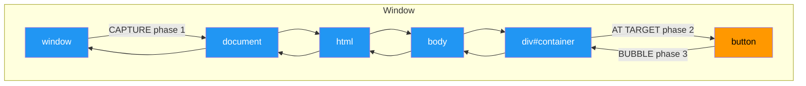

# 02 — Events

Events are signals fired inside the browser when something happens — clicks, key presses, form submissions, network completions, etc.

---

## 1. Event Types

| Category | Examples |
|----------|----------|
| Mouse | `click`, `dblclick`, `mousedown`, `mouseup`, `mousemove`, `mouseenter`, `mouseleave` |
| Keyboard | `keydown`, `keyup`, `keypress` (deprecated) |
| Focus | `focus`, `blur`, `focusin`, `focusout` |
| Form | `submit`, `change`, `input`, `reset` |
| Window | `load`, `DOMContentLoaded`, `resize`, `scroll`, `beforeunload` |
| Touch | `touchstart`, `touchmove`, `touchend`, `touchcancel` |
| Pointer | `pointerdown`, `pointerup`, `pointermove`, `pointercancel` |
| Drag | `dragstart`, `dragover`, `drop`, `dragend` |
| Clipboard | `copy`, `cut`, `paste` |
| Animation | `animationstart`, `animationend`, `animationiteration` |

---

## 2. `addEventListener`

```js
element.addEventListener(type, listener, options);
```

```js
const btn = document.querySelector('button');

btn.addEventListener('click', (e) => {
  console.log('Clicked!', e);
});
```

### Options (third parameter)

```js
btn.addEventListener('click', handler, {
  capture: false,   // use capture phase?
  once: true,       // auto-remove after one invocation
  passive: true     // can't call preventDefault (perf hint for scroll)
});
```

### `removeEventListener`

Must pass the **same function reference**:

```js
const handler = () => console.log('click');
btn.addEventListener('click', handler);
btn.removeEventListener('click', handler); // works
```

---

## 3. The Event Object

The handler receives an `Event` object with properties:

```js
btn.addEventListener('click', (e) => {
  e.target;          // element that triggered the event
  e.currentTarget;   // element the listener is attached to
  e.type;            // event type string
  e.bubbles;         // whether event bubbles
  e.eventPhase;       // 1=capture, 2=at target, 3=bubble
  e.timestamp;       // time relative to page load
  e.defaultPrevented;// was preventDefault called?
});
```

For mouse events:

```js
e.clientX / e.clientY;   // viewport coordinates
e.pageX / e.pageY;       // page coordinates (includes scroll)
e.screenX / e.screenY;   // screen coordinates
e.ctrlKey / e.shiftKey / e.altKey / e.metaKey; // modifier keys
```

For keyboard events:

```js
e.key;          // 'Enter', 'ArrowUp', 'a', ...
e.code;         // 'Enter', 'ArrowUp', 'KeyA', ...
e.repeat;       // true if held down
```

---

## 4. Event Phases — Capture, Target, Bubble



| Phase | `eventPhase` | Direction |
|-------|:------------:|-----------|
| **Capture** | 1 | Window → target (`capture: true`) |
| **At Target** | 2 | The target element itself |
| **Bubble** | 3 | Target → Window (default) |

```html
<div id="parent">
  <button id="child">Click</button>
</div>
```

```js
document.querySelector('#parent').addEventListener('click', () => {
  console.log('parent capture');
}, { capture: true });

document.querySelector('#child').addEventListener('click', () => {
  console.log('child (at target)');
});

document.querySelector('#parent').addEventListener('click', () => {
  console.log('parent bubble');
});
// Logs: parent capture → child (at target) → parent bubble
```

---

## 5. `preventDefault()`

Cancels the **default browser behavior**:

```js
// Prevent link navigation
link.addEventListener('click', (e) => {
  e.preventDefault();
  console.log('Stay here');
});

// Prevent form submission
form.addEventListener('submit', (e) => {
  e.preventDefault();
  validateAndSend();
});

// Prevent right-click menu
document.addEventListener('contextmenu', (e) => {
  e.preventDefault();
});
```

Check `e.defaultPrevented` to see if another handler already cancelled it.

---

## 6. `stopPropagation()`

Stops the event from moving to the **next phase** or to **other elements** in the same phase.

```js
parent.addEventListener('click', () => console.log('parent'));
child.addEventListener('click', (e) => {
  e.stopPropagation(); // parent won't fire
  console.log('child');
});
// Only logs: child
```

Note: Other listeners on the **same element** still fire.

---

## 7. `stopImmediatePropagation()`

Stops propagation **and** prevents any other listener on the **same element** from firing.

```js
el.addEventListener('click', (e) => {
  e.stopImmediatePropagation();
  console.log('first');
});
el.addEventListener('click', () => {
  console.log('second'); // NEVER runs
});
```

---

## 8. Event Listener Patterns

### Once listener

```js
btn.addEventListener('click', () => {
  console.log('Fires once');
}, { once: true });
```

### Passive listener (scroll performance)

```js
// Browser can optimize scrolling — can't call preventDefault
document.addEventListener('touchstart', handler, { passive: true });
```

### Delegation via capture (for events that don't bubble)

`focus`, `blur`, `scroll`, `mouseenter`, `mouseleave` do **not** bubble, but you can catch them in the capture phase:

```js
document.addEventListener('focus', (e) => {
  console.log('Focused:', e.target);
}, { capture: true }); // works for non-bubbling events
```

---

## 9. Custom Events

```js
const event = new CustomEvent('user-login', {
  detail: { userId: 42, name: 'Alice' },
  bubbles: true,
  cancelable: true
});

document.dispatchEvent(event);

// Listen
document.addEventListener('user-login', (e) => {
  console.log(e.detail); // { userId: 42, name: 'Alice' }
});
```

---

## 10. Event Delegation (Preview)

Instead of adding listeners to many elements, add **one** to a parent:

```js
document.querySelector('ul').addEventListener('click', (e) => {
  const li = e.target.closest('li');
  if (!li) return;
  console.log('Clicked:', li.textContent);
});
```

Covered in depth in the next file.

---

## Summary

```js
// Add listener (bubble phase by default)
el.addEventListener('click', handler);

// Capture phase
el.addEventListener('click', handler, { capture: true });

// Remove
el.removeEventListener('click', handler);

// Stop event travel
e.stopPropagation();

// Stop all on same element + travel
e.stopImmediatePropagation();

// Cancel default
e.preventDefault();
```
