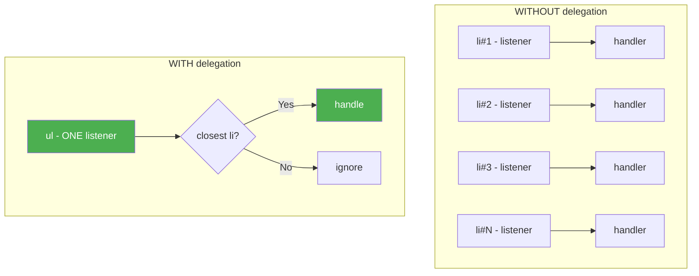

# 03 — Event Delegation

Event delegation is a technique where you attach a **single event listener** to a **parent element** that handles events from **multiple children** via event bubbling.

---

## 1. What is Event Delegation?

Instead of this:

```js
// ❌ Bad — N listeners, breaks when new items added
document.querySelectorAll('li').forEach(li => {
  li.addEventListener('click', () => {
    li.classList.toggle('done');
  });
});
```

Do this:

```js
// ✅ Good — 1 listener, works for future items
document.querySelector('ul').addEventListener('click', (e) => {
  const li = e.target.closest('li');
  if (!li) return;
  li.classList.toggle('done');
});
```



---

## 2. Why Use Event Delegation?

| Benefit | Explanation |
|---------|-------------|
| **Memory efficient** | Fewer listeners = less memory |
| **Dynamic content** | Works for elements added after page load |
| **Cleaner code** | Single handler vs N identical handlers |
| **Performance** | Single registered listener, less setup cost |

---

## 3. Key API: `e.target` & `e.currentTarget`

```js
parent.addEventListener('click', (e) => {
  e.target;          // the actual clicked element (deepest)
  e.currentTarget;   // the element with the listener (parent)
});
```

### Using `closest()` to find the intended element

```js
table.addEventListener('click', (e) => {
  const row = e.target.closest('tr');
  const cell = e.target.closest('td');
  const deleteBtn = e.target.closest('.delete-btn');

  if (deleteBtn) {
    row.remove();
  } else if (cell) {
    console.log('Cell:', cell.textContent);
  }
});
```

---

## 4. Use Cases

### 4.1 List Navigation

```js
const menu = document.querySelector('.menu');
menu.addEventListener('click', (e) => {
  const item = e.target.closest('.menu-item');
  if (!item) return;

  // Highlight selected
  menu.querySelectorAll('.menu-item').forEach(i => i.classList.remove('active'));
  item.classList.add('active');
});
```

### 4.2 Data Table Actions

```js
table.addEventListener('click', (e) => {
  const btn = e.target.closest('[data-action]');
  if (!btn) return;

  const action = btn.dataset.action;
  const row = btn.closest('tr');
  const id = row.dataset.id;

  switch (action) {
    case 'edit': editRecord(id); break;
    case 'delete': deleteRecord(id); break;
    case 'view': viewRecord(id); break;
  }
});
```

### 4.3 Dynamic Content — Comments Feed

```js
const feed = document.querySelector('.feed');

// Works for existing AND future comments
feed.addEventListener('click', (e) => {
  const likeBtn = e.target.closest('.like-btn');
  if (likeBtn) {
    likeBtn.classList.toggle('liked');
  }

  const replyBtn = e.target.closest('.reply-btn');
  if (replyBtn) {
    showReplyForm(replyBtn.closest('.comment'));
  }
});

// Dynamically add new comments
function addComment(text) {
  const div = document.createElement('div');
  div.className = 'comment';
  div.innerHTML = `
    <p>${text}</p>
    <button class="like-btn">❤</button>
    <button class="reply-btn">Reply</button>
  `;
  feed.appendChild(div); // ← no new listeners needed
}
```

### 4.4 Input Validation in Forms

```js
form.addEventListener('input', (e) => {
  const field = e.target.closest('[data-validate]');
  if (!field) return;

  const rule = field.dataset.validate;
  const isValid = validate(field.value, rule);
  field.classList.toggle('invalid', !isValid);
  field.nextElementSibling.textContent = isValid ? '' : `${field.name} is invalid`;
});
```

---

## 5. When NOT to Use Event Delegation

Some events **do not bubble**:

| Event | Bubbles? | Alternative |
|-------|:--------:|-------------|
| `focus` / `blur` | No | Use `focusin` / `focusout` (they bubble) or capture phase |
| `mouseenter` / `mouseleave` | No | Use `mouseover` / `mouseout` (they bubble) |
| `scroll` | No | Capture phase `{ capture: true }` |
| `load` / `error` | No | Direct listeners |
| `resize` | No | Direct listeners |

### When direct listeners are better

- Events fire on **non-bubbling** event types (above)
- You need `stopPropagation` for specific elements
- Only 1–3 elements (delegation overhead isn't worth it)
- You need `eventPhase` = AT_TARGET specific behavior

---

## 6. Implementing Delegation — Full Example

```html
<ul id="todo-list">
  <li data-id="1">Buy milk <button class="delete">✕</button></li>
  <li data-id="2">Walk dog <button class="delete">✕</button></li>
  <li data-id="3">Pay bills <button class="delete">✕</button></li>
</ul>
<button id="add-todo">Add Todo</button>
```

```js
const list = document.getElementById('todo-list');

list.addEventListener('click', (e) => {
  const deleteBtn = e.target.closest('.delete');
  const li = e.target.closest('li');

  if (deleteBtn) {
    // Delete
    li.remove();
    e.stopPropagation(); // prevent li click
  }
});

list.addEventListener('dblclick', (e) => {
  const li = e.target.closest('li');
  if (!li) return;
  li.contentEditable = true;
  li.focus();
});

list.addEventListener('blur', (e) => {
  const li = e.target.closest('li');
  if (!li || !li.contentEditable) return;
  li.contentEditable = false;
  console.log('Updated:', li.dataset.id, li.textContent.trim());
}, { capture: true }); // blur doesn't bubble

// Add new items — delegation handles events automatically
document.getElementById('add-todo').addEventListener('click', () => {
  const li = document.createElement('li');
  li.dataset.id = Date.now();
  li.innerHTML = `New task <button class="delete">✕</button>`;
  list.appendChild(li);
});
```

---

## 7. Performance Considerations

- **Throttle/debounce** if the handler does heavy work (e.g., API calls on input)
- **Check `e.target` early** to exit fast for irrelevant clicks
- Avoid deep DOM queries inside the handler — cache references
- Delegating from `document` is convenient but **every click** runs through your handler — prefer the closest stable parent

```js
// ❌ All clicks on page go through this
document.addEventListener('click', handler);

// ✅ Only clicks inside sidebar
document.querySelector('#sidebar').addEventListener('click', handler);
```

---

## Summary

```js
// Pattern template
parent.addEventListener('event', (e) => {
  const target = e.target.closest('.selector');
  if (!target) return;
  // handle
});
```

| Do delegate | Don't delegate |
|-------------|----------------|
| Lists, menus, tables | Non-bubbling events |
| Dynamic content | 1–2 static elements |
| Many similar elements | When you need `stopPropagation` per element |
| Forms with many fields | High-frequency scroll/resize (use passive) |
