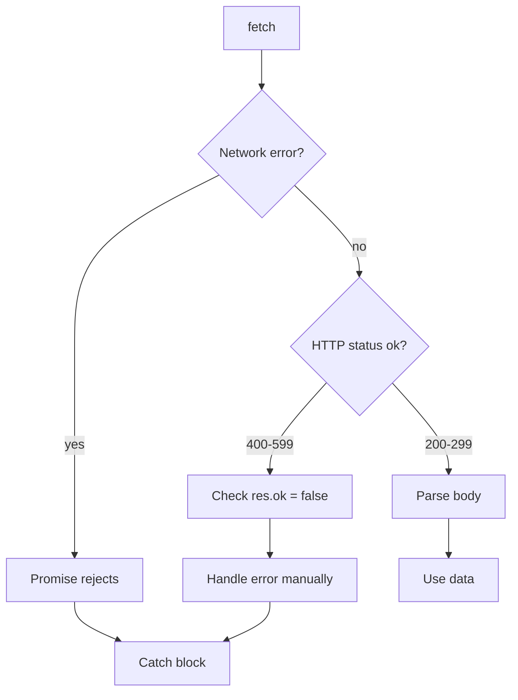
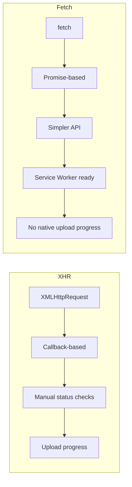

# 04 — Fetch API

The `fetch()` API provides a modern, promise-based interface for making HTTP requests. It replaces `XMLHttpRequest` (XHR).

---

## 1. Basics

```js
fetch('https://api.example.com/data')
  .then(response => response.json())
  .then(data => console.log(data))
  .catch(error => console.error(error));
```

`fetch()` returns a `Promise<Response>`. The promise **only rejects** on network failure — not on HTTP error status (4xx, 5xx).

---

## 2. HTTP Methods

### GET (default)

```js
fetch('https://api.example.com/users')
  .then(res => res.json())
  .then(users => console.log(users));
```

### POST

```js
fetch('https://api.example.com/users', {
  method: 'POST',
  headers: { 'Content-Type': 'application/json' },
  body: JSON.stringify({ name: 'Alice', role: 'admin' })
})
  .then(res => res.json())
  .then(newUser => console.log(newUser));
```

### PUT

```js
fetch('https://api.example.com/users/42', {
  method: 'PUT',
  headers: { 'Content-Type': 'application/json' },
  body: JSON.stringify({ name: 'Alice Updated' })
});
```

### DELETE

```js
fetch('https://api.example.com/users/42', {
  method: 'DELETE'
});
```

---

## 3. Headers

```js
const headers = new Headers();
headers.append('Authorization', 'Bearer token123');
headers.append('Content-Type', 'application/json');
headers.append('X-Custom', 'value');

fetch('/api/data', {
  method: 'POST',
  headers,
  body: JSON.stringify({ key: 'value' })
});
```

**Common headers:**

| Header | Purpose |
|--------|---------|
| `Content-Type` | `application/json`, `multipart/form-data`, `text/plain` |
| `Authorization` | Bearer token, Basic auth |
| `Accept` | What format the client expects |
| `X-Requested-With` | `XMLHttpRequest` (legacy CSRF protection) |

---

## 4. Request Body Formats

### JSON

```js
body: JSON.stringify({ name: 'Alice' })
headers: { 'Content-Type': 'application/json' }
```

### FormData (multipart/form-data)

```js
const formData = new FormData();
formData.append('username', 'alice');
formData.append('avatar', fileInput.files[0]);

fetch('/upload', {
  method: 'POST',
  body: formData // Content-Type auto-set to multipart/form-data
});
```

### URLSearchParams (application/x-www-form-urlencoded)

```js
const params = new URLSearchParams();
params.append('user', 'alice');
params.append('action', 'login');

fetch('/auth', {
  method: 'POST',
  body: params
});
```

### Blob / ArrayBuffer (binary)

```js
const blob = new Blob([data], { type: 'application/octet-stream' });
fetch('/upload', { method: 'POST', body: blob });
```

---

## 5. Reading the Response

```js
const response = await fetch(url);

response.ok;        // true if status in 200-299
response.status;    // 200, 404, 500, etc.
response.statusText;// 'OK', 'Not Found'
response.headers;   // Headers object
response.url;       // final URL (after redirects)
response.redirected;// was there a redirect?

// Body methods (call only ONE):
const json = await response.json();
const text = await response.text();
const blob = await response.blob();
const buffer = await response.arrayBuffer();
const formData = await response.formData();
```

### Check HTTP status

```js
if (!response.ok) {
  const error = await response.text();
  throw new Error(`HTTP ${response.status}: ${error}`);
}
```

---

## 6. Error Handling

```js
async function fetchData(url) {
  try {
    const res = await fetch(url);

    if (!res.ok) {
      throw new Error(`Request failed: ${res.status}`);
    }

    return await res.json();
  } catch (err) {
    if (err.name === 'AbortError') {
      console.log('Request was aborted');
    } else {
      console.error('Network error or HTTP error:', err);
    }
    throw err;
  }
}
```



---

## 7. Aborting with `AbortController`

```js
const controller = new AbortController();
const signal = controller.signal;

// Timeout after 5 seconds
setTimeout(() => controller.abort(), 5000);

try {
  const res = await fetch(url, { signal });
  const data = await res.json();
} catch (err) {
  if (err.name === 'AbortError') {
    console.log('Fetch aborted');
  }
}
```

You can also abort multiple requests with the **same** signal:

```js
const controller = new AbortController();
fetch('/api/a', { signal: controller.signal });
fetch('/api/b', { signal: controller.signal });

// Aborts both
controller.abort();
```

---

## 8. File Upload with Progress

`fetch()` doesn't natively support upload progress. For progress, either use XHR or combine with `axios`:

```js
// XHR with progress
function uploadWithProgress(file, onProgress) {
  return new Promise((resolve, reject) => {
    const xhr = new XMLHttpRequest();
    xhr.open('POST', '/upload');

    xhr.upload.onprogress = (e) => {
      if (e.lengthComputable) {
        onProgress(Math.round((e.loaded / e.total) * 100));
      }
    };

    xhr.onload = () => {
      if (xhr.status === 200) resolve(xhr.response);
      else reject(new Error(xhr.statusText));
    };

    xhr.onerror = () => reject(new Error('Network error'));

    const formData = new FormData();
    formData.append('file', file);
    xhr.send(formData);
  });
}
```

---

## 9. Streaming Responses

Read a response incrementally (e.g., for large JSON arrays or SSE):

```js
const res = await fetch('/api/large-data');
const reader = res.body.getReader();
const decoder = new TextDecoder();

while (true) {
  const { done, value } = await reader.read();
  if (done) break;
  const chunk = decoder.decode(value, { stream: true });
  console.log('Chunk:', chunk);
}
```

---

## 10. Comparison: Fetch vs XHR



| Feature | Fetch | XHR |
|---------|-------|-----|
| API style | Promise | Callback / Event-based |
| Syntax | Clean, modern | Verbose |
| JSON handling | `.json()` method | `JSON.parse()` |
| Upload progress | ❌ (needs XHR or axios) | ✅ `upload.onprogress` |
| Download progress | ✅ Response.body reader | ✅ `onprogress` |
| Abort | ✅ AbortController | ✅ `.abort()` |
| Timeout | Manual (AbortController + timer) | ✅ `.timeout` property |
| Default credentials | Omit (use `credentials: 'include'`) | Sends cookies |
| Service Worker | ✅ Fully supported | Limited |
| Error on 4xx/5xx | No (resolves normally) | No (like fetch) |

---

## 11. Full Example: CRUD Client

```js
class ApiClient {
  constructor(baseURL) {
    this.baseURL = baseURL;
  }

  async request(endpoint, options = {}) {
    const url = `${this.baseURL}${endpoint}`;
    const config = {
      headers: { 'Content-Type': 'application/json' },
      ...options,
    };

    if (config.body && typeof config.body === 'object') {
      config.body = JSON.stringify(config.body);
    }

    const res = await fetch(url, config);

    if (!res.ok) {
      const error = await res.text();
      throw new Error(`${res.status}: ${error}`);
    }

    const text = await res.text();
    return text ? JSON.parse(text) : null;
  }

  get(endpoint) {
    return this.request(endpoint);
  }

  post(endpoint, data) {
    return this.request(endpoint, { method: 'POST', body: data });
  }

  put(endpoint, data) {
    return this.request(endpoint, { method: 'PUT', body: data });
  }

  delete(endpoint) {
    return this.request(endpoint, { method: 'DELETE' });
  }
}

const api = new ApiClient('https://api.example.com');
const user = await api.post('/users', { name: 'Alice' });
const users = await api.get('/users');
await api.delete(`/users/${user.id}`);
```

---

## Summary

```js
// GET
fetch(url);

// POST
fetch(url, { method: 'POST', headers, body });

// Handle errors
if (!res.ok) throw new Error(res.status);

// Abort
const c = new AbortController();
fetch(url, { signal: c.signal });
c.abort();

// Read body
await res.json(); // or .text(), .blob(), .arrayBuffer()
```
