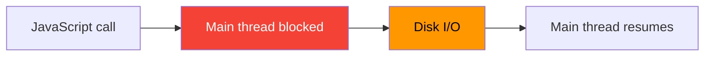
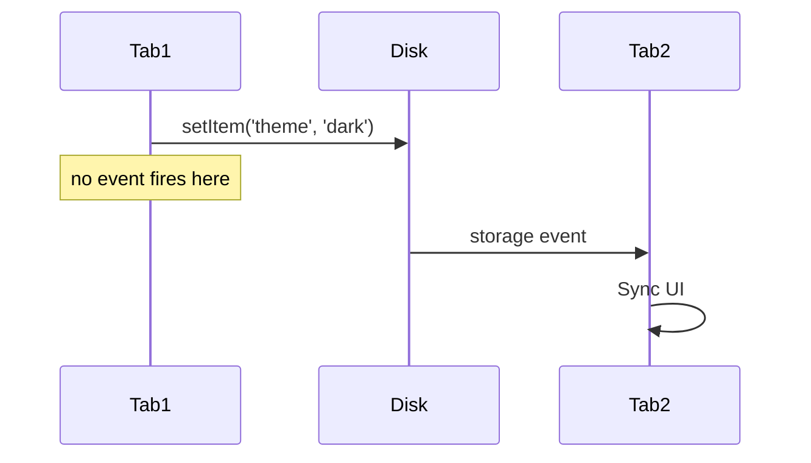

# 05 — localStorage

`localStorage` is a synchronous key-value storage that persists **indefinitely** with no expiration. Data is scoped to the **origin** (protocol + hostname + port).

---

## 1. Basic API

```js
// Set
localStorage.setItem('theme', 'dark');
localStorage.setItem('fontSize', '16');

// Get
const theme = localStorage.getItem('theme'); // 'dark'
const missing = localStorage.getItem('nope'); // null

// Remove
localStorage.removeItem('theme');

// Clear all
localStorage.clear();

// Length
console.log(localStorage.length);

// Key by index
const firstKey = localStorage.key(0);
```

### All values are strings

```js
localStorage.setItem('count', 42);
typeof localStorage.getItem('count'); // 'string' — need to parse

const count = Number(localStorage.getItem('count'));
```

---

## 2. JSON Serialization

```js
// Save complex data
const user = { id: 1, name: 'Alice', preferences: { theme: 'dark' } };
localStorage.setItem('user', JSON.stringify(user));

// Read
const saved = JSON.parse(localStorage.getItem('user'));
console.log(saved.name); // 'Alice'
```

### Safe parsing

```js
function getJSON(key, fallback = null) {
  try {
    const value = localStorage.getItem(key);
    return value ? JSON.parse(value) : fallback;
  } catch {
    return fallback;
  }
}

function setJSON(key, value) {
  localStorage.setItem(key, JSON.stringify(value));
}
```

---

## 3. Storage Limits

| Browser | Approximate limit |
|---------|-----------------|
| Chrome | 5–10 MB |
| Firefox | 5–10 MB |
| Safari | 5 MB |
| IE/Edge | 5–10 MB |

### QuotaExceededError

```js
try {
  localStorage.setItem('big', 'x'.repeat(10 * 1024 * 1024)); // 10MB
} catch (e) {
  if (e.name === 'QuotaExceededError') {
    console.error('Storage full — clear some data');
    // Fall back to memory or notify user
  }
}
```

---

## 4. Synchronous Nature

`localStorage` operations are **blocking**. The main thread pauses during read/write.

```js
// ❌ Blocking — freezes UI for large data
localStorage.setItem('large', bigString);
```



**Impact:** Avoid reading/writing large blobs on the critical rendering path. Use `IndexedDB` for large structured data.

---

## 5. `storage` Event

The `storage` event fires on **other tabs/windows** (not the current one) when localStorage changes.

```js
window.addEventListener('storage', (e) => {
  console.log(`Key "${e.key}" changed from "${e.oldValue}" to "${e.newValue}"`);
  console.log('URL:', e.url);
  console.log('Storage area:', e.storageArea);
});
```



### Use case: cross-tab sync

```js
// Tab 1 — user changes setting
localStorage.setItem('theme', 'light');

// Tab 2 — automatically update
window.addEventListener('storage', (e) => {
  if (e.key === 'theme') {
    document.body.className = e.newValue;
  }
});
```

---

## 6. Security Concerns

### ❌ Never store sensitive data

```js
// DANGEROUS
localStorage.setItem('jwt', 'eyJhbGciOiJIUzI1NiIs...');
localStorage.setItem('creditCard', '4111-1111-1111-1111');
localStorage.setItem('sessionToken', 'abc123');
```

**Why?:**
1. **XSS** — any injected script can read `localStorage`
2. **No automatic expiration**
3. **Accessible by any JS on the origin**
4. **No built-in encryption** (stored as plaintext on disk)

### ✅ Better approaches for auth

```js
// Use httpOnly cookies for session tokens
// Token is not accessible via JS → immune to XSS token theft
```

| Storage | Accessible via JS | Sent automatically | CSRF protection |
|---------|:----------------:|:------------------:|:---------------:|
| localStorage | ✅ Yes | ❌ No | ✅ N/A |
| httpOnly cookie | ❌ No | ✅ Yes | ❌ Need SameSite/CSRF token |

---

## 7. Use Cases

### Theme persistence

```js
const savedTheme = localStorage.getItem('theme') || 'light';
document.documentElement.setAttribute('data-theme', savedTheme);

document.querySelector('.theme-toggle').addEventListener('click', () => {
  const next = document.documentElement.getAttribute('data-theme') === 'light' ? 'dark' : 'light';
  document.documentElement.setAttribute('data-theme', next);
  localStorage.setItem('theme', next);
});
```

### Form auto-save (draft recovery)

```js
const FORM_KEY = 'draft-post';

// Auto-save every 30s
setInterval(() => {
  const formData = {
    title: document.getElementById('title').value,
    body: document.getElementById('body').value
  };
  localStorage.setItem(FORM_KEY, JSON.stringify(formData));
}, 30000);

// Restore on page load
window.addEventListener('DOMContentLoaded', () => {
  const draft = localStorage.getItem(FORM_KEY);
  if (draft) {
    const { title, body } = JSON.parse(draft);
    document.getElementById('title').value = title || '';
    document.getElementById('body').value = body || '';
  }
});
```

### Cache API responses

```js
async function fetchWithCache(url, ttl = 300000) {
  const cached = localStorage.getItem(`cache:${url}`);

  if (cached) {
    const { data, timestamp } = JSON.parse(cached);
    if (Date.now() - timestamp < ttl) {
      return data; // cache hit
    }
    localStorage.removeItem(`cache:${url}`);
  }

  const response = await fetch(url);
  const data = await response.json();

  localStorage.setItem(`cache:${url}`, JSON.stringify({
    data,
    timestamp: Date.now()
  }));

  return data;
}
```

### UI preferences

```js
const prefs = getJSON('preferences', {});
prefs.sidebarCollapsed = true;
prefs.fontSize = 18;
prefs.recentFiles = ['doc1.md', 'doc2.md'];
setJSON('preferences', prefs);
```

---

## 8. Testing for Availability

```js
function isLocalStorageAvailable() {
  try {
    const key = '__test__';
    localStorage.setItem(key, '1');
    localStorage.removeItem(key);
    return true;
  } catch {
    return false;
  }
}
```

Safari private mode throws on `setItem`.

---

## Summary

```js
// Set
localStorage.setItem(key, value); // value must be string

// Get (returns null if missing)
const val = localStorage.getItem(key);

// Remove
localStorage.removeItem(key);

// Clear all
localStorage.clear();

// Listen for changes from other tabs
window.addEventListener('storage', handler);

// Safe JSON
localStorage.setItem('key', JSON.stringify(obj));
const obj = JSON.parse(localStorage.getItem('key'));
```
