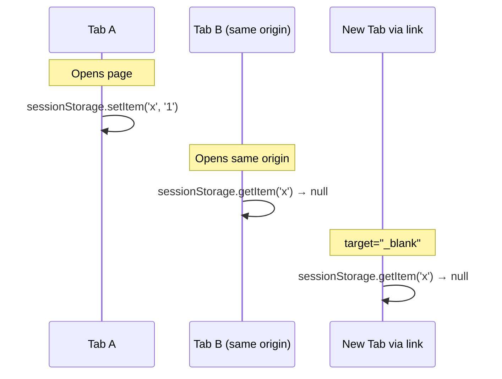
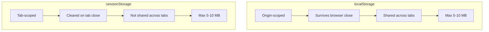

# 06 — sessionStorage

`sessionStorage` is identical to `localStorage` in API but with a **tab-scoped lifetime**: data persists until the tab or browser is closed.

---

## 1. Same API as localStorage

```js
// Set
sessionStorage.setItem('authToken', 'abc123');

// Get
const token = sessionStorage.getItem('authToken');

// Remove
sessionStorage.removeItem('authToken');

// Clear all
sessionStorage.clear();

// Length
console.log(sessionStorage.length);

// Key by index
console.log(sessionStorage.key(0));

// JSON
sessionStorage.setItem('prefs', JSON.stringify({ theme: 'dark' }));
const prefs = JSON.parse(sessionStorage.getItem('prefs'));
```

---

## 2. Tab-Specific Lifecycle



| Action | Data retained? |
|--------|:-------------:|
| Page refresh (F5) | ✅ Yes |
| Navigate to same origin | ✅ Yes |
| Open new tab (same URL) | ❌ No (separate session) |
| Duplicate tab | ❌ No (separate session) |
| Close tab and reopen | ❌ No |
| Close browser | ❌ No |

### Important: Duplicate tab behavior

Most browsers create a **new empty session** when duplicating a tab. Chrome used to clone it but removed that behavior.

---

## 3. Use Cases

### 3.1 Multi-step form / Wizard

```js
// Step 1
sessionStorage.setItem('step1', JSON.stringify({ name: 'Alice', email: 'alice@example.com' }));

// Step 2
sessionStorage.setItem('step2', JSON.stringify({ plan: 'premium', billing: 'monthly' }));

// Step 3 — submit
const userData = {
  ...JSON.parse(sessionStorage.getItem('step1')),
  ...JSON.parse(sessionStorage.getItem('step2')),
};
await fetch('/api/signup', { method: 'POST', body: JSON.stringify(userData) });

// Cleanup
sessionStorage.clear();
```

### 3.2 Tab-specific auth state (OAuth flow)

```js
// During OAuth redirect, store state parameter
sessionStorage.setItem('oauth_state', crypto.randomUUID());

// After redirect callback — verify state matches
const returnedState = new URLSearchParams(window.location.search).get('state');
if (returnedState === sessionStorage.getItem('oauth_state')) {
  // Proceed with token exchange
}
```

### 3.3 One-time flags

```js
function showWelcome() {
  if (sessionStorage.getItem('welcome_shown')) return;

  showToast('Welcome back!');
  sessionStorage.setItem('welcome_shown', 'true');
}
```

### 3.4 Scroll position between page navigations

```js
// Save scroll before navigation
window.addEventListener('beforeunload', () => {
  sessionStorage.setItem('scrollPos', window.scrollY);
});

// Restore scroll on page load
window.addEventListener('load', () => {
  const pos = sessionStorage.getItem('scrollPos');
  if (pos) {
    window.scrollTo(0, parseInt(pos, 10));
    sessionStorage.removeItem('scrollPos');
  }
});
```

---

## 4. Differences from localStorage



### Comparison Table

| Feature | `localStorage` | `sessionStorage` |
|---------|:--------------:|:----------------:|
| **Lifetime** | Until explicitly deleted | Until tab/browser closes |
| **Scope** | Origin (all tabs) | Single tab |
| **Duplicate tab** | Same data | Usually empty |
| **`storage` event** | ✅ Fires in other tabs | ❌ Never fires |
| **Capacity** | 5–10 MB | 5–10 MB |
| **API** | Identical | Identical |
| **Sync/Async** | Synchronous (blocking) | Synchronous (blocking) |
| **Data type** | String only | String only |

### When to use which

```js
// sessionStorage — transient, tab-specific
// ✅ Multi-step form data (lost on tab close — acceptable)
// ✅ OAuth state parameter
// ✅ One-time tab flags
// ✅ Unsaved editor state

// localStorage — persistent, cross-tab
// ✅ User preferences (theme, font size)
// ✅ App state that should survive restart
// ✅ Draft recovery
// ✅ Offline cache
```

---

## 5. Storage Event — Won't Fire for sessionStorage

```js
// ❌ This will NOT fire for sessionStorage changes
window.addEventListener('storage', (e) => {
  console.log('This only fires for localStorage');
});
```

The `storage` event is exclusively for `localStorage` cross-tab synchronization.

---

## 6. Private Browsing Behavior

In private/incognito mode:

| Browser | sessionStorage behavior |
|---------|------------------------|
| Chrome | Works normally — cleared when last private tab closes |
| Firefox | Works normally |
| Safari | Works normally |
| Safari (private) | May throw — test availability |

---

## 7. Security Note

Same security concerns as `localStorage`:

- **XSS** can read all sessionStorage data
- No built-in encryption
- Accessible to any JS on the origin

> Treat sessionStorage the same as localStorage for security: **never store secrets or tokens** if they can be used by an attacker. Use httpOnly cookies for auth tokens.

---

## Summary

```js
// API is identical to localStorage
sessionStorage.setItem('key', value);
sessionStorage.getItem('key');       // null if missing
sessionStorage.removeItem('key');
sessionStorage.clear();

// Key difference: tab-scoped lifetime
// 🔁 Refresh OK, ❌ New tab = empty

// Best for transient, tab-local data
// ❌ Not for shared / persistent state
```
