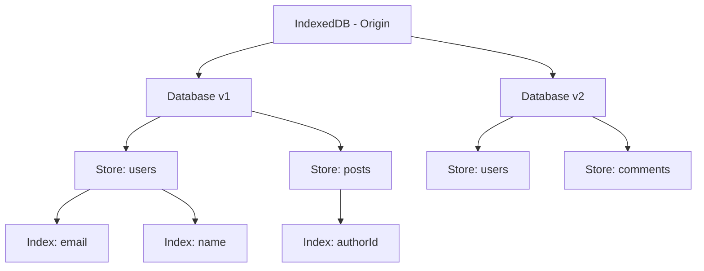
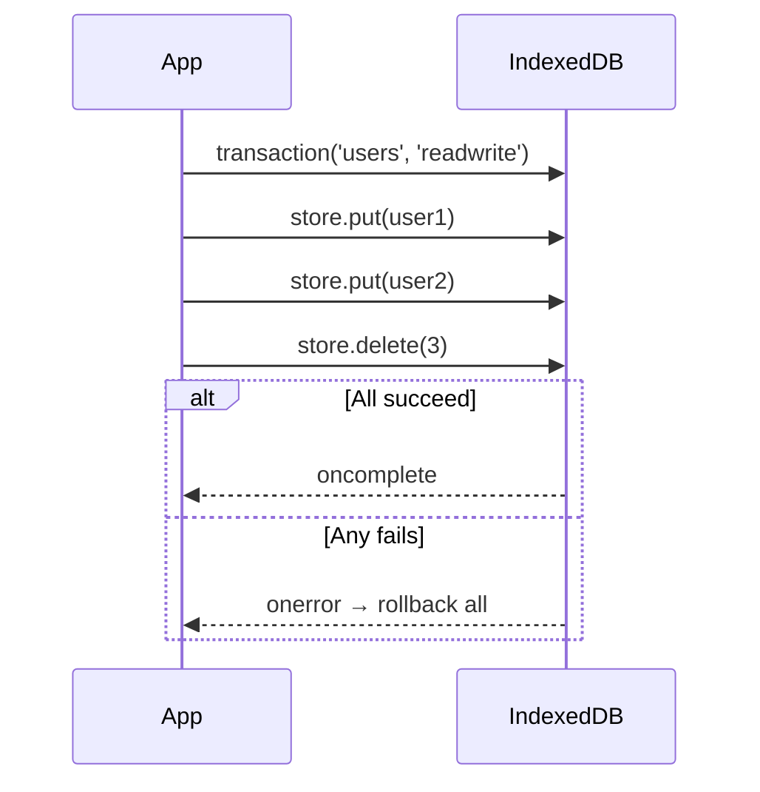

# 07 — IndexedDB

IndexedDB is a **low-level, asynchronous, transactional** database in the browser. It stores structured data (including files/blobs), supports indexes for fast lookups, and has much larger storage limits than localStorage.

---

## 1. Key Concepts

| Concept | Description |
|---------|-------------|
| **Database** | Origin-scoped, versioned |
| **Object Store** | Like a table in SQL |
| **Index** | Fast lookup on a property (like SQL index) |
| **Transaction** | Atomic read/write scope |
| **Cursor** | Iterates over multiple records |
| **Key path** | The property used as primary key |



---

## 2. Opening a Database & Versioning

```js
const request = indexedDB.open('MyApp', 2); // name, version

request.onupgradeneeded = (event) => {
  const db = event.target.result;
  const oldVersion = event.oldVersion;

  // Create stores and indexes here
  if (oldVersion < 1) {
    const userStore = db.createObjectStore('users', { keyPath: 'id' });
    userStore.createIndex('email', 'email', { unique: true });
    userStore.createIndex('name', 'name', { unique: false });
  }

  if (oldVersion < 2) {
    const postStore = db.createObjectStore('posts', { keyPath: 'id', autoIncrement: true });
    postStore.createIndex('authorId', 'authorId', { unique: false });
  }
};

request.onsuccess = (event) => {
  const db = event.target.result;
  console.log('DB opened at version', db.version);
};

request.onerror = (event) => {
  console.error('DB error:', event.target.error);
};
```

---

## 3. CRUD Operations

### Create / Add

```js
const tx = db.transaction('users', 'readwrite');
const store = tx.objectStore('users');

store.add({ id: 1, name: 'Alice', email: 'alice@example.com' });
store.add({ id: 2, name: 'Bob', email: 'bob@example.com' });

tx.oncomplete = () => console.log('Users added');
tx.onerror = (e) => console.error(e.target.error);
```

### Read

```js
const tx = db.transaction('users', 'readonly');
const store = tx.objectStore('users');
const request = store.get(1);

request.onsuccess = () => console.log(request.result);
// { id: 1, name: 'Alice', email: 'alice@example.com' }
```

### Update

```js
const tx = db.transaction('users', 'readwrite');
const store = tx.objectStore('users');

// put replaces or inserts if key matches
store.put({ id: 1, name: 'Alice Updated', email: 'alice@new.com' });
```

### Delete

```js
const tx = db.transaction('users', 'readwrite');
tx.objectStore('users').delete(1);
```

---

## 4. Using Indexes

```js
function getUserByEmail(db, email) {
  return new Promise((resolve, reject) => {
    const tx = db.transaction('users', 'readonly');
    const store = tx.objectStore('users');
    const emailIndex = store.index('email');
    const request = emailIndex.get(email);

    request.onsuccess = () => resolve(request.result);
    request.onerror = () => reject(request.error);
  });
}
```

### Index with cursor (get all matching)

```js
function getUsersByName(db, name) {
  return new Promise((resolve) => {
    const results = [];
    const tx = db.transaction('users', 'readonly');
    const store = tx.objectStore('users');
    const nameIndex = store.index('name');
    const range = IDBKeyRange.only(name);
    const cursor = nameIndex.openCursor(range);

    cursor.onsuccess = (event) => {
      const cur = event.target.result;
      if (cur) {
        results.push(cur.value);
        cur.continue();
      } else {
        resolve(results);
      }
    };
  });
}
```

---

## 5. Cursor Iteration

```js
function getAll(db, storeName) {
  return new Promise((resolve) => {
    const results = [];
    const tx = db.transaction(storeName, 'readonly');
    const store = tx.objectStore(storeName);
    const cursor = store.openCursor();

    cursor.onsuccess = (event) => {
      const cur = event.target.result;
      if (cur) {
        results.push(cur.value);
        cur.continue();
      } else {
        resolve(results);
      }
    };
  });
}
```

### Cursor directions

```js
store.openCursor();                   // default: next
store.openCursor(null, 'prev');       // reverse
store.openCursor(null, 'nextunique'); // skip duplicates
```

### Key ranges

```js
IDBKeyRange.only(value);
IDBKeyRange.lowerBound(value, open);   // open=false means inclusive
IDBKeyRange.upperBound(value, open);
IDBKeyRange.bound(lower, upper, lowerOpen, upperOpen);
```

```js
// Ages 18-30 inclusive
const range = IDBKeyRange.bound(18, 30);
store.index('age').openCursor(range);
```

---

## 6. Transactions

```js
// Read-only (can run in parallel)
const tx1 = db.transaction('users', 'readonly');

// Read-write (serialized — only one at a time per store)
const tx2 = db.transaction('users', 'readwrite');

// Multiple stores in one transaction
const tx3 = db.transaction(['users', 'posts'], 'readwrite');

// Abort on error
tx3.onerror = (e) => {
  console.error('Transaction failed, rolling back');
};
tx3.abort(); // manual rollback
```



---

## 7. Promise Wrapper (idb library)

The raw IDB API is callback-heavy. The [`idb`](https://github.com/jakearchibald/idb) library wraps it in promises.

```js
import { openDB } from 'idb';

const db = await openDB('MyApp', 1, {
  upgrade(db) {
    const store = db.createObjectStore('users', { keyPath: 'id' });
    store.createIndex('email', 'email', { unique: true });
  }
});

// CRUD with promises
await db.add('users', { id: 1, name: 'Alice', email: 'alice@example.com' });
const user = await db.get('users', 1);
await db.put('users', { ...user, name: 'Alice Updated' });
await db.delete('users', 1);

// Query index
const alice = await db.getFromIndex('users', 'email', 'alice@example.com');

// Cursor
const allUsers = await db.getAll('users');
```

### If you can't use the library, write a minimal wrapper:

```js
function idbPromise(db, storeName, type, arg) {
  return new Promise((resolve, reject) => {
    const tx = db.transaction(storeName, type === 'get' ? 'readonly' : 'readwrite');
    const store = tx.objectStore(storeName);
    const request = store[type](...arg);

    request.onsuccess = () => resolve(request.result);
    request.onerror = () => reject(request.error);
  });
}

const user = await idbPromise(db, 'users', 'get', [1]);
await idbPromise(db, 'users', 'put', [{ id: 2, name: 'Bob' }]);
```

---

## 8. Full Example: Offline-First Notes App

```js
import { openDB } from 'idb';

async function initDB() {
  return openDB('NotesApp', 1, {
    upgrade(db) {
      const notes = db.createObjectStore('notes', { keyPath: 'id', autoIncrement: true });
      notes.createIndex('updatedAt', 'updatedAt');
      notes.createIndex('tag', 'tag');
    }
  });
}

class NotesStore {
  constructor() {
    this.db = null;
  }

  async ready() {
    if (!this.db) this.db = await initDB();
  }

  async add(note) {
    await this.ready();
    note.createdAt = note.updatedAt = Date.now();
    return this.db.add('notes', note);
  }

  async getAll() {
    await this.ready();
    return this.db.getAllFromIndex('notes', 'updatedAt'); // sorted by update time
  }

  async get(id) {
    await this.ready();
    return this.db.get('notes', id);
  }

  async update(note) {
    await this.ready();
    note.updatedAt = Date.now();
    return this.db.put('notes', note);
  }

  async delete(id) {
    await this.ready();
    return this.db.delete('notes', id);
  }

  async getByTag(tag) {
    await this.ready();
    return this.db.getAllFromIndex('notes', 'tag', tag);
  }
}

const notes = new NotesStore();
await notes.add({ title: 'My Note', body: 'Hello IndexedDB', tag: 'personal' });
const allNotes = await notes.getAll();
```

---

## 9. Storage Limits

| Browser | Approx limit | Notes |
|---------|-------------|-------|
| Chrome | 60% of disk | Per origin, no fixed max |
| Firefox | 50% of disk | At least 10 MB |
| Safari | Up to 1 GB | Per origin |
| Edge | Same as Chrome | Chromium-based |

You can check usage with:

```js
if (navigator.storage && navigator.storage.estimate) {
  const quota = await navigator.storage.estimate();
  console.log(`Used: ${quota.usage} / ${quota.quota}`);
}
```

---

## Summary

| Task | Raw IDB | `idb` library |
|------|---------|---------------|
| Open DB | `indexedDB.open()` | `openDB()` |
| Add | `store.add()` | `db.add()` |
| Get | `store.get()` | `db.get()` |
| Put | `store.put()` | `db.put()` |
| Delete | `store.delete()` | `db.delete()` |
| Index | `store.index().get()` | `db.getFromIndex()` |
| Cursor | `store.openCursor()` | `db.getAll()` |
| Version | `onupgradeneeded` | `upgrade` callback |
