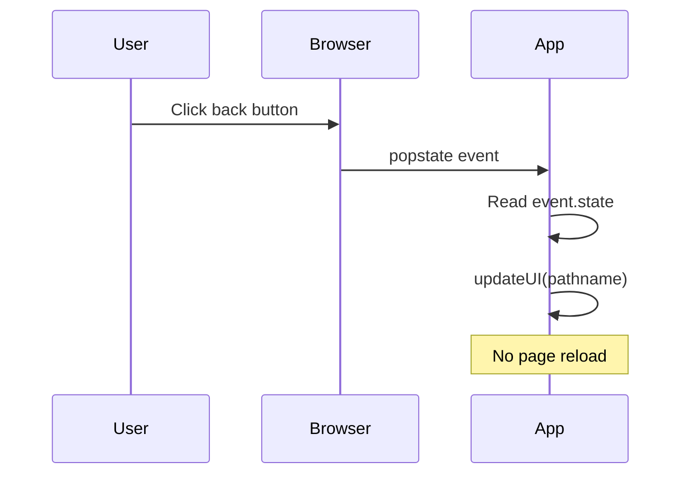

# 08 — History API

The History API lets you manipulate the browser's **session history** — the stack of pages the user has visited. This is the foundation of client-side routing in SPAs.

---

## 1. The `history` Object

```js
window.history.length;     // number of entries in history stack
window.history.scrollRestoration; // 'auto' or 'manual'
```

### Basic navigation

```js
history.back();           // equivalent to pressing the back button
history.forward();        // forward
history.go(-2);           // go back 2 pages
history.go(1);            // go forward 1 page
history.go(0);            // reload current page
```

---

## 2. `pushState` — Add an Entry

Adds a new entry to the history stack **without triggering a page load**.

```js
history.pushState(state, title, url);

// Example
history.pushState({ page: 'home' }, '', '/home');
```

| Parameter | Description |
|-----------|-------------|
| `state` | Serializable data associated with the entry (any structured clone) |
| `title` | Ignored by most browsers (pass empty string) |
| `url` | New URL to display in the address bar (must be same-origin) |

```mermaid
graph LR
    subgraph Stack after pushState
        A1[/ / \] --> A2[/about\]
        A2 --> A3[/contact\]
        A3 --> A4[/home\*]
    end

    subgraph Before pushState
        B1[/ / \] --> B2[/about\]
        B2 --> B3[/contact\*\]
    end

    style A4 fill:#4caf50,color:#fff
    style B3 fill:#ff9800,color:#000
```

---

## 3. `replaceState` — Replace Current Entry

Modifies the current history entry instead of adding a new one.

```js
history.replaceState({ page: 'dashboard' }, '', '/dashboard');
```

Useful for:
- Redirect within SPA without adding a history entry
- Updating query strings without polluting history

---

## 4. `popstate` Event

Fires when the user navigates via browser back/forward buttons or `history.back()`/`history.forward()`. **Does not fire** on `pushState`/`replaceState`.

```js
window.addEventListener('popstate', (event) => {
  console.log('Location:', document.location.href);
  console.log('State:', event.state); // the state object from pushState/replaceState
  renderRoute(document.location.pathname);
});
```



---

## 5. Building SPA Routing

### 5.1 Hash-based routing

```js
window.addEventListener('hashchange', () => {
  const hash = window.location.hash.slice(1) || '/';
  renderRoute(hash);
});

function navigateTo(path) {
  window.location.hash = path; // adds #path to URL, triggers hashchange
}
```

**Pros:** Works without server config. **Cons:** Ugly URLs, `#` in path.

### 5.2 History-based routing (clean URLs)

```js
function navigateTo(path) {
  history.pushState({ path }, '', path);
  renderRoute(path);
}

window.addEventListener('popstate', () => {
  renderRoute(window.location.pathname);
});

// Initial render
renderRoute(window.location.pathname);
```

### 5.3 Full router implementation

```js
class Router {
  constructor(routes, container) {
    this.routes = routes;        // Map<pattern, handler>
    this.container = container;  // DOM element
    this._bindLinks();
    window.addEventListener('popstate', () => this._resolve());
    this._resolve(); // initial route
  }

  navigate(path) {
    history.pushState({ path }, '', path);
    this._resolve();
  }

  _resolve() {
    const path = window.location.pathname;
    for (const [pattern, handler] of this.routes) {
      const params = this._match(pattern, path);
      if (params !== null) {
        this.container.innerHTML = '';
        handler(this.container, params);
        return;
      }
    }
    // 404
    this.container.innerHTML = '<h1>404 — Not Found</h1>';
  }

  _match(pattern, path) {
    const patternParts = pattern.split('/');
    const pathParts = path.split('/');
    if (patternParts.length !== pathParts.length) return null;

    const params = {};
    for (let i = 0; i < patternParts.length; i++) {
      if (patternParts[i].startsWith(':')) {
        params[patternParts[i].slice(1)] = pathParts[i];
      } else if (patternParts[i] !== pathParts[i]) {
        return null;
      }
    }
    return params;
  }

  _bindLinks() {
    this.container.addEventListener('click', (e) => {
      const link = e.target.closest('a[data-nav]');
      if (!link) return;
      e.preventDefault();
      this.navigate(link.getAttribute('href'));
    });
  }
}
```

### Usage

```js
const routes = new Map([
  ['/', (el) => el.innerHTML = '<h1>Home</h1>'],
  ['/users', (el) => el.innerHTML = '<h1>Users</h1>'],
  ['/users/:id', (el, params) => el.innerHTML = `<h1>User ${params.id}</h1>`],
  ['/about', (el) => el.innerHTML = '<h1>About</h1>'],
]);

const router = new Router(routes, document.getElementById('app'));

// Navigate programmatically
router.navigate('/users/42');
```

```html
<!-- Links use data-nav attribute -->
<a href="/" data-nav>Home</a>
<a href="/users" data-nav>Users</a>
<a href="/about" data-nav>About</a>
```

---

## 6. Hash vs History Routing

| Feature | Hash (`#/path`) | History (`/path`) |
|---------|:---------------:|:-----------------:|
| URL appearance | Has `#` | Clean |
| Server config | None needed | Must serve `index.html` for all routes |
| SEO (with SSR) | Harder | Better |
| `popstate` / `hashchange` | `hashchange` | `popstate` |
| Browser support | IE8+ | IE10+ |
| Scroll restoration | Manual | Built-in (`auto`) |

### Server config for history routing

```nginx
# nginx
location / {
  try_files $uri $uri/ /index.html;
}
```

```apache
# Apache .htaccess
RewriteEngine On
RewriteCond %{REQUEST_FILENAME} !-f
RewriteCond %{REQUEST_FILENAME} !-d
RewriteRule ^ /index.html [L]
```

---

## 7. Scroll Restoration

By default, the browser restores scroll position on `popstate`.

```js
// Disable automatic scroll restoration
history.scrollRestoration = 'manual';

// Custom scroll restoration
window.addEventListener('popstate', (e) => {
  if (e.state && e.state.scrollY !== undefined) {
    window.scrollTo(0, e.state.scrollY);
  }
});

// Save scroll before navigation
document.addEventListener('click', (e) => {
  const link = e.target.closest('a[data-nav]');
  if (link) {
    history.state.scrollY = window.scrollY;
  }
});
```

---

## 8. `scrollRestoration` Modes

| Mode | Behavior |
|------|----------|
| `'auto'` (default) | Browser automatically restores scroll position on back/forward |
| `'manual'` | You control scroll restoration |

---

## Example: Complete SPA with History Routing

```html
<!-- index.html -->
<nav>
  <a href="/" data-link>Home</a>
  <a href="/products" data-link>Products</a>
  <a href="/cart" data-link>Cart</a>
</nav>
<main id="app"></main>
```

```js
// app.js
const app = document.getElementById('app');

function render(html) {
  app.innerHTML = html;
}

const routes = {
  '/': () => render('<h1>Home</h1><p>Welcome!</p>'),
  '/products': () => render('<h1>Products</h1><ul><li>Item A</li><li>Item B</li></ul>'),
  '/cart': () => render('<h1>Cart</h1><p>Your cart is empty.</p>'),
};

function router() {
  const path = window.location.pathname;
  (routes[path] || (() => render('<h1>404</h1>')))();
}

// Intercept link clicks
document.addEventListener('click', (e) => {
  const link = e.target.closest('[data-link]');
  if (!link) return;
  e.preventDefault();
  const href = link.getAttribute('href');
  history.pushState({ path: href }, '', href);
  router();
});

window.addEventListener('popstate', router);
router();
```

---

## Summary

```js
// Navigate (add history entry)
history.pushState({ data }, '', '/new-path');

// Navigate (replace current entry)
history.replaceState({ data }, '', '/another-path');

// Listen for back/forward
window.addEventListener('popstate', (e) => {
  // e.state contains the saved data
  // window.location.pathname has current URL
});

// Check scroll mode
history.scrollRestoration; // 'auto' | 'manual'
```
