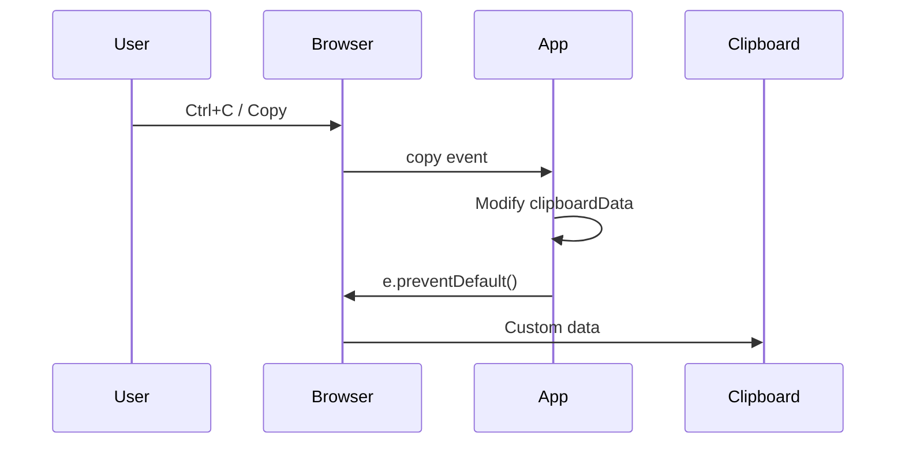

# 09 — Clipboard API

The Clipboard API provides **asynchronous** access to the system clipboard for reading and writing text, images, and other data.

---

## 1. Basic Read/Write (Text)

### Write text

```js
await navigator.clipboard.writeText('Hello, world!');
console.log('Text copied to clipboard');
```

### Read text

```js
const text = await navigator.clipboard.readText();
console.log('Clipboard contents:', text);
```

### With try/catch

```js
async function copy(text) {
  try {
    await navigator.clipboard.writeText(text);
    showToast('Copied!');
  } catch (err) {
    console.error('Copy failed:', err);
    fallbackCopy(text);
  }
}

async function paste() {
  try {
    return await navigator.clipboard.readText();
  } catch (err) {
    console.error('Paste failed:', err);
    return null;
  }
}
```

---

## 2. Advanced Read/Write (Images & Blobs)

### Write (arbitrary data)

```js
// Copy a canvas as PNG
canvas.toBlob(async (blob) => {
  try {
    await navigator.clipboard.write([
      new ClipboardItem({
        'image/png': blob
      })
    ]);
  } catch (err) {
    console.error('Copy image failed:', err);
  }
});
```

### Read (multiple formats)

```js
const items = await navigator.clipboard.read();

for (const item of items) {
  if (item.types.includes('image/png')) {
    const blob = await item.getType('image/png');
    const img = document.createElement('img');
    img.src = URL.createObjectURL(blob);
    document.body.appendChild(img);
  }

  if (item.types.includes('text/plain')) {
    const blob = await item.getType('text/plain');
    const text = await blob.text();
    console.log('Text:', text);
  }
}
```

---

## 3. Permissions

Clipboard access requires user **activation** (click, touch, keypress) and appropriate permissions.

### Write permission

```js
// Write is allowed automatically in secure contexts
// during user-initiated event handlers
button.addEventListener('click', async () => {
  await navigator.clipboard.writeText('ok');
});
```

### Read permission

```js
// Read requires explicit permission
const permission = await navigator.permissions.query({
  name: 'clipboard-read'
});

if (permission.state === 'granted' || permission.state === 'prompt') {
  const text = await navigator.clipboard.readText();
}
```

```mermaid
flowchart TD
    A[User action] --> B{Secure context?}
    B -->|No (HTTP)| C[Clipboard API unavailable]
    B -->|Yes (HTTPS| D[Call API]
    D --> E{Operation}
    E -->|writeText| F[Granted - works]
    E -->|readText| G{Permission?}
    G -->|Granted| H[Read succeeds]
    G -->|Denied| I[Read fails]
    G -->|Prompt| J[Browser shows dialog]
    J --> K{User choice}
    K -->|Allow| H
    K -->|Block| I
```

---

## 4. Clipboard Events

The document fires events when the user **manually** copies, cuts, or pastes (not when using the programmatic API).

```js
document.addEventListener('copy', (e) => {
  // Modify what gets copied
  e.clipboardData.setData('text/plain', 'Custom copied text');
  e.clipboardData.setData('text/html', '<b>Custom</b> copied text');
  e.preventDefault(); // prevent default copy
});

document.addEventListener('cut', (e) => {
  console.log('Cut event');
  e.clipboardData.setData('text/plain', window.getSelection().toString().toUpperCase());
  e.preventDefault();
});

document.addEventListener('paste', (e) => {
  const text = e.clipboardData.getData('text/plain');
  const html = e.clipboardData.getData('text/html');
  const files = e.clipboardData.files; // pasted files (e.g., screenshot)

  console.log('Pasted text:', text);
  e.preventDefault(); // prevent default paste
});
```



### ClipboardEvent properties

```js
document.addEventListener('paste', (e) => {
  e.clipboardData;              // DataTransfer object
  e.clipboardData.items;        // FileList-like items
  e.clipboardData.files;        // FileList (for file pastes)
  e.clipboardData.types;        // ['text/plain', 'text/html', 'Files']
});
```

---

## 5. Security Considerations

| Aspect | Guidance |
|--------|----------|
| **HTTPS only** | Clipboard API requires a secure context |
| **User gesture** | `writeText`/`write` require user activation (click, keypress) |
| **Read permission** | `readText`/`read` require user activation + permission prompt |
| **Event readonly** | Can't read clipboard outside paste event |
| **Clearing clipboard** | Not possible via API (write empty string instead) |

### Best practices

```js
// ✅ Always wrap in try/catch
async function safeCopy(text) {
  try {
    await navigator.clipboard.writeText(text);
  } catch {
    // Fallback for older browsers or permission denied
    fallbackCopy(text);
  }
}

function fallbackCopy(text) {
  const textarea = document.createElement('textarea');
  textarea.value = text;
  textarea.style.position = 'fixed';
  textarea.style.opacity = '0';
  document.body.appendChild(textarea);
  textarea.select();
  document.execCommand('copy');
  document.body.removeChild(textarea);
}
```

### What NOT to do

```js
// ❌ Read silently on page load (will fail — no user gesture)
window.onload = () => navigator.clipboard.readText();

// ❌ Don't store copied data without user knowledge
document.addEventListener('copy', (e) => {
  // Don't silently log user's copied content to a server
});
```

---

## 6. Supported Data Types

| MIME type | Description |
|-----------|-------------|
| `text/plain` | Plain text |
| `text/html` | HTML content |
| `image/png` | PNG image |
| `image/jpeg` | JPEG image |
| `image/svg+xml` | SVG image |
| `text/uri-list` | URLs |

---

## 7. Full Example: Rich Copy/Paste

```js
// Copy formatted content
async function copyRich(text, html) {
  try {
    await navigator.clipboard.write([
      new ClipboardItem({
        'text/plain': new Blob([text], { type: 'text/plain' }),
        'text/html': new Blob([html], { type: 'text/html' })
      })
    ]);
    showToast('Copied with formatting!');
  } catch (err) {
    // Fallback to text-only
    await navigator.clipboard.writeText(text);
  }
}

// Paste with image support
async function pasteRich() {
  try {
    const items = await navigator.clipboard.read();
    const results = [];

    for (const item of items) {
      if (item.types.includes('image/png')) {
        const blob = await item.getType('image/png');
        results.push({ type: 'image', data: blob });
      } else if (item.types.includes('text/html')) {
        const blob = await item.getType('text/html');
        results.push({ type: 'html', data: await blob.text() });
      } else if (item.types.includes('text/plain')) {
        const blob = await item.getType('text/plain');
        results.push({ type: 'text', data: await blob.text() });
      }
    }

    return results;
  } catch {
    return [];
  }
}
```

---

## Summary

```js
// Write text (requires user gesture)
await navigator.clipboard.writeText('text');

// Read text (requires user gesture + permission)
const text = await navigator.clipboard.readText();

// Write image
await navigator.clipboard.write([new ClipboardItem({ 'image/png': blob })]);

// Read all formats
const items = await navigator.clipboard.read();

// Clipboard events (user-initiated only)
document.addEventListener('copy', (e) => e.clipboardData.setData(...));
document.addEventListener('paste', (e) => e.clipboardData.getData(...));
document.addEventListener('cut', (e) => e.clipboardData.setData(...));
```
