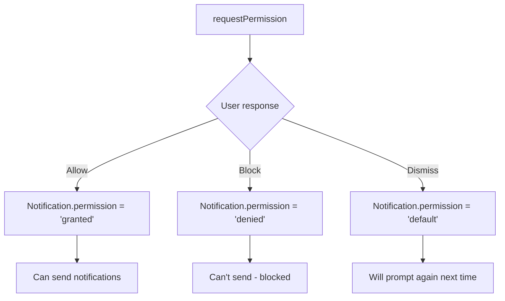

# 10 — Notification API

The Notifications API lets websites display **system-level notifications** outside the browser window, even when the tab is in the background.

---

## 1. Requesting Permission

Before sending notifications, you must ask the user for permission.

```js
async function requestNotificationPermission() {
  if (!('Notification' in window)) {
    console.log('Notifications not supported');
    return 'unsupported';
  }

  const permission = await Notification.requestPermission();
  // 'granted' | 'denied' | 'default'
  return permission;
}
```



### Check current permission

```js
if (Notification.permission === 'granted') {
  // Already allowed
} else if (Notification.permission === 'denied') {
  // User blocked — can't ask again programmatically
  // Direct user to browser settings
}
```

---

## 2. Creating Notifications

```js
const notification = new Notification('Hello!', {
  body: 'This is a notification body',
  icon: '/icon-192.png',
  badge: '/badge-72.png',
  tag: 'message-1',
  data: { url: '/inbox/123' },
  requireInteraction: true,
  silent: false,
  vibrate: [200, 100, 200],
});
```

### Options reference

| Option | Type | Description |
|--------|------|-------------|
| `body` | string | Main text content |
| `icon` | string | URL to 192x192+ icon |
| `badge` | string | Small icon (used on mobile) |
| `tag` | string | Groups notifications — same tag replaces old |
| `data` | any | Arbitrary data attached to the notification |
| `requireInteraction` | boolean | Stay visible until user clicks (vs auto-dismiss) |
| `silent` | boolean | No sound/vibration |
| `vibrate` | number[] | Vibration pattern `[on, off, on, ...]` |
| `image` | string | Large image URL |
| `actions` | NotificationAction[] | Action buttons (mobile) |
| `renotify` | boolean | Force re-notify even with same tag (default false) |
| `dir` | `'auto'\|'ltr'\|'rtl'` | Text direction |

---

## 3. Handling Clicks

```js
const notification = new Notification('New message', {
  body: 'You have a new message from Alice',
  data: { chatId: 42 }
});

notification.onclick = (event) => {
  event.preventDefault(); // prevent browser focusing the tab
  window.focus();
  openChat(event.target.data.chatId);
  event.target.close();
};
```

### Global click handler

```js
// Handle clicks for all notifications
document.addEventListener('click', (e) => {
  // This fires for notification clicks too
  // But it's better to use the notification's own onclick
});
```

---

## 4. Closing Notifications

```js
// Close programmatically
notification.close();

// Or the user dismisses it
notification.onclose = () => {
  console.log('Notification dismissed');
};
```

---

## 5. Notification Tags (Grouping)

Replace an existing notification with the same tag:

```js
function notify(tag, title, body) {
  // If a notification with tag 'new-message' exists,
  // it will be replaced
  new Notification(title, { tag, body });
}

notify('new-message', 'Alice', 'Hey!');
notify('new-message', 'Alice', 'Are you there?');
// Only ONE notification visible (the 2nd replaces the 1st)
```

---

## 6. Service Worker Integration

Notifications from service workers persist even when the page is closed.

### In the Service Worker

```js
// sw.js
self.addEventListener('push', (event) => {
  const data = event.data.json();

  event.waitUntil(
    self.registration.showNotification(data.title, {
      body: data.body,
      icon: '/icon-192.png',
      badge: '/badge-72.png',
      data: { url: data.url }
    })
  );
});

// Handle notification click from service worker
self.addEventListener('notificationclick', (event) => {
  event.notification.close();

  const urlToOpen = event.notification.data.url || '/';

  event.waitUntil(
    clients.matchAll({ type: 'window', includeUncontrolled: true })
      .then((clientList) => {
        // Focus existing window if open
        for (const client of clientList) {
          if (client.url.includes(urlToOpen) && 'focus' in client) {
            return client.focus();
          }
        }
        // Otherwise open new window
        if (clients.openWindow) {
          return clients.openWindow(urlToOpen);
        }
      })
  );
});
```

### Register push subscription (from page)

```js
// Request notification permission first
const permission = await Notification.requestPermission();
if (permission !== 'granted') return;

const registration = await navigator.serviceWorker.ready;
const subscription = await registration.pushManager.subscribe({
  userVisibleOnly: true,
  applicationServerKey: urlBase64ToUint8Array(publicVapidKey)
});

// Send subscription to your server
await fetch('/api/push/subscribe', {
  method: 'POST',
  body: JSON.stringify(subscription)
});
```

---

## 7. Actions (Mobile)

```js
const notification = new Notification('Incoming call', {
  body: 'Alice is calling...',
  tag: 'call',
  requireInteraction: true,
  actions: [
    { action: 'answer', title: 'Answer' },
    { action: 'decline', title: 'Decline' },
  ]
});

notification.onaction = (event) => {
  const action = event.action;
  if (action === 'answer') {
    startCall();
  } else if (action === 'decline') {
    rejectCall();
  }
  notification.close();
};
```

---

## 8. Full Example: Chat Notification System

```js
class ChatNotifier {
  constructor() {
    this.supported = 'Notification' in window;
  }

  async init() {
    if (!this.supported) return false;
    const perm = await Notification.requestPermission();
    return perm === 'granted';
  }

  notify(message) {
    if (Notification.permission !== 'granted') return;

    // Use tag to group by conversation
    const tag = `chat:${message.conversationId}`;

    const notification = new Notification(`${message.from}:`, {
      body: message.text,
      icon: message.avatarUrl,
      tag,
      data: { conversationId: message.conversationId },
    });

    notification.onclick = () => {
      window.focus();
      openConversation(message.conversationId);
      notification.close();
    };
  }

  error(err) {
    new Notification('Error', {
      body: err.message,
      tag: 'error',
    });
  }
}

const notifier = new ChatNotifier();
await notifier.init();

// Later, when a message arrives
socket.on('message', (msg) => notifier.notify(msg));
```

---

## 9. Limitations & Considerations

| Issue | Note |
|-------|------|
| **HTTPS required** | Notifications only work on secure origins |
| **Permission once** | Can't re-prompt if denied — user must change in settings |
| **Autoclose** | Most dismiss after ~4-8 seconds on desktop |
| **Mobile limitations** | `requireInteraction` ignored on iOS/Android |
| **Focus behavior** | Clicking notification may focus the tab or open new window |
| **No fallback** | If permission denied, no notification — handle gracefully |

---

## Summary

```js
// Check support
if (!('Notification' in window)) return;

// Request permission
const permission = await Notification.requestPermission();

// Create notification
const n = new Notification('Title', { body: 'Body', icon: '/icon.png' });

// Handle click
n.onclick = () => { window.focus(); n.close(); };

// Handle close
n.onclose = () => {};

// SW notificationclick event
self.addEventListener('notificationclick', (e) => {
  e.notification.close();
  e.waitUntil(clients.openWindow('/'));
});
```
