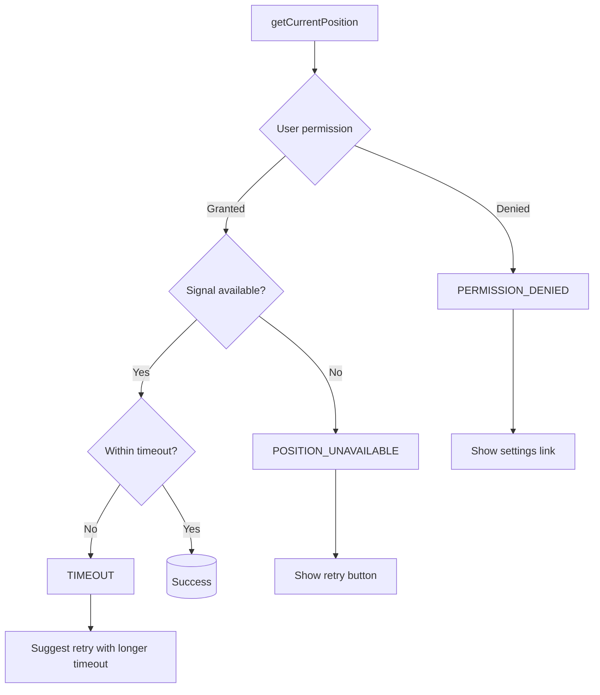

# 11 — Geolocation API

The Geolocation API provides access to the device's **geographic position** (latitude, longitude) via GPS, WiFi, or IP-based triangulation.

---

## 1. Checking Availability

```js
if ('geolocation' in navigator) {
  console.log('Geolocation supported');
} else {
  console.log('Geolocation not supported — provide manual input fallback');
}
```

---

## 2. `getCurrentPosition` — One-Time Position

```js
navigator.geolocation.getCurrentPosition(successCallback, errorCallback, options);
```

### Basic usage

```js
navigator.geolocation.getCurrentPosition(
  (position) => {
    const { latitude, longitude, accuracy } = position.coords;
    console.log(`Lat: ${latitude}, Lng: ${longitude}, Accuracy: ${accuracy}m`);
  },
  (error) => {
    console.error('Error:', error.message);
  }
);
```

### Position object

```js
position.coords.latitude;        // degrees
position.coords.longitude;       // degrees
position.coords.accuracy;        // meters (lower is better)
position.coords.altitude;        // meters above sea level (or null)
position.coords.altitudeAccuracy;// meters (or null)
position.coords.heading;         // degrees clockwise from north (or null)
position.coords.speed;           // meters/second (or null)
position.timestamp;              // when the position was read
```

---

## 3. `watchPosition` — Continuous Tracking

```js
const watchId = navigator.geolocation.watchPosition(success, error, options);

// Later, stop watching
navigator.geolocation.clearWatch(watchId);
```

### Usage example

```js
let watchId = null;

function startTracking() {
  watchId = navigator.geolocation.watchPosition(
    (pos) => {
      updateMap(pos.coords.latitude, pos.coords.longitude);
      updateSpeed(pos.coords.speed);
    },
    (err) => console.warn(err.message),
    { enableHighAccuracy: true, maximumAge: 1000 }
  );
}

function stopTracking() {
  if (watchId !== null) {
    navigator.geolocation.clearWatch(watchId);
    watchId = null;
  }
}
```

---

## 4. Options

| Option | Type | Default | Description |
|--------|------|---------|-------------|
| `enableHighAccuracy` | boolean | `false` | Request GPS (more accurate, more power) |
| `timeout` | number (ms) | Infinity | Max time to wait for a position |
| `maximumAge` | number (ms) | 0 | Accept cached position up to this age |

```js
const options = {
  enableHighAccuracy: true,  // Use GPS
  timeout: 10000,            // Wait max 10 seconds
  maximumAge: 30000          // Accept position up to 30 seconds old
};
```

---

## 5. Error Handling

```js
navigator.geolocation.getCurrentPosition(success, (error) => {
  switch (error.code) {
    case error.PERMISSION_DENIED:      // 1
      showMessage('Location access denied. Enable in site settings.');
      break;
    case error.POSITION_UNAVAILABLE:   // 2
      showMessage('Location unavailable. Check GPS/wifi.');
      break;
    case error.TIMEOUT:                // 3
      showMessage('Location request timed out. Try again.');
      break;
  }
  console.error(error.code, error.message);
});
```



---

## 6. Permission Handling

### Check permission state

```js
const status = await navigator.permissions.query({ name: 'geolocation' });

if (status.state === 'granted') {
  // Already allowed
} else if (status.state === 'prompt') {
  // Will prompt on next call
} else if (status.state === 'denied') {
  // Show message and disable location features
}

// Listen for permission changes
status.onchange = () => {
  console.log('Permission changed to:', status.state);
};
```

### User gesture requirement

Most browsers require a **user gesture** (click) to trigger the permission prompt:

```js
// ✅ Will show prompt
button.addEventListener('click', () => {
  navigator.geolocation.getCurrentPosition(success);
});

// ❌ May not show prompt (depends on browser)
window.onload = () => {
  navigator.geolocation.getCurrentPosition(success);
};
```

---

## 7. Use Cases

### 7.1 Show location on a map

```js
function showOnMap(lat, lng) {
  const map = document.getElementById('map');
  map.src = `https://maps.google.com/maps?q=${lat},${lng}&z=15&output=embed`;
}

navigator.geolocation.getCurrentPosition((pos) => {
  showOnMap(pos.coords.latitude, pos.coords.longitude);
});
```

### 7.2 Distance calculation (Haversine)

```js
function getDistanceFromLatLon(lat1, lon1, lat2, lon2) {
  const R = 6371; // Earth radius in km
  const dLat = (lat2 - lat1) * Math.PI / 180;
  const dLon = (lon2 - lon1) * Math.PI / 180;
  const a = Math.sin(dLat/2) ** 2 +
            Math.cos(lat1 * Math.PI / 180) *
            Math.cos(lat2 * Math.PI / 180) *
            Math.sin(dLon/2) ** 2;
  const c = 2 * Math.atan2(Math.sqrt(a), Math.sqrt(1 - a));
  return R * c;
}

navigator.geolocation.getCurrentPosition((pos) => {
  const dist = getDistanceFromLatLon(
    pos.coords.latitude, pos.coords.longitude,
    targetLat, targetLng
  );
  console.log(`Distance: ${dist.toFixed(1)} km`);
});
```

### 7.3 Find nearby places

```js
async function findNearby(lat, lng, radius = 1000) {
  const url = `/api/places?lat=${lat}&lng=${lng}&radius=${radius}`;
  const res = await fetch(url);
  return res.json();
}

navigator.geolocation.getCurrentPosition(async (pos) => {
  const places = await findNearby(pos.coords.latitude, pos.coords.longitude);
  renderResults(places);
});
```

### 7.4 Reverse geocoding

```js
async function getAddress(lat, lng) {
  const res = await fetch(
    `https://nominatim.openstreetmap.org/reverse?format=json&lat=${lat}&lon=${lng}`
  );
  const data = await res.json();
  return data.display_name;
}
```

### 7.5 Ride-sharing / delivery tracking

```js
const watchId = navigator.geolocation.watchPosition(
  (pos) => {
    socket.emit('driver-location', {
      lat: pos.coords.latitude,
      lng: pos.coords.longitude
    });
  },
  null,
  { enableHighAccuracy: true, maximumAge: 2000 }
);

// On unmount/leave
navigator.geolocation.clearWatch(watchId);
```

---

## 8. Battery & Performance Considerations

```js
// ⚡ High accuracy = more battery drain
// Use only when needed, fallback to low accuracy

let highAccuracy = false;

function startRoughTracking() {
  navigator.geolocation.watchPosition(updatePos, err, {
    enableHighAccuracy: false,
    maximumAge: 30000,       // 30 second cache
    timeout: 15000
  });
}

function startPreciseTracking() {
  navigator.geolocation.watchPosition(updatePos, err, {
    enableHighAccuracy: true,
    maximumAge: 1000,
    timeout: 5000
  });
}
```

---

## 9. Fallback Strategy

```js
async function getLocation() {
  if (!('geolocation' in navigator)) {
    return await askManualLocation();
  }

  // Try high accuracy first with short timeout
  try {
    const pos = await new Promise((resolve, reject) => {
      navigator.geolocation.getCurrentPosition(resolve, reject, {
        enableHighAccuracy: true,
        timeout: 5000
      });
    });
    return pos.coords;
  } catch {
    console.log('High accuracy failed, trying low');
  }

  // Fallback to low accuracy
  try {
    const pos = await new Promise((resolve, reject) => {
      navigator.geolocation.getCurrentPosition(resolve, reject, {
        enableHighAccuracy: false,
        timeout: 10000
      });
    });
    return pos.coords;
  } catch {
    // Ultimate fallback: ask user to type address
    return await askManualLocation();
  }
}
```

---

## Summary

```js
// One-time
navigator.geolocation.getCurrentPosition(success, error, options);

// Continuous
const id = navigator.geolocation.watchPosition(success, error, options);
navigator.geolocation.clearWatch(id);

// Position data
position.coords.latitude;
position.coords.longitude;
position.coords.accuracy;

// Error codes
error.PERMISSION_DENIED;     // 1
error.POSITION_UNAVAILABLE;  // 2
error.TIMEOUT;               // 3

// Permission
const perm = await navigator.permissions.query({ name: 'geolocation' });
```
