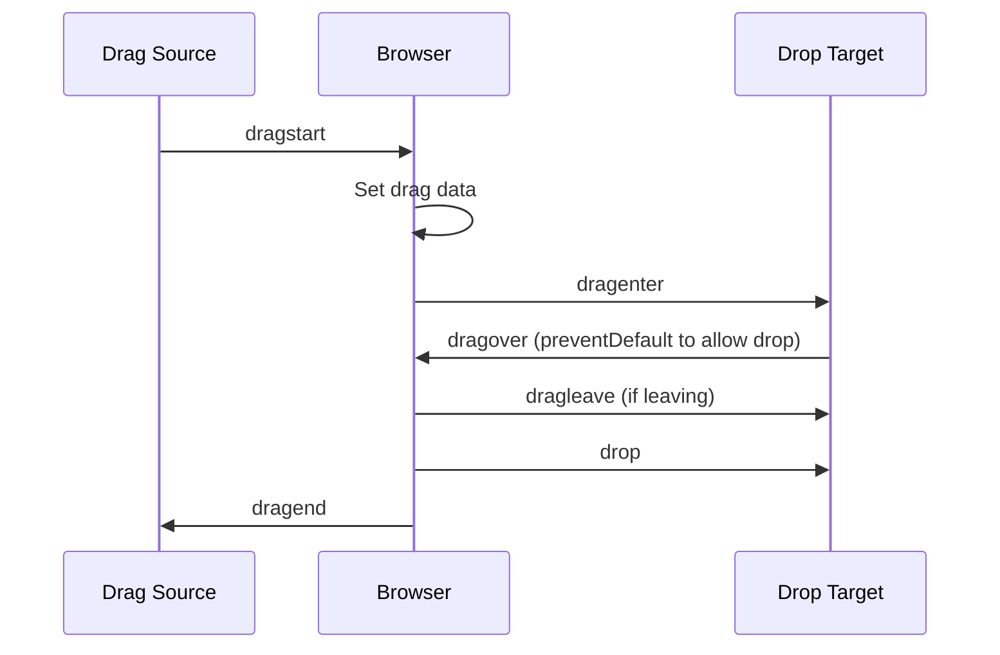
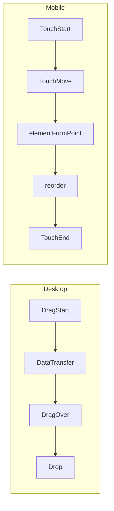

# 12 — Drag and Drop

The HTML Drag and Drop API enables native drag-and-drop interactions within the browser.

---

## 1. Drag Lifecycle



| Event | Fires on | Description |
|-------|----------|-------------|
| `dragstart` | Source | User starts dragging |
| `drag` | Source | Continuously while dragging |
| `dragenter` | Target | Dragged element enters a valid target |
| `dragover` | Target | Every few hundred ms while over target |
| `dragleave` | Target | Leaves the target |
| `drop` | Target | Element is dropped |
| `dragend` | Source | Drag operation ends (anywhere) |

---

## 2. Making an Element Draggable

```html
<div draggable="true" id="item-1" class="drag-item">
  Drag me
</div>
```

```js
document.querySelectorAll('.drag-item').forEach(item => {
  item.addEventListener('dragstart', (e) => {
    e.dataTransfer.setData('text/plain', item.id);
    item.classList.add('dragging');
  });

  item.addEventListener('dragend', (e) => {
    item.classList.remove('dragging');
  });
});
```

---

## 3. DataTransfer API

`e.dataTransfer` carries data between drag source and drop target.

### Methods

```js
// Set drag data
e.dataTransfer.setData(format, data);
e.dataTransfer.setData('text/plain', 'some text');
e.dataTransfer.setData('text/html', '<b>HTML</b>');
e.dataTransfer.setData('application/json', JSON.stringify(obj));

// Get drag data (in drop handler)
const text = e.dataTransfer.getData('text/plain');
const html = e.dataTransfer.getData('text/html');

// Available formats
e.dataTransfer.types; // ['text/plain', 'text/html', ...]

// Files (for file drops)
e.dataTransfer.files; // FileList
```

### Drag effects

```js
e.dataTransfer.effectAllowed = 'move';   // 'move' | 'copy' | 'link' | 'none'

// In dragover:
e.dataTransfer.dropEffect = 'move';      // 'move' | 'copy' | 'link' | 'none'
```

---

## 4. Creating a Drop Target

```js
const dropZone = document.querySelector('.drop-zone');

dropZone.addEventListener('dragover', (e) => {
  e.preventDefault(); // REQUIRED to allow drop
  e.dataTransfer.dropEffect = 'move';
  dropZone.classList.add('drag-over');
});

dropZone.addEventListener('dragleave', (e) => {
  dropZone.classList.remove('drag-over');
});

dropZone.addEventListener('drop', (e) => {
  e.preventDefault();
  dropZone.classList.remove('drag-over');

  const id = e.dataTransfer.getData('text/plain');
  const draggedElement = document.getElementById(id);
  dropZone.appendChild(draggedElement);
});
```

---

## 5. Drag Feedback — Custom Image

```js
element.addEventListener('dragstart', (e) => {
  // Custom drag image (ghost)
  const ghost = document.createElement('div');
  ghost.textContent = element.textContent;
  ghost.style.cssText = 'background:#ddd;padding:4px;position:absolute;top:-999px';
  document.body.appendChild(ghost);
  e.dataTransfer.setDragImage(ghost, 10, 10);

  // Clean up after
  setTimeout(() => ghost.remove(), 0);
});
```

---

## 6. Example: Drag-to-Reorder List

```html
<ul id="sortable-list">
  <li draggable="true" data-id="1">Item 1</li>
  <li draggable="true" data-id="2">Item 2</li>
  <li draggable="true" data-id="3">Item 3</li>
  <li draggable="true" data-id="4">Item 4</li>
</ul>
```

```js
const list = document.getElementById('sortable-list');
let draggedItem = null;

list.addEventListener('dragstart', (e) => {
  draggedItem = e.target.closest('li');
  e.dataTransfer.effectAllowed = 'move';
  e.dataTransfer.setData('text/plain', draggedItem.dataset.id);
  draggedItem.classList.add('dragging');
});

list.addEventListener('dragover', (e) => {
  e.preventDefault();
  const target = e.target.closest('li');
  if (!target || target === draggedItem) return;

  // Determine if we should insert before or after
  const rect = target.getBoundingClientRect();
  const midY = rect.top + rect.height / 2;

  if (e.clientY < midY) {
    list.insertBefore(draggedItem, target);
  } else {
    list.insertBefore(draggedItem, target.nextSibling);
  }
});

list.addEventListener('dragend', () => {
  draggedItem?.classList.remove('dragging');
  draggedItem = null;

  // Save new order
  const order = [...list.querySelectorAll('li')].map(li => li.dataset.id);
  console.log('New order:', order);
});
```

---

## 7. File Drop

```html
<div id="file-zone" class="drop-zone">
  Drop files here
</div>
```

```js
const fileZone = document.getElementById('file-zone');

fileZone.addEventListener('dragover', (e) => {
  e.preventDefault();
  fileZone.classList.add('drag-over');
});

fileZone.addEventListener('dragleave', () => {
  fileZone.classList.remove('drag-over');
});

fileZone.addEventListener('drop', (e) => {
  e.preventDefault();
  fileZone.classList.remove('drag-over');

  const files = e.dataTransfer.files;
  handleFiles(files);
});

function handleFiles(files) {
  for (const file of files) {
    console.log(`${file.name} (${file.size} bytes, ${file.type})`);

    // Preview image
    if (file.type.startsWith('image/')) {
      const reader = new FileReader();
      reader.onload = (e) => {
        const img = document.createElement('img');
        img.src = e.target.result;
        img.width = 200;
        fileZone.appendChild(img);
      };
      reader.readAsDataURL(file);
    }
  }
}
```

---

## 8. Touch Events Fallback

Drag and Drop does **not** work on mobile. Use touch events as fallback.

```js
class DragController {
  constructor(container, itemSelector) {
    this.container = container;
    this.items = () => container.querySelectorAll(itemSelector);
    this.draggedItem = null;
    this.isDragging = false;

    this.init();
  }

  init() {
    // Pointer events work on both mouse and touch
    this.container.addEventListener('pointerdown', this.onPointerDown.bind(this));
    document.addEventListener('pointermove', this.onPointerMove.bind(this));
    document.addEventListener('pointerup', this.onPointerUp.bind(this));
  }

  onPointerDown(e) {
    const item = e.target.closest('[draggable]');
    if (!item) return;
    this.draggedItem = item;
    this.isDragging = true;
    this.startX = e.clientX;
    this.startY = e.clientY;
    item.setPointerCapture(e.pointerId);
    item.classList.add('dragging');
  }

  onPointerMove(e) {
    if (!this.isDragging || !this.draggedItem) return;

    const target = document.elementFromPoint(e.clientX, e.clientY);
    const listItem = target?.closest('[draggable]');
    if (!listItem || listItem === this.draggedItem) return;

    const rect = listItem.getBoundingClientRect();
    const midY = rect.top + rect.height / 2;

    if (e.clientY < midY) {
      this.container.insertBefore(this.draggedItem, listItem);
    } else {
      this.container.insertBefore(this.draggedItem, listItem.nextSibling);
    }
  }

  onPointerUp() {
    if (this.draggedItem) {
      this.draggedItem.classList.remove('dragging');
      this.draggedItem = null;
    }
    this.isDragging = false;
  }
}
```



---

## 9. Drag-and-Drop Between Containers

```js
const lists = document.querySelectorAll('.list');

lists.forEach(list => {
  list.addEventListener('dragover', (e) => {
    e.preventDefault();
    const target = e.target.closest('.card');
    if (!target) return;

    const rect = target.getBoundingClientRect();
    const midY = rect.top + rect.height / 2;

    if (e.clientY < midY) {
      list.insertBefore(draggedItem, target);
    } else {
      list.insertBefore(draggedItem, target.nextSibling);
    }
  });

  list.addEventListener('drop', (e) => {
    e.preventDefault();
    // Item is already placed by dragover
    saveState();
  });
});
```

---

## Summary

```js
// Source: make draggable
element.draggable = true;
element.addEventListener('dragstart', (e) => {
  e.dataTransfer.setData('text/plain', id);
  e.dataTransfer.effectAllowed = 'move';
});

// Target: allow drop
target.addEventListener('dragover', (e) => {
  e.preventDefault(); // required
});
target.addEventListener('drop', (e) => {
  e.preventDefault();
  const id = e.dataTransfer.getData('text/plain');
  // handle drop
});

// Files
e.dataTransfer.files; // FileList in drop handler

// Mobile fallback: use pointer events + elementFromPoint
```
