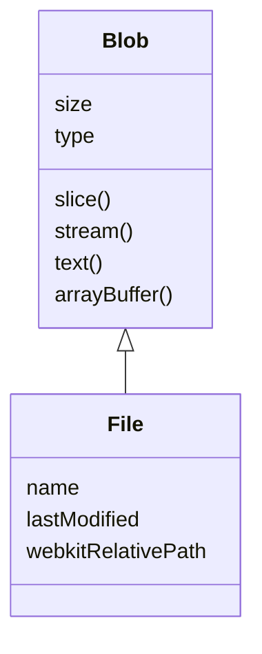
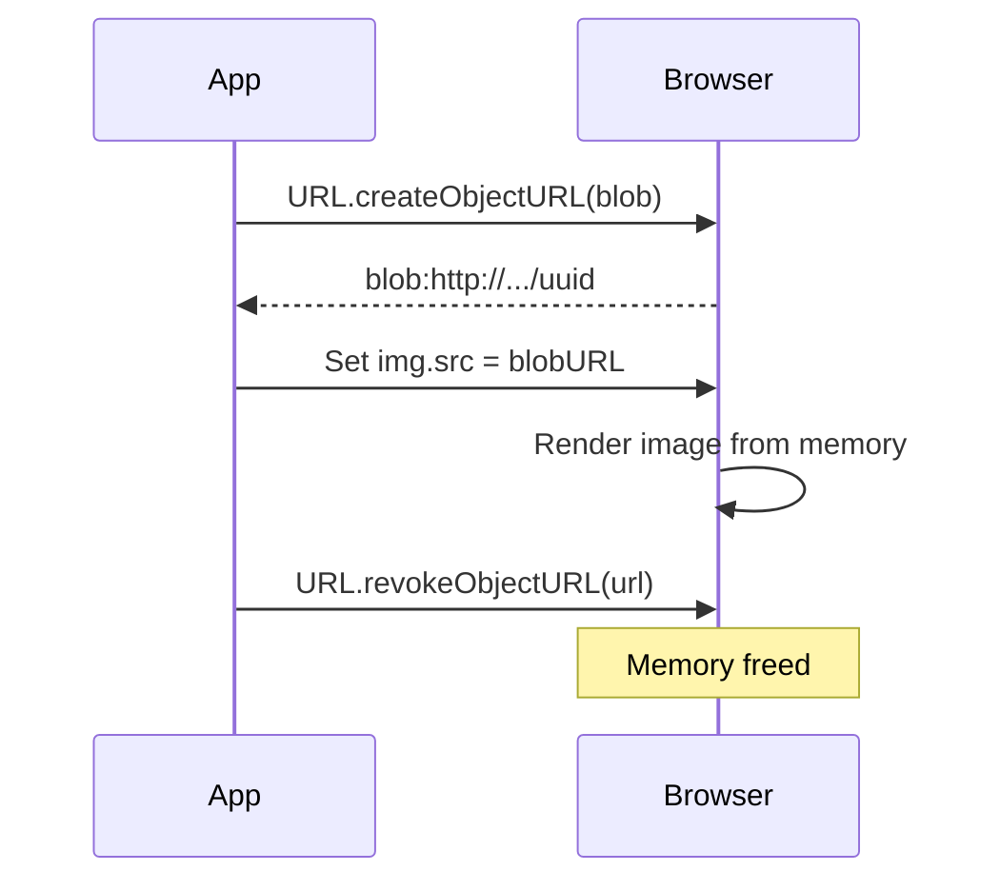

# 13 — File API

The File API lets web applications read, create, and manipulate files in the browser.

---

## 1. File Objects

A `File` is a subclass of `Blob` with **name** and **lastModified** properties.

```js
// From a file input
<input type="file" id="file-input" multiple>

const input = document.getElementById('file-input');
input.addEventListener('change', () => {
  for (const file of input.files) {
    console.log(file.name);       // 'photo.jpg'
    console.log(file.size);       // 123456 (bytes)
    console.log(file.type);       // 'image/jpeg'
    console.log(file.lastModified); // unix timestamp
  }
});
```



---

## 2. FileReader API

Asynchronously reads file contents.

```js
const reader = new FileReader();

reader.onload = (e) => {
  console.log(e.target.result); // file content
};

reader.onerror = (e) => {
  console.error(e.target.error);
};

reader.onprogress = (e) => {
  if (e.lengthComputable) {
    console.log(`${(e.loaded / e.total) * 100}%`);
  }
};
```

### Read methods

```js
const file = input.files[0];
const reader = new FileReader();

// As text
reader.readAsText(file, 'UTF-8');      // for .txt, .csv, .json

// As DataURL (base64 — good for images)
reader.readAsDataURL(file);            // produces 'data:image/png;base64,...'

// As ArrayBuffer (binary)
reader.readAsArrayBuffer(file);        // for further binary processing

// As binary string (legacy)
reader.readAsBinaryString(file);       // deprecated
```

### Promise wrapper

```js
function readFile(file, format = 'dataURL') {
  return new Promise((resolve, reject) => {
    const reader = new FileReader();
    reader.onload = () => resolve(reader.result);
    reader.onerror = () => reject(reader.error);

    switch (format) {
      case 'text': reader.readAsText(file); break;
      case 'buffer': reader.readAsArrayBuffer(file); break;
      default: reader.readAsDataURL(file);
    }
  });
}

const data = await readFile(fileInput.files[0]); // dataURL
const text = await readFile(fileInput.files[0], 'text');
```

---

## 3. File Input Examples

### Single file with preview

```js
<input type="file" id="avatar" accept="image/*">

const avatarInput = document.getElementById('avatar');
const preview = document.getElementById('preview');

avatarInput.addEventListener('change', async (e) => {
  const file = e.target.files[0];
  if (!file) return;

  // Validate
  if (!file.type.startsWith('image/')) {
    alert('Please select an image');
    return;
  }
  if (file.size > 5 * 1024 * 1024) {
    alert('File too large (max 5MB)');
    return;
  }

  // Preview
  const dataUrl = await readFile(file);
  preview.src = dataUrl;
});
```

### Multiple files

```js
<input type="file" multiple accept=".pdf,.doc,.docx">

input.addEventListener('change', () => {
  for (const file of input.files) {
    uploadFile(file);
  }
});
```

### Accept attributes

```html
accept="image/*"              <!-- All images -->
accept="image/png,image/jpeg"  <!-- Specific types -->
accept=".pdf,.doc,.docx"      <!-- Extensions -->
accept="video/*,audio/*"      <!-- Video and audio -->
```

---

## 4. Drag-and-Drop Files

```js
const dropZone = document.getElementById('drop-zone');

dropZone.addEventListener('dragover', (e) => {
  e.preventDefault();
  dropZone.classList.add('hover');
});

dropZone.addEventListener('dragleave', () => {
  dropZone.classList.remove('hover');
});

dropZone.addEventListener('drop', (e) => {
  e.preventDefault();
  dropZone.classList.remove('hover');
  const files = e.dataTransfer.files;
  handleFiles(files);
});

function handleFiles(files) {
  for (const file of files) {
    if (file.type.startsWith('image/')) {
      const img = document.createElement('img');
      img.src = URL.createObjectURL(file);
      img.width = 200;
      dropZone.appendChild(img);
    }
  }
}
```

---

## 5. Blob — Creating Files Programmatically

```js
// Create a text Blob
const blob = new Blob(['Hello, world!'], { type: 'text/plain' });
console.log(blob.size, blob.type);

// Create from typed arrays
const buffer = new Uint8Array([72, 101, 108, 108, 111]); // "Hello"
const blob2 = new Blob([buffer], { type: 'application/octet-stream' });

// Slice a Blob (like file chunking)
const chunk = blob.slice(0, 5, 'text/plain'); // first 5 bytes
```

### Blob → File

```js
const file = new File([blob], 'hello.txt', { type: 'text/plain' });
// File extends Blob, adds name + lastModified
```

---

## 6. `URL.createObjectURL` & `revokeObjectURL`

Creates a temporary `blob:` URL pointing to in-memory data.

```js
const img = document.getElementById('preview');
const file = input.files[0];

// Create URL
const url = URL.createObjectURL(file);
img.src = url;

// Revoke when done (free memory)
img.onload = () => URL.revokeObjectURL(url);
```



### Comparison: createObjectURL vs FileReader

| Method | Memory | Use case |
|--------|--------|----------|
| `URL.createObjectURL` | Sync, ref-counted | Display images/video instantly |
| `FileReader.readAsDataURL` | Async, base64 | Store/transmit as data URL |

```js
// Best for preview: createObjectURL (instant, no encoding)
img.src = URL.createObjectURL(file);

// Best for storage: FileReader base64
const base64 = await readFile(file, 'dataURL');
localStorage.setItem('avatar', base64);
```

---

## 7. File Slicing for Chunked Upload

```js
async function uploadChunked(file, url, chunkSize = 1024 * 1024) {
  const totalChunks = Math.ceil(file.size / chunkSize);

  for (let i = 0; i < totalChunks; i++) {
    const start = i * chunkSize;
    const end = Math.min(start + chunkSize, file.size);
    const chunk = file.slice(start, end);

    const formData = new FormData();
    formData.append('file', chunk, file.name);
    formData.append('chunkIndex', i);
    formData.append('totalChunks', totalChunks);
    formData.append('originalName', file.name);

    const res = await fetch(url, { method: 'POST', body: formData });

    if (!res.ok) {
      throw new Error(`Chunk ${i} failed`);
    }

    const progress = Math.round(((i + 1) / totalChunks) * 100);
    updateProgress(progress);
  }

  // Notify server to merge chunks
  await fetch(`${url}/complete`, {
    method: 'POST',
    body: JSON.stringify({ fileName: file.name, totalChunks })
  });
}
```

---

## 8. Full Example: Image Upload with Preview & Validation

```html
<div class="uploader">
  <div id="drop-zone">Drop image or click to upload</div>
  <input type="file" id="file-input" accept="image/*" hidden>
  <div id="preview-area"></div>
</div>
```

```js
const dropZone = document.getElementById('drop-zone');
const fileInput = document.getElementById('file-input');
const previewArea = document.getElementById('preview-area');

// Click to upload
dropZone.addEventListener('click', () => fileInput.click());

fileInput.addEventListener('change', (e) => {
  handleFiles(e.target.files);
});

// Drag & drop
dropZone.addEventListener('dragover', (e) => {
  e.preventDefault();
  dropZone.classList.add('hover');
});
dropZone.addEventListener('dragleave', () => dropZone.classList.remove('hover'));
dropZone.addEventListener('drop', (e) => {
  e.preventDefault();
  dropZone.classList.remove('hover');
  handleFiles(e.dataTransfer.files);
});

function handleFiles(files) {
  for (const file of files) {
    if (!file.type.startsWith('image/')) {
      alert(`${file.name} is not an image`);
      continue;
    }
    if (file.size > 10 * 1024 * 1024) {
      alert(`${file.name} is too large (max 10MB)`);
      continue;
    }

    const container = document.createElement('div');
    container.className = 'preview-item';

    const img = document.createElement('img');
    img.src = URL.createObjectURL(file);
    img.onload = () => URL.revokeObjectURL(img.src);

    const info = document.createElement('div');
    info.textContent = `${file.name} (${(file.size / 1024).toFixed(1)} KB)`;

    container.append(img, info);
    previewArea.appendChild(container);
  }
}
```

---

## 9. Stream API (Modern Alternative to FileReader)

For large files, use `file.stream()` + async iteration:

```js
async function readLargeFile(file) {
  const stream = file.stream();
  const reader = stream.getReader();
  const decoder = new TextDecoder();
  let result = '';

  while (true) {
    const { done, value } = await reader.read();
    if (done) break;
    result += decoder.decode(value, { stream: true });
  }

  return result;
}
```

---

## Summary

```js
// File input
input.files;                // FileList
file.name, file.size, file.type, file.lastModified;

// FileReader
const reader = new FileReader();
reader.readAsText(file);
reader.readAsDataURL(file);
reader.readAsArrayBuffer(file);

// Blob
new Blob([data], { type: 'mime/type' });
blob.slice(start, end);

// Object URL
const url = URL.createObjectURL(file);
URL.revokeObjectURL(url);

// File slicing
file.slice(start, end);
```
