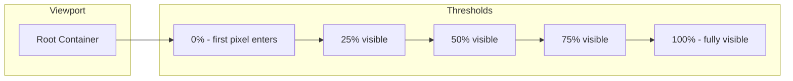
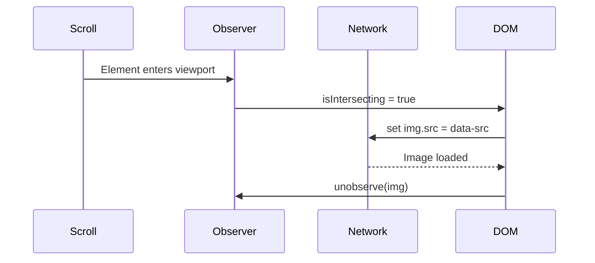

# 14 — IntersectionObserver

`IntersectionObserver` efficiently detects when a target element enters or leaves the viewport (or a parent container). It runs **asynchronously** and avoids expensive scroll event handlers.

---

## 1. Creating an Observer

```js
const observer = new IntersectionObserver(callback, options);

observer.observe(targetElement);
observer.unobserve(targetElement);
observer.disconnect(); // stop observing all
```

### Callback

```js
const observer = new IntersectionObserver((entries) => {
  entries.forEach(entry => {
    // entry.isIntersecting — boolean
    // entry.intersectionRatio — 0.0 to 1.0
    // entry.target — the element
    // entry.boundingClientRect — element's rect
    // entry.intersectionRect — visible portion rect
    // entry.rootBounds — root's rect
  });
});
```

---

## 2. Options

```js
const observer = new IntersectionObserver(callback, {
  root: document.querySelector('#scroll-container'), // null = viewport
  rootMargin: '0px',           // CSS-like margin around root
  threshold: 0.5               // single value or array [0, 0.25, 0.5, 0.75, 1]
});
```

| Option | Default | Description |
|--------|---------|-------------|
| `root` | `null` (viewport) | Element used as the viewport for visibility |
| `rootMargin` | `'0px'` | Shrink/grow the root's bounding box before checking |
| `threshold` | `0` | Ratio of visibility needed to trigger (0 = any pixel, 1 = fully visible) |

### Threshold array — fire at multiple points

```js
const observer = new IntersectionObserver((entries) => {
  entries.forEach(entry => {
    console.log(`${entry.target.id}: ${entry.intersectionRatio}`);
  });
}, {
  threshold: [0, 0.25, 0.5, 0.75, 1.0]
  // fires at 0%, 25%, 50%, 75%, 100% visibility
});
```



---

## 3. Use Case: Lazy Loading Images

```html

```

```js
const imageObserver = new IntersectionObserver((entries) => {
  entries.forEach(entry => {
    if (entry.isIntersecting) {
      const img = entry.target;
      img.src = img.dataset.src;
      img.classList.remove('lazy');
      imageObserver.unobserve(img);
    }
  });
}, {
  rootMargin: '200px' // start loading 200px before visible
});

document.querySelectorAll('img.lazy').forEach(img => imageObserver.observe(img));
```



---

## 4. Use Case: Infinite Scroll

```html
<div id="sentinel">Loading more...</div>
```

```js
let page = 1;

const sentinel = document.getElementById('sentinel');

const loadMoreObserver = new IntersectionObserver(async (entries) => {
  const entry = entries[0];
  if (entry.isIntersecting) {
    page++;
    const items = await fetch(`/api/items?page=${page}`).then(r => r.json());
    if (items.length === 0) {
      sentinel.textContent = 'No more items';
      loadMoreObserver.unobserve(sentinel);
      return;
    }
    renderItems(items);
  }
}, {
  rootMargin: '100px' // trigger before reaching sentinel
});

loadMoreObserver.observe(sentinel);
```

---

## 5. Use Case: Animation on Scroll

```js
const animObserver = new IntersectionObserver((entries) => {
  entries.forEach(entry => {
    if (entry.isIntersecting) {
      entry.target.classList.add('animate-in');
      animObserver.unobserve(entry.target); // animate once
    }
  });
}, { threshold: 0.2 });

document.querySelectorAll('.reveal').forEach(el => animObserver.observe(el));
```

```css
.reveal {
  opacity: 0;
  transform: translateY(30px);
  transition: opacity 0.6s, transform 0.6s;
}
.reveal.animate-in {
  opacity: 1;
  transform: translateY(0);
}
```

---

## 6. Use Case: Tracking Impressions (Analytics)

```js
const impressionObserver = new IntersectionObserver((entries) => {
  entries.forEach(entry => {
    if (entry.isIntersecting) {
      const ad = entry.target;
      // Send impression event
      navigator.sendBeacon('/api/impression', new URLSearchParams({
        adId: ad.dataset.adId,
        visible: entry.intersectionRatio
      }));
      impressionObserver.unobserve(ad);
    }
  });
}, { threshold: 0.5 });

document.querySelectorAll('.ad-unit').forEach(ad => impressionObserver.observe(ad));
```

---

## 7. Use Case: Sticky Header (Visible/Hidden)

```js
const header = document.getElementById('header');
const sentinel = document.createElement('div');
sentinel.style.height = '1px';
document.body.prepend(sentinel);

const observer = new IntersectionObserver(([entry]) => {
  header.classList.toggle('sticky', !entry.isIntersecting);
});

observer.observe(sentinel);
```

---

## 8. Performance Comparison

| Approach | Scroll listener | IntersectionObserver |
|----------|:---------------:|:-------------------:|
| Runs on | Main thread (every frame) | Async, compositor thread |
| Batching | Manual | Automatic (entries array) |
| Cross-origin iframes | Hard | Built-in |
| Setup | Manual calculations | Declarative |

```js
// ❌ Scroll listener (causes layout thrash)
window.addEventListener('scroll', () => {
  const rect = element.getBoundingClientRect();
  if (rect.top < window.innerHeight) {
    loadImage(element);
  }
});

// ✅ IntersectionObserver (no scroll listeners needed)
const observer = new IntersectionObserver(([entry]) => {
  if (entry.isIntersecting) loadImage(entry.target);
});
observer.observe(element);
```

---

## 9. Advanced: `rootMargin` for Preloading

```js
// Negative margin = later trigger
const observer = new IntersectionObserver(callback, {
  rootMargin: '-100px 0px' // trigger when 100px inside viewport
});

// Positive margin = earlier trigger
const observer2 = new IntersectionObserver(callback, {
  rootMargin: '200px 0px' // trigger when 200px before viewport
});
```

---

## 10. Full Example: Lazy Loading Gallery with Infinite Scroll

```html
<div id="gallery"></div>
<div id="loader">Loading...</div>
```

```js
class LazyGallery {
  constructor() {
    this.page = 0;
    this.gallery = document.getElementById('gallery');
    this.loader = document.getElementById('loader');

    this.imageObserver = new IntersectionObserver(this.onImageVisible.bind(this), {
      rootMargin: '100px'
    });

    this.scrollObserver = new IntersectionObserver(this.onScrollEnd.bind(this), {
      rootMargin: '200px'
    });

    this.scrollObserver.observe(this.loader);
    this.loadPage();
  }

  async loadPage() {
    this.loader.textContent = 'Loading...';
    const images = await fetch(`/api/images?page=${this.page}`).then(r => r.json());

    if (images.length === 0) {
      this.loader.textContent = 'End of gallery';
      this.scrollObserver.disconnect();
      return;
    }

    for (const imgData of images) {
      const img = document.createElement('img');
      img.className = 'lazy';
      img.dataset.src = imgData.url;
      img.src = 'placeholder.svg';
      img.alt = imgData.alt;
      this.gallery.appendChild(img);
      this.imageObserver.observe(img);
    }

    this.page++;
  }

  onImageVisible(entries) {
    entries.forEach(entry => {
      if (!entry.isIntersecting) return;
      const img = entry.target;
      img.src = img.dataset.src;
      img.onload = () => img.classList.add('loaded');
      this.imageObserver.unobserve(img);
    });
  }

  onScrollEnd() {
    this.loadPage();
  }
}

const gallery = new LazyGallery();
```

---

## Summary

```js
// Create
const observer = new IntersectionObserver(callback, {
  root: null,       // viewport
  rootMargin: '0px',
  threshold: 0      // any visibility
});

// Observe / stop
observer.observe(el);
observer.unobserve(el);
observer.disconnect();

// Callback entries
entry.isIntersecting;      // boolean
entry.intersectionRatio;   // 0.0 - 1.0
entry.target;              // the element
entry.boundingClientRect;  // element rect
```
