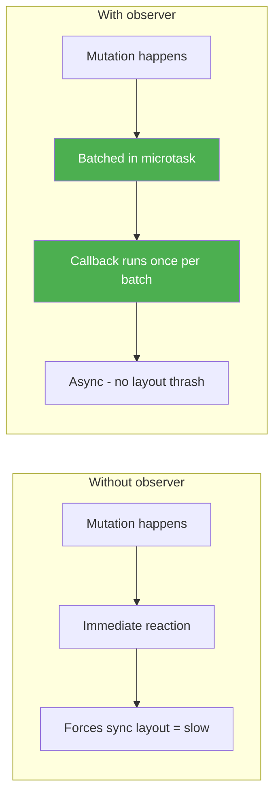

# 15 — MutationObserver

`MutationObserver` watches for **changes to the DOM tree** — additions, removals, attribute changes, and text changes. It fires asynchronously, batching mutations into a single callback.

---

## 1. Creating an Observer

```js
const observer = new MutationObserver(callback);

observer.observe(targetNode, config);
observer.disconnect(); // stop observing
observer.takeRecords(); // flush pending mutations
```

### Configuration — what to watch

```js
observer.observe(targetElement, {
  childList: true,       // watch direct children (add/remove)
  attributes: true,      // watch attribute changes
  subtree: true,         // watch all descendants
  characterData: true,   // watch text content changes
  attributeFilter: ['class', 'style'], // specific attributes only
  attributeOldValue: true,  // record old value
  characterDataOldValue: true, // record old text
});
```

---

## 2. MutationRecord Objects

The callback receives an array of `MutationRecord` objects:

```js
const observer = new MutationObserver((mutations) => {
  mutations.forEach(mutation => {
    mutation.type;              // 'childList' | 'attributes' | 'characterData'
    mutation.target;            // the changed node

    // For childList:
    mutation.addedNodes;        // NodeList of added nodes
    mutation.removedNodes;      // NodeList of removed nodes

    // For attributes:
    mutation.attributeName;     // name of changed attribute
    mutation.oldValue;          // previous value (if attributeOldValue: true)

    // For characterData:
    mutation.oldValue;          // previous text (if characterDataOldValue: true)
  });
});

observer.observe(target, {
  childList: true,
  attributes: true,
  attributeOldValue: true,
  subtree: true,
});
```

---

## 3. Watching Children (Add/Remove)

```js
const list = document.getElementById('todo-list');

const observer = new MutationObserver((mutations) => {
  mutations.forEach(m => {
    m.addedNodes.forEach(node => {
      if (node.nodeType === Node.ELEMENT_NODE && node.matches('li')) {
        console.log('Todo added:', node.textContent);
        node.classList.add('fade-in');
      }
    });

    m.removedNodes.forEach(node => {
      if (node.nodeType === Node.ELEMENT_NODE) {
        console.log('Todo removed:', node.textContent);
      }
    });
  });
});

observer.observe(list, { childList: true });
```

---

## 4. Watching Attributes

```js
const box = document.getElementById('box');

const observer = new MutationObserver((mutations) => {
  mutations.forEach(m => {
    if (m.attributeName === 'class') {
      console.log(`Class changed from "${m.oldValue}" to "${box.className}"`);
    }
    if (m.attributeName === 'style') {
      console.log('Style changed');
    }
  });
});

observer.observe(box, {
  attributes: true,
  attributeOldValue: true,
  attributeFilter: ['class', 'style']
});

box.classList.add('active'); // triggers callback
```

---

## 5. Watching Text Changes

```js
const editable = document.getElementById('editable');

const observer = new MutationObserver((mutations) => {
  mutations.forEach(m => {
    if (m.type === 'characterData') {
      console.log(`Text changed from "${m.oldValue}" to "${m.target.textContent}"`);
    }
  });
});

observer.observe(editable, {
  characterData: true,
  characterDataOldValue: true,
  subtree: true // include text nodes inside
});

// When user types in contentEditable div
```

---

## 6. Performance Considerations



| Aspect | Guidance |
|--------|----------|
| **Batching** | Multiple mutations collected into one callback |
| **Disconnect** | Call `disconnect()` when done — prevents leaks |
| **subtree: true** | More expensive — use only when needed |
| **characterData** | Can be noisy for text-heavy elements |
| **attributeFilter** | Reduces noise — specify what you need |

---

## 7. Use Case: Custom Element Lifecycle

```js
class AutoResizeTextarea extends HTMLTextAreaElement {
  connectedCallback() {
    this.style.overflow = 'hidden';
    this.resize();

    this._observer = new MutationObserver(() => this.resize());
    this._observer.observe(this, {
      attributes: true,
      attributeFilter: ['value', 'placeholder']
    });

    this.addEventListener('input', () => this.resize());
  }

  resize() {
    this.style.height = 'auto';
    this.style.height = this.scrollHeight + 'px';
  }

  disconnectedCallback() {
    this._observer?.disconnect();
  }
}

customElements.define('auto-textarea', AutoResizeTextarea, { extends: 'textarea' });
```

---

## 8. Use Case: Detect `innerHTML` Injection (Security)

```js
// Monitor for unexpected script injection
const container = document.getElementById('comments');

const securityObserver = new MutationObserver((mutations) => {
  mutations.forEach(m => {
    m.addedNodes.forEach(node => {
      if (node.nodeType === Node.ELEMENT_NODE) {
        const scripts = node.querySelectorAll('script');
        scripts.forEach(s => {
          console.warn('Script injection detected:', s.src || s.textContent);
          s.remove();
        });
      }
    });
  });
});

securityObserver.observe(container, { childList: true, subtree: true });
```

---

## 9. Use Case: Change Detection in a Simple App

```js
class StateManager {
  constructor(rootElement) {
    this.state = {};
    this.render = () => rootElement;
    this._observers = [];

    // Watch for DOM changes caused by state
    this._domObserver = new MutationObserver(() => {
      this._observers.forEach(cb => cb());
    });

    this._domObserver.observe(rootElement, {
      childList: true,
      subtree: true,
      attributes: true,
      characterData: true
    });
  }

  setState(update) {
    Object.assign(this.state, update);
    this.render(this.state);
  }

  onChange(cb) {
    this._observers.push(cb);
  }

  destroy() {
    this._domObserver.disconnect();
  }
}

const app = new StateManager(document.getElementById('app'));
app.onChange(() => console.log('DOM updated'));
app.setState({ items: [1, 2, 3] });
```

---

## 10. Full Example: Auto-Save on DOM Change

```js
class AutoSaver {
  constructor(rootElement, saveFn, delay = 1000) {
    this.saveFn = saveFn;
    this.timer = null;

    this.observer = new MutationObserver(() => {
      clearTimeout(this.timer);
      this.timer = setTimeout(() => this.save(), delay);
    });

    this.observer.observe(rootElement, {
      childList: true,
      subtree: true,
      attributes: true,
      characterData: true
    });

    // Save on page unload
    window.addEventListener('beforeunload', () => this.save());
  }

  async save() {
    try {
      await this.saveFn();
      console.log('Auto-saved');
    } catch (err) {
      console.error('Auto-save failed:', err);
    }
  }

  destroy() {
    this.observer.disconnect();
    clearTimeout(this.timer);
  }
}

// Usage: auto-save a rich text editor
const editor = document.getElementById('editor');
const saver = new AutoSaver(editor, async () => {
  await fetch('/api/drafts', {
    method: 'PUT',
    body: JSON.stringify({ html: editor.innerHTML })
  });
});

// Clean up when leaving
window.addEventListener('unload', () => saver.destroy());
```

---

## 11. MutationObserver vs Other Techniques

| Aspect | MutationObserver | Polling | DOM events |
|--------|:----------------:|:-------:|:----------:|
| Efficiency | Async, batched | ❌ Wasteful | Sync per event |
| DOM changes | Any | N/A | Only specific |
| Custom code changes | ✅ Yes | N/A | ❌ (unless dispatched) |
| Old value | ✅ Optional | N/A | No |

---

## Summary

```js
// Create
const observer = new MutationObserver(callback);

// Start watching
observer.observe(target, {
  childList: true,    // children add/remove
  attributes: true,   // attribute changes
  subtree: true,      // all descendants
  characterData: true,// text changes
  attributeFilter: ['class'],
  attributeOldValue: true,
  characterDataOldValue: true,
});

// Stop
observer.disconnect();

// Flush pending
const pending = observer.takeRecords();
```
