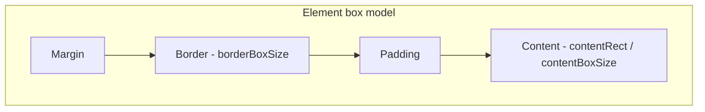
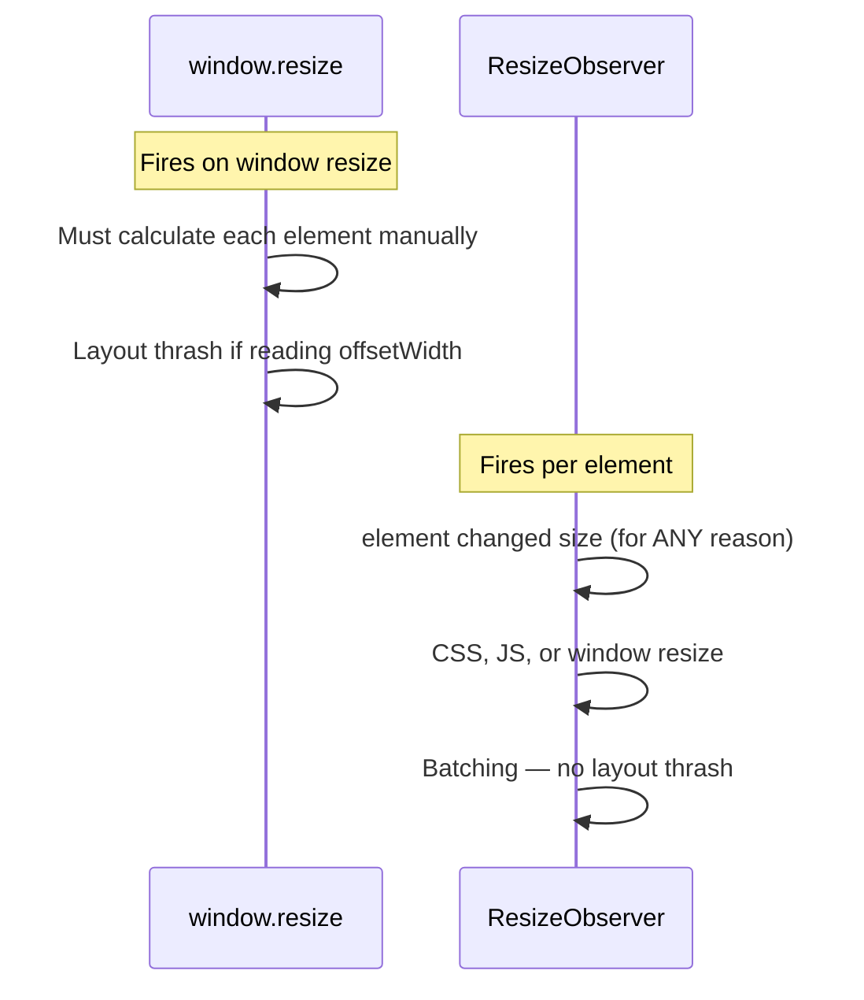

# 16 — ResizeObserver

`ResizeObserver` fires a callback whenever an element's **content rectangle** changes size — more precise than listening to `window.resize`.

---

## 1. Creating an Observer

```js
const observer = new ResizeObserver(callback);

observer.observe(targetElement);
observer.observe(targetElement, { box: 'border-box' }); // optional box
observer.unobserve(targetElement);
observer.disconnect();
```

### Callback

```js
const observer = new ResizeObserver((entries) => {
  entries.forEach(entry => {
    entry.target;           // the element
    entry.contentRect;      // { x, y, width, height, top, right, bottom, left }
    entry.borderBoxSize;    // new — array of { blockSize, inlineSize }
    entry.contentBoxSize;   // new — array of { blockSize, inlineSize }
    entry.devicePixelContentBoxSize; // precise for high-DPI
  });
});
```

---

## 2. `contentRect` vs `borderBoxSize`



| Property | What it measures | Box model |
|----------|-----------------|-----------|
| `contentRect` | Content area (legacy) | Content box |
| `contentBoxSize` | Content area (new, returns array) | Content box |
| `borderBoxSize` | Border area (includes padding + border) | Border box |
| `devicePixelContentBoxSize` | Physical pixels (devicePixelRatio-aware) | Content box |

```js
// Preferred for modern browsers
observer.observe(el, { box: 'border-box' });
```

---

## 3. Use Case: Responsive Container Component

```js
class ResponsiveCard {
  constructor(el) {
    this.el = el;
    this.observer = new ResizeObserver(([entry]) => {
      const { width } = entry.contentRect;
      this.el.classList.remove('card-sm', 'card-md', 'card-lg');

      if (width < 400) {
        this.el.classList.add('card-sm');
      } else if (width < 700) {
        this.el.classList.add('card-md');
      } else {
        this.el.classList.add('card-lg');
      }
    });

    this.observer.observe(el);
  }

  destroy() {
    this.observer.disconnect();
  }
}

// Usage
const cards = document.querySelectorAll('.responsive-card');
cards.forEach(card => new ResponsiveCard(card));
```

```css
.card-sm { font-size: 14px; padding: 8px; }
.card-md { font-size: 16px; padding: 16px; }
.card-lg { font-size: 18px; padding: 24px; }
```

---

## 4. Use Case: Canvas Resizing

```js
const canvas = document.getElementById('my-canvas');
const ctx = canvas.getContext('2d');

const observer = new ResizeObserver(([entry]) => {
  const { width, height } = entry.contentRect;

  const dpr = window.devicePixelRatio || 1;
  canvas.width = width * dpr;
  canvas.height = height * dpr;
  canvas.style.width = width + 'px';
  canvas.style.height = height + 'px';

  ctx.scale(dpr, dpr);
  draw(ctx, width, height);
});

observer.observe(canvas);
```

---

## 5. Use Case: Text Overflow Detection

```js
const textElements = document.querySelectorAll('.truncatable');

const observer = new ResizeObserver((entries) => {
  entries.forEach(entry => {
    const el = entry.target;
    const isOverflowing = el.scrollWidth > el.clientWidth;
    el.classList.toggle('is-truncated', isOverflowing);
    el.title = isOverflowing ? el.textContent : '';
  });
});

textElements.forEach(el => observer.observe(el));
```

---

## 6. Use Case: Virtual Scroll Container Height

```js
const viewport = document.getElementById('virtual-scroll-viewport');

const observer = new ResizeObserver(([entry]) => {
  const height = entry.contentRect.height;
  recalculateVisibleItems(height);
});

observer.observe(viewport);
```

---

## 7. Difference from `window.resize`



| Feature | `window.resize` | `ResizeObserver` |
|---------|:---------------:|:----------------:|
| Fires when | Window resizes | Any element resizes |
| Scope | Global | Per observed element |
| Reason | Window viewport change | CSS, JS, dynamic content, font load |
| Throttling | Manual | Built-in (batched per frame) |
| Initial value | No | Fires at observation start |
| Performance | Can cause layout thrash | Efficient |

```js
// ❌ Window resize — need to manually check elements
window.addEventListener('resize', () => {
  const w = sidebar.offsetWidth; // forces layout
  if (w < 400) collapseSidebar();
});

// ✅ ResizeObserver — direct, efficient
const observer = new ResizeObserver(([entry]) => {
  if (entry.contentRect.width < 400) collapseSidebar();
});
observer.observe(sidebar);
```

---

## 8. Initial Observation Behavior

`ResizeObserver` fires the callback **immediately** when observation starts:

```js
const observer = new ResizeObserver(([entry]) => {
  console.log('Initial size:', entry.contentRect.width);
  // Called once on observe(), then on every resize
});

observer.observe(element);
// Immediately logs the current size
```

This eliminates the need to manually read the initial dimensions.

---

## 9. Performance Best Practices

```js
// ❌ Expensive work in callback
const observer = new ResizeObserver((entries) => {
  entries.forEach(entry => {
    heavyCalculation(entry.contentRect.width); // blocks
  });
});

// ✅ Debounce or use requestAnimationFrame for heavy work
let pending = false;

const observer = new ResizeObserver((entries) => {
  if (!pending) {
    pending = true;
    requestAnimationFrame(() => {
      entries.forEach(e => heavyCalculation(e.contentRect.width));
      pending = false;
    });
  }
});
```

---

## 10. Full Example: Auto-Growing Textarea

```js
<textarea id="auto-textarea" rows="1"></textarea>
```

```js
const textarea = document.getElementById('auto-textarea');

const observer = new ResizeObserver(() => {
  textarea.style.height = 'auto';
  textarea.style.height = textarea.scrollHeight + 'px';
});

// Watch for content changes via input
textarea.addEventListener('input', () => {
  // ResizeObserver notices the scrollHeight change
});

// Observe initial sizing
observer.observe(textarea, { box: 'border-box' });
```

---

## 11. Browser Support

| Browser | Support |
|---------|:-------:|
| Chrome | 64+ |
| Firefox | 69+ |
| Safari | 13.1+ |
| Edge | 79+ |
| IE | ❌ |

### Polyfill

For older browsers, include a polyfill:

```html
<script src="https://polyfill.io/v3/polyfill.min.js?features=ResizeObserver"></script>
```

---

## Summary

```js
// Create
const observer = new ResizeObserver((entries) => {
  entries.forEach(entry => {
    const { width, height } = entry.contentRect;
    // or entry.borderBoxSize[0].blockSize
  });
});

// Start / stop
observer.observe(element, { box: 'content-box' });
observer.unobserve(element);
observer.disconnect();

// contentRect: { x, y, width, height, top, right, bottom, left }
// borderBoxSize: [{ blockSize, inlineSize }]
// contentBoxSize: [{ blockSize, inlineSize }]
```
