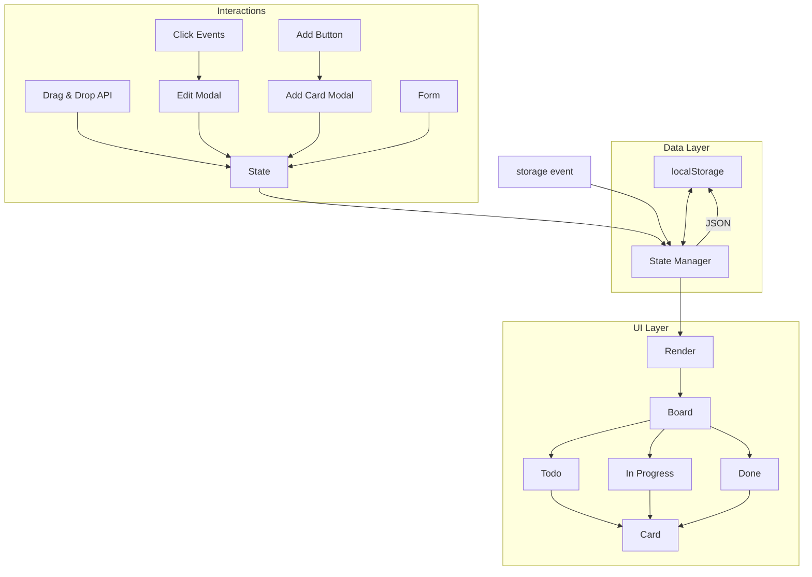

# 17 — Projects

Three hands-on projects to solidify your understanding of DOM & Browser APIs. Each project includes full requirements, architecture, and step-by-step implementation guidance.

---

## Project 1: Kanban Board

A drag-and-drop task board with columns (Todo, In Progress, Done). Persists state via localStorage.

### Requirements

- Three columns: **Todo**, **In Progress**, **Done**
- **Add** a task card to any column
- **Drag and drop** cards between columns and reorder within a column
- **Edit** a card by clicking its title
- **Delete** a card
- **Persist** all state to `localStorage` (survives page refresh)
- **Cross-tab sync** — show toast notification when localStorage changes in another tab

### Architecture



### Tech Stack

- Vanilla HTML/CSS/JS (no frameworks)
- HTML Drag & Drop API
- localStorage + storage event
- contentEditable for inline editing

### Step-by-Step

#### Step 1: HTML Structure

```html
<div id="kanban">
  <div id="todo" class="column" data-column="todo">
    <h2>Todo <button class="add-card">+</button></h2>
    <div class="cards"></div>
  </div>
  <div id="in-progress" class="column" data-column="in-progress">
    <h2>In Progress <button class="add-card">+</button></h2>
    <div class="cards"></div>
  </div>
  <div id="done" class="column" data-column="done">
    <h2>Done <button class="add-card">+</button></h2>
    <div class="cards"></div>
  </div>
</div>

<!-- Add Card Modal -->
<div id="modal" class="hidden">
  <div class="modal-content">
    <input type="text" id="card-title" placeholder="Task title">
    <select id="card-column">
      <option value="todo">Todo</option>
      <option value="in-progress">In Progress</option>
      <option value="done">Done</option>
    </select>
    <button id="save-card">Add</button>
  </div>
</div>
```

#### Step 2: State Manager

```js
const STORAGE_KEY = 'kanban-board';

class KanbanState {
  constructor() {
    this.data = this.load();
    this.listeners = [];
  }

  load() {
    try {
      const saved = localStorage.getItem(STORAGE_KEY);
      return saved ? JSON.parse(saved) : {
        todo: [],
        'in-progress': [],
        done: []
      };
    } catch {
      return { todo: [], 'in-progress': [], done: [] };
    }
  }

  save() {
    localStorage.setItem(STORAGE_KEY, JSON.stringify(this.data));
  }

  getCards(column) {
    return this.data[column] || [];
  }

  addCard(column, title) {
    const card = { id: Date.now().toString(), title, createdAt: Date.now() };
    this.data[column].push(card);
    this.save();
    this.notify();
  }

  moveCard(cardId, fromColumn, toColumn, newIndex) {
    const cardIndex = this.data[fromColumn].findIndex(c => c.id === cardId);
    if (cardIndex === -1) return;
    const [card] = this.data[fromColumn].splice(cardIndex, 1);
    this.data[toColumn].splice(newIndex, 0, card);
    this.save();
    this.notify();
  }

  updateCard(cardId, title) {
    for (const col of Object.values(this.data)) {
      const card = col.find(c => c.id === cardId);
      if (card) {
        card.title = title;
        this.save();
        this.notify();
        return;
      }
    }
  }

  deleteCard(cardId) {
    for (const col of Object.values(this.data)) {
      const idx = col.findIndex(c => c.id === cardId);
      if (idx !== -1) {
        col.splice(idx, 1);
        this.save();
        this.notify();
        return;
      }
    }
  }

  onChange(fn) {
    this.listeners.push(fn);
  }

  notify() {
    this.listeners.forEach(fn => fn(this.data));
  }
}
```

#### Step 3: Render Cards

```js
function renderBoard(state) {
  for (const column of ['todo', 'in-progress', 'done']) {
    const container = document.querySelector(`[data-column="${column}"] .cards`);
    container.innerHTML = '';

    state.getCards(column).forEach(card => {
      const div = document.createElement('div');
      div.className = 'card';
      div.draggable = true;
      div.dataset.cardId = card.id;
      div.textContent = card.title;
      container.appendChild(div);
    });
  }
}
```

#### Step 4: Drag & Drop

```js
let draggedCard = null;

document.addEventListener('dragstart', (e) => {
  const card = e.target.closest('.card');
  if (!card) return;
  draggedCard = card;
  card.classList.add('dragging');
  e.dataTransfer.effectAllowed = 'move';
  e.dataTransfer.setData('text/plain', card.dataset.cardId);
});

document.addEventListener('dragend', (e) => {
  e.target.closest('.card')?.classList.remove('dragging');
  draggedCard = null;
});

document.querySelectorAll('.cards').forEach(container => {
  container.addEventListener('dragover', (e) => {
    e.preventDefault();
    const afterElement = getDragAfterElement(container, e.clientY);
    // Visual indicator
  });

  container.addEventListener('drop', (e) => {
    e.preventDefault();
    const cardId = e.dataTransfer.getData('text/plain');
    const fromColumn = findColumn(draggedCard);
    const toColumn = container.closest('.column').dataset.column;
    const afterElement = getDragAfterElement(container, e.clientY);
    const newIndex = afterElement
      ? [...container.children].indexOf(afterElement)
      : container.children.length;

    state.moveCard(cardId, fromColumn, toColumn, newIndex);
    renderBoard(state);
  });
});

function getDragAfterElement(container, y) {
  const cards = [...container.querySelectorAll('.card:not(.dragging)')];
  return cards.reduce((closest, card) => {
    const box = card.getBoundingClientRect();
    const offset = y - box.top - box.height / 2;
    if (offset < 0 && offset > closest.offset) {
      return { offset, element: card };
    }
    return closest;
  }, { offset: Number.NEGATIVE_INFINITY }).element;
}
```

#### Step 5: Cross-tab Sync

```js
window.addEventListener('storage', (e) => {
  if (e.key === STORAGE_KEY) {
    const newState = JSON.parse(e.newValue);
    state.data = newState;
    renderBoard(state);
    showToast('Board updated from another tab');
  }
});
```

### Extension Ideas

- Dark mode toggle (persisted)
- Card colors / labels
- Filter by search
- Undo / redo (history stack)

---

## Project 2: Whiteboard

A drawing app using Canvas API and Pointer Events. Supports freehand drawing, shapes, colors, and undo.

### Requirements

- **Freehand draw** with pointer/touch
- **Shape tools**: rectangle, circle, line
- **Color picker** with recent colors
- **Brush size** slider
- **Undo / Clear**
- **Responsive** — works on mobile and desktop
- **Export** as PNG

### Architecture

```mermaid
graph TD
    subgraph Input
        PointerEvents[Pointer Events] --> Controller
        Toolbar[Toolbar UI] --> Controller
    end

    subgraph Controller
        Controller --> Command[Command Pattern]
        Command --> History[Undo Stack]
    end

    subgraph Canvas
        History --> Render[drawOnCanvas]
        Render --> Canvas[<canvas>]
    end

    subgraph Export
        Canvas -->|toDataURL| PNG
    end
```

### Step-by-Step

#### Step 1: Canvas Setup

```html
<div id="whiteboard">
  <canvas id="draw-canvas"></canvas>
  <div id="toolbar">
    <button data-tool="pen">✏️</button>
    <button data-tool="rect">▬</button>
    <button data-tool="circle">●</button>
    <button data-tool="line">╱</button>
    <button data-tool="eraser">🧹</button>
    <input type="color" id="color-picker" value="#000000">
    <input type="range" id="brush-size" min="1" max="20" value="3">
    <button id="undo">↩</button>
    <button id="clear">🗑</button>
    <button id="export">💾</button>
  </div>
</div>
```

#### Step 2: Canvas Controller

```js
class Whiteboard {
  constructor(canvas) {
    this.canvas = canvas;
    this.ctx = canvas.getContext('2d');
    this.isDrawing = false;
    this.tool = 'pen';
    this.color = '#000000';
    this.size = 3;
    this.history = [];
    this.historyIndex = -1;
    this.shapes = [];

    this.resize();
    this.bindEvents();
  }

  resize() {
    const rect = this.canvas.parentElement.getBoundingClientRect();
    this.canvas.width = rect.width;
    this.canvas.height = rect.height;
    this.redraw();
  }

  bindEvents() {
    // Pointer events for both mouse and touch
    this.canvas.addEventListener('pointerdown', this.onPointerDown.bind(this));
    this.canvas.addEventListener('pointermove', this.onPointerMove.bind(this));
    this.canvas.addEventListener('pointerup', this.onPointerUp.bind(this));
    this.canvas.addEventListener('pointerleave', this.onPointerUp.bind(this));

    // Resize observer for responsive canvas
    new ResizeObserver(() => this.resize()).observe(this.canvas.parentElement);
  }

  getPos(e) {
    const rect = this.canvas.getBoundingClientRect();
    return {
      x: e.clientX - rect.left,
      y: e.clientY - rect.top
    };
  }

  startShape(pos) {
    this.currentShape = {
      tool: this.tool,
      color: this.color,
      size: this.size,
      startX: pos.x,
      startY: pos.y,
      endX: pos.x,
      endY: pos.y
    };
  }

  updateShape(pos) {
    if (!this.currentShape) return;
    this.currentShape.endX = pos.x;
    this.currentShape.endY = pos.y;
    this.redraw();
    this.drawShape(this.currentShape, false);
  }

  endShape() {
    if (!this.currentShape) return;
    this.shapes.push(this.currentShape);
    this.history.push(this.currentShape);
    this.historyIndex = this.shapes.length - 1;
    this.currentShape = null;
  }

  drawShape(shape, commit = true) {
    const ctx = this.ctx;
    ctx.beginPath();
    ctx.strokeStyle = shape.color;
    ctx.lineWidth = shape.size;
    ctx.lineCap = 'round';
    ctx.lineJoin = 'round';

    const x1 = shape.startX, y1 = shape.startY;
    const x2 = shape.endX, y2 = shape.endY;

    switch (shape.tool) {
      case 'pen':
      case 'eraser':
        ctx.globalCompositeOperation = shape.tool === 'eraser' ? 'destination-out' : 'source-over';
        ctx.lineTo(x2, y2);
        ctx.stroke();
        break;
      case 'rect':
        ctx.strokeRect(x1, y1, x2 - x1, y2 - y1);
        break;
      case 'circle':
        const radius = Math.hypot(x2 - x1, y2 - y1);
        ctx.arc(x1, y1, radius, 0, Math.PI * 2);
        ctx.stroke();
        break;
      case 'line':
        ctx.moveTo(x1, y1);
        ctx.lineTo(x2, y2);
        ctx.stroke();
        break;
    }
    ctx.globalCompositeOperation = 'source-over';
  }

  redraw() {
    this.ctx.clearRect(0, 0, this.canvas.width, this.canvas.height);
    this.shapes.forEach(s => this.drawShape(s));
  }

  undo() {
    if (this.historyIndex < 0) return;
    this.shapes = this.shapes.slice(0, this.historyIndex);
    this.historyIndex--;
    this.redraw();
  }

  clear() {
    this.shapes = [];
    this.history = [];
    this.historyIndex = -1;
    this.redraw();
  }

  exportPNG() {
    const link = document.createElement('a');
    link.download = 'whiteboard.png';
    link.href = this.canvas.toDataURL('image/png');
    link.click();
  }

  onPointerDown(e) {
    this.isDrawing = true;
    const pos = this.getPos(e);
    this.canvas.setPointerCapture(e.pointerId);

    if (this.tool === 'pen' || this.tool === 'eraser') {
      this.ctx.beginPath();
      this.ctx.moveTo(pos.x, pos.y);
      // We need to store paths for pen/eraser
      this.currentPath = {
        tool: this.tool,
        color: this.color,
        size: this.size,
        points: [pos]
      };
    } else {
      this.startShape(pos);
    }
  }

  onPointerMove(e) {
    if (!this.isDrawing) return;
    const pos = this.getPos(e);

    if (this.tool === 'pen' || this.tool === 'eraser') {
      this.currentPath.points.push(pos);
      this.ctx.lineWidth = this.size;
      this.ctx.strokeStyle = this.color;
      this.ctx.lineCap = 'round';
      this.ctx.globalCompositeOperation = this.tool === 'eraser' ? 'destination-out' : 'source-over';
      this.ctx.lineTo(pos.x, pos.y);
      this.ctx.stroke();
      this.ctx.globalCompositeOperation = 'source-over';
    } else {
      this.updateShape(pos);
    }
  }

  onPointerUp() {
    if (!this.isDrawing) return;
    this.isDrawing = false;

    if (this.currentPath) {
      this.shapes.push(this.currentPath);
      this.history.push(this.currentPath);
      this.historyIndex = this.shapes.length - 1;
      this.currentPath = null;
    } else {
      this.endShape();
    }
  }
}
```

#### Step 3: Wire Toolbar

```js
const board = new Whiteboard(document.getElementById('draw-canvas'));

document.querySelectorAll('[data-tool]').forEach(btn => {
  btn.addEventListener('click', () => {
    document.querySelector('[data-tool].active')?.classList.remove('active');
    btn.classList.add('active');
    board.tool = btn.dataset.tool;
  });
});

document.getElementById('color-picker').addEventListener('input', (e) => {
  board.color = e.target.value;
});

document.getElementById('brush-size').addEventListener('input', (e) => {
  board.size = parseInt(e.target.value);
});

document.getElementById('undo').addEventListener('click', () => board.undo());
document.getElementById('clear').addEventListener('click', () => board.clear());
document.getElementById('export').addEventListener('click', () => board.exportPNG());
```

### Extension Ideas

- Text tool (use `fillText`)
- Layers
- Save to IndexedDB for recovery
- Share via WebSocket (collaborative drawing)

---

## Project 3: Rich Text Editor

A contentEditable-based rich text editor using `document.execCommand` and the Range/Selection API.

### Requirements

- **Formatting**: Bold, Italic, Underline, Strikethrough
- **Lists**: Ordered, Unordered
- **Headings**: H1–H6
- **Links**: Add/remove hyperlinks
- **Images**: Insert from URL
- **Undo/Redo** (built-in browser or custom)
- **Source view** — toggle between rich text and HTML source
- **Export HTML** output

### Architecture

```mermaid
graph TD
    subgraph Toolbar
        FormatBtns[Format Buttons] --> CMD[execCommand]
        LinkBtn[Link Button] --> LinkModal
        ImageBtn[Image Button] --> ImageModal
    end

    subgraph Editor
        CMD --> EditorDiv[contentEditable div]
        Selection[Selection API] --> CMD
    end

    subgraph Views
        EditorDiv -->|toggle| TextArea[textarea source view]
    end

    subgraph Output
        EditorDiv --> innerHTML --> Output
    end
```

### Step-by-Step

#### Step 1: HTML Structure

```html
<div id="editor-container">
  <div id="toolbar">
    <button data-cmd="bold" title="Bold"><strong>B</strong></button>
    <button data-cmd="italic" title="Italic"><em>I</em></button>
    <button data-cmd="underline" title="Underline"><u>U</u></button>
    <button data-cmd="strikeThrough" title="Strikethrough"><s>S</s></button>
    <span class="separator"></span>
    <button data-cmd="insertUnorderedList" title="Bullet list">•</button>
    <button data-cmd="insertOrderedList" title="Numbered list">1.</button>
    <span class="separator"></span>
    <select id="heading-select">
      <option value="">Normal</option>
      <option value="h1">H1</option>
      <option value="h2">H2</option>
      <option value="h3">H3</option>
    </select>
    <span class="separator"></span>
    <button id="link-btn" title="Insert link">🔗</button>
    <button id="image-btn" title="Insert image">🖼</button>
    <span class="separator"></span>
    <button id="source-btn" title="Toggle source">&lt;/&gt;</button>
    <button id="export-btn" title="Export">📋</button>
  </div>

  <div id="editor" contenteditable="true">
    <p>Start typing...</p>
  </div>

  <textarea id="source-view" class="hidden"></textarea>

  <!-- Link Modal -->
  <div id="link-modal" class="modal hidden">
    <div class="modal-content">
      <input type="url" id="link-url" placeholder="https://example.com">
      <button id="apply-link">Apply</button>
      <button id="remove-link">Remove</button>
    </div>
  </div>

  <!-- Image Modal -->
  <div id="image-modal" class="modal hidden">
    <div class="modal-content">
      <input type="url" id="image-url" placeholder="https://example.com/image.png">
      <button id="insert-image">Insert</button>
    </div>
  </div>
</div>
```

#### Step 2: Editor Controller

```js
class RichTextEditor {
  constructor(container) {
    this.container = container;
    this.editor = container.querySelector('#editor');
    this.sourceView = container.querySelector('#source-view');
    this.toolbar = container.querySelector('#toolbar');
    this.showSource = false;

    this.initToolbar();
    this.initSelectionChange();
  }

  execCommand(cmd, value = null) {
    document.execCommand(cmd, false, value);
    this.editor.focus();
  }

  queryState(cmd) {
    return document.queryCommandState(cmd);
  }

  getHTML() {
    return this.editor.innerHTML;
  }

  setHTML(html) {
    this.editor.innerHTML = html;
  }

  initToolbar() {
    // Format buttons
    this.toolbar.querySelectorAll('[data-cmd]').forEach(btn => {
      btn.addEventListener('click', () => {
        this.execCommand(btn.dataset.cmd);
        this.updateButtonStates();
      });
    });

    // Heading select
    this.toolbar.querySelector('#heading-select').addEventListener('change', (e) => {
      const value = e.target.value;
      if (value) {
        this.execCommand('formatBlock', `<${value}>`);
      } else {
        this.execCommand('formatBlock', '<p>');
      }
      e.target.value = '';
    });

    // Link
    this.toolbar.querySelector('#link-btn').addEventListener('click', () => {
      const selectedText = window.getSelection().toString();
      if (!selectedText) {
        showToast('Select text first');
        return;
      }
      this.showLinkModal();
    });

    // Image
    this.toolbar.querySelector('#image-btn').addEventListener('click', () => {
      this.showImageModal();
    });

    // Source toggle
    this.toolbar.querySelector('#source-btn').addEventListener('click', () => {
      this.toggleSource();
    });

    // Export
    this.toolbar.querySelector('#export-btn').addEventListener('click', () => {
      this.exportHTML();
    });

    // Link modal buttons
    document.getElementById('apply-link').addEventListener('click', () => {
      const url = document.getElementById('link-url').value;
      if (url) {
        this.execCommand('createLink', url);
        this.hideModal('link-modal');
      }
    });

    document.getElementById('remove-link').addEventListener('click', () => {
      this.execCommand('unlink');
      this.hideModal('link-modal');
    });

    document.getElementById('insert-image').addEventListener('click', () => {
      const url = document.getElementById('image-url').value;
      if (url) {
        this.execCommand('insertImage', url);
        this.hideModal('image-modal');
      }
    });

    // Close modals on overlay click
    document.querySelectorAll('.modal').forEach(m => {
      m.addEventListener('click', (e) => {
        if (e.target === m) m.classList.add('hidden');
      });
    });
  }

  updateButtonStates() {
    this.toolbar.querySelectorAll('[data-cmd]').forEach(btn => {
      btn.classList.toggle('active', this.queryState(btn.dataset.cmd));
    });
  }

  initSelectionChange() {
    document.addEventListener('selectionchange', () => {
      if (!this.showSource) {
        this.updateButtonStates();
      }
    });
  }

  toggleSource() {
    this.showSource = !this.showSource;
    if (this.showSource) {
      this.sourceView.value = this.editor.innerHTML;
      this.editor.classList.add('hidden');
      this.sourceView.classList.remove('hidden');
      this.editor.contentEditable = 'false';
    } else {
      this.editor.innerHTML = this.sourceView.value;
      this.editor.classList.remove('hidden');
      this.sourceView.classList.add('hidden');
      this.editor.contentEditable = 'true';
    }
  }

  exportHTML() {
    const html = this.showSource ? this.sourceView.value : this.editor.innerHTML;
    navigator.clipboard.writeText(html).then(() => {
      showToast('HTML copied to clipboard!');
    }).catch(() => {
      // Fallback
      const textarea = document.createElement('textarea');
      textarea.value = html;
      document.body.appendChild(textarea);
      textarea.select();
      document.execCommand('copy');
      document.body.removeChild(textarea);
      showToast('HTML copied!');
    });
  }

  showLinkModal() {
    document.getElementById('link-modal').classList.remove('hidden');
    document.getElementById('link-url').value = '';
    document.getElementById('link-url').focus();
  }

  showImageModal() {
    document.getElementById('image-modal').classList.remove('hidden');
    document.getElementById('image-url').value = '';
    document.getElementById('image-url').focus();
  }

  hideModal(id) {
    document.getElementById(id).classList.add('hidden');
  }
}
```

#### Step 3: Custom Undo/Redo (Optional)

```js
class UndoManager {
  constructor(editor, maxHistory = 50) {
    this.editor = editor;
    this.maxHistory = maxHistory;
    this.stack = [editor.innerHTML];
    this.index = 0;
    this.isRestoring = false;

    this.editor.addEventListener('input', () => {
      if (this.isRestoring) return;
      this.stack = this.stack.slice(0, this.index + 1);
      this.stack.push(editor.innerHTML);
      if (this.stack.length > this.maxHistory) this.stack.shift();
      this.index = this.stack.length - 1;
    });
  }

  undo() {
    if (this.index <= 0) return;
    this.index--;
    this.restore();
  }

  redo() {
    if (this.index >= this.stack.length - 1) return;
    this.index++;
    this.restore();
  }

  restore() {
    this.isRestoring = true;
    this.editor.innerHTML = this.stack[this.index];
    // Move cursor to end
    const range = document.createRange();
    range.selectNodeContents(this.editor);
    range.collapse(false);
    const sel = window.getSelection();
    sel.removeAllRanges();
    sel.addRange(range);
    this.isRestoring = false;
  }
}
```

### Extension Ideas

- Image resize handles (using ResizeObserver)
- Table insertion
- Markdown shortcuts (`**bold**`, `*italic*`)
- Drag-and-drop image upload (insert as base64)
- Save drafts to IndexedDB

---

## Final Notes

Each project can be extended with additional features. The key learning goals:

| Project | APIs Covered |
|---------|-------------|
| **Kanban Board** | Drag & Drop, localStorage, storage event, DOM manipulation |
| **Whiteboard** | Canvas, Pointer Events, ResizeObserver, Command pattern |
| **Rich Text Editor** | contentEditable, execCommand, Selection/Range, Clipboard |

Build all three and you'll have a strong practical understanding of the core DOM & Browser APIs.
