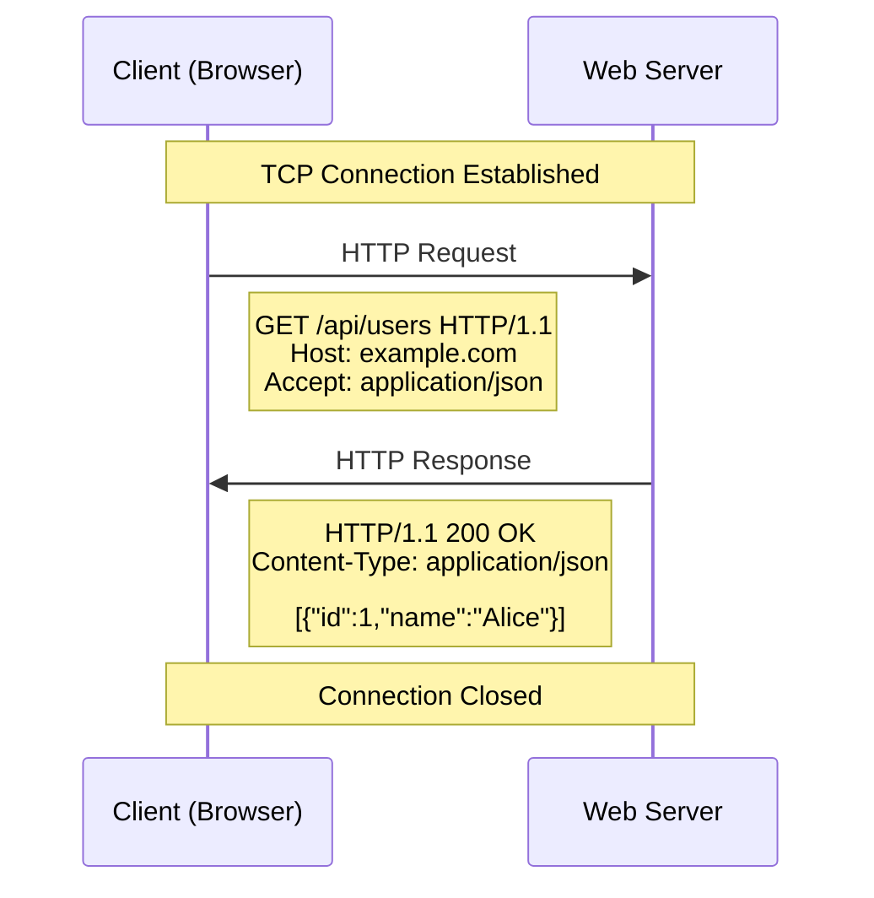
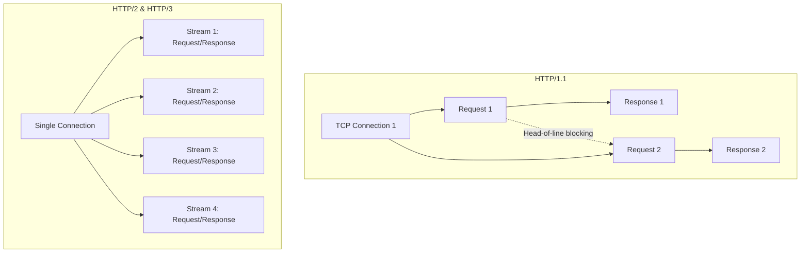

# HTTP Protocol

## What is HTTP?

HTTP (Hypertext Transfer Protocol) is an application-layer protocol for transmitting hypermedia documents, such as HTML. It follows a client-server model where the client initiates a request and the server responds.

## Request / Response Structure



### Request Format

```
METHOD /path HTTP/1.1
Host: example.com
User-Agent: Mozilla/5.0
Accept: application/json
Content-Type: application/json

{"key": "value"}
```

### Response Format

```
HTTP/1.1 200 OK
Content-Type: application/json
Content-Length: 42

{"message": "Hello, world!"}
```

## HTTP Methods

| Method | Description | Idempotent | Safe | Body |
|--------|-------------|------------|------|------|
| `GET` | Retrieve a resource | Yes | Yes | No |
| `POST` | Create a resource | No | No | Yes |
| `PUT` | Replace a resource | Yes | No | Yes |
| `PATCH` | Partially update a resource | No | No | Yes |
| `DELETE` | Remove a resource | Yes | No | Optional |
| `HEAD` | Get response headers only | Yes | Yes | No |
| `OPTIONS` | Describe available methods | Yes | Yes | No |

### Real-world Example

```javascript
// Using Fetch API
async function apiDemo() {
  // GET
  const users = await fetch('https://api.example.com/users', {
    method: 'GET',
    headers: { 'Accept': 'application/json' }
  }).then(r => r.json());

  // POST
  const created = await fetch('https://api.example.com/users', {
    method: 'POST',
    headers: { 'Content-Type': 'application/json' },
    body: JSON.stringify({ name: 'Alice', email: 'alice@example.com' })
  }).then(r => r.json());

  // PUT (full replacement)
  await fetch('https://api.example.com/users/1', {
    method: 'PUT',
    headers: { 'Content-Type': 'application/json' },
    body: JSON.stringify({ id: 1, name: 'Alice Updated', email: 'alice@example.com' })
  });

  // PATCH (partial update)
  await fetch('https://api.example.com/users/1', {
    method: 'PATCH',
    headers: { 'Content-Type': 'application/json' },
    body: JSON.stringify({ name: 'Alice New' })
  });

  // DELETE
  await fetch('https://api.example.com/users/1', { method: 'DELETE' });
}
```

## Status Codes

| Code | Category | Meaning | Example |
|------|----------|---------|---------|
| **1xx** | Informational | Request received, continuing | `100 Continue` |
| **2xx** | Success | Request succeeded | `200 OK`, `201 Created`, `204 No Content` |
| **3xx** | Redirection | Further action needed | `301 Moved Permanently`, `304 Not Modified` |
| **4xx** | Client Error | Request has bad syntax | `400 Bad Request`, `401 Unauthorized`, `403 Forbidden`, `404 Not Found`, `429 Too Many Requests` |
| **5xx** | Server Error | Server failed to fulfill | `500 Internal Server Error`, `502 Bad Gateway`, `503 Service Unavailable` |

### Common Status Codes Reference

```javascript
// Handling status codes
async function handleResponse(response) {
  if (response.status >= 200 && response.status < 300) {
    return response.json();
  }
  
  switch (response.status) {
    case 400:
      throw new Error('Bad request - check your input');
    case 401:
      throw new Error('Unauthorized - please login');
    case 403:
      throw new Error('Forbidden - insufficient permissions');
    case 404:
      throw new Error('Resource not found');
    case 429:
      const retryAfter = response.headers.get('Retry-After');
      throw new Error(`Rate limited. Retry after ${retryAfter} seconds`);
    case 500:
      throw new Error('Internal server error');
    case 502:
    case 503:
      throw new Error('Service temporarily unavailable');
    default:
      throw new Error(`Unexpected status: ${response.status}`);
  }
}
```

## Common Headers

### Request Headers

| Header | Example | Purpose |
|--------|---------|---------|
| `Host` | `Host: example.com` | Target domain |
| `User-Agent` | `User-Agent: Mozilla/5.0` | Client identification |
| `Accept` | `Accept: application/json` | Expected response format |
| `Authorization` | `Authorization: Bearer <token>` | Authentication credentials |
| `Content-Type` | `Content-Type: application/json` | Body format |
| `Cache-Control` | `Cache-Control: no-cache` | Caching directives |
| `Origin` | `Origin: https://myapp.com` | Request origin (CORS) |
| `Referer` | `Referer: https://myapp.com/page` | Previous page URL |

### Response Headers

| Header | Example | Purpose |
|--------|---------|---------|
| `Content-Type` | `Content-Type: text/html; charset=utf-8` | Response format |
| `Content-Length` | `Content-Length: 1234` | Body size in bytes |
| `Set-Cookie` | `Set-Cookie: session=abc123; HttpOnly` | Set a cookie |
| `Cache-Control` | `Cache-Control: max-age=3600` | Caching policy |
| `Access-Control-Allow-Origin` | `Access-Control-Allow-Origin: *` | CORS policy |
| `Location` | `Location: /new-url` | Redirect target |
| `Retry-After` | `Retry-After: 120` | Rate limit retry time |

## HTTP/1.1 vs HTTP/2 vs HTTP/3

| Feature | HTTP/1.1 | HTTP/2 | HTTP/3 |
|---------|----------|--------|--------|
| Transport | TCP | TCP | QUIC (UDP) |
| Multiplexing | No (head-of-line blocking) | Yes (streams) | Yes (streams) |
| Header Compression | No | HPACK | QPACK |
| Server Push | No | Yes | Yes |
| Connection | One request per connection | Multiple streams per connection | Multiple streams per connection |
| Encryption | Optional | Optional (TLS common) | Required |
| Latency | Higher (round trips) | Lower | Lowest (0-RTT) |



### Connection Example

```javascript
// HTTP/1.1 - multiple connections (browsers use 6 per domain)
const start = performance.now();
const results = await Promise.all([
  fetch('https://api.example.com/a'),
  fetch('https://api.example.com/b'),
  fetch('https://api.example.com/c')
]);
console.log(`HTTP/1.1 parallel: ${performance.now() - start}ms`);

// HTTP/2 - single connection, true multiplexing
// Browser handles multiplexing automatically
const response = await fetch('https://http2.example.com/data');
console.log('HTTP/2 connection reused automatically');
```

## Key Takeaways

- HTTP is a stateless request-response protocol
- Methods have semantic meanings — use them correctly
- Status codes group into 5 categories; handle each appropriately
- Headers carry metadata about requests and responses
- HTTP/2 and HTTP/3 solve HTTP/1.1 performance problems through multiplexing and better transport
