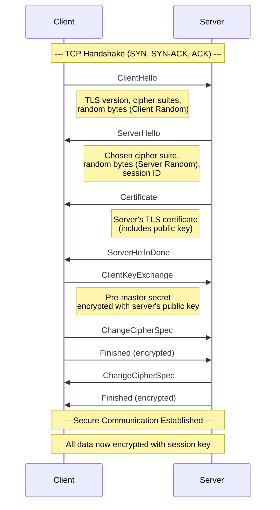

# HTTPS & TLS/SSL

## What is HTTPS?

HTTPS (HTTP Secure) is HTTP over TLS/SSL. It encrypts the entire communication between client and server, ensuring confidentiality, integrity, and authentication.

## Why HTTPS Matters

```
┌─────────────────────────────────────┐
│            Without HTTPS             │
├─────────────────────────────────────┤
│  Client ──► [Attacker] ──► Server   │
│  - Passwords visible in plaintext    │
│  - Content can be modified in transit│
│  - Impersonation possible            │
└─────────────────────────────────────┘

┌─────────────────────────────────────┐
│            With HTTPS                │
├─────────────────────────────────────┤
│  Client ──► [Encrypted] ──► Server  │
│  - Data is encrypted                │
│  - Integrity verified               │
│  - Server identity validated        │
└─────────────────────────────────────┘
```

## Symmetric vs Asymmetric Encryption

| Aspect | Symmetric | Asymmetric |
|--------|-----------|------------|
| Keys | Single shared key | Public + Private key pair |
| Speed | Fast | Slow (100-1000x slower) |
| Use case | Bulk data encryption | Key exchange, signatures |
| Examples | AES, ChaCha20 | RSA, ECDSA, ECDH |
| Key distribution | Problematic | Easy (public key is sharable) |

### How They Work Together (Hybrid)

```
1. Asymmetric: Client and server agree on a symmetric session key
2. Symmetric: Bulk data is encrypted with the session key
3. Result: Security of asymmetric + speed of symmetric
```

## The TLS Handshake



### Handshake in Code

```javascript
// Node.js: Making an HTTPS request
const https = require('https');

const options = {
  hostname: 'api.example.com',
  port: 443,
  path: '/secure-data',
  method: 'GET',
  // These happen automatically behind the scenes:
  // 1. TCP connection
  // 2. TLS handshake
  // 3. Certificate validation
  // 4. Encrypted request/response
};

const req = https.request(options, (res) => {
  let data = '';
  res.on('data', chunk => data += chunk);
  res.on('end', () => console.log('Received:', data));
});

req.end();
```

```javascript
// Browser: Fetch API (HTTPS handled automatically)
fetch('https://api.example.com/data')
  .then(response => response.json())
  .then(data => console.log(data));
// The browser validates the certificate automatically
// A red lock or "Not Secure" appears in the address bar
```

## Certificate Authorities (CAs)

CAs are trusted third parties that issue digital certificates. The certificate binds a public key to an entity (domain, organization).

```
                   ┌─────────────┐
                   │  Root CA    │
                   │ (Self-signed)│
                   └──────┬──────┘
                          │ Signs
                   ┌──────┴──────┐
                   │ Intermediate│
                   │     CA      │
                   └──────┬──────┘
                          │ Signs
                   ┌──────┴──────┐
                   │ example.com │
                   │ Certificate │
                   └─────────────┘
```

### Certificate Chain Validation

```
Browser trusts Root CA
  └─ Root CA signed Intermediate CA ── OK
      └─ Intermediate CA signed example.com ── OK
          └─ example.com certificate is valid ── ✓ Secure
```

### Common CAs

- Let's Encrypt (free, automated)
- DigiCert
- GlobalSign
- Comodo (Sectigo)
- Cloudflare (Origin CA)

## Certificate Contents

```
Certificate:
    Subject: CN = example.com
    Issuer: CN = R3, O = Let's Encrypt
    Serial Number: 04:12:34:...
    Not Before: Jan 1 00:00:00 2025 GMT
    Not After  : Jan 1 00:00:00 2026 GMT
    Subject Public Key Info:
        Public Key Algorithm: RSA
        Public-Key: (2048 bit)
    X509v3 Subject Alternative Name:
        DNS: example.com, DNS: www.example.com
    Signature Algorithm: sha256WithRSAEncryption
```

## Mixed Content

Mixed content occurs when a page loaded over HTTPS includes resources (images, scripts, styles) loaded over HTTP.

```html
<!-- HTTPS page -->
<!DOCTYPE html>
<html lang="en">
<head>
  <!-- Safe: HTTPS -->
  <link rel="stylesheet" href="https://cdn.example.com/style.css">
  
  <!-- BLOCKED by browsers: Mixed active content -->
  <script src="http://cdn.example.com/script.js"></script>
  
  <!-- Warning but allowed: Mixed passive content -->
  
</head>
```

**Browsers block mixed active content** (scripts, iframes, XHR) but may still display warnings for passive content (images, audio).

### Fixing Mixed Content

```javascript
// Solution 1: Use protocol-relative URLs
const url = '//cdn.example.com/image.jpg';  // Uses page's protocol

// Solution 2: Always use HTTPS
const url = 'https://cdn.example.com/image.jpg';

// Solution 3: Content Security Policy (CSP)
// meta tag or HTTP header
// Content-Security-Policy: upgrade-insecure-requests;
```

## HSTS (HTTP Strict Transport Security)

HSTS tells browsers to always use HTTPS for your domain, even if the user types `http://`.

```
Strict-Transport-Security: max-age=31536000; includeSubDomains; preload
```

| Directive | Purpose |
|-----------|---------|
| `max-age` | How long (seconds) to enforce HTTPS |
| `includeSubDomains` | Apply to all subdomains |
| `preload` | Submit to browser hardcoded HSTS list |

### HSTS Preload

Sites can be submitted to https://hstspreload.org to be hardcoded into browsers. Once preloaded, HTTPS is enforced before any connection is made.

```nginx
# Nginx configuration example
server {
    listen 443 ssl;
    server_name example.com;
    
    ssl_certificate /etc/ssl/certs/example.com.pem;
    ssl_certificate_key /etc/ssl/private/example.com.key;
    
    add_header Strict-Transport-Security "max-age=63072000; includeSubDomains; preload";
}
```

## HTTPS in Practice

```javascript
// Enforce HTTPS in a Node.js/Express app
const express = require('express');
const app = express();

// Redirect HTTP to HTTPS
app.use((req, res, next) => {
  if (req.headers['x-forwarded-proto'] !== 'https' && process.env.NODE_ENV === 'production') {
    return res.redirect(`https://${req.headers.host}${req.url}`);
  }
  next();
});
```

```javascript
// Checking if a site uses HTTPS
function isSecure(url) {
  return url.startsWith('https://');
}

// Getting certificate info (browser)
// In DevTools > Security panel, you can see:
// - Certificate validity
// - Connection cipher suite (e.g., TLS_AES_256_GCM_SHA384)
// - HSTS status
```

## Key Takeaways

- HTTPS encrypts all data between client and server
- TLS uses hybrid encryption: asymmetric for key exchange, symmetric for bulk data
- Certificate Authorities validate server identity
- Always use HTTPS in production — there's no excuse not to (Let's Encrypt is free)
- Prevent mixed content by serving all resources over HTTPS
- HSTS enforces HTTPS at the browser level
