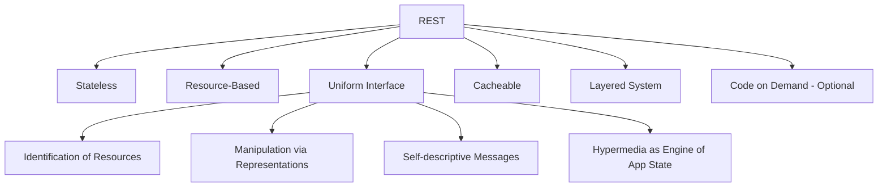

# REST API Design

## What is REST?

REST (Representational State Transfer) is an architectural style for designing networked applications. It uses HTTP as its foundation and emphasizes stateless communication and resource-based interactions.

## REST Principles



| Principle | Description | Example |
|-----------|-------------|---------|
| **Stateless** | Each request contains all needed info | No server-side sessions |
| **Resource-Based** | Everything is a resource identified by URI | `/users/42` |
| **Uniform Interface** | Consistent API patterns | Same conventions across all endpoints |
| **Cacheable** | Responses must define cacheability | `Cache-Control` headers |
| **Layered System** | Client doesn't know if talking to server or proxy | Reverse proxies, CDNs |

## URL Naming Conventions

```
✅ Good RESTful URLs

GET    /users                    # List users
GET    /users/42                 # Get user with ID 42
POST   /users                    # Create a new user
PUT    /users/42                 # Replace user 42
PATCH  /users/42                 # Partially update user 42
DELETE /users/42                 # Delete user 42

GET    /users/42/posts            # Get posts by user 42
GET    /users/42/posts/7          # Get post 7 from user 42

❌ Bad RESTful URLs

GET    /getUsers                 # Verb in URL (use HTTP methods)
POST   /createUser               # Verb in URL
GET    /users/getUserById/42     # Action in URL
POST   /updateUser               # Verb instead of method
GET    /users?id=42              # Filtering in query for single resource
DELETE /deleteUser?id=42         # Everything wrong
```

### Resource Naming Rules

```javascript
// ✅ Plural nouns for collections
const ENDPOINTS = {
  users: '/api/users',
  posts: '/api/posts',
  comments: '/api/comments'
};

// ❌ Singular or inconsistent
const BAD_ENDPOINTS = {
  user: '/api/user',         // Singular
  getPosts: '/api/getPosts', // Verb
  allComments: '/api/allComments' // Non-standard
};

// ✅ Nested resources (max 2-3 levels deep)
GET /api/users/42/posts
GET /api/posts/7/comments

// ❌ Deep nesting
GET /api/users/42/posts/7/comments/5/replies/3  // Too deep

// ✅ Better: flatten with query params
GET /api/comments?postId=7&userId=42
```

## Pagination, Filtering & Sorting

### Pagination

```javascript
// Offset-based pagination
GET /api/users?page=2&limit=20

// Response
{
  "data": [{ "id": 21, "name": "Bob" }, ...],
  "pagination": {
    "page": 2,
    "limit": 20,
    "totalItems": 150,
    "totalPages": 8,
    "hasNext": true,
    "hasPrev": true,
    "nextPage": "/api/users?page=3&limit=20",
    "prevPage": "/api/users?page=1&limit=20"
  }
}

// Cursor-based pagination (better for real-time data)
GET /api/users?cursor=eyJpZCI6NDJ9&limit=20

// Response
{
  "data": [{ "id": 43, "name": "Charlie" }, ...],
  "pagination": {
    "nextCursor": "eyJpZCI6NjJ9",
    "hasMore": true
  }
}
```

### Filtering & Sorting

```javascript
// Filtering by field
GET /api/users?role=admin&status=active
GET /api/users?age[gte]=18&age[lte]=65
GET /api/users?tags=javascript,typescript

// Sorting
GET /api/users?sort=name              // Ascending
GET /api/users?sort=-createdAt         // Descending
GET /api/users?sort=role,-createdAt    // Multiple fields

// Field selection (sparse fields)
GET /api/users?fields=id,name,email

// Search
GET /api/users?search=john
GET /api/users?q=john%20doe

// Combining everything
GET /api/users?page=1&limit=10&role=admin&sort=-createdAt&fields=id,name,email
```

### Client-side Implementation

```javascript
class ApiClient {
  constructor(baseUrl) {
    this.baseUrl = baseUrl;
  }

  async getUsers({ page = 1, limit = 20, sort, filter, fields } = {}) {
    const params = new URLSearchParams();
    params.set('page', page);
    params.set('limit', limit);
    if (sort) params.set('sort', sort);
    if (filter) Object.entries(filter).forEach(([k, v]) => params.set(k, v));
    if (fields) params.set('fields', fields.join(','));

    const response = await fetch(`${this.baseUrl}/users?${params}`);
    if (!response.ok) throw new ApiError(response);
    return response.json();
  }
}

// Usage
const api = new ApiClient('https://api.example.com');
const { data, pagination } = await api.getUsers({
  page: 1,
  limit: 25,
  sort: '-createdAt',
  filter: { role: 'admin', status: 'active' },
  fields: ['id', 'name', 'email']
});
```

## API Versioning

| Strategy | Example | Pros | Cons |
|----------|---------|------|------|
| URL path | `/api/v1/users` | Explicit, easy to route | URL pollution |
| Header | `Accept: application/vnd.api+json;version=2` | Clean URLs | Harder to test |
| Query param | `/api/users?version=1` | Simple | Cache issues |
| Subdomain | `v1.api.example.com` | Clean separation | DNS setup |

```javascript
// URL path versioning (most common)
const API_VERSIONS = {
  v1: {
    users: '/api/v1/users',
    posts: '/api/v1/posts'
  },
  v2: {
    users: '/api/v2/users',  // Changes in v2
    posts: '/api/v2/posts'
  }
};

// Header-based versioning
fetch('/api/users', {
  headers: {
    'Accept': 'application/vnd.api+json;version=2',
    'Content-Type': 'application/json'
  }
});
```

## Error Responses

```javascript
// Consistent error format
{
  "error": {
    "code": "VALIDATION_ERROR",
    "message": "Validation failed for the request",
    "status": 400,
    "details": [
      {
        "field": "email",
        "message": "Email is required",
        "code": "REQUIRED"
      },
      {
        "field": "email",
        "message": "Must be a valid email address",
        "code": "INVALID_FORMAT"
      }
    ],
    "requestId": "req_abc123",
    "timestamp": "2025-01-15T10:30:00Z"
  }
}
```

### HTTP Status for Errors

| Status | Meaning | When to Use |
|--------|---------|-------------|
| `400 Bad Request` | Malformed input | Invalid JSON, missing fields |
| `401 Unauthorized` | Authentication required | Missing/invalid API key |
| `403 Forbidden` | No permission | Authenticated but not allowed |
| `404 Not Found` | Resource doesn't exist | Wrong ID, wrong path |
| `405 Method Not Allowed` | Wrong HTTP method | POST on read-only endpoint |
| `409 Conflict` | State conflict | Duplicate resource, stale data |
| `422 Unprocessable Entity` | Validation error | Semantic validation failure |
| `429 Too Many Requests` | Rate limit hit | Exceeded quota |
| `500 Internal Server Error` | Server bug | Unexpected failure |
| `503 Service Unavailable` | Overloaded/maintenance | Temporary unavailability |

### Error Handling on Client

```javascript
class ApiError extends Error {
  constructor(response, body) {
    super(body?.error?.message || `HTTP ${response.status}`);
    this.status = response.status;
    this.code = body?.error?.code;
    this.details = body?.error?.details;
    this.requestId = response.headers.get('X-Request-Id');
  }
}

async function apiFetch(url, options = {}) {
  const response = await fetch(url, {
    headers: { 'Content-Type': 'application/json', ...options.headers },
    ...options
  });

  if (!response.ok) {
    let body;
    try { body = await response.json(); } catch {}
    throw new ApiError(response, body);
  }

  return response.json();
}

// Usage with error handling
try {
  const user = await apiFetch('/api/users', {
    method: 'POST',
    body: JSON.stringify({ name: 'Alice' })
  });
  console.log('Created:', user);
} catch (error) {
  if (error instanceof ApiError) {
    switch (error.status) {
      case 400:
        console.error('Validation:', error.details);
        break;
      case 401:
        redirectToLogin();
        break;
      case 429:
        console.warn('Rate limited, retrying...');
        await delay(5000);
        return apiFetch(url, options); // Retry
      default:
        reportError(error);
    }
  }
}
```

## Complete API Design Example

```javascript
// Full REST API client
class RestClient {
  constructor(baseUrl) {
    this.baseUrl = baseUrl.replace(/\/$/, '');
  }

  async _request(method, path, options = {}) {
    const url = new URL(`${this.baseUrl}${path}`);
    
    if (options.params) {
      Object.entries(options.params).forEach(([k, v]) => {
        if (v !== undefined && v !== null) url.searchParams.set(k, v);
      });
    }

    const config = {
      method,
      headers: {
        'Content-Type': 'application/json',
        'Accept': 'application/json',
        ...options.headers
      }
    };

    if (options.body && method !== 'GET') {
      config.body = JSON.stringify(options.body);
    }

    if (options.token) {
      config.headers['Authorization'] = `Bearer ${options.token}`;
    }

    const response = await fetch(url.toString(), config);
    
    if (!response.ok) {
      const error = await response.json().catch(() => ({}));
      throw { status: response.status, ...error };
    }

    return response.json();
  }

  // User resources
  async listUsers(params) {
    return this._request('GET', '/users', { params });
  }

  async getUser(id) {
    return this._request('GET', `/users/${id}`);
  }

  async createUser(data) {
    return this._request('POST', '/users', { body: data });
  }

  async updateUser(id, data) {
    return this._request('PUT', `/users/${id}`, { body: data });
  }

  async patchUser(id, data) {
    return this._request('PATCH', `/users/${id}`, { body: data });
  }

  async deleteUser(id) {
    return this._request('DELETE', `/users/${id}`);
  }
}

// Usage
const api = new RestClient('https://api.example.com/v1');

async function main() {
  // Create
  const user = await api.createUser({ name: 'Alice', email: 'alice@test.com' });
  
  // Read
  const users = await api.listUsers({ page: 1, limit: 10, sort: '-createdAt' });
  
  // Update
  const updated = await api.patchUser(user.id, { name: 'Alice Updated' });
  
  // Delete
  await api.deleteUser(user.id);
}
```

## Key Takeaways

- Resources are nouns, HTTP methods are verbs
- Use consistent plural nouns for endpoints
- Support pagination, filtering, sorting from day one
- Return consistent, descriptive error responses
- Version your API to avoid breaking clients
- Use proper HTTP status codes for every response
