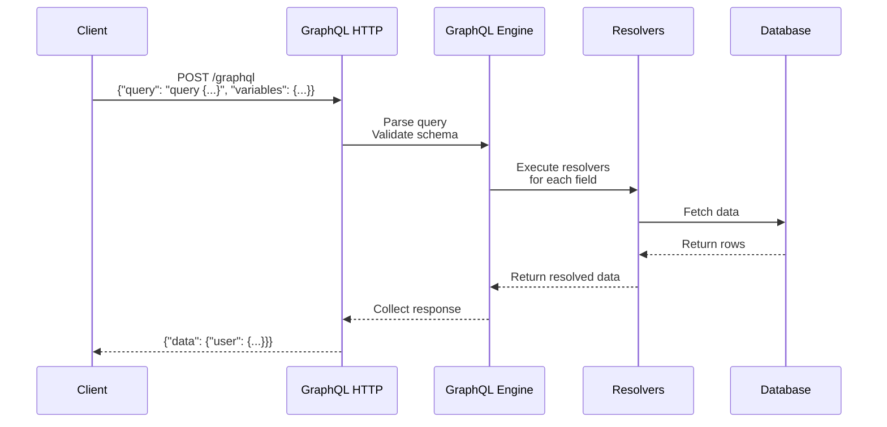

# GraphQL

## What is GraphQL?

GraphQL is a query language for APIs developed by Facebook. It allows clients to request exactly the data they need, nothing more and nothing less. Unlike REST, GraphQL has a single endpoint.

## REST vs GraphQL

```mermaid
graph LR
    subgraph "REST"
        A1[Client] --> B1[/api/users]
        A1 --> C1[/api/users/42/posts]
        A1 --> D1[/api/users/42/posts/7/comments]
    end
    
    subgraph "GraphQL"
        A2[Client] --> B2[/graphql]
        B2 -.->|Single query<br/>gets all data| A2
    end
```

| Feature | REST | GraphQL |
|---------|------|---------|
| Data fetching | Multiple endpoints, often over/under-fetching | Single endpoint, exact data requested |
| Versioning | URL or header versioning | Evolve schema, no versioning needed |
| Over-fetching | Server decides what fields to return | Client specifies fields |
| Under-fetching | Multiple round trips (n+1 problem) | Single query for nested resources |
| Tooling | Swagger/OpenAPI, Postman | GraphiQL, Apollo Studio, GraphQL Codegen |
| Caching | Native HTTP caching | Requires custom cache (Apollo Cache) |
| File upload | Multipart form data | Requires multipart spec extension |
| Learning curve | Low | Medium-High |

## Schema & Type System

```graphql
# Schema Definition Language (SDL)

type User {
  id: ID!
  name: String!
  email: String!
  age: Int
  posts: [Post!]!
  createdAt: DateTime
}

type Post {
  id: ID!
  title: String!
  content: String!
  published: Boolean!
  author: User!
  comments: [Comment!]!
  createdAt: DateTime
}

type Comment {
  id: ID!
  text: String!
  author: User!
  post: Post!
}

type Query {
  users: [User!]!
  user(id: ID!): User
  posts(published: Boolean): [Post!]!
  post(id: ID!): Post
}

type Mutation {
  createUser(input: CreateUserInput!): User!
  updateUser(id: ID!, input: UpdateUserInput!): User!
  deleteUser(id: ID!): Boolean!
  createPost(input: CreatePostInput!): Post!
}

input CreateUserInput {
  name: String!
  email: String!
  age: Int
}

input UpdateUserInput {
  name: String
  email: String
  age: Int
}

type Subscription {
  postCreated: Post!
  userUpdated: User!
}
```

## Queries

```graphql
# Query: get exactly what you need
query GetUserWithPosts {
  user(id: "42") {
    name
    email
    posts {
      title
      createdAt
    }
  }
}

# Response (no over-fetching)
{
  "data": {
    "user": {
      "name": "Alice",
      "email": "alice@example.com",
      "posts": [
        { "title": "GraphQL 101", "createdAt": "2025-01-15T10:00:00Z" }
      ]
    }
  }
}
```

### Multiple Queries in One Request

```graphql
query HomePage {
  recentPosts: posts(published: true, limit: 5) {
    id title createdAt
    author { name }
  }
  activeUsers: users(active: true) {
    id name
  }
  stats {
    totalPosts
    totalUsers
  }
}
```

### Variables & Aliases

```graphql
query GetUser($userId: ID!, $includeEmail: Boolean!) {
  user(id: $userId) {
    id
    name
    email @include(if: $includeEmail)
    posts(limit: 3) {
      title
    }
  }
}

# Variables
{
  "userId": "42",
  "includeEmail": true
}
```

## Mutations

```graphql
mutation CreateNewUser($input: CreateUserInput!) {
  createUser(input: $input) {
    id
    name
    email
    createdAt
  }
}

# Variables
{
  "input": {
    "name": "Bob",
    "email": "bob@example.com",
    "age": 30
  }
}
```

### Fragments

```graphql
# Define reusable fragment
fragment UserFields on User {
  id
  name
  email
  avatar
}

fragment PostFields on Post {
  id
  title
  excerpt
  createdAt
}

# Use fragment in queries
query GetProfile {
  user(id: "42") {
    ...UserFields
    posts {
      ...PostFields
      author {
        ...UserFields
      }
    }
  }
}
```

## Subscriptions

```graphql
subscription OnNewPost {
  postCreated {
    id
    title
    content
    author {
      name
    }
    createdAt
  }
}
```

## Resolvers

```javascript
// Server-side: GraphQL resolvers (Apollo Server example)
const resolvers = {
  Query: {
    users: async (_, args, context) => {
      return context.db.user.findMany();
    },
    user: async (_, { id }, context) => {
      return context.db.user.findUnique({ where: { id } });
    },
    posts: async (_, { published }, context) => {
      const where = published !== undefined ? { published } : {};
      return context.db.post.findMany({ where });
    }
  },

  Mutation: {
    createUser: async (_, { input }, context) => {
      const existing = await context.db.user.findUnique({
        where: { email: input.email }
      });
      if (existing) {
        throw new GraphQLError('Email already exists', {
          extensions: { code: 'EMAIL_EXISTS' }
        });
      }
      return context.db.user.create({ data: input });
    },

    createPost: async (_, { input }, context) => {
      // Access authenticated user from context
      if (!context.user) {
        throw new GraphQLError('Not authenticated', {
          extensions: { code: 'UNAUTHENTICATED' }
        });
      }
      return context.db.post.create({
        data: { ...input, authorId: context.user.id }
      });
    }
  },

  User: {
    posts: async (parent, _, context) => {
      // Parent is the User object
      return context.db.post.findMany({
        where: { authorId: parent.id }
      });
    }
  },

  Post: {
    author: async (parent, _, context) => {
      return context.db.user.findUnique({
        where: { id: parent.authorId }
      });
    }
  }
};

// Context with authentication
const server = new ApolloServer({
  typeDefs,
  resolvers,
  context: async ({ req }) => {
    const token = req.headers.authorization?.replace('Bearer ', '');
    if (token) {
      const user = await verifyToken(token);
      return { user, db };
    }
    return { db };
  }
});
```

## Apollo Client Basics

```javascript
// Client-side: Apollo Client
import { ApolloClient, InMemoryCache, gql, useQuery, useMutation } from '@apollo/client';

// Setup
const client = new ApolloClient({
  uri: 'https://api.example.com/graphql',
  cache: new InMemoryCache({
    typePolicies: {
      User: {
        keyFields: ['id'],
        fields: {
          posts: {
            merge(existing = [], incoming) {
              return incoming; // Replace on refetch
            }
          }
        }
      }
    }
  }),
  headers: {
    Authorization: `Bearer ${localStorage.getItem('token')}`
  }
});

// Query Component
const GET_USERS = gql`
  query GetUsers {
    users {
      id
      name
      email
      posts {
        title
      }
    }
  }
`;

function UsersList() {
  const { loading, error, data, refetch } = useQuery(GET_USERS, {
    // Options
    variables: { limit: 20 },
    fetchPolicy: 'cache-first', // Use cache if available
    pollInterval: 30000, // Poll every 30 seconds
    onError: (err) => console.error('Query error:', err)
  });

  if (loading) return <Spinner />;
  if (error) return <Error message={error.message} onRetry={refetch} />;

  return (
    <ul>
      {data.users.map(user => (
        <li key={user.id}>{user.name} - {user.email}</li>
      ))}
    </ul>
  );
}

// Mutation Component
const CREATE_USER = gql`
  mutation CreateUser($input: CreateUserInput!) {
    createUser(input: $input) {
      id
      name
      email
    }
  }
`;

function CreateUserForm() {
  const [createUser, { loading, error }] = useMutation(CREATE_USER, {
    // Update cache after mutation
    update: (cache, { data }) => {
      cache.modify({
        fields: {
          users(existingUsers = []) {
            const newUserRef = cache.writeFragment({
              data: data.createUser,
              fragment: gql`
                fragment NewUser on User {
                  id
                  name
                  email
                }
              `
            });
            return [...existingUsers, newUserRef];
          }
        }
      });
    }
  });

  const handleSubmit = async (formData) => {
    try {
      const { data } = await createUser({
        variables: { input: formData }
      });
      console.log('Created:', data.createUser);
    } catch (err) {
      console.error('Failed:', err);
    }
  };

  return <form onSubmit={handleSubmit}>...</form>;
}
```

## GraphQL Query Flow



## Directives

```graphql
query GetUser($withEmail: Boolean!) {
  user(id: "42") {
    id
    name
    email @include(if: $withEmail)
    posts @skip(if: $withEmail) {
      title
    }
  }
}
```

## Security Considerations

```javascript
// Rate limiting
const server = new ApolloServer({
  typeDefs,
  resolvers,
  plugins: [
    {
      async requestDidStart(reqContext) {
        // Limit query depth
        const depth = calculateDepth(reqContext.request.query);
        if (depth > 5) {
          throw new GraphQLError('Query too deep');
        }
      }
    }
  ]
});

// Query cost analysis
const costAnalyzer = {
  Query: { users: 5, user: 2 },
  Mutation: { createUser: 10 },
  defaultCost: 1
};

// Batch queries are allowed (batching optimization)
// But disable introspection in production
const isProduction = process.env.NODE_ENV === 'production';
const server = new ApolloServer({
  introspection: !isProduction
});
```

## Key Takeaways

- GraphQL lets clients request exactly the data they need
- Single endpoint vs multiple REST endpoints
- Strongly typed schema serves as contract between client and server
- Fragments enable reusable field selections
- Apollo Client provides powerful caching and state management
- Subscriptions enable real-time updates via WebSocket
- Use query depth limiting and cost analysis to prevent abuse
