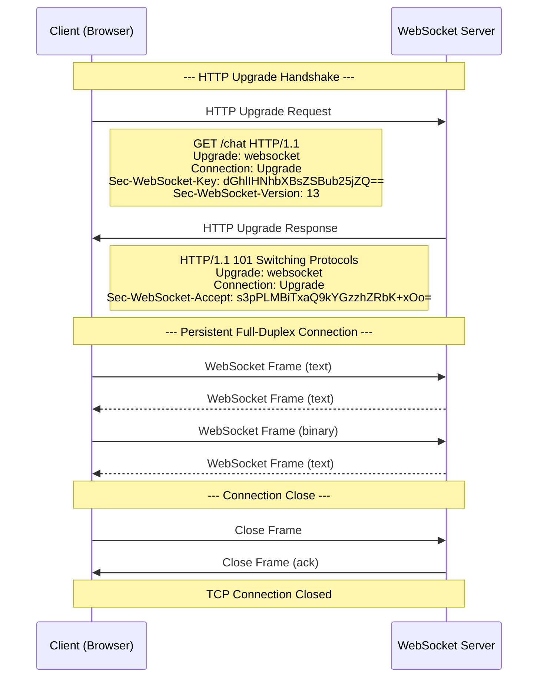

# WebSocket

## What is WebSocket?

WebSocket provides full-duplex communication over a single TCP connection. Unlike HTTP's request-response pattern, WebSocket allows the server to push data to the client at any time.

## WebSocket vs HTTP

| Feature | HTTP | WebSocket |
|---------|------|-----------|
| Communication | Half-duplex (request-response) | Full-duplex |
| Connection | Short-lived (stateless) | Persistent (stateful) |
| Overhead | High (headers per request) | Low (minimal framing after handshake) |
| Server push | Not possible (polling/SSE needed) | Native |
| Protocol | `http://` / `https://` | `ws://` / `wss://` |
| Binary data | Text-based (Base64 for binary) | Native binary frames |
| Use cases | Standard API calls | Real-time apps, gaming, chat |
| Browser support | Universal | Excellent (IE10+) |

## The WebSocket Handshake



## Message Framing

WebSocket messages are sent in frames. Each frame has:

```
 0                   1                   2                   3
 0 1 2 3 4 5 6 7 8 9 0 1 2 3 4 5 6 7 8 9 0 1 2 3 4 5 6 7 8 9 0 1
+-+-+-+-+-------+-+-------------+-------------------------------+
|F|R|R|R| opcode|M| Payload len |    Extended payload length    |
|I|S|S|S|  (4)  |A|     (7)     |             (16/64)           |
|N|V|V|V|       |S|             |   (if payload len==126/127)   |
| |1|2|3|       |K|             |                               |
+-+-+-+-+-------+-+-------------+ - - - - - - - - - - - - - - -+
|     Extended payload length continued, if payload len == 127  |
+ - - - - - - - - - - - - - - - +-------------------------------+
|                               |Masking-key, if MASK set to 1  |
+-------------------------------+-------------------------------+
| Masking-key (continued)       |          Payload Data         |
+-------------------------------+ - - - - - - - - - - - - - - -+
:                     Payload Data continued ...                :
+ - - - - - - - - - - - - - - - - - - - - - - - - - - - - - - +
|                     Payload Data (continued)                  |
+---------------------------------------------------------------+
```

### Opcodes

| Opcode | Type | Description |
|--------|------|-------------|
| `0x0` | Continuation | Continuation frame for fragmented message |
| `0x1` | Text | UTF-8 text data |
| `0x2` | Binary | Binary data |
| `0x8` | Close | Connection close |
| `0x9` | Ping | Ping (keepalive) |
| `0xA` | Pong | Pong response |

## Browser WebSocket API

```javascript
// Client-side WebSocket
class ChatClient {
  constructor(url) {
    this.url = url;
    this.ws = null;
    this.reconnectAttempts = 0;
    this.maxReconnectAttempts = 10;
    this.listeners = new Map();
    this.pendingMessages = [];
  }

  connect() {
    this.ws = new WebSocket(this.url);
    
    this.ws.onopen = () => {
      console.log('Connected');
      this.reconnectAttempts = 0;
      this.emit('connected');
      
      // Send pending messages
      while (this.pendingMessages.length > 0) {
        this.send(this.pendingMessages.shift());
      }
    };

    this.ws.onmessage = (event) => {
      try {
        const data = JSON.parse(event.data);
        this.emit(data.type, data.payload);
      } catch {
        this.emit('raw', event.data);
      }
    };

    this.ws.onclose = (event) => {
      console.log('Disconnected:', event.code, event.reason);
      this.emit('disconnected', event);
      this.scheduleReconnect();
    };

    this.ws.onerror = (error) => {
      console.error('WebSocket error:', error);
      this.emit('error', error);
    };
  }

  send(data) {
    if (this.ws?.readyState === WebSocket.OPEN) {
      this.ws.send(JSON.stringify(data));
    } else {
      this.pendingMessages.push(data);
    }
  }

  on(event, callback) {
    if (!this.listeners.has(event)) {
      this.listeners.set(event, []);
    }
    this.listeners.get(event).push(callback);
    return () => this.off(event, callback);
  }

  off(event, callback) {
    const callbacks = this.listeners.get(event);
    if (callbacks) {
      const idx = callbacks.indexOf(callback);
      if (idx !== -1) callbacks.splice(idx, 1);
    }
  }

  emit(event, ...args) {
    const callbacks = this.listeners.get(event);
    if (callbacks) {
      callbacks.forEach(cb => cb(...args));
    }
  }

  scheduleReconnect() {
    if (this.reconnectAttempts >= this.maxReconnectAttempts) {
      this.emit('reconnect_failed');
      return;
    }

    // Exponential backoff with jitter
    const baseDelay = 1000;
    const maxDelay = 30000;
    const delay = Math.min(
      baseDelay * Math.pow(2, this.reconnectAttempts),
      maxDelay
    );
    const jitter = Math.random() * 1000;
    const totalDelay = delay + jitter;

    console.log(`Reconnecting in ${totalDelay}ms (attempt ${this.reconnectAttempts + 1})`);
    
    setTimeout(() => {
      this.reconnectAttempts++;
      this.connect();
    }, totalDelay);
  }

  close() {
    if (this.ws) {
      this.ws.close(1000, 'Client closing');
    }
  }
}

// Usage
const chat = new ChatClient('wss://chat.example.com/ws');

chat.on('connected', () => console.log('Ready to chat'));
chat.on('message', ({ user, text, timestamp }) => {
  displayMessage(user, text, timestamp);
});
chat.on('disconnected', () => showDisconnectedBanner());
chat.on('reconnect_failed', () => showError('Unable to reconnect'));

chat.connect();
```

## Heartbeat / Keepalive

```javascript
class HeartbeatClient extends ChatClient {
  constructor(url) {
    super(url);
    this.pingInterval = 30000;
    this.pongTimeout = 10000;
    this._pingTimer = null;
    this._pongTimer = null;
  }

  onopen() {
    super.onopen();
    this.startHeartbeat();
  }

  startHeartbeat() {
    this._pingTimer = setInterval(() => {
      this.ws.send(JSON.stringify({ type: 'ping' }));
      
      // Wait for pong
      this._pongTimer = setTimeout(() => {
        console.warn('No pong received, closing');
        this.ws.close();
      }, this.pongTimeout);
    }, this.pingInterval);
  }

  // Server sends pong
  handlePong() {
    clearTimeout(this._pongTimer);
  }

  onclose(event) {
    clearInterval(this._pingTimer);
    clearTimeout(this._pongTimer);
    super.onclose(event);
  }
}
```

## Chat Application Example

```javascript
// Complete chat application
const ChatApp = {
  ws: null,
  username: null,

  init(username) {
    this.username = username;
    this.ws = new WebSocket('wss://chat.example.com/ws');
    
    this.ws.onopen = () => {
      this.ws.send(JSON.stringify({
        type: 'join',
        payload: { username: this.username }
      }));
    };

    this.ws.onmessage = (event) => {
      const { type, payload } = JSON.parse(event.data);
      switch (type) {
        case 'message':
          this.renderMessage(payload);
          break;
        case 'user_joined':
          this.renderSystemMessage(`${payload.username} joined`);
          this.updateUserList(payload.users);
          break;
        case 'user_left':
          this.renderSystemMessage(`${payload.username} left`);
          this.updateUserList(payload.users);
          break;
        case 'typing':
          this.showTypingIndicator(payload.username);
          break;
      }
    };

    this.ws.onclose = () => {
      this.renderSystemMessage('Disconnected');
    };
  },

  sendMessage(text) {
    this.ws.send(JSON.stringify({
      type: 'message',
      payload: {
        username: this.username,
        text,
        timestamp: Date.now()
      }
    }));
  },

  sendTyping() {
    this.ws.send(JSON.stringify({
      type: 'typing',
      payload: { username: this.username }
    }));
  },

  // UI methods
  renderMessage({ username, text, timestamp }) {
    const div = document.createElement('div');
    div.className = 'message';
    div.innerHTML = `
      <strong>${escapeHtml(username)}</strong>
      <span class="time">${new Date(timestamp).toLocaleTimeString()}</span>
      <p>${escapeHtml(text)}</p>
    `;
    document.getElementById('messages').appendChild(div);
  },

  renderSystemMessage(text) {
    const div = document.createElement('div');
    div.className = 'system-message';
    div.textContent = text;
    document.getElementById('messages').appendChild(div);
  },

  updateUserList(users) {
    document.getElementById('users').innerHTML = users
      .map(u => `<li>${escapeHtml(u)}</li>`)
      .join('');
  }
};

function escapeHtml(str) {
  const div = document.createElement('div');
  div.textContent = str;
  return div.innerHTML;
}
```

## Server-side (Node.js with ws)

```javascript
const WebSocket = require('ws');
const http = require('http');

const server = http.createServer((req, res) => {
  res.writeHead(200, { 'Content-Type': 'text/plain' });
  res.end('WebSocket server running');
});

const wss = new WebSocket.Server({ server });

const clients = new Map();

wss.on('connection', (ws, req) => {
  const clientId = generateId();
  clients.set(clientId, { ws, username: null });

  console.log(`Client ${clientId} connected from ${req.socket.remoteAddress}`);

  ws.on('message', (data) => {
    try {
      const { type, payload } = JSON.parse(data);

      switch (type) {
        case 'join':
          clients.get(clientId).username = payload.username;
          broadcast({
            type: 'user_joined',
            payload: {
              username: payload.username,
              users: getOnlineUsers()
            }
          }, clientId);
          break;

        case 'message':
          broadcast({
            type: 'message',
            payload: {
              username: payload.username,
              text: payload.text,
              timestamp: Date.now()
            }
          });
          break;

        case 'ping':
          ws.send(JSON.stringify({ type: 'pong' }));
          break;
      }
    } catch (err) {
      console.error('Invalid message:', err);
    }
  });

  ws.on('close', () => {
    const client = clients.get(clientId);
    if (client?.username) {
      broadcast({
        type: 'user_left',
        payload: {
          username: client.username,
          users: getOnlineUsers().filter(u => u !== client.username)
        }
      });
    }
    clients.delete(clientId);
  });

  ws.on('error', (err) => {
    console.error(`Client ${clientId} error:`, err);
    clients.delete(clientId);
  });
});

function broadcast(message, excludeId) {
  const data = JSON.stringify(message);
  clients.forEach((client, id) => {
    if (id !== excludeId && client.ws.readyState === WebSocket.OPEN) {
      client.ws.send(data);
    }
  });
}

function getOnlineUsers() {
  return Array.from(clients.values())
    .filter(c => c.username)
    .map(c => c.username);
}

function generateId() {
  return Math.random().toString(36).substring(2, 10);
}

server.listen(8080, () => {
  console.log('WebSocket server on port 8080');
});
```

## Reconnection Strategy

```javascript
class ReconnectingWebSocket {
  constructor(url, options = {}) {
    this.url = url;
    this.maxAttempts = options.maxAttempts || Infinity;
    this.baseDelay = options.baseDelay || 1000;
    this.maxDelay = options.maxDelay || 30000;
    this.attempts = 0;
    this.connect();
  }

  connect() {
    this.ws = new WebSocket(this.url);
    this.ws.onopen = () => {
      this.attempts = 0;
    };
    this.ws.onclose = (event) => {
      // Don't reconnect on intentional close (1000) or protocol error (1002)
      if (event.code === 1000 || event.code === 1002) return;
      this.scheduleReconnect();
    };
  }

  scheduleReconnect() {
    this.attempts++;
    const delay = Math.min(
      this.baseDelay * Math.pow(1.5, this.attempts - 1),
      this.maxDelay
    );
    setTimeout(() => this.connect(), delay);
  }
}
```

## Key Takeaways

- WebSocket enables real-time, full-duplex communication
- Connection starts with HTTP upgrade handshake (101 Switching Protocols)
- Messages use a lightweight binary framing protocol
- Always implement reconnection with exponential backoff
- Use heartbeats (ping/pong) to detect dead connections
- Prefer `wss://` (WebSocket Secure) over `ws://`
- Browser API is simple: `new WebSocket(url)` with `onopen`, `onmessage`, `onclose`, `onerror`
