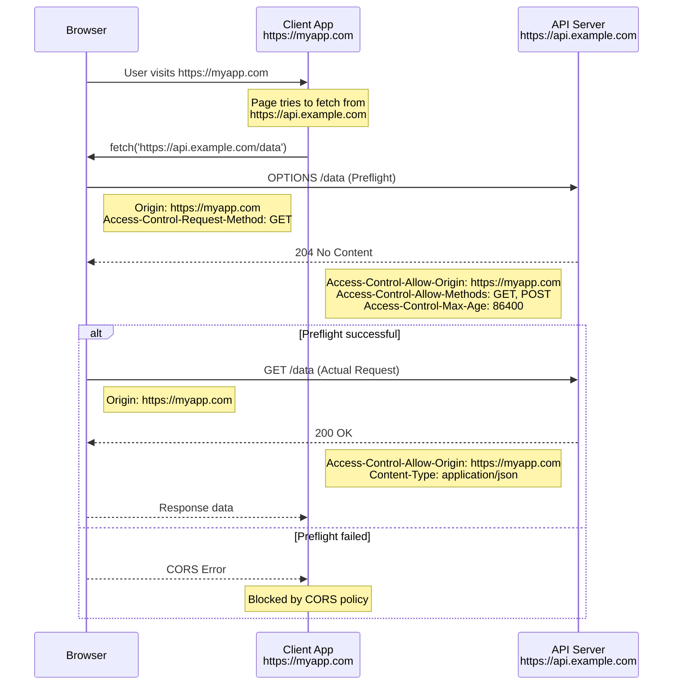
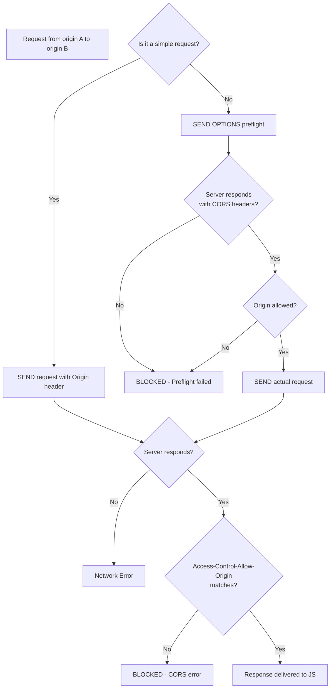

# CORS (Cross-Origin Resource Sharing)

## Same-Origin Policy

The Same-Origin Policy (SOP) prevents a web page from making requests to a different origin than the one that served the page.

```
Origin = Scheme (protocol) + Host (domain) + Port

https://example.com:443
│       │              │
Scheme  Host           Port
```

### What counts as "same origin"?

| URL A | URL B | Same Origin? |
|-------|-------|--------------|
| `https://example.com/page1` | `https://example.com/page2` | ✅ Yes |
| `https://example.com` | `https://api.example.com` | ❌ No (subdomain) |
| `https://example.com` | `http://example.com` | ❌ No (scheme) |
| `https://example.com` | `https://example.com:8080` | ❌ No (port) |
| `https://example.com` | `https://example.com/path` | ✅ Yes |

## The CORS Mechanism

CORS (Cross-Origin Resource Sharing) is a mechanism that uses HTTP headers to tell browsers to allow a web application running at one origin to access resources from a different origin.



## Simple vs Preflight Requests

### Simple Requests

A request is "simple" if it meets ALL these conditions:

- Method: `GET`, `HEAD`, or `POST`
- Headers: Only `Accept`, `Accept-Language`, `Content-Language`, `Content-Type` (with values `application/x-www-form-urlencoded`, `multipart/form-data`, or `text/plain`)
- No event listeners on `XMLHttpRequestUpload`

Simple requests don't trigger a preflight. The browser sends the request directly with an `Origin` header.

### Preflight Requests

All other requests trigger a preflight `OPTIONS` request before the actual request.

```javascript
// Triggers preflight (custom header)
fetch('https://api.example.com/data', {
  headers: { 'X-Custom-Header': 'value' }
});

// Triggers preflight (non-simple content type)
fetch('https://api.example.com/data', {
  method: 'POST',
  headers: { 'Content-Type': 'application/json' },
  body: JSON.stringify({ key: 'value' })
});

// Triggers preflight (PUT method)
fetch('https://api.example.com/data/1', {
  method: 'PUT',
  body: JSON.stringify({ key: 'updated' })
});

// No preflight (simple request)
fetch('https://api.example.com/data');
```

## CORS Headers

### Response Headers (Server)

| Header | Description | Example |
|--------|-------------|---------|
| `Access-Control-Allow-Origin` | Allowed origins | `*` or `https://myapp.com` |
| `Access-Control-Allow-Methods` | Allowed HTTP methods | `GET, POST, PUT, DELETE` |
| `Access-Control-Allow-Headers` | Allowed request headers | `Content-Type, Authorization` |
| `Access-Control-Expose-Headers` | Headers client can access | `X-Request-Id` |
| `Access-Control-Max-Age` | Cache preflight response (seconds) | `86400` |
| `Access-Control-Allow-Credentials` | Allow cookies/auth | `true` |

### Request Headers (Browser)

| Header | Description | Example |
|--------|-------------|---------|
| `Origin` | Request origin | `https://myapp.com` |
| `Access-Control-Request-Method` | Method in preflight | `PUT` |
| `Access-Control-Request-Headers` | Headers in preflight | `authorization, content-type` |

## CORS Configuration Examples

### Server-side (Express.js)

```javascript
const express = require('express');
const cors = require('cors');
const app = express();

// Option 1: Allow all origins (development only)
app.use(cors());

// Option 2: Specific origins
app.use(cors({
  origin: 'https://myapp.com',
  methods: ['GET', 'POST', 'PUT', 'DELETE', 'PATCH'],
  allowedHeaders: ['Content-Type', 'Authorization'],
  exposedHeaders: ['X-Request-Id'],
  credentials: true,
  maxAge: 86400
}));

// Option 3: Dynamic origin
const allowedOrigins = [
  'https://myapp.com',
  'https://admin.myapp.com',
  'https://staging.myapp.com'
];

app.use(cors({
  origin: (origin, callback) => {
    if (!origin || allowedOrigins.includes(origin)) {
      callback(null, true);
    } else {
      callback(new Error('Not allowed by CORS'));
    }
  },
  credentials: true
}));

// Option 4: Manual middleware
app.use((req, res, next) => {
  res.header('Access-Control-Allow-Origin', 'https://myapp.com');
  res.header('Access-Control-Allow-Methods', 'GET, POST, PUT, DELETE');
  res.header('Access-Control-Allow-Headers', 'Content-Type, Authorization');
  
  if (req.method === 'OPTIONS') {
    return res.sendStatus(204);
  }
  
  next();
});
```

### Server-side (Nginx)

```nginx
server {
    listen 443 ssl;
    server_name api.example.com;
    
    location / {
        # Allow specific origin
        if ($http_origin ~* (https?://myapp\.com$)) {
            add_header Access-Control-Allow-Origin "$http_origin";
            add_header Access-Control-Allow-Methods "GET, POST, PUT, DELETE, OPTIONS";
            add_header Access-Control-Allow-Headers "Content-Type, Authorization";
            add_header Access-Control-Max-Age 86400;
        }
        
        # Handle preflight
        if ($request_method = OPTIONS) {
            add_header Access-Control-Allow-Origin "$http_origin";
            add_header Access-Control-Allow-Methods "GET, POST, PUT, DELETE, OPTIONS";
            add_header Access-Control-Allow-Headers "Content-Type, Authorization";
            add_header Content-Length 0;
            add_header Content-Type text/plain;
            return 204;
        }
    }
}
```

## Credentials (Cookies & Auth)

When making CORS requests with credentials (cookies, HTTP auth), special handling is required:

```javascript
// Client-side: must include credentials option
fetch('https://api.example.com/user', {
  credentials: 'include', // Send cookies
  // or: credentials: 'same-origin'
  // or: credentials: 'omit'
});

// Server-side: must specify exact origin (not *)
// and set credentials: true
app.use(cors({
  origin: 'https://myapp.com',  // Required: CANNOT be '*'
  credentials: true
}));
```

## Handling CORS Errors

### Common CORS Errors

```javascript
// Error 1: "No 'Access-Control-Allow-Origin' header is present"
// Server didn't include the CORS header

// Error 2: "Response to preflight request doesn't pass"
// Preflight OPTIONS request failed

// Error 3: "Credentials flag is 'true', but the 
// 'Access-Control-Allow-Origin' header is '*'"
// Cannot use * with credentials

// Error 4: "Request header field X-Custom is not 
// allowed by Access-Control-Allow-Headers"
// Custom header not listed in allowed headers
```

### Client-side Error Handling

```javascript
async function corsFetch(url, options = {}) {
  try {
    const response = await fetch(url, {
      credentials: 'include',
      ...options
    });
    
    if (response.type === 'opaque') {
      // Opaque responses occur with no-cors mode
      throw new Error('Opaque response - cannot read data');
    }
    
    return response.json();
  } catch (error) {
    if (error.name === 'TypeError') {
      // Network errors often indicate CORS issues in Firefox
      console.error('CORS error detected:', url);
      throw new Error(`CORS request to ${url} failed`);
    }
    throw error;
  }
}

// Detection
function isCorsError(error, url) {
  const isChrome = error.message?.includes('CORS');
  const isFirefox = error.name === 'TypeError' && 
    error.message?.includes('NetworkError');
  const isSafari = error.message?.includes('cors');
  
  return isChrome || isFirefox || isSafari;
}
```

## Proxy Solutions

When you can't control the server, use a proxy:

### Development Proxy

```javascript
// Vite config
// vite.config.js
export default {
  server: {
    proxy: {
      '/api': {
        target: 'https://api.example.com',
        changeOrigin: true,
        rewrite: (path) => path.replace(/^\/api/, '')
      }
    }
  }
};

// Webpack dev server
// webpack.config.js
module.exports = {
  devServer: {
    proxy: {
      '/api': {
        target: 'https://api.example.com',
        changeOrigin: true,
        secure: false
      }
    }
  }
};
```

### CORS Proxy Services

```javascript
// Using a CORS proxy (development/testing only!)
const PROXY = 'https://cors-anywhere.herokuapp.com/';

async function fetchWithProxy(url) {
  // This adds CORS headers to the response
  const proxyUrl = `${PROXY}${url}`;
  return fetch(proxyUrl, {
    headers: { 'X-Requested-With': 'XMLHttpRequest' }
  });
}
```

### API Gateway Proxy (Production)

```javascript
// Use your own backend as a proxy
async function fetchThroughProxy(endpoint) {
  // Your server proxies the request and adds CORS headers
  const response = await fetch(`/api/proxy?url=${encodeURIComponent(endpoint)}`, {
    headers: { 'Authorization': `Bearer ${getToken()}` }
  });
  return response.json();
}
```

```javascript
// Express proxy endpoint
app.get('/api/proxy', async (req, res) => {
  try {
    const targetUrl = req.query.url;
    const response = await fetch(targetUrl, {
      headers: { 'User-Agent': 'MyApp/1.0' }
    });
    const data = await response.json();
    res.json(data);
  } catch (error) {
    res.status(502).json({ error: 'Proxy failed' });
  }
});
```

## CORS Flow Diagram



## Best Practices

```javascript
// 1. Use environment-specific CORS configs
const corsConfig = {
  development: {
    origin: 'http://localhost:3000',
    credentials: true
  },
  staging: {
    origin: ['https://staging.myapp.com', 'https://staging-admin.myapp.com'],
    credentials: true
  },
  production: {
    origin: ['https://myapp.com', 'https://admin.myapp.com'],
    credentials: true,
    maxAge: 86400
  }
};

// 2. Whitelist, don't wildcard (unless public API)
app.use(cors(corsConfig[process.env.NODE_ENV]));

// 3. Handle OPTIONS globally
app.options('*', cors());

// 4. Validate origin server-side
function isValidOrigin(origin) {
  const allowed = new Set([
    'https://myapp.com',
    'https://www.myapp.com'
  ]);
  return allowed.has(origin);
}
```

## Key Takeaways

- Same-Origin Policy blocks cross-origin requests by default
- CORS is a cooperative protocol — the server must opt in via headers
- Simple requests skip preflight; everything else triggers OPTIONS
- Use `credentials: 'include'` to send cookies cross-origin
- Cannot use `*` origin with credentials — must specify exact origin
- When you can't control the server, use a proxy
- Always validate origins server-side in production
