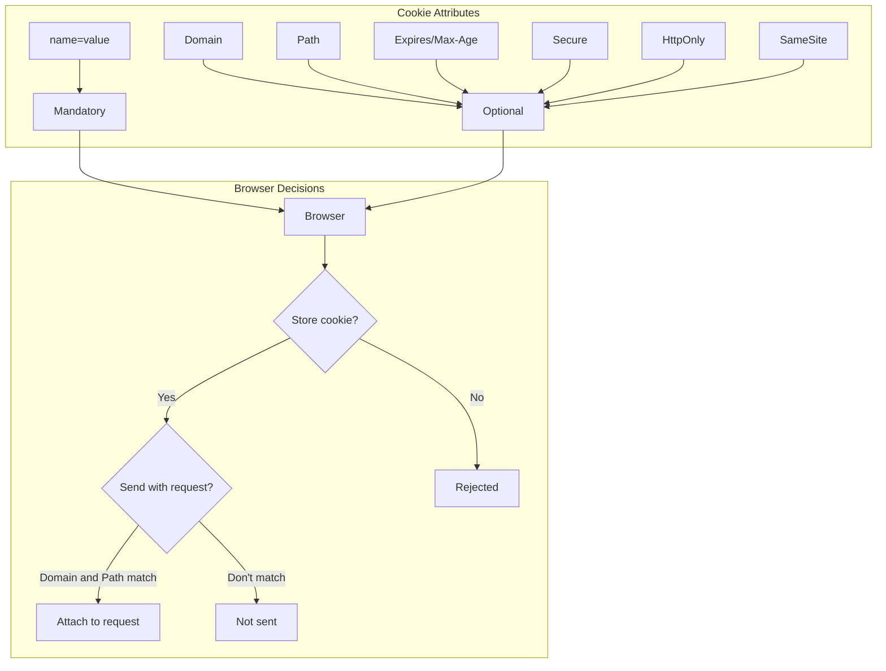
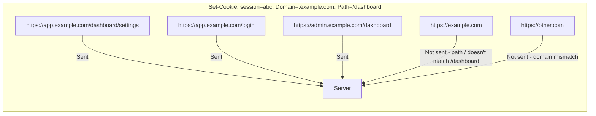
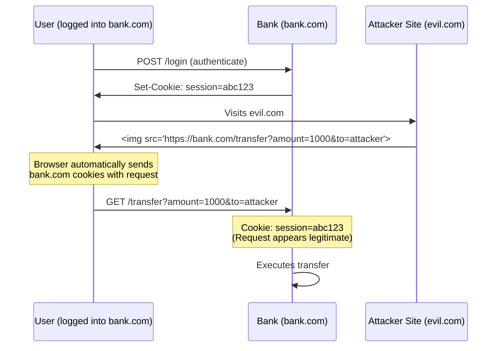

# HTTP Cookies

## What are Cookies?

Cookies are small pieces of data (max 4KB) stored by the browser and sent with every request to the origin that set them. They're primarily used for session management, personalization, and tracking.

## Cookie Attributes

```
Set-Cookie: <cookie-name>=<cookie-value>; Attribute1; Attribute2
```



### Attribute Reference

| Attribute | Format | Purpose |
|-----------|--------|---------|
| **Domain** | `Domain=.example.com` | Specifies which hosts can receive the cookie |
| **Path** | `Path=/app` | Limits cookie to a specific path |
| **Expires** | `Expires=Wed, 21 Oct 2025 07:28:00 GMT` | Absolute expiration date |
| **Max-Age** | `Max-Age=3600` | Relative expiration in seconds (overrides Expires) |
| **Secure** | `Secure` | Only send over HTTPS |
| **HttpOnly** | `HttpOnly` | Not accessible via JavaScript |
| **SameSite** | `SameSite=Lax` | Controls cross-site sending behavior |
| **Priority** | `Priority=High` | Low/Medium/High eviction priority |

### Setting Cookies

```javascript
// Server-side (Express.js)
res.cookie('session', 'abc123', {
  httpOnly: true,
  secure: true,
  sameSite: 'strict',
  maxAge: 1000 * 60 * 60 * 24, // 24 hours
  path: '/',
  domain: '.example.com'
});

// Client-side (JavaScript)
document.cookie = 'theme=dark; path=/; max-age=31536000; secure';
document.cookie = 'locale=en-US; path=/; max-age=31536000';
```

### Reading Cookies

```javascript
// Client-side
function getCookie(name) {
  const value = `; ${document.cookie}`;
  const parts = value.split(`; ${name}=`);
  if (parts.length === 2) return parts.pop().split(';').shift();
  return null;
}

const theme = getCookie('theme');
console.log(theme); // 'dark'

// Listing all cookies
console.log(document.cookie);
// "theme=dark; locale=en-US"

// Server-side (Express.js)
app.use((req, res, next) => {
  console.log(req.cookies);    // Parsed cookies (cookie-parser middleware)
  console.log(req.headers.cookie); // Raw cookie header
  next();
});
```

### Deleting Cookies

```javascript
// Server-side
res.clearCookie('session', { path: '/' });

// Client-side (set past expiration)
document.cookie = 'theme=; max-age=0; path=/';

// Cookie removal function
function deleteCookie(name, path = '/') {
  document.cookie = `${name}=; path=${path}; max-age=0`;
}
```

## Cookie Scope

```
Domain rule:
  - If Domain is NOT set: cookie only sent to origin server (no subdomains)
  - If Domain IS set: cookie sent to all specified subdomains
  
Path rule:
  - Cookie sent if request path matches or is within the cookie Path

Priority:
  - More specific path takes precedence
  - Same path: cookie set later wins
```



## Cookie Size Limits

```
Per cookie:       max ~4096 bytes (4KB)
Per domain:       max ~50 cookies
Total storage:    max ~300 cookies (browser-dependent)
```

```javascript
// Cookie size checker
function estimateCookieSize(name, value) {
  return encodeURIComponent(name).length + 
         encodeURIComponent(value).length + 
         1; // for the '='
}

// Check if adding cookie exceeds limits
function canSetCookie(name, value) {
  const existingCookies = document.cookie.split(';').length;
  const size = estimateCookieSize(name, value);
  
  if (existingCookies >= 50) return false;
  if (size > 4096) return false;
  return true;
}
```

## Session vs Persistent Cookies

| Type | Max-Age / Expires | Storage |
|------|-------------------|---------|
| Session cookie | Not set | Memory (deleted when browser closes) |
| Persistent cookie | Set | Disk (persists across browser sessions) |

```javascript
// Session cookie (no Max-Age)
res.cookie('sessionId', 'xyz');

// Persistent cookie (24 hours)
res.cookie('rememberMe', 'yes', { maxAge: 86400000 });
```

## Third-Party Cookies

Cookies set by a domain other than the one the user is currently visiting. Used for tracking across sites.

```javascript
// When visiting site-a.com:
// site-a.com sets its own first-party cookie
// site-a.com loads an ad from adnetwork.com
// adnetwork.com sets a third-party cookie

// Third-party cookie behavior (varies by browser):
// - All modern browsers block third-party cookies by default
// - Chrome started phasing them out in 2024
// - Safari (ITP - Intelligent Tracking Prevention) blocks them
// - Firefox (ETP - Enhanced Tracking Protection) blocks them
```

## CSRF Protection

CSRF (Cross-Site Request Forgery) attacks trick users into performing unwanted actions. SameSite cookies are the primary defense.

### CSRF Attack



### CSRF Defense Strategies

```javascript
// 1. SameSite Cookie (most effective)
res.cookie('session', 'abc123', {
  sameSite: 'strict', // or 'lax'
  httpOnly: true,
  secure: true
});

// 2. CSRF Token
function generateCsrfToken() {
  return crypto.randomBytes(32).toString('hex');
}

// Include token in forms
// <input type="hidden" name="_csrf" value="the-token">

// Validate server-side
app.post('/transfer', (req, res) => {
  if (req.body._csrf !== req.session.csrfToken) {
    return res.status(403).send('Invalid CSRF token');
  }
  // Process transfer
});

// 3. Custom Header (works because custom headers can't be set cross-origin)
fetch('/api/transfer', {
  method: 'POST',
  headers: { 'X-Requested-By': 'MyApp' },
  credentials: 'include',
  body: JSON.stringify(transferData)
});
```

### SameSite Values

| Value | Description | Use Case |
|-------|-------------|----------|
| `Strict` | Cookie only sent for same-site requests | Banking, admin panels |
| `Lax` | Cookie sent for top-level navigations (GET) | Default, general use |
| `None` | Cookie sent for all requests (requires `Secure`) | Cross-site integrations |

```javascript
// SameSite comparison:
res.cookie('session_strict', 'v1', { sameSite: 'strict', secure: true });
res.cookie('session_lax', 'v2', { sameSite: 'lax', secure: true });
res.cookie('session_none', 'v3', { sameSite: 'none', secure: true });

// User clicks link from google.com to myapp.com:
// - strict: NOT sent (cross-site)
// - lax: SENT (top-level navigation)
// - none: SENT

//  tag on google.com loading myapp.com/image:
// - strict: NOT sent
// - lax: NOT sent (not top-level navigation)
// - none: SENT

// fetch() from google.com to myapp.com/api:
// - strict: NOT sent
// - lax: NOT sent
// - none: SENT
```

## Cookie Security Checklist

```javascript
const cookieConfig = {
  // ALWAYS set these for auth cookies:
  httpOnly: true,   // Prevent XSS access to cookie
  secure: true,     // Only send over HTTPS
  sameSite: 'lax',  // CSRF protection
  
  // Context-dependent:
  domain: '.example.com', // Only if subdomains need it
  path: '/',              // Most cases use root
  maxAge: 86400 * 30,    // 30 days for persistent
  
  // Additional:
  // - Set short expiration (maxAge)
  // - Use unique cookie names per app
  // - Rotate session IDs on login
};
```

## Cookie vs Other Storage

| Feature | Cookies | localStorage | sessionStorage |
|---------|---------|--------------|----------------|
| Capacity | ~4KB per cookie | ~5-10MB | ~5-10MB |
| Sent to server | Yes (every request) | No | No |
| Expiration | Configurable | Manual only | Tab close |
| Access | JS (unless HttpOnly) + HTTP | JS only | JS only |
| CSRF vulnerable | Yes (without SameSite) | No | No |
| XSS vulnerable | No (with HttpOnly) | Yes | Yes |
| Scope | Domain + Path | Origin | Origin + Tab |

## Key Takeaways

- Cookies are automatically sent with every matching request
- Always use `HttpOnly` and `Secure` for auth cookies
- `SameSite=Lax` is the modern default for CSRF protection
- Third-party cookies are being phased out by all browsers
- Cookies are limited to ~4KB — store only identifiers, not data
- Use `SameSite=Strict` for sensitive operations requiring same-origin requests
- Consider localStorage/IndexedDB for client-side storage needs
