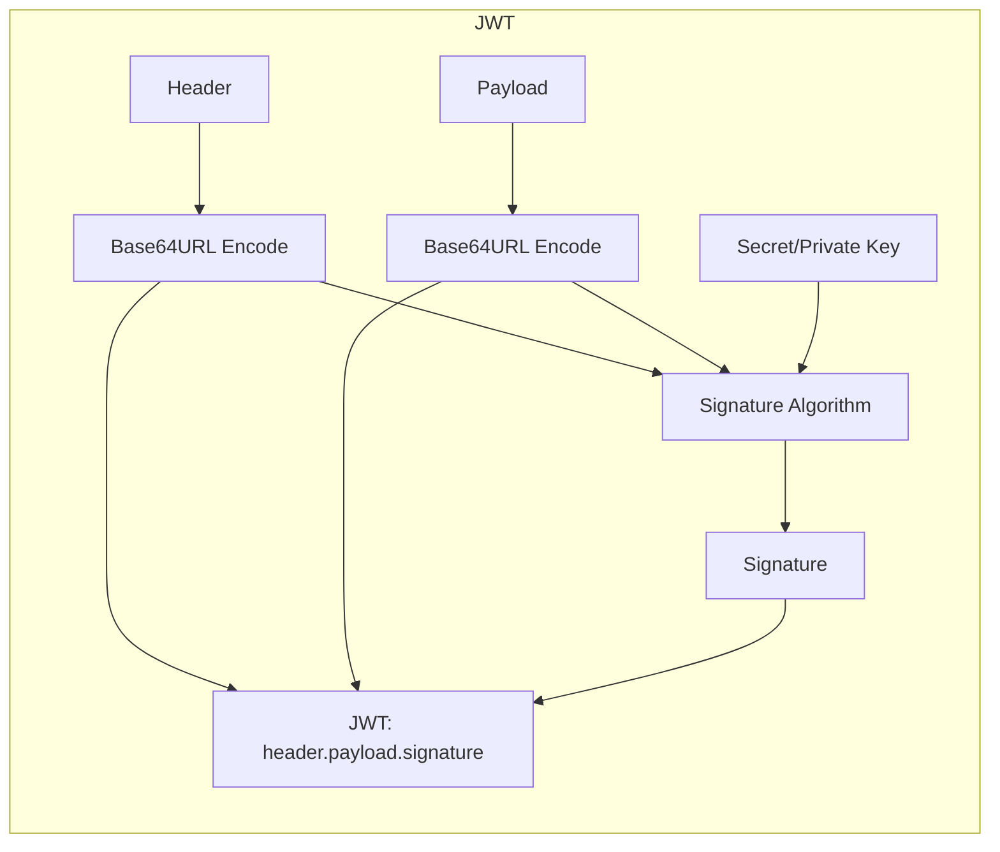
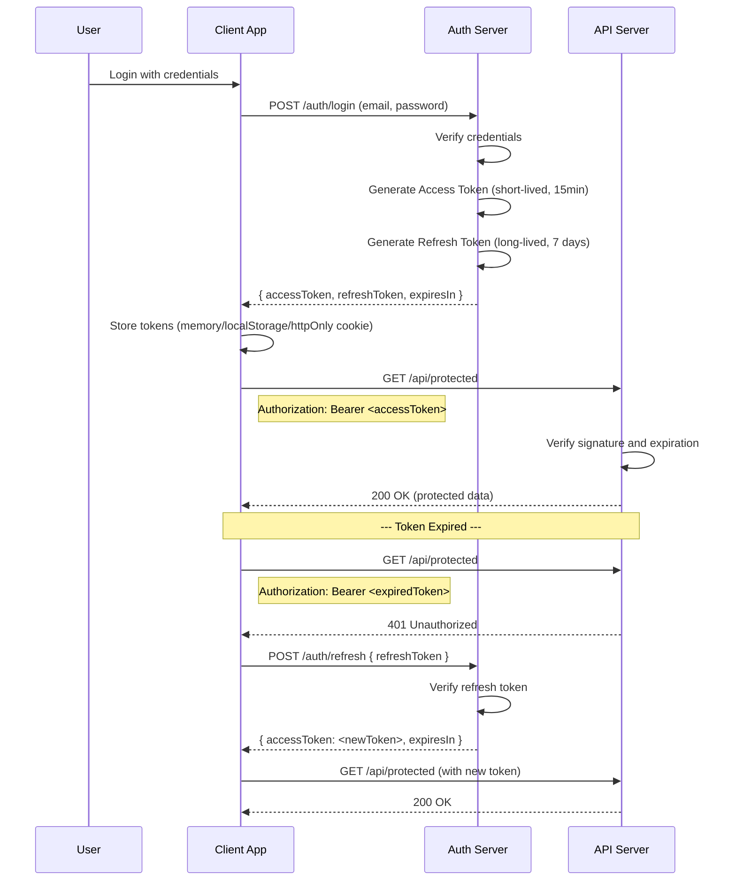

# JWT (JSON Web Tokens)

## What is JWT?

JWT is a compact, URL-safe token format for representing claims between two parties. It's commonly used for authentication and information exchange.

## JWT Structure

A JWT consists of three parts separated by dots:

```
header.payload.signature
```

```
eyJhbGciOiJIUzI1NiIsInR5cCI6IkpXVCJ9.
eyJzdWIiOiIxMjM0NTY3ODkwIiwibmFtZSI6IkFsaWNlIiwiaWF0IjoxNTE2MjM5MDIyfQ.
SflKxwRJSMeKKF2QT4fwpMeJf36POk6yJV_adQssw5c
```



### Header

```json
{
  "alg": "HS256",
  "typ": "JWT"
}
```

| Field | Description | Common Values |
|-------|-------------|---------------|
| `alg` | Signing algorithm | `HS256`, `RS256`, `ES256` |
| `typ` | Token type | `JWT` |
| `kid` | Key ID (for key rotation) | Key identifier string |

### Payload (Claims)

```json
{
  "sub": "1234567890",
  "name": "Alice",
  "iat": 1516239022,
  "exp": 1516242622,
  "iss": "https://auth.example.com",
  "aud": "https://api.example.com",
  "role": "admin"
}
```

### Standard Claims (Registered Claim Names)

| Claim | Full Name | Description |
|-------|-----------|-------------|
| `sub` | Subject | Who the token is about (usually user ID) |
| `iss` | Issuer | Who issued the token |
| `aud` | Audience | Who should accept the token |
| `exp` | Expiration | Token expiration time (seconds since epoch) |
| `nbf` | Not Before | Token not valid before this time |
| `iat` | Issued At | When the token was issued |
| `jti` | JWT ID | Unique identifier for this token |

### Signature

```
HMACSHA256(
  base64UrlEncode(header) + "." + base64UrlEncode(payload),
  secret
)
```

## Encoding vs Encryption

```
┌─────────────────────────────────────────────────────┐
│ JWT is SIGNED, not encrypted                        │
│                                                     │
│ Encoding: Base64URL converts binary to text          │
│  └─ Anyone can decode and read the payload           │
│                                                     │
│ Signing: Cryptographic signature verifies integrity  │
│  └─ Anyone can read, only signer can create          │
│                                                     │
│ Encryption: JWE (JSON Web Encryption)                │
│  └─ Encrypted payload, only intended receiver reads  │
└─────────────────────────────────────────────────────┘
```

```javascript
// Decoding a JWT (everyone can do this)
function decodeJWT(token) {
  const parts = token.split('.');
  if (parts.length !== 3) throw new Error('Invalid JWT');
  
  const header = JSON.parse(atob(parts[0]));
  const payload = JSON.parse(atob(parts[1]));
  
  return { header, payload, signature: parts[2] };
}

const token = 'eyJhbGciOiJIUzI1NiIsInR5cCI6IkpXVCJ9...';
const decoded = decodeJWT(token);
console.log(decoded.payload); // Anyone can read this!
```

## Stateless Auth Flow



## Token Storage: localStorage vs httpOnly Cookie

| Aspect | localStorage | httpOnly Cookie |
|--------|-------------|-----------------|
| XSS vulnerability | Readable by JS → stolen | Protected from JS |
| CSRF vulnerability | Not vulnerable | Vulnerable (use SameSite) |
| API requests | Sent manually via header | Sent automatically |
| Storage size | 5-10MB | ~4KB |
| Subdomain sharing | Not possible | Possible (Domain attribute) |
| Cleanup | Manual | Automatic (expiration) |

### Implementation Comparison

```javascript
// ========== localStorage approach ==========

// Login
async function login(email, password) {
  const response = await fetch('/api/auth/login', {
    method: 'POST',
    headers: { 'Content-Type': 'application/json' },
    body: JSON.stringify({ email, password })
  });
  
  const { accessToken, refreshToken } = await response.json();
  
  // Store in localStorage
  localStorage.setItem('accessToken', accessToken);
  localStorage.setItem('refreshToken', refreshToken);
  
  // Set default auth header
  setDefaultAuthHeader(accessToken);
}

// Every request needs manual header
function setDefaultAuthHeader(token) {
  // Using axios
  axios.defaults.headers.common['Authorization'] = `Bearer ${token}`;
}

// ========== httpOnly Cookie approach ==========

// Login (server sets httpOnly cookie)
async function login(email, password) {
  await fetch('/api/auth/login', {
    method: 'POST',
    headers: { 'Content-Type': 'application/json' },
    body: JSON.stringify({ email, password }),
    credentials: 'include' // Important: send/receive cookies
  });
  // Token is automatically managed by browser
}

// Requests automatically include cookie
async function fetchProtected() {
  const response = await fetch('/api/protected', {
    credentials: 'include' // Send cookies
  });
  return response.json();
}
```

## Full JWT Auth Implementation

```javascript
// ========== Server-side (Node.js) ==========
const jwt = require('jsonwebtoken');
const express = require('express');
const app = express();

const ACCESS_SECRET = process.env.JWT_ACCESS_SECRET;
const REFRESH_SECRET = process.env.JWT_REFRESH_SECRET;

// Login endpoint
app.post('/api/auth/login', async (req, res) => {
  const { email, password } = req.body;
  const user = await authenticateUser(email, password);
  
  if (!user) {
    return res.status(401).json({ message: 'Invalid credentials' });
  }

  const accessToken = jwt.sign(
    { sub: user.id, role: user.role },
    ACCESS_SECRET,
    { expiresIn: '15m' }
  );

  const refreshToken = jwt.sign(
    { sub: user.id, type: 'refresh' },
    REFRESH_SECRET,
    { expiresIn: '7d' }
  );

  // Option 1: Return tokens to client
  res.json({
    accessToken,
    refreshToken,
    expiresIn: 900 // 15 minutes in seconds
  });

  // Option 2: Set httpOnly cookie
  // res.cookie('refreshToken', refreshToken, {
  //   httpOnly: true,
  //   secure: true,
  //   sameSite: 'strict',
  //   maxAge: 7 * 24 * 60 * 60 * 1000,
  //   path: '/api/auth'
  // });
});

// Middleware: verify access token
function authenticateToken(req, res, next) {
  const authHeader = req.headers['authorization'];
  const token = authHeader && authHeader.split(' ')[1]; // Bearer TOKEN

  if (!token) {
    return res.status(401).json({ message: 'Token required' });
  }

  try {
    const decoded = jwt.verify(token, ACCESS_SECRET);
    req.user = decoded;
    next();
  } catch (err) {
    if (err.name === 'TokenExpiredError') {
      return res.status(401).json({ message: 'Token expired', code: 'TOKEN_EXPIRED' });
    }
    return res.status(403).json({ message: 'Invalid token' });
  }
}

// Refresh endpoint
app.post('/api/auth/refresh', async (req, res) => {
  const { refreshToken } = req.body;
  // Or read from cookie: req.cookies.refreshToken

  if (!refreshToken) {
    return res.status(401).json({ message: 'Refresh token required' });
  }

  try {
    const decoded = jwt.verify(refreshToken, REFRESH_SECRET);
    
    if (decoded.type !== 'refresh') {
      return res.status(403).json({ message: 'Invalid refresh token' });
    }

    // Issue new access token
    const newAccessToken = jwt.sign(
      { sub: decoded.sub },
      ACCESS_SECRET,
      { expiresIn: '15m' }
    );

    // Optional: rotate refresh token
    const newRefreshToken = jwt.sign(
      { sub: decoded.sub, type: 'refresh' },
      REFRESH_SECRET,
      { expiresIn: '7d' }
    );

    res.json({
      accessToken: newAccessToken,
      refreshToken: newRefreshToken,
      expiresIn: 900
    });
  } catch (err) {
    return res.status(403).json({ message: 'Invalid refresh token' });
  }
});

// Protected route
app.get('/api/protected', authenticateToken, (req, res) => {
  res.json({ message: 'Protected data', user: req.user });
});
```

```javascript
// ========== Client-side (React) ==========
import { useState, useEffect, createContext, useContext } from 'react';

const AuthContext = createContext(null);

function AuthProvider({ children }) {
  const [user, setUser] = useState(null);
  const [loading, setLoading] = useState(true);

  useEffect(() => {
    const token = localStorage.getItem('accessToken');
    if (token) {
      const decoded = parseJWT(token);
      if (decoded.exp * 1000 > Date.now()) {
        setUser(decoded);
      } else {
        refreshAccessToken();
      }
    }
    setLoading(false);
  }, []);

  async function login(email, password) {
    const response = await fetch('/api/auth/login', {
      method: 'POST',
      headers: { 'Content-Type': 'application/json' },
      body: JSON.stringify({ email, password })
    });

    if (!response.ok) throw new Error('Login failed');

    const { accessToken, refreshToken } = await response.json();
    localStorage.setItem('accessToken', accessToken);
    localStorage.setItem('refreshToken', refreshToken);
    setUser(parseJWT(accessToken));
  }

  async function refreshAccessToken() {
    const refreshToken = localStorage.getItem('refreshToken');
    if (!refreshToken) {
      logout();
      return;
    }

    try {
      const response = await fetch('/api/auth/refresh', {
        method: 'POST',
        headers: { 'Content-Type': 'application/json' },
        body: JSON.stringify({ refreshToken })
      });

      if (!response.ok) throw new Error('Refresh failed');

      const { accessToken, refreshToken: newRefresh } = await response.json();
      localStorage.setItem('accessToken', accessToken);
      if (newRefresh) localStorage.setItem('refreshToken', newRefresh);
      setUser(parseJWT(accessToken));
    } catch {
      logout();
    }
  }

  function logout() {
    localStorage.removeItem('accessToken');
    localStorage.removeItem('refreshToken');
    setUser(null);
  }

  return (
    <AuthContext.Provider value={{ user, loading, login, logout }}>
      {children}
    </AuthContext.Provider>
  );
}

function parseJWT(token) {
  try {
    return JSON.parse(atob(token.split('.')[1]));
  } catch {
    return null;
  }
}

// Axios interceptor for auto-refresh
import axios from 'axios';

axios.interceptors.response.use(
  response => response,
  async error => {
    const originalRequest = error.config;

    if (error.response?.status === 401 && !originalRequest._retry) {
      originalRequest._retry = true;

      try {
        const refreshToken = localStorage.getItem('refreshToken');
        const response = await axios.post('/api/auth/refresh', { refreshToken });
        
        const { accessToken } = response.data;
        localStorage.setItem('accessToken', accessToken);
        
        originalRequest.headers['Authorization'] = `Bearer ${accessToken}`;
        return axios(originalRequest);
      } catch {
        // Redirect to login
        window.location.href = '/login';
        return Promise.reject(error);
      }
    }

    return Promise.reject(error);
  }
);

// Set default auth header
axios.defaults.headers.common['Authorization'] = 
  `Bearer ${localStorage.getItem('accessToken')}`;
```

## Security Concerns

```javascript
// 1. Token theft
// In localStorage: stolen via XSS
// In httpOnly cookie: protected from XSS, vulnerable to CSRF (mitigated by SameSite)

// 2. No server-side invalidation (stateless)
// Solution: token blacklist or short expiry
const blacklistedTokens = new Set();

app.post('/api/auth/logout', (req, res) => {
  const token = req.headers.authorization?.split(' ')[1];
  if (token) {
    blacklistedTokens.add(token);
  }
  res.json({ message: 'Logged out' });
});

// 3. JWT must be sent over HTTPS only
// 4. Keep access tokens short-lived (15 minutes)
// 5. Rotate refresh tokens on each use
// 6. Use asymmetric signing (RS256) for microservices

// Server-side token validation with blacklist
function authenticateToken(req, res, next) {
  const token = req.headers.authorization?.split(' ')[1];
  
  if (!token) return res.status(401).json({ message: 'Token required' });
  if (blacklistedTokens.has(token)) return res.status(401).json({ message: 'Token revoked' });

  try {
    const decoded = jwt.verify(token, ACCESS_SECRET);
    req.user = decoded;
    next();
  } catch {
    return res.status(403).json({ message: 'Invalid token' });
  }
}
```

## Key Takeaways

- JWT is a signed token format — anyone can read the payload
- Use short-lived access tokens (15 min) + long-lived refresh tokens (7 days)
- Store access tokens in memory or httpOnly cookie (not localStorage)
- Refresh tokens should be rotated and stored in httpOnly cookies
- JWTs are stateless — you cannot revoke them without a blacklist
- Always validate `exp`, `iss`, and `aud` claims
- Always use HTTPS — tokens are bearer credentials
