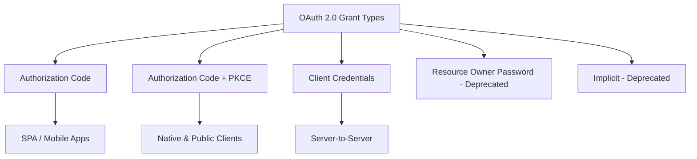
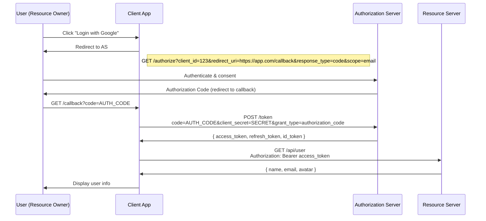
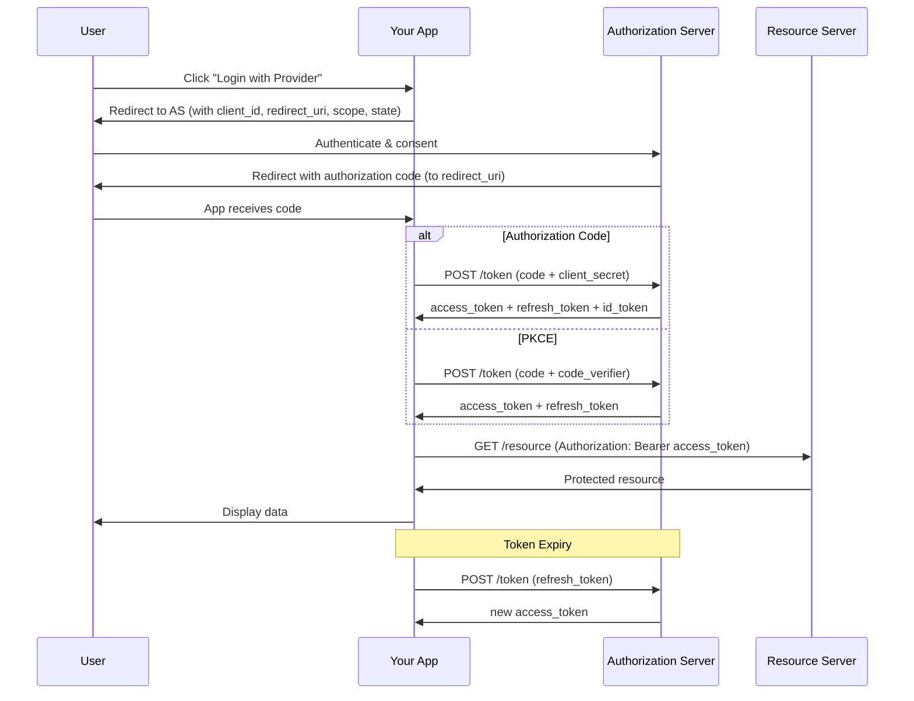

# OAuth 2.0

## What is OAuth 2.0?

OAuth 2.0 is an authorization framework that enables applications to obtain limited access to user accounts on an HTTP service. It's the industry standard for delegated authorization.

## OAuth 2.0 Roles

```mermaid
graph LR
    U[Resource Owner<br/>(User)]
    C[Client Application<br/>(Your App)]
    AS[Authorization Server]
    RS[Resource Server<br/>(API)]
    
    U -->|"1. Authorize"| C
    C -->|"2. Request Authorization"| AS
    AS -->|"3. Grant Token"| C
    C -->|"4. Access Resource"| RS
```

| Role | Description | Example |
|------|-------------|---------|
| **Resource Owner** | Entity that can grant access to protected resources | End user |
| **Client** | Application requesting access on behalf of resource owner | Your web app |
| **Authorization Server** | Issues tokens after authenticating the resource owner | Google, GitHub Auth |
| **Resource Server** | Hosts the protected resources; validates tokens | Google APIs, GitHub API |

## Grant Types



### 1. Authorization Code Grant (Web Apps)



```javascript
// Backend: Exchange authorization code for tokens
app.get('/callback', async (req, res) => {
  const { code } = req.query;

  // Exchange code for tokens
  const tokenResponse = await fetch('https://oauth.example.com/token', {
    method: 'POST',
    headers: { 'Content-Type': 'application/x-www-form-urlencoded' },
    body: new URLSearchParams({
      grant_type: 'authorization_code',
      code,
      client_id: process.env.CLIENT_ID,
      client_secret: process.env.CLIENT_SECRET,
      redirect_uri: 'https://app.com/callback'
    })
  });

  const { access_token, refresh_token } = await tokenResponse.json();

  // Use access token to get user info
  const userResponse = await fetch('https://api.example.com/user', {
    headers: { 'Authorization': `Bearer ${access_token}` }
  });

  const user = await userResponse.json();

  // Create session in your app
  req.session.user = user;
  req.session.accessToken = access_token;
  req.session.refreshToken = refresh_token;

  res.redirect('/dashboard');
});
```

### 2. Authorization Code + PKCE (SPA / Mobile)

PKCE (Proof Key for Code Exchange) prevents authorization code interception attacks for public clients (no client secret).

```javascript
// Client-side PKCE flow
class OAuthPKCE {
  constructor(config) {
    this.clientId = config.clientId;
    this.redirectUri = config.redirectUri;
    this.authorizationUrl = config.authorizationUrl;
    this.tokenUrl = config.tokenUrl;
    this.scope = config.scope || 'openid email profile';
  }

  generateCodeVerifier() {
    const array = new Uint8Array(32);
    crypto.getRandomValues(array);
    return base64URLEncode(array);
  }

  async generateCodeChallenge(verifier) {
    const encoder = new TextEncoder();
    const data = encoder.encode(verifier);
    const digest = await crypto.subtle.digest('SHA-256', data);
    return base64URLEncode(new Uint8Array(digest));
  }

  async initiateLogin() {
    const codeVerifier = this.generateCodeVerifier();
    const codeChallenge = await this.generateCodeChallenge(codeVerifier);

    // Store verifier temporarily
    sessionStorage.setItem('code_verifier', codeVerifier);

    const params = new URLSearchParams({
      response_type: 'code',
      client_id: this.clientId,
      redirect_uri: this.redirectUri,
      code_challenge: codeChallenge,
      code_challenge_method: 'S256',
      scope: this.scope,
      state: this.generateState()
    });

    sessionStorage.setItem('oauth_state', params.get('state'));
    window.location.href = `${this.authorizationUrl}?${params}`;
  }

  async handleCallback() {
    const urlParams = new URLSearchParams(window.location.search);
    const code = urlParams.get('code');
    const state = urlParams.get('state');
    const storedState = sessionStorage.getItem('oauth_state');

    if (state !== storedState) {
      throw new Error('State mismatch - CSRF attack detected');
    }

    const codeVerifier = sessionStorage.getItem('code_verifier');

    // Exchange code for tokens
    const response = await fetch(this.tokenUrl, {
      method: 'POST',
      headers: { 'Content-Type': 'application/x-www-form-urlencoded' },
      body: new URLSearchParams({
        grant_type: 'authorization_code',
        code,
        redirect_uri: this.redirectUri,
        client_id: this.clientId,
        code_verifier: codeVerifier
      })
    });

    const tokens = await response.json();

    // Clean up
    sessionStorage.removeItem('code_verifier');
    sessionStorage.removeItem('oauth_state');

    return tokens;
  }

  generateState() {
    const array = new Uint8Array(16);
    crypto.getRandomValues(array);
    return Array.from(array, b => b.toString(16).padStart(2, '0')).join('');
  }
}

// Usage
const oauth = new OAuthPKCE({
  clientId: 'my-client-id',
  redirectUri: 'https://app.com/oauth/callback',
  authorizationUrl: 'https://accounts.example.com/authorize',
  tokenUrl: 'https://accounts.example.com/token'
});

// Start login
document.getElementById('login-btn').onclick = () => oauth.initiateLogin();

// Handle callback
if (window.location.search.includes('code=')) {
  oauth.handleCallback()
    .then(tokens => {
      localStorage.setItem('accessToken', tokens.access_token);
      window.location.href = '/dashboard';
    })
    .catch(err => console.error('OAuth failed:', err));
}

function base64URLEncode(buffer) {
  return btoa(String.fromCharCode(...new Uint8Array(buffer)))
    .replace(/\+/g, '-')
    .replace(/\//g, '_')
    .replace(/=+$/, '');
}
```

### 3. Client Credentials Grant (Server-to-Server)

```javascript
// Backend service-to-service authentication
class ServiceClient {
  constructor(clientId, clientSecret, tokenUrl) {
    this.clientId = clientId;
    this.clientSecret = clientSecret;
    this.tokenUrl = tokenUrl;
    this.accessToken = null;
    this.expiresAt = 0;
  }

  async getAccessToken() {
    // Return cached token if still valid
    if (this.accessToken && Date.now() < this.expiresAt) {
      return this.accessToken;
    }

    const response = await fetch(this.tokenUrl, {
      method: 'POST',
      headers: { 'Content-Type': 'application/x-www-form-urlencoded' },
      body: new URLSearchParams({
        grant_type: 'client_credentials',
        client_id: this.clientId,
        client_secret: this.clientSecret,
        scope: 'read write'
      })
    });

    const data = await response.json();
    this.accessToken = data.access_token;
    this.expiresAt = Date.now() + (data.expires_in * 1000) - 60000; // 1 min buffer

    return this.accessToken;
  }

  async request(url, options = {}) {
    const token = await this.getAccessToken();
    const response = await fetch(url, {
      ...options,
      headers: {
        ...options.headers,
        'Authorization': `Bearer ${token}`
      }
    });
    return response.json();
  }
}

// Usage
const api = new ServiceClient(
  process.env.SERVICE_CLIENT_ID,
  process.env.SERVICE_CLIENT_SECRET,
  'https://auth.example.com/oauth/token'
);

const data = await api.request('https://api.example.com/users');
```

## OAuth vs JWT

| Aspect | OAuth 2.0 | JWT |
|--------|-----------|-----|
| Purpose | Authorization framework | Token format |
| Scope | Defines roles, flows, grants | Encodes claims in a signed token |
| Tokens | Can use any token format | A specific token format |
| Use case | Delegated access (3rd-party) | Stateless auth between services |
| Standard | RFC 6749 | RFC 7519 |
| Relationship | OAuth can use JWT as token format | JWT can be used in OAuth flows |

**They complement each other:** OAuth 2.0 defines the *flow* to obtain tokens; JWT is a common *format* for those tokens.

## Social Login Example

```javascript
// Complete Google OAuth login
class GoogleAuth {
  constructor(clientId) {
    this.clientId = clientId;
  }

  async init() {
    // Load Google Identity Services library
    await this.loadGISLibrary();

    this.client = google.accounts.oauth2.initCodeClient({
      client_id: this.clientId,
      scope: 'openid email profile',
      ux_mode: 'popup',
      callback: async (response) => {
        if (response.code) {
          await this.handleAuthCode(response.code);
        }
      }
    });
  }

  login() {
    this.client.requestCode();
  }

  async handleAuthCode(code) {
    // Send code to your backend
    const result = await fetch('/api/auth/google', {
      method: 'POST',
      headers: { 'Content-Type': 'application/json' },
      body: JSON.stringify({ code })
    });

    const { user, token } = await result.json();
    
    // Store token and redirect
    localStorage.setItem('accessToken', token);
    window.location.href = '/dashboard';
  }

  loadGISLibrary() {
    return new Promise((resolve) => {
      const script = document.createElement('script');
      script.src = 'https://accounts.google.com/gsi/client';
      script.onload = resolve;
      document.head.appendChild(script);
    });
  }
}
```

```javascript
// Backend: Handle Google OAuth callback
app.post('/api/auth/google', async (req, res) => {
  const { code } = req.body;

  // Exchange code for tokens
  const tokenResponse = await fetch('https://oauth2.googleapis.com/token', {
    method: 'POST',
    headers: { 'Content-Type': 'application/x-www-form-urlencoded' },
    body: new URLSearchParams({
      code,
      client_id: process.env.GOOGLE_CLIENT_ID,
      client_secret: process.env.GOOGLE_CLIENT_SECRET,
      redirect_uri: 'postmessage', // Special for GIS popup
      grant_type: 'authorization_code'
    })
  });

  const { id_token, access_token } = await tokenResponse.json();

  // Verify id_token and extract user info
  const ticket = await verifyGoogleToken(id_token);
  const payload = ticket.getPayload();

  // Find or create user in your database
  let user = await User.findByGoogleId(payload.sub);
  if (!user) {
    user = await User.create({
      googleId: payload.sub,
      email: payload.email,
      name: payload.name,
      avatar: payload.picture
    });
  }

  // Issue your own JWT
  const token = jwt.sign(
    { sub: user.id, email: user.email },
    process.env.JWT_SECRET,
    { expiresIn: '24h' }
  );

  res.json({ user: { id: user.id, name: user.name, email: user.email }, token });
});
```

## OAuth Flow Diagram



## Security Considerations

```javascript
// 1. Always validate redirect_uri
function validateRedirectUri(uri) {
  const allowed = [
    'https://app.com/oauth/callback',
    'https://app.com/auth/callback'
  ];
  return allowed.includes(uri);
}

// 2. Use state parameter for CSRF protection
const state = crypto.randomUUID();
sessionStorage.setItem('oauth_state', state);
redirectToProvider(state);

// 3. PKCE for any public client (SPA, mobile)
// 4. Keep client_secret only on backend
// 5. Validate token expiry and audience
// 6. Use HTTPS everywhere
// 7. Scope down permissions to minimum required
```

## Key Takeaways

- OAuth 2.0 is an authorization framework, not an authentication protocol (though often used for both)
- Four roles: Resource Owner, Client, Authorization Server, Resource Server
- Authorization Code + PKCE is the recommended flow for SPAs and mobile apps
- Client Credentials is for server-to-server communication
- Never expose client_secret in client-side code
- Always validate `state` parameter to prevent CSRF
- OAuth and JWT complement each other — OAuth defines the flow, JWT can be the token format
