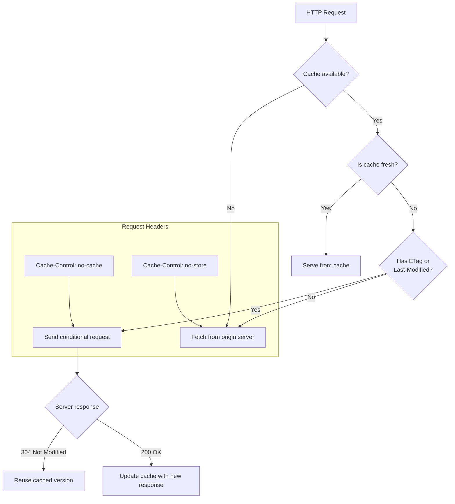
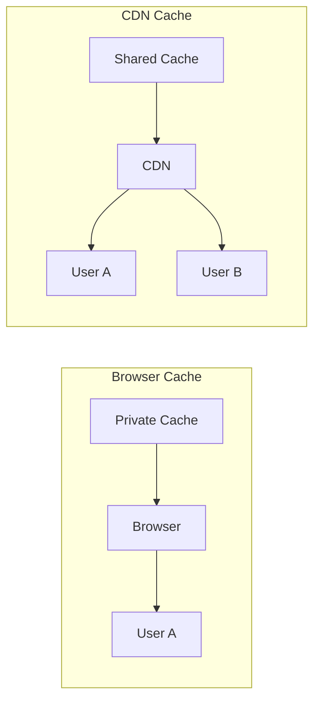
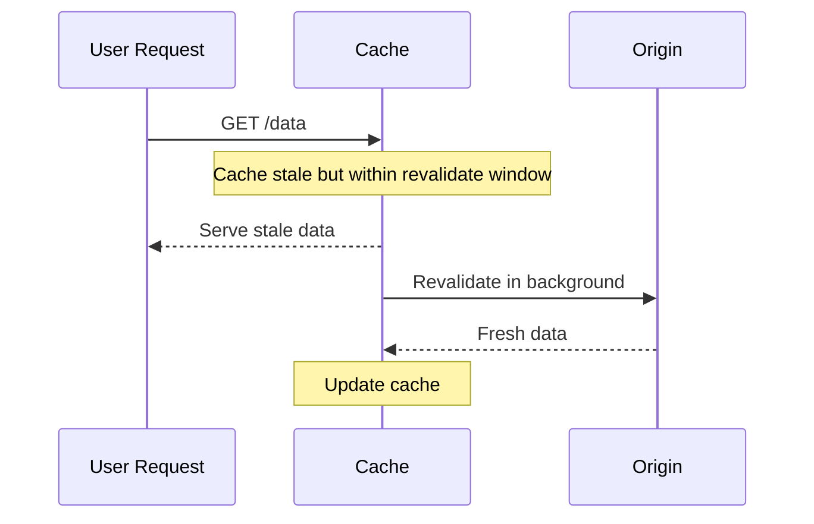

# Caching

## What is Caching?

Caching stores copies of resources to serve future requests faster, reducing server load and improving user experience.

## Cache Decision Tree



## Cache-Control Directives

| Directive | Meaning | Example |
|-----------|---------|---------|
| `max-age=<s>` | Max time cache is fresh | `max-age=3600` |
| `s-maxage=<s>` | Same as max-age for shared caches | `s-maxage=3600` |
| `no-cache` | Must revalidate before use | `no-cache` |
| `no-store` | Don't cache at all | `no-store` |
| `public` | Cacheable by any cache | `public, max-age=3600` |
| `private` | Only browser cache | `private, max-age=3600` |
| `must-revalidate` | Must revalidate once stale | `must-revalidate` |
| `stale-while-revalidate` | Serve stale while revalidating | `stale-while-revalidate=60` |
| `stale-if-error` | Serve stale if origin errors | `stale-if-error=3600` |

```javascript
// Common combos
const cacheConfigs = {
  api: 'public, max-age=300, stale-while-revalidate=60',
  private: 'private, max-age=3600',
  never: 'no-store',
  static: 'public, max-age=31536000, immutable',
  html: 'public, max-age=0, must-revalidate'
};
```

## ETag & Last-Modified

```javascript
// Server: ETag generation
const crypto = require('crypto');

app.get('/api/users', (req, res) => {
  const data = getUsers();
  const etag = crypto.createHash('md5').update(JSON.stringify(data)).digest('hex');

  if (req.headers['if-none-match'] === etag) {
    return res.status(304).end();
  }

  res.set('ETag', etag);
  res.json(data);
});

// Client: Conditional request with ETag
async function fetchWithCache(url) {
  const cached = sessionStorage.getItem(url);
  const cachedEtag = sessionStorage.getItem(`${url}:etag`);

  const headers = {};
  if (cachedEtag) headers['If-None-Match'] = cachedEtag;

  const response = await fetch(url, { headers });

  if (response.status === 304) return JSON.parse(cached);

  const data = await response.json();
  const etag = response.headers.get('ETag');
  if (etag) {
    sessionStorage.setItem(url, JSON.stringify(data));
    sessionStorage.setItem(`${url}:etag`, etag);
  }
  return data;
}

// Server: Last-Modified
app.get('/api/data', (req, res) => {
  const lastModified = getLastModifiedTime();
  if (req.headers['if-modified-since']) {
    const clientDate = new Date(req.headers['if-modified-since']);
    if (clientDate >= lastModified) return res.status(304).end();
  }
  res.set('Last-Modified', lastModified.toUTCString());
  res.json(getData());
});
```

## Private vs Public Cache



```javascript
// Private - only browser can cache
res.set('Cache-Control', 'private, max-age=3600');

// Public - any cache (CDN, proxy) can cache
res.set('Cache-Control', 'public, max-age=3600');
```

## stale-while-revalidate



```javascript
// Cache-Control: max-age=60, stale-while-revalidate=3600
// Serves stale for up to 1h after expiry while revalidating in background

async function fetchWithStale(url) {
  const cache = await caches.open('api-cache');
  const cached = await cache.match(url);

  if (cached) {
    const age = Date.now() - new Date(cached.headers.get('date')).getTime();
    if (age < 60000) return cached;
    if (age < 3660000) {
      revalidateInBackground(url, cache);
      return cached;
    }
  }
  return freshFetch(url, cache);
}
```

## Cache Busting Strategies

### 1. Content Hashing (Best)

```javascript
// Build produces: style.a1b2c3.css, app.d4e5f6.js
// Cache-Control: public, max-age=31536000, immutable
// New content → new hash → new URL → cache miss
```

### 2. Versioned URLs

```javascript
// /v1/api/users
// /api/users?v=20250115
// /assets/v1.0.0/app.js
```

### 3. Service Worker Cache Busting

```javascript
self.addEventListener('activate', (event) => {
  event.waitUntil(
    caches.keys().then(names => Promise.all(
      names.filter(n => n !== CACHE_VERSION).map(n => caches.delete(n))
    ))
  );
});
```

## Client-side Cache Implementation

```javascript
class ApiCache {
  constructor(ttl = 300000) {
    this.ttl = ttl;
    this.cache = new Map();
  }

  async get(key, fetcher) {
    const entry = this.cache.get(key);
    if (entry && Date.now() < entry.expires) {
      return entry.data;
    }
    const data = await fetcher();
    this.cache.set(key, { data, expires: Date.now() + this.ttl });
    return data;
  }

  invalidate(key) {
    this.cache.delete(key);
  }

  clear() {
    this.cache.clear();
  }
}

// Usage
const userCache = new ApiCache(60000);

async function getUser(id) {
  return userCache.get(`user:${id}`, () =>
    fetch(`/api/users/${id}`).then(r => r.json())
  );
}
```

## HTTP Caching Tips

```javascript
// 1. Cache static assets aggressively
// Cache-Control: public, max-age=31536000, immutable

// 2. Use ETag for dynamic content validation
// 3. Set stale-while-revalidate for resilience
// 4. Version all cacheable URLs
// 5. Use CDN for public content
// 6. Never cache sensitive/authenticated data
// 7. Monitor cache hit rates
```

## Key Takeaways

- Cache-Control directives control if and how responses are cached
- ETag and Last-Modified enable efficient conditional revalidation
- Use stale-while-revalidate for instant responses with background freshness
- Content hashing is the most reliable cache-busting strategy
- Private caches store user-specific data; public caches store shared resources
- CDNs sit between users and origin, caching public responses globally
