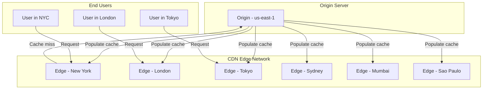
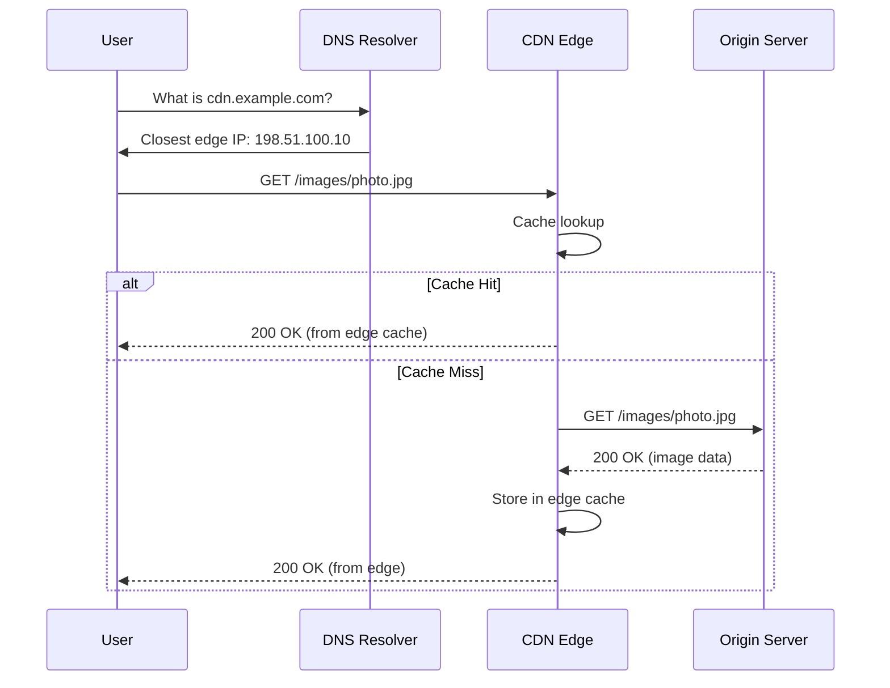

# CDN (Content Delivery Network)

## What is a CDN?

A CDN is a geographically distributed network of proxy servers and their data centers. The goal is to provide high availability and performance by distributing the service spatially relative to end users.

## How CDNs Work



### Request Flow



## CDN Benefits

| Benefit | Description | Impact |
|---------|-------------|--------|
| Reduced Latency | Content served from nearby edge | 50-80% faster page loads |
| High Availability | Multiple edge nodes, automatic failover | 99.99%+ uptime |
| Scalability | Absorb traffic spikes, handle DDoS | Handle 10-100x normal traffic |
| Bandwidth Savings | Cache reduces origin load | 60-95% bandwidth reduction |
| Security | DDoS protection, WAF, bot management | Built-in edge security |
| Global Reach | Serve content from 100+ locations | Consistent global performance |

## Popular CDNs

```javascript
const cdns = {
  cloudflare: {
    name: 'Cloudflare',
    network: '330+ cities, 120+ countries',
    features: ['DDoS protection', 'WAF', 'Workers', 'SSL/TLS'],
    pricing: 'Free tier available'
  },
  akamai: {
    name: 'Akamai',
    network: '4100+ locations, 135+ countries',
    features: ['Enterprise grade', 'Edge Compute', 'API acceleration'],
    pricing: 'Custom enterprise pricing'
  },
  fastly: {
    name: 'Fastly',
    network: '150+ POPs',
    features: ['VCL configuration', 'Edge Compute', 'Instant Purge'],
    pricing: 'Usage-based, starts at $50/mo'
  },
  aws_cloudfront: {
    name: 'Amazon CloudFront',
    network: '600+ POPs',
    features: ['AWS integration', 'Lambda@Edge', 'Origin Shield'],
    pricing: 'Pay-as-you-go'
  }
};
```

## CDN Caching

### Cache Headers for CDNs

```javascript
// Recommended CDN caching strategy

// Static assets - cache for 1 year
app.use('/static/*', (req, res, next) => {
  res.set('Cache-Control', 'public, max-age=31536000, immutable');
  next();
});

// API responses - short cache with revalidation
app.get('/api/posts', (req, res) => {
  res.set('Cache-Control', 'public, max-age=60, stale-while-revalidate=600');
  res.set('CDN-Cache-Control', 'public, max-age=300'); // CDN-specific longer cache
  res.json(posts);
});

// Bypass CDN cache for authenticated users
app.get('/api/profile', (req, res) => {
  if (req.user) {
    res.set('Cache-Control', 'private, no-store');
  }
  res.json(profile);
});

// Surrogate-Control for CDN-specific caching
app.get('/api/data', (req, res) => {
  res.set('Cache-Control', 'max-age=0');  // Browser: don't cache
  res.set('Surrogate-Control', 'max-age=3600'); // CDN: cache 1 hour
  res.json(data);
});
```

### CDN Purge (Invalidation)

```javascript
// Cloudflare API purge
async function purgeCloudflareCache(urls) {
  const response = await fetch(
    `https://api.cloudflare.com/client/v4/zones/${ZONE_ID}/purge_cache`,
    {
      method: 'POST',
      headers: {
        'Authorization': `Bearer ${CLOUDFLARE_TOKEN}`,
        'Content-Type': 'application/json'
      },
      body: JSON.stringify({ files: urls })
    }
  );
  return response.json();
}

// Purge single URL
await purgeCloudflareCache(['https://example.com/index.html']);

// Purge everything
await purgeCloudflareCache({ purge_everything: true });

// AWS CloudFront invalidation
async function invalidateCloudFront(distributionId, paths) {
  const response = await fetch(
    `https://cloudfront.amazonaws.com/2020-05-31/distribution/${distributionId}/invalidation`,
    {
      method: 'POST',
      headers: {
        'Authorization': `AWS ${signRequest()}`,
        'Content-Type': 'application/xml'
      },
      body: `<InvalidationBatch>
        <Paths><Quantity>${paths.length}</Quantity><Items>
          ${paths.map(p => `<Path>${p}</Path>`).join('')}
        </Items></Paths>
        <CallerReference>${Date.now()}</CallerReference>
      </InvalidationBatch>`
    }
  );
  return response.json();
}
```

## Dynamic vs Static Content

| Aspect | Static Content | Dynamic Content |
|--------|---------------|-----------------|
| Examples | Images, CSS, JS, fonts | API responses, HTML pages |
| Cache duration | Long (year+) | Short (seconds-minutes) |
| CDN strategy | Cache at edge aggressively | Cache with revalidation |
| Invalidation | Rarely needed | Frequent via purge |
| Performance | Fastest possible | Optimize with stale-while-revalidate |

```javascript
// CDN configuration example (Cloudflare Workers)
async function handleRequest(request) {
  const url = new URL(request.url);
  const cache = caches.default;

  // Try cache first
  let response = await cache.match(request);
  if (response) return response;

  response = await fetch(request);

  // Cache based on content type
  if (request.method === 'GET') {
    if (url.pathname.match(/\.(jpg|png|css|js|woff2?)$/)) {
      // Static assets: cache 1 year
      response = new Response(response.body, response);
      response.headers.set('Cache-Control', 'public, max-age=31536000, immutable');
    } else if (url.pathname.startsWith('/api/')) {
      // API: cache 1 minute
      response = new Response(response.body, response);
      response.headers.set('Cache-Control', 'public, max-age=60');
    }
    
    // Store in CDN cache
    request.headers.set('Cache-Control', response.headers.get('Cache-Control'));
    request.method = 'GET';
    await cache.put(request, response.clone());
  }

  return response;
}

addEventListener('fetch', event => {
  event.respondWith(handleRequest(event.request));
});
```

## CDN Security Features

```javascript
// DDoS Protection (provided by CDN)
// 1. Traffic is distributed across edge network
// 2. Malicious traffic filtered at edge before reaching origin
// 3. Rate limiting per IP

// Web Application Firewall (WAF)
// Blocks: SQL injection, XSS, path traversal, etc.

// Bot Management
// Detects and blocks malicious bots

// Origin IP Protection
// Only CDN IPs can reach origin (firewall)

// SSL/TLS termination at edge
// Client <--HTTPS--> CDN <--HTTPS--> Origin
```

## CDN Configuration Example

```javascript
// Using CDN in frontend
const config = {
  // Use CDN URLs for assets
  cdnUrl: 'https://cdn.example.com',
  
  // Version all assets
  assets: {
    styles: `${cdnUrl}/v1/styles/main.a1b2c3.css`,
    scripts: `${cdnUrl}/v1/scripts/app.d4e5f6.js`,
    images: `${cdnUrl}/v1/images/`
  }
};

// Load optimized image from CDN
function getImageUrl(path, width) {
  // Many CDNs support image optimization via URL parameters
  return `https://cdn.example.com/images/${path}?w=${width}&q=80&format=webp`;
}

// Preconnect to CDN
// <link rel="preconnect" href="https://cdn.example.com">
// <link rel="dns-prefetch" href="https://cdn.example.com">
```

## Key Takeaways

- CDNs cache content at edge servers geographically close to users
- Cache-Control headers control what CDNs cache and for how long
- Static assets benefit most from CDN caching (long TTL, immutable)
- Dynamic content can use stale-while-revalidate for performance
- CDNs provide security benefits: DDoS protection, WAF, bot management
- Purge/invalidation clears CDN cache when content changes
- Popular CDNs: Cloudflare, Akamai, Fastly, AWS CloudFront
