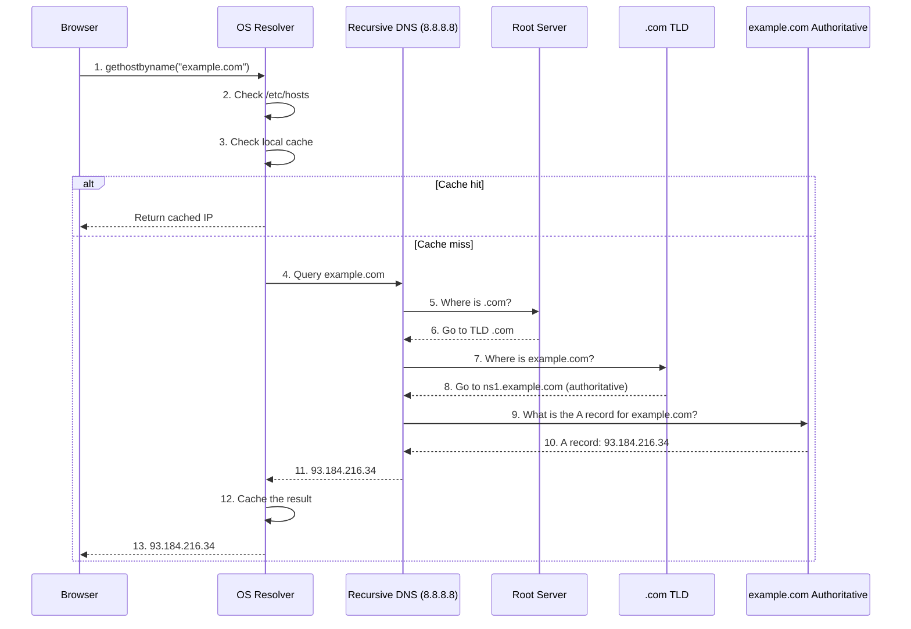
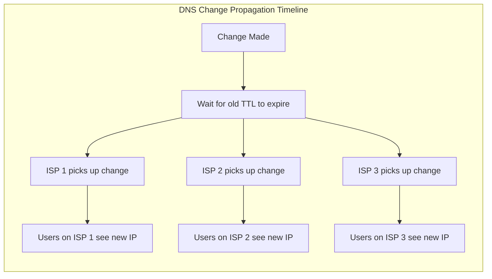

# DNS (Domain Name System)

## What is DNS?

DNS is the phonebook of the internet. It translates human-readable domain names (like `example.com`) into machine-readable IP addresses (like `93.184.216.34`).

## DNS Hierarchy

```mermaid
graph TB
    subgraph "DNS Hierarchy"
        ROOT[Root Servers<br/>. (13 root clusters)]
        ROOT --> TLD[TLD Servers<br/>.com, .org, .net, .io]
        TLD --> AUTH[Authoritative Servers<br/>example.com]
        AUTH --> RECORD[DNS Records<br/>A, AAAA, CNAME, MX, TXT]
    end
    
    subgraph "Example Resolution"
        REQ[client.example.com wants<br/>api.example.com]
        REQ --> RECURSIVE[Recursive Resolver<br/>(ISP / 8.8.8.8)]
        RECURSIVE --> ROOT
        RECURSIVE --> TLD
        RECURSIVE --> AUTH
        AUTH -->|93.184.216.34| RECURSIVE
        RECURSIVE -->|93.184.216.34| REQ
    end
```

## DNS Resolution Process



## DNS Record Types

| Record | Purpose | Example |
|--------|---------|---------|
| **A** | Map domain to IPv4 address | `example.com A 93.184.216.34` |
| **AAAA** | Map domain to IPv6 address | `example.com AAAA 2606:2800:220:1:248:1893:25c8:1946` |
| **CNAME** | Alias one domain to another | `www.example.com CNAME example.com` |
| **MX** | Mail exchange server | `example.com MX 10 mail.example.com` |
| **TXT** | Arbitrary text (verification, SPF) | `example.com TXT "v=spf1 include:_spf.google.com"` |
| **NS** | Name server for domain | `example.com NS ns1.example.com` |
| **SOA** | Start of Authority (zone info) | `example.com SOA ns1.example.com admin.example.com 2025011501` |
| **SRV** | Service location | `_sip._tcp.example.com SRV 10 5 5060 sip.example.com` |
| **PTR** | Reverse DNS (IP to domain) | `34.216.184.93.in-addr.arpa PTR example.com` |

### Common Record Configurations

```javascript
const dnsRecords = {
  // Basic IPv4
  'example.com': {
    type: 'A',
    value: '93.184.216.34',
    ttl: 3600
  },
  
  // IPv4 and IPv6
  'example.com': [
    { type: 'A', value: '93.184.216.34' },
    { type: 'AAAA', value: '2606:2800:220:1:248:1893:25c8:1946' }
  ],
  
  // WWW as alias
  'www.example.com': {
    type: 'CNAME',
    value: 'example.com'
  },
  
  // Email servers
  'example.com': {
    type: 'MX',
    priority: 10,
    value: 'mail.example.com'
  },
  
  // Multiple mail servers with priority
  'example.com': [
    { type: 'MX', priority: 10, value: 'mail1.example.com' },
    { type: 'MX', priority: 20, value: 'mail2.example.com' } // backup
  ]
};
```

## DNS Caching

DNS results are cached at multiple levels with TTL (Time To Live).

```
Browser:     ~Browser DNS cache (varies)
OS:          ~OS DNS cache (varies by OS)
Router:      ~Router DNS cache (optional)
ISP/Local:   ~Recursive resolver cache (TTL-respecting)
Root/TLD:    ~Authoritative responses (not cached by resolver)
```

```javascript
// DNS TTL Examples
const ttlExamples = {
  'cdn.example.com': {
    ttl: 60,      // 1 minute - CDN can change IPs frequently
    reason: 'Fast failover for CDN traffic'
  },
  'example.com': {
    ttl: 3600,     // 1 hour - standard for main domain
    reason: 'Balance between stability and change propagation'
  },
  'static.example.com': {
    ttl: 86400,    // 24 hours - static resources
    reason: 'Infrequently changed, reduce resolver load'
  },
  'api.example.com': {
    ttl: 300,      // 5 minutes - API endpoint
    reason: 'Allow quick fixes/re-routing'
  }
};
```

## DNS Propagation

When you change DNS records, propagation time depends on:

1. **TTL of existing record** - Must expire before new record is fetched
2. **Caching at each resolver** - ISPs may not respect TTL strictly



```javascript
// Before changing DNS, lower the TTL
// Step 1: Change TTL to 300 (5 minutes)
// Step 2: Wait 24 hours for old TTL to expire everywhere
// Step 3: Make the actual record change
// Step 4: Wait for propagation (usually 5-30 minutes)
// Step 5: Restore TTL to original value

// Check DNS propagation
async function checkDNS(domain, expectedIP) {
  const providers = [
    'https://dns.google/resolve?name=',
    'https://cloudflare-dns.com/dns-query?name=',
    'https://dns.quad9.net:5053/dns-query?name='
  ];
  
  for (const provider of providers) {
    const response = await fetch(`${provider}${domain}&type=A`, {
      headers: { 'Accept': 'application/dns-json' }
    });
    const data = await response.json();
    const resolved = data.Answer?.find(a => a.type === 1)?.data;
    console.log(`${provider}: ${resolved === expectedIP ? 'PROPAGATED' : 'NOT YET'}`);
  }
}
```

## DNS Record Manipulation (Node.js)

```javascript
const dns = require('dns');
const { promisify } = require('util');

const resolve4 = promisify(dns.resolve4);
const resolve6 = promisify(dns.resolve6);
const resolveCname = promisify(dns.resolveCname);
const resolveMx = promisify(dns.resolveMx);
const resolveTxt = promisify(dns.resolveTxt);

async function checkDomain(domain) {
  try {
    const [a, aaaa, cname, mx, txt] = await Promise.allSettled([
      resolve4(domain),
      resolve6(domain),
      resolveCname(domain),
      resolveMx(domain),
      resolveTxt(domain)
    ]);

    return {
      A: a.status === 'fulfilled' ? a.value : null,
      AAAA: aaaa.status === 'fulfilled' ? aaaa.value : null,
      CNAME: cname.status === 'fulfilled' ? cname.value : null,
      MX: mx.status === 'fulfilled' ? mx.value : null,
      TXT: txt.status === 'fulfilled' ? txt.value : null
    };
  } catch (error) {
    throw new Error(`DNS lookup failed: ${error.message}`);
  }
}

// Usage
const records = await checkDomain('example.com');
console.log(records);
// { A: ['93.184.216.34'], MX: [{ priority: 10, exchange: 'mail.example.com' }], ... }
```

## DNS over HTTPS (DoH)

DoH encrypts DNS queries, preventing eavesdropping and manipulation.

```javascript
// Using DoH to resolve a domain
async function resolveWithDoH(domain, type = 'A') {
  const providers = {
    cloudflare: {
      url: 'https://cloudflare-dns.com/dns-query',
      params: { name: domain, type }
    },
    google: {
      url: 'https://dns.google/resolve',
      params: { name: domain, type }
    },
    quad9: {
      url: 'https://dns.quad9.net:5053/dns-query',
      params: { name: domain, type }
    }
  };

  const provider = providers.cloudflare;
  const url = `${provider.url}?${new URLSearchParams(provider.params)}`;

  const response = await fetch(url, {
    headers: { 'Accept': 'application/dns-json' }
  });

  const data = await response.json();
  return data.Answer?.map(r => r.data) || [];
}

// Usage
const ips = await resolveWithDoH('example.com', 'A');
console.log('Resolved IPs:', ips);

// Browser's built-in DoH
// Chrome: Settings > Security > Use secure DNS
// Firefox: Settings > Network Settings > Enable DNS over HTTPS
```

## DNS Security

```javascript
// DNSSEC (DNS Security Extensions)
// Signs DNS records to prevent spoofing
// example.com IN RRSIG A 5 2 3600 20250215...

// DDoS protection for DNS
// Use anycast DNS (multiple servers share same IP)
// Popular: Cloudflare DNS (1.1.1.1), Google DNS (8.8.8.8)

// Split-horizon DNS
// Internal users resolve to private IP
// External users resolve to public IP
const dnsConfig = {
  internal: { 'app.example.com': '10.0.0.5' },
  external: { 'app.example.com': '203.0.113.5' }
};
```

## Key Takeaways

- DNS translates domain names to IP addresses through a hierarchical resolution process
- Multiple record types serve different purposes (A, AAAA, CNAME, MX, TXT)
- DNS caching at multiple levels improves performance but delays propagation
- TTL determines how long DNS records are cached
- Lower TTL before making DNS changes to speed up propagation
- DNS over HTTPS (DoH) encrypts DNS queries for privacy and security
- DNSSEC protects against DNS spoofing/poisoning
