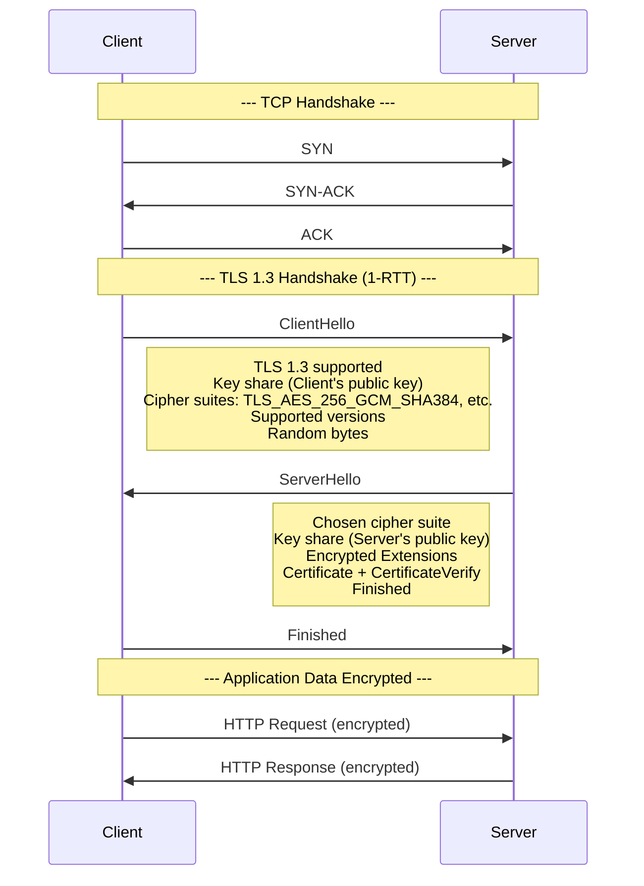
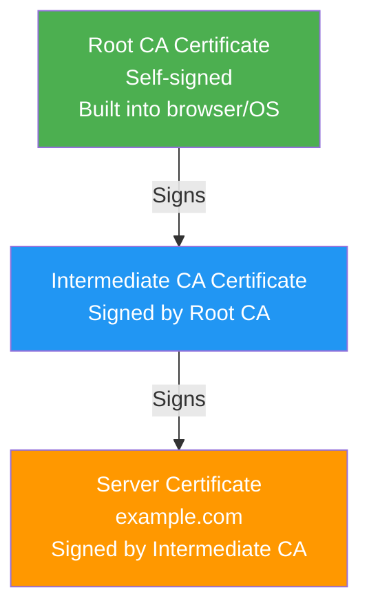
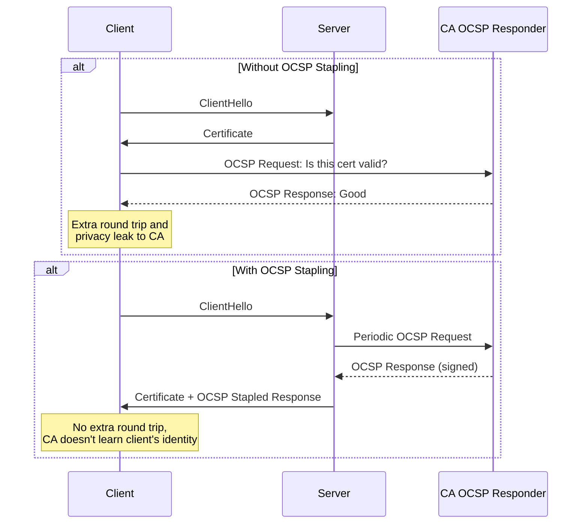

# TLS Deep Dive

## What is TLS?

TLS (Transport Layer Security) is the protocol that provides encryption, authentication, and integrity for internet communications. It's the S in HTTPS.

## TLS Handshake Deep Dive



### TLS 1.2 vs TLS 1.3

| Feature | TLS 1.2 | TLS 1.3 |
|---------|---------|---------|
| Round trips | 2-RTT (full handshake) | 1-RTT (or 0-RTT for resumption) |
| Cipher suites | Many (RSA, DH, ECDH, etc.) | Few (AEAD only) |
| Key exchange | Explicit (separate messages) | Embedded in Hello messages |
| Deprecated | RSA key transport, CBC ciphers | Removed all legacy algorithms |
| 0-RTT | Not supported | Supported (with replay protection) |
| Forward secrecy | Optional | Mandatory |
| Handshake messages | 7+ messages | 3 messages |

### TLS 1.2 Handshake (2-RTT)

```
Client                                        Server
  |                                            |
  | 1. ClientHello --------------------------> |
  |                                            |
  | 2. ServerHello --------------------------  |
  |    Certificate -------------------------   |
  |    ServerKeyExchange -------------------   |
  |    ServerHelloDone --------------------   |
  |                                            |
  | 3. ClientKeyExchange ------------------->  |
  |    ChangeCipherSpec --------------------   |
  |    Finished (encrypted) ----------------   |
  |                                            |
  | 4. ChangeCipherSpec <-------------------   |
  |    Finished (encrypted) <----------------  |
  |                                            |
  | 5. Application Data <===================>  |
```

## Cipher Suites

A cipher suite defines the cryptographic algorithms used in a TLS connection.

```
TLS_AES_256_GCM_SHA384  (TLS 1.3)
│   │      │      │
│   │      │      └─ Hash function for key derivation
│   │      └──────── AEAD encryption mode
│   └─────────────── Encryption algorithm
└─────────────────── Protocol
```

### TLS 1.3 Cipher Suites

| Suite | Encryption | Key Size | Auth Tag |
|-------|-----------|----------|----------|
| `TLS_AES_128_GCM_SHA256` | AES-GCM | 128-bit | 128-bit |
| `TLS_AES_256_GCM_SHA384` | AES-GCM | 256-bit | 128-bit |
| `TLS_CHACHA20_POLY1305_SHA256` | ChaCha20-Poly1305 | 256-bit | 128-bit |

### TLS 1.2 Cipher Suites (Legacy)

```
TLS_ECDHE_RSA_WITH_AES_128_GCM_SHA256
│   │    │        │       │      │
│   │    │        │       │      └─ PRF hash
│   │    │        │       └──────── AEAD mode
│   │    │        └──────────────── Encryption
│   │    └───────────────────────── Authentication (RSA signature)
│   └────────────────────────────── Key exchange (ECDHE)
└────────────────────────────────── Protocol
```

## Certificate Chain



### Certificate Chain Validation

```javascript
// How browsers verify certificates
class CertificateValidator {
  async validate(certChain) {
    // 1. Check each certificate's signature
    for (let i = 1; i < certChain.length; i++) {
      const issuer = certChain[i - 1];
      const subject = certChain[i];
      
      if (!this.verifySignature(subject, issuer.publicKey)) {
        throw new Error('Invalid signature in chain');
      }
    }

    // 2. Verify root is trusted
    if (!this.isTrustedRoot(certChain[0])) {
      throw new Error('Root certificate not trusted');
    }

    // 3. Check leaf certificate
    const leaf = certChain[certChain.length - 1];

    // Check expiration
    const now = new Date();
    if (now < leaf.notBefore || now > leaf.notAfter) {
      throw new Error('Certificate expired or not yet valid');
    }

    // Check hostname
    if (!this.matchesHostname(leaf, window.location.hostname)) {
      throw new Error('Hostname mismatch');
    }

    // Check revocation (OCSP/CRL)
    if (await this.isRevoked(leaf)) {
      throw new Error('Certificate has been revoked');
    }

    return true;
  }

  matchesHostname(cert, hostname) {
    const names = [
      cert.subject.CN,
      ...cert.subjectAltNames
    ];
    return names.some(name => {
      if (name.startsWith('*.')) {
        const domain = name.slice(2);
        return hostname.endsWith(domain) && 
               hostname.split('.').length === domain.split('.').length + 1;
      }
      return name === hostname;
    });
  }
}
```

## Forward Secrecy

Forward secrecy ensures that if a server's private key is compromised, past sessions cannot be decrypted.

```
Without Forward Secrecy:
  Server's private key encrypts pre-master secret
  → Attacker captures traffic, gets private key later
  → Decrypts all past sessions ❌

With Forward Secrecy (ECDHE):
  Ephemeral key pair generated per session
  → Server's private key only signs the ephemeral key
  → Attacker gets private key, still cannot decrypt past sessions ✅
```

```javascript
// Server-side: Enforcing forward secrecy (Nginx)
// ssl_ciphers 'ECDHE+AESGCM:ECDHE+CHACHA20:DHE+AESGCM';
// ssl_prefer_server_ciphers on;
// ssl_ecdh_curve secp384r1;

// Node.js: Using ECDHE
const https = require('https');
const tls = require('tls');

const options = {
  // ECDHE key exchange ensures forward secrecy
  ciphers: [
    'TLS_AES_256_GCM_SHA384',
    'TLS_AES_128_GCM_SHA256',
    'TLS_CHACHA20_POLY1305_SHA256'
  ].join(':'),
  honorCipherOrder: true,
  ecdhCurve: 'auto',
  secureOptions: 
    crypto.constants.SSL_OP_NO_SSLv3 |
    crypto.constants.SSL_OP_NO_TLSv1 |
    crypto.constants.SSL_OP_NO_TLSv1_1
};

https.createServer(options, app).listen(443);
```

## OCSP Stapling

OCSP (Online Certificate Status Protocol) Stapling lets the server provide a signed OCSP response alongside its certificate, so the client doesn't need to contact the CA separately.



```nginx
# Nginx OCSP Stapling configuration
server {
    listen 443 ssl;
    server_name example.com;

    ssl_certificate /etc/ssl/certs/example.com.pem;
    ssl_certificate_key /etc/ssl/private/example.com.key;

    # OCSP Stapling
    ssl_stapling on;
    ssl_stapling_verify on;
    resolver 8.8.8.8 8.8.4.4 valid=300s;
    resolver_timeout 5s;

    # Trust store for OCSP response verification
    ssl_trusted_certificate /etc/ssl/certs/ca-chain.crt;
}
```

## Performance Impact of TLS

### Connection Overhead

| Operation | TLS 1.2 | TLS 1.3 |
|-----------|---------|---------|
| New connection | 2 RTT + ~3ms CPU | 1 RTT + ~2ms CPU |
| Resumed connection | 1 RTT + ~1ms CPU | 0-1 RTT + ~0.5ms CPU |
| CPU cost (per connection) | ~2ms (2048-bit RSA) | ~1ms (ECDHE) |

### Optimization Techniques

```javascript
// 1. Session resumption (TLS tickets)
const tlsSessionStore = new Map();

const server = https.createServer({
  // Enable session tickets for faster resumption
  ticketKeys: crypto.randomBytes(48), // Rotate periodically
  sessionTimeout: 300, // 5 minutes
}, app);

// 2. Connection keep-alive
// HTTP headers: Connection: keep-alive
// Reuse TLS session for multiple HTTP requests

// 3. Early data (0-RTT) - TLS 1.3 only
const options = {
  earlyData: true, // Send data with first flight
  maxEarlyDataSize: 16384
};

// 4. OCSP stapling (avoids extra round trip)
// 5. Certificate chain optimization (minimize size)
// 6. Use ECDSA certificates (smaller than RSA)

// Performance measurement
async function measureTLSPerformance(url) {
  const start = performance.now();
  const response = await fetch(url);
  const end = performance.now();

  const timing = response.timings || {};
  return {
    total: end - start,
    tlsHandshake: timing.tls || 'unknown',
    ttfb: performance.now() - start
  };
}
```

## TLS Best Practices

```javascript
// Server configuration checklist
const tlsConfig = {
  // Protocol versions
  minVersion: 'TLSv1.2', // Disable SSLv3, TLSv1.0, TLSv1.1
  maxVersion: 'TLSv1.3',

  // Cipher suites (TLS 1.3)
  ciphers: [
    'TLS_AES_256_GCM_SHA384',     // Best AES
    'TLS_CHACHA20_POLY1305_SHA256', // Best for mobile
    'TLS_AES_128_GCM_SHA256'       // Fallback
  ],

  // Certificates
  certificate: '/etc/ssl/certs/example.com.pem',
  certificateKey: '/etc/ssl/private/example.com.key',
  certificateChain: '/etc/ssl/certs/fullchain.pem',

  // Performance
  sessionTimeout: 300,
  sessionTickets: true,
  ocspStapling: true,

  // Security
  hsts: 'max-age=63072000; includeSubDomains; preload',
  strictMode: true
};

// Test TLS configuration
// https://www.ssllabs.com/ssltest/
// https://testssl.sh/
```

## Key Takeaways

- TLS 1.3 reduces handshake from 2-RTT to 1-RTT (0-RTT for resumption)
- Forward secrecy (via ECDHE) ensures past sessions can't be decrypted if private key is compromised
- OCSP Stapling eliminates extra round trips for certificate revocation checks
- Cipher suites define the complete set of cryptographic algorithms used
- Certificate chain validation ensures the server's identity is trusted
- Session resumption and 0-RTT significantly reduce connection overhead
- Always disable obsolete protocols (SSLv3, TLSv1.0, TLSv1.1)
