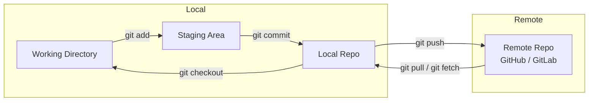

# Git Basics — Version Control & Core Commands

## What is Version Control?

Version control is a system that records changes to files over time so you can recall specific versions later. It enables multiple people to collaborate, track who made what change and when, and revert mistakes.

### Types of Version Control

| Type | Example | Description |
|------|---------|-------------|
| Local | RCS | Snapshots stored on the local disk |
| Centralized | CVS, SVN | Single server stores all versions; clients check out |
| **Distributed** | **Git** | Every clone is a full backup of the repository |

**Git** is a **Distributed Version Control System (DVCS)** — every developer has the entire history locally.

---

## Core Concepts — The Three Trees

Git maintains three primary trees for every project:

1. **Working Directory** — the actual files you edit
2. **Staging Area (Index)** — proposed next commit
3. **Repository (Commit History)** — committed snapshots

### Data Flow Diagram



---

## Essential Commands

### `git init` — Create a New Repository

```bash
mkdir my-project
cd my-project
git init
```

This creates a `.git` folder that stores all tracking data.

### `git clone` — Copy an Existing Repository

```bash
git clone https://github.com/user/repo.git
# Clones into a folder named 'repo'

git clone https://github.com/user/repo.git my-folder
# Clones into 'my-folder' instead
```

### `git status` — Inspect the Current State

```bash
$ git status
On branch main
Changes not staged for commit:
  modified:   index.html

Untracked files:
  style.css
```

### `git add` — Stage Changes

```bash
git add index.html          # stage a single file
git add src/                # stage an entire directory
git add .                   # stage all changes in current dir
git add -p                  # stage interactively (hunk by hunk)
```

### `git commit` — Record a Snapshot

```bash
git commit -m "Fix navbar alignment on mobile"
git commit                 # opens editor for multi-line message
git commit --amend         # amend the last commit (don't use on public history)
```

### `git log` — View History

```bash
git log                    # full history
git log --oneline          # compact one-line per commit
git log --graph            # show branch topology
git log --oneline --graph --all   # full picture
```

Example output:

```
* e3a1b2d (HEAD -> main) Fix typo in README
* a4f6c8e Add login form validation
* b7d9e1f Initial commit
```

### `git diff` — Compare Changes

```bash
git diff                   # unstaged changes (working vs staging)
git diff --staged          # staged changes (staging vs last commit)
git diff HEAD~1 HEAD       # changes between last two commits
git diff main..feature     # compare branches
```

---

## `.gitignore` — Ignoring Files

A `.gitignore` file tells Git which files or folders to ignore (e.g., build artifacts, dependencies, secrets).

```gitignore
# Dependencies
node_modules/
vendor/

# Build output
dist/
build/
*.exe

# Environment files
.env
.env.local

# OS files
.DS_Store
Thumbs.db

# IDE files
.vscode/
.idea/
```

Place `.gitignore` in the root of your repo and commit it.

---

## `git config` — Configuration

```bash
# Identity (required for commits)
git config --global user.name "Your Name"
git config --global user.email "your.email@example.com"

# Default editor
git config --global core.editor "code --wait"

# Line endings
git config --global core.autocrlf input       # macOS/Linux
git config --global core.autocrlf true        # Windows

# Aliases
git config --global alias.co checkout
git config --global alias.br branch
git config --global alias.st status
git config --global alias.lg "log --oneline --graph --all"

# View all config
git config --list
git config --global --list
```

Config stored at:
- System: `<git-install>/etc/gitconfig`
- Global: `~/.gitconfig` or `~/.config/git/config`
- Local: `.git/config` (per-repo)

---

## Writing Good Commit Messages

The conventional format (used by Linux kernel, many open-source projects):

```
<type>(<scope>): <short summary>  (max 50 chars)

<optional body, wrapped at 72 chars>

<optional footer>
```

**Types:**

| Type | Meaning |
|------|---------|
| `feat` | A new feature |
| `fix` | A bug fix |
| `docs` | Documentation changes |
| `style` | Formatting, missing semicolons (no code change) |
| `refactor` | Code restructuring (no feature or fix) |
| `test` | Adding/updating tests |
| `chore` | Build tasks, dependencies, etc. |

**Good example:**

```
feat(auth): add OAuth2 login with Google provider

- Integrate Google Identity Services SDK
- Add /api/auth/google endpoint
- Store refresh token in HTTP-only cookie
- Update user model with google_id field

Closes #142
```

**Bad examples to avoid:**

```
Update files                # too vague
fixed bug                   # doesn't say what or where
asdfgh                       # meaningless
WIP                          # what is being worked on?
```

---

## Real-World Scenario

```bash
# Team member clones the project
git clone https://github.com/team/project.git

# Creates a feature branch
git checkout -b feat/user-profile

# Works on the feature
echo 'export const Profile = () => <div>Profile</div>' > Profile.jsx
git add Profile.jsx
git commit -m "feat(profile): add Profile component skeleton"

# Realizes they forgot to add tests
echo 'test("renders profile")' > Profile.test.jsx
git add Profile.test.jsx
git commit -m "test(profile): add basic render test"

# Checks what they've done
git log --oneline

# Pushes to remote
git push origin feat/user-profile
```

---

## Quick Reference Card

```bash
git init          # start tracking in current dir
git clone <url>   # copy remote repo locally
git status        # what's changed?
git add <file>    # stage a file
git commit -m "msg"  # commit staged changes
git log           # view commit history
git diff          # see unstaged changes
git config        # set user name, email, etc.
```
