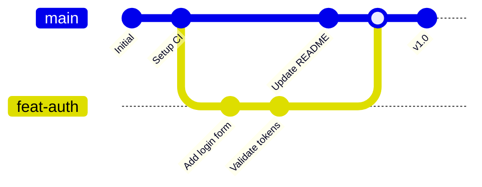

# Branching — Isolating Work in Git

## What is a Branch?

A branch is a movable pointer to a specific commit. Branches let you develop features, fix bugs, and experiment in isolated contexts without affecting the main codebase.



---

## Core Branching Commands

### `git branch` — List, Create, Delete

```bash
git branch                  # list local branches (* marks current)
git branch -r               # list remote branches
git branch -a               # list all branches (local + remote)
git branch feat-new         # create a branch at current commit
git branch -d feat-old      # delete a branch (safe: prevents unmerged)
git branch -D feat-old      # force delete (discards unmerged work)
git branch -m old-name new-name  # rename a branch
```

### `git checkout` — Switch Branches (Classic)

```bash
git checkout main           # switch to main
git checkout -b feat-signup # create AND switch in one command
```

### `git switch` — Switch Branches (Modern)

Git 2.23+ introduced `switch` as a clearer alternative:

```bash
git switch main             # switch to main
git switch -c feat-signup   # create AND switch
git switch -                # switch to previous branch
```

---

## How Branching Works Internally

```bash
# A branch is just a 40-byte file in .git/refs/heads/ containing a commit hash
$ cat .git/refs/heads/main
a1b2c3d4e5f6a7b8c9d0e1f2a3b4c5d6e7f8a9b0
```

When you create a new branch, Git writes the current commit hash to a new file. When you make new commits, that hash updates to point to the latest commit.

---

## Branch Naming Conventions

Consistent naming makes it clear what each branch is for.

| Pattern | Example | Purpose |
|---------|---------|---------|
| `feat/<name>` | `feat/user-login` | New feature |
| `fix/<name>` | `fix/nav-z-index` | Bug fix |
| `chore/<name>` | `chore/update-deps` | Maintenance |
| `docs/<name>` | `docs/api-guide` | Documentation |
| `refactor/<name>` | `refactor/auth-module` | Code restructuring |
| `test/<name>` | `test/payment-flow` | Adding tests |
| `hotfix/<name>` | `hotfix/security-patch` | Urgent production fix |
| `release/<version>` | `release/v2.1.0` | Release preparation |

**Best practices:**
- Use lowercase with hyphens (kebab-case)
- Include issue/ticket number: `feat/JIRA-123-user-profile`
- Keep names descriptive but concise
- Delete branches after merging

---

## Branch Strategies

### 1. GitFlow

A robust strategy for projects with scheduled releases.

```
main ──────●────────────●────────────●──── (production releases)
            \          / \          /
 develop ────●──●──●────●──●──●────●──── (integration)
                \    /      \    /
   feature ──────●──●        ●──●
```

**Branches:**
- `main` — production-ready code only
- `develop` — integration branch for features
- `feat/*` — feature branches off `develop`
- `release/*` — release candidates off `develop`, merged to `main` and `develop`
- `hotfix/*` — urgent fixes off `main`, merged to `main` and `develop`

**Pros:** Clear separation, works well for releases
**Cons:** Complex, overhead for continuous delivery teams

### 2. GitHub Flow

A simplified, PR-based workflow popular with CI/CD.

```
main ────●───●───●───●───●───●
           \     /   \     /
 feat-1─────●──●     feat-2──●
```

**Rules:**
- `main` is always deployable
- Create feature branches off `main`
- Open a Pull Request for review
- Merge to `main` after approval & CI passes
- Deploy immediately after merge

**Pros:** Simple, works great with CI/CD
**Cons:** Less isolation for complex releases

### 3. Trunk-Based Development

Developers commit directly to `main` (or short-lived branches).

```
main ──●──●──●──●──●──●──●──●──●──●
        |    |     |     |
       pair  pair  pair  pair  (< 1 day branches)
```

**Rules:**
- Branches live < 1 day (ideally hours)
- Feature flags hide incomplete work
- Frequent small commits
- Continuous integration runs on every push

**Pros:** Maximum velocity, minimal merge overhead
**Cons:** Requires strong CI, feature flags, and discipline

---

## Branch Comparison Table

| Aspect | GitFlow | GitHub Flow | Trunk-Based |
|--------|---------|-------------|-------------|
| Complexity | High | Low | Very Low |
| Release model | Scheduled releases | Continuous delivery | Continuous deployment |
| Branch lifetime | Days to weeks | Hours to days | Hours |
| CI/CD pressure | Low | Medium | High |
| Best for | Mobile apps, versions | Web apps, SaaS | High-velocity teams |

---

## Real-World Scenario

```bash
# Team is using GitHub Flow

# Start work on a feature
git switch main
git pull
git switch -c feat/payment-gateway

# Work and commit
echo "Stripe integration" > payment.ts
git add payment.ts
git commit -m "feat(payment): add Stripe integration"

# Someone else creates a bugfix branch
git switch main
git switch -c fix/checkout-error

# List all branches to see active work
git branch -a

# Push feature branch
git push -u origin feat/payment-gateway

# Open a PR on GitHub, get it reviewed, merge.
# Delete the local branch after merge:
git branch -d feat/payment-gateway

# Delete remote branch:
git push origin --delete feat/payment-gateway
```

---

## Quick Reference

```bash
git branch                  # list local branches
git branch <name>           # create branch at HEAD
git branch -d <name>        # delete branch (safe)
git branch -D <name>        # delete branch (force)
git checkout <name>         # switch branches
git checkout -b <name>      # create + switch
git switch <name>           # switch (modern)
git switch -c <name>        # create + switch (modern)
git push -u origin <name>   # push branch + track remote
git push origin --delete <name>  # delete remote branch
```
