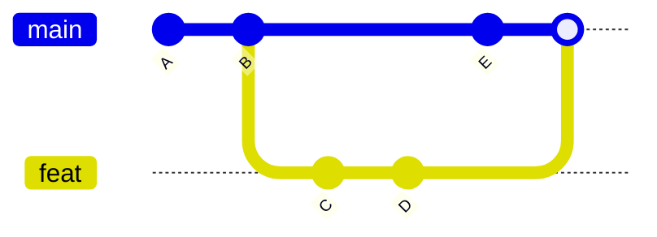

# Merging — Combining Branch Histories

## What is a Merge?

Merging integrates changes from one branch into another. Git finds the common ancestor (`merge base`) and applies the divergent changes from both branches.

---

## Merge Types

### Fast-Forward Merge

When the target branch hasn't diverged — Git simply moves the pointer forward.

```
Before:              After:
main ──●──●──●       main ──●──●──●──●──●
              \                      (fast-forward)
 feat ─────────●──●
```

```bash
git switch main
git merge feat           # fast-forwards main to feat's tip
```

**No merge commit is created.**

### 3-Way Merge (True Merge)

When branches have diverged — Git creates a new **merge commit** with two parents.

```
Before:
main ──●──●──●──●──●
              \
 feat ─────────●──●──●

After:
main ──●──●──●──●──●──●──● (merge commit)
              \        /
 feat ─────────●──●──●
```

```bash
$ git merge feat
# Merge made by the 'ort' strategy.
```



---

## Merge Command Reference

```bash
git merge feat                # merge feat into current branch
git merge --no-ff feat        # force a merge commit even if fast-forward possible
git merge --ff-only feat      # abort if fast-forward isn't possible
git merge --squash feat       # squash all feat commits into one (no merge commit)
git merge --abort             # abort a merge in progress (conflict)
git merge --continue          # continue after resolving conflicts
```

---

## Merge Conflicts

A conflict occurs when Git cannot automatically resolve differences — the same part of the same file was changed in both branches.

### Conflict Anatomy

When a conflict happens, Git marks the file:

```diff
<<<<<<< HEAD
const theme = "dark";
=======
const theme = "light";
>>>>>>> feat/theme-toggle
```

- `<<<<<<< HEAD` — your current branch's version
- `=======` — divider
- `>>>>>>> feat/theme-toggle` — incoming branch's version

### Resolving a Conflict

```bash
# 1. See conflicting files
git status
# both modified:   src/config.ts

# 2. Open the file and manually edit it to keep the desired version
# Remove conflict markers <<<<, ====, >>>>

# 3. After editing:
git add src/config.ts
git commit                   # Git opens a pre-filled merge commit message
```

### Using Merge Tools

```bash
# Configure a diff/merge tool
git config --global merge.tool vscode
git config --global mergetool.vscode.cmd "code --wait $MERGED"

# Launch the merge tool when conflicts exist
git mergetool
```

---

## Merge Strategies

Git uses different strategies to perform merges. The default is `ort` (the rewritten `recursive` strategy).

| Strategy | Flag | Behavior |
|----------|------|----------|
| `ort` | (default) | Resolves using recursive 3-way merge; handles rename detection |
| `ours` | `-s ours` | Keep our version entirely; discard theirs |
| `theirs` | (not built-in, use `-X theirs`) | Auto-resolve conflicts in favor of theirs |
| `octopus` | `-s octopus` | Merge more than two branches at once |
| `subtree` | `-s subtree` | Merge two projects where one is a subdirectory of the other |

### Strategy Options (passed with `-X`)

```bash
git merge -X theirs feat         # auto-resolve conflicts using theirs
git merge -X ours feat           # auto-resolve conflicts using ours
git merge -X patience feat       # use patience diff algorithm (better for refactored code)
git merge -X ignore-space-change feat  # ignore whitespace changes
```

---

## Common Merge Scenarios

### Scenario 1: Fast-Forward (No Divergence)

```bash
git switch main
# No new commits on main since feat was created
git merge feat
# Updating a1b2c3d..e4f5g6h
# Fast-forward
```

### Scenario 2: 3-Way Merge (Diverged)

```bash
git switch main
git merge feat
# Merge made by the 'ort' strategy.
# The merge commit has two parents
```

### Scenario 3: Conflict Resolution

```bash
git switch main
git merge feat
# Auto-merging src/app.ts
# CONFLICT (content): Merge conflict in src/app.ts
# Automatic merge failed; fix conflicts and then commit the result.

# View conflicts
git diff

# Resolve manually in editor
# Code: --wait opens VS Code
code src/app.ts

# Stage resolved file
git add src/app.ts

# Complete the merge
git commit

# If you want to bail out:
git merge --abort
```

---

## Real-World Scenario

```bash
# Developer A is working on feat/search on main
git checkout -b feat/search
echo "search bar added" > search.tsx
git add search.tsx
git commit -m "feat(search): add search component"

# Developer B merged a change to main in the meantime
git checkout main
echo "new header" > header.tsx
git add header.tsx
git commit -m "feat(header): redesign header"

# Developer A returns and merges main into their branch
git checkout feat/search
git merge main

# Conflict: both changed index.ts
# Resolve, add, commit

git add index.ts
git commit -m "Merge branch 'main' into feat/search"
```

---

## `--no-ff` Explained

Using `--no-ff` preserves branch history even when fast-forward is possible:

```bash
git merge --no-ff feat
```

```
Without --no-ff (no merge commit):          With --no-ff (merge commit visible):
main ──●──●──●──●──●                        main ──●──●──●────●──●
                                                              \    /
 feat ────────────●──●                        feat ────────────●──●
```

Teams often enforce `--no-ff` on `main` to keep feature history visible.

---

## Quick Reference

```bash
git merge <branch>                # merge branch into current
git merge --no-ff <branch>        # always create a merge commit
git merge --abort                 # abort a conflicted merge
git merge --continue              # continue after resolution
git mergetool                     # launch visual merge tool
git log --oneline --graph --all   # see merge topology
```
