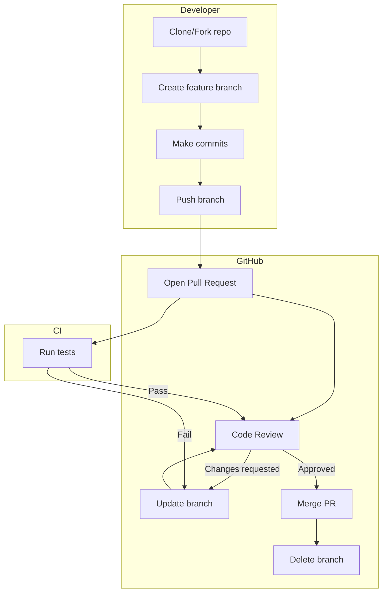

# GitHub Workflow — Collaboration on GitHub

## The Pull Request Workflow

The standard collaboration model on GitHub revolves around **Pull Requests (PRs)** — a mechanism for proposing, reviewing, and integrating changes.



---

## Forking vs Branching

| Approach | Description | When to Use |
|----------|-------------|-------------|
| **Branch within repo** | All collaborators work in the same repo on branches | Trusted team members with write access |
| **Fork + PR** | Copy the repo under your own account, submit PR from there | External contributors, open source |

### Forking Workflow

```bash
# 1. Fork the repo on GitHub (click "Fork" button)

# 2. Clone your fork
git clone https://github.com/YOUR-USERNAME/upstream-repo.git
cd upstream-repo

# 3. Add upstream remote
git remote add upstream https://github.com/original-owner/upstream-repo.git

# 4. Sync your fork
git fetch upstream
git checkout main
git merge upstream/main

# 5. Create a branch, work, push
git checkout -b feat/amazing-feature
# ... work ...
git push origin feat/amazing-feature

# 6. Open a PR from your fork to the original repo
```

---

## Pull Requests — Deep Dive

### Creating a Good PR

**Title:** Use conventional commits style:
```
feat(auth): add OAuth2 login with Google
fix(api): handle null response in user endpoint
docs(readme): update installation instructions
```

**Description template:**

```markdown
## Description
Brief description of what this PR does.

## Related Issue
Closes #123

## Type of Change
- [ ] Bug fix
- [ ] New feature
- [ ] Breaking change
- [ ] Documentation update

## Testing
- [ ] Unit tests pass
- [ ] Integration tests pass
- [ ] Manual testing done

## Screenshots (if applicable)

## Checklist
- [ ] My code follows the style guidelines
- [ ] I have performed a self-review
- [ ] I have commented on complex code
- [ ] I have updated the documentation
```

### PR Size Guidelines

| Size | Commits | Review Experience |
|------|---------|-------------------|
| **Small** | 1–3 | Fast, thorough review |
| **Medium** | 4–8 | Manageable |
| **Large** | 9+ | Slow, superficial review |

**Best practice:** Keep PRs under 400 lines changed. Split large features into multiple PRs.

---

## Code Review

### What Reviewers Look For

1. **Correctness** — Does the code do what it says?
2. **Design** — Is it well-structured? Follows patterns?
3. **Performance** — Any obvious inefficiencies?
4. **Security** — SQL injection, XSS, exposed secrets?
5. **Testing** — Are there tests? Do they cover edge cases?
6. **Style** — Consistent with project conventions?

### Review Etiquette

**For authors:**
- Respond to comments promptly
- Keep PRs small and focused
- Write descriptive commit messages
- Self-review before requesting review

**For reviewers:**
- Be constructive, not critical
- Distinguish between "must fix" and "suggestion"
- Explain your reasoning
- Approve only when satisfied

---

## GitHub Issues

Issues track bugs, features, tasks, and discussions.

### Issue Labels

| Label | Purpose |
|-------|---------|
| `bug` | Something isn't working |
| `enhancement` | New feature or request |
| `good first issue` | Good for newcomers |
| `help wanted` | Extra attention needed |
| `question` | Further information is requested |
| `wontfix` | This will not be worked on |

**Linking PRs to issues:** Include `Closes #123`, `Fixes #123`, or `Resolves #123` in the PR description.

---

## GitHub Actions (CI/CD)

Automate testing, linting, and deployment.

```yaml
# .github/workflows/ci.yml
name: CI
on:
  push:
    branches: [main]
  pull_request:
    branches: [main]

jobs:
  test:
    runs-on: ubuntu-latest
    steps:
      - uses: actions/checkout@v4
      - uses: actions/setup-node@v4
        with:
          node-version: 20

      - run: npm ci
      - run: npm run lint
      - run: npm test
      - run: npm run build
```

---

## GitHub Pages

Host static sites directly from a repository.

```bash
# In repo Settings > Pages, set source:
# - Branch: main, folder: / (root)
# - Branch: main, folder: /docs
# - GitHub Actions

# Or with Actions:
```

```yaml
# .github/workflows/deploy.yml
name: Deploy to GitHub Pages
on:
  push:
    branches: [main]

jobs:
  deploy:
    runs-on: ubuntu-latest
    permissions:
      contents: read
      pages: write
    steps:
      - uses: actions/checkout@v4
      - uses: actions/setup-node@v4
      - run: npm ci && npm run build
      - uses: actions/upload-pages-artifact@v3
        with:
          path: ./dist
      - uses: actions/deploy-pages@v4
```

---

## Protecting Branches

Branch protection rules enforce workflow policies on `main` (or other critical branches).

**Settings → Branches → Add rule:**

```
Branch name pattern: main

☑ Require pull request reviews before merging
   ☑ Require at least 1 approval
   ☑ Dismiss stale reviews

☑ Require status checks to pass before merging
   ☑ Require branches to be up to date

☑ Require conversation resolution before merging

☑ Include administrators

☑ Allow force pushes  (❌ restrict to everyone)
☑ Allow deletions    (❌ restrict to everyone)
```

---

## Semantic PRs & Conventional Commits

Standardize commit messages for automatic changelog generation and versioning.

### Conventional Commits Spec

```
<type>[optional scope]: <description>

[optional body]

[optional footer(s)]
```

**Types:**
- `feat` — new feature (MINOR in semver)
- `fix` — bug fix (PATCH in semver)
- `BREAKING CHANGE` (in footer or `!` after type) — MAJOR in semver

```
feat: add OAuth2 login

BREAKING CHANGE: removes old auth system
```

```
feat(api)!: remove deprecated v1 endpoints
```

### Automation Tools

- **commitlint** — validates commit messages
- **semantic-release** — automated versioning and changelog
- **release-please** — GitHub Action for release PRs

---

## Merge Strategies on GitHub

When merging a PR on GitHub, you have three options:

### 1. Create a Merge Commit

```
main ────●────●────●────────●─────
          \        /        /
 feat ─────●──●──●─────────●
```

```bash
# git operation:
git checkout main
git merge --no-ff feat
```

**Best for:** Preserving full branch history, feature branches with multiple commits.

### 2. Squash and Merge

```
main ──●──●──●──●──● (single squashed commit)
```

```bash
# git operation:
git checkout main
git merge --squash feat
git commit -m "feat: add login feature (#42)"
```

**Best for:** Keeping main history clean, when individual commits aren't meaningful.

### 3. Rebase and Merge

```
main ──●──●──●──●──●──● (linear, no merge commit)
```

```bash
# git operation:
git checkout feat
git rebase main
git checkout main
git merge feat
```

**Best for:** Linear history, when PR commits are well-structured.

---

## Real-World PR Flow

```bash
# 1. Create feature branch
git checkout -b feat/user-notifications

# 2. Work, commit
echo "notification service" > notify.ts
git add notify.ts
git commit -m "feat(notify): add notification service"

# 3. Push and open PR
git push -u origin feat/user-notifications

# 4. Open PR on GitHub with description
# "Adds notification service with email and push support. Closes #89."

# 5. CI runs (Actions)
# - lint ✅, test ✅, build ✅

# 6. Review
# - Alice approves
# - Bob requests changes to error handling

# 7. Address feedback
# Edit notification error handling
git add notify.ts
git commit -m "fix(notify): handle connection errors gracefully"
git push

# 8. PR approved, merge (squash)
# GitHub merges: "feat(notify): add notification service (#42)"

# 9. Clean up
git checkout main
git pull
git branch -d feat/user-notifications
```

---

## Quick Reference

```bash
# Fork workflow
git remote add upstream <url>   # add original repo as remote
git fetch upstream              # fetch upstream changes
git merge upstream/main         # sync with upstream

# PR workflow
git checkout -b <branch>        # create branch
git push -u origin <branch>     # push and track
gh pr create --fill             # create PR (GitHub CLI)
gh pr checkout <number>         # checkout a PR locally
gh pr review --approve          # approve PR

# After merge
git checkout main && git pull   # update main
git branch -d <branch>          # delete local branch
git push origin --delete <branch>  # delete remote branch
```
