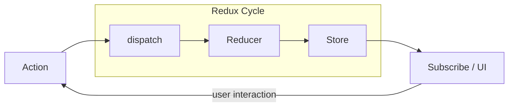
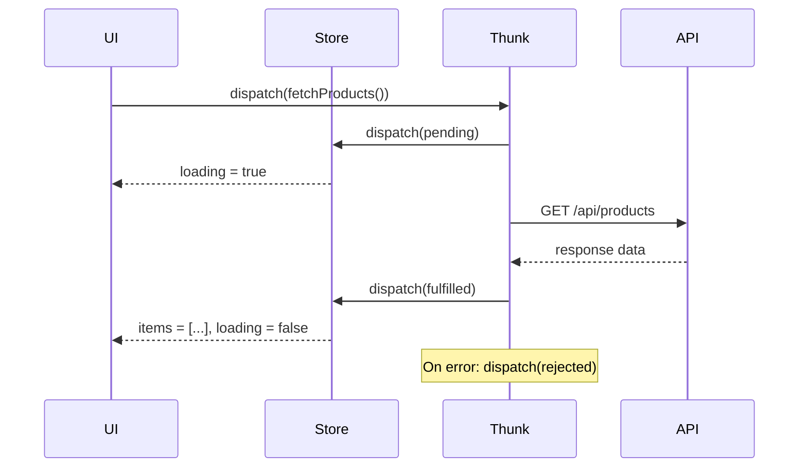
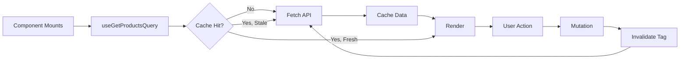

# Redux Toolkit

## Redux Principles

### Three Core Principles

1. **Single source of truth** — The global state is stored in one store object tree.
2. **State is read-only** — The only way to change state is by dispatching an action (an object describing what happened).
3. **Changes are made with pure functions** — Reducers specify how state transforms in response to actions.

### Redux Data Flow (One-Way)



## Redux Toolkit (RTK)

RTK is the official, opinionated way to write Redux logic. It eliminates boilerplate.

### configureStore

```js
import { configureStore } from '@reduxjs/toolkit';
import cartReducer from './features/cart/cartSlice';
import authReducer from './features/auth/authSlice';
import productsReducer from './features/products/productsSlice';

export const store = configureStore({
  reducer: {
    cart: cartReducer,
    auth: authReducer,
    products: productsReducer,
  },
  devTools: process.env.NODE_ENV !== 'production',
});
```

configureStore automatically:
- Combines slice reducers
- Adds middleware (thunk by default)
- Enables Redux DevTools
- Runs serializability checks in dev

### createSlice

```js
import { createSlice, nanoid } from '@reduxjs/toolkit';

const cartSlice = createSlice({
  name: 'cart',
  initialState: {
    items: [],
    status: 'idle',
  },
  reducers: {
    itemAdded: {
      reducer(state, action) {
        const existing = state.items.find(i => i.id === action.payload.id);
        if (existing) {
          existing.quantity += 1;
        } else {
          state.items.push({ ...action.payload, quantity: 1 });
        }
      },
      prepare(product) {
        return { payload: { ...product, id: nanoid() } };
      },
    },
    itemRemoved(state, action) {
      state.items = state.items.filter(i => i.id !== action.payload);
    },
    quantityUpdated(state, action) {
      const item = state.items.find(i => i.id === action.payload.id);
      if (item) item.quantity = action.payload.quantity;
    },
    cartCleared(state) {
      state.items = [];
    },
  },
});

export const { itemAdded, itemRemoved, quantityUpdated, cartCleared } = cartSlice.actions;
export default cartSlice.reducer;
```

**Immer integration**: RTK uses Immer internally — you can write "mutating" syntax in reducers that produces immutable updates.

### createAsyncThunk

```js
import { createAsyncThunk, createSlice } from '@reduxjs/toolkit';

export const fetchProducts = createAsyncThunk(
  'products/fetchProducts',
  async ({ category, page }, { rejectWithValue }) => {
    try {
      const response = await fetch(
        `/api/products?category=${category}&page=${page}`
      );
      if (!response.ok) throw new Error('Failed to fetch');
      return await response.json();
    } catch (err) {
      return rejectWithValue(err.message);
    }
  }
);

const productsSlice = createSlice({
  name: 'products',
  initialState: {
    items: [],
    loading: false,
    error: null,
    currentPage: 1,
    totalPages: 1,
  },
  reducers: {},
  extraReducers: (builder) => {
    builder
      .addCase(fetchProducts.pending, (state) => {
        state.loading = true;
        state.error = null;
      })
      .addCase(fetchProducts.fulfilled, (state, action) => {
        state.loading = false;
        state.items = action.payload.products;
        state.totalPages = action.payload.totalPages;
        state.currentPage = action.payload.page;
      })
      .addCase(fetchProducts.rejected, (state, action) => {
        state.loading = false;
        state.error = action.payload;
      });
  },
});
```

### Thunk Lifecycle Diagram



## RTK Query

RTK Query is a data-fetching layer built on top of RTK. It handles caching, loading states, and auto-refetching.

```js
import { createApi, fetchBaseQuery } from '@reduxjs/toolkit/query/react';

export const apiSlice = createApi({
  reducerPath: 'api',
  baseQuery: fetchBaseQuery({ baseUrl: '/api' }),
  tagTypes: ['Product', 'Cart', 'User'],
  endpoints: (builder) => ({
    getProducts: builder.query({
      query: ({ category, page = 1 }) =>
        `/products?category=${category}&page=${page}`,
      providesTags: ['Product'],
    }),
    getProduct: builder.query({
      query: (id) => `/products/${id}`,
      providesTags: (result, error, id) => [{ type: 'Product', id }],
    }),
    updateCart: builder.mutation({
      query: (cartData) => ({
        url: '/cart',
        method: 'PUT',
        body: cartData,
      }),
      invalidatesTags: ['Cart'],
    }),
  }),
});

export const { useGetProductsQuery, useGetProductQuery, useUpdateCartMutation } = apiSlice;
```

### RTK Query Auto-Revalidation



## DevTools

Redux DevTools provides:
- Action log with timestamps
- State diff viewer
- Time-travel debugging
- State export/import
- Action replay

```js
// Enabled by default in configureStore
devTools: process.env.NODE_ENV !== 'production'
```

## Usage in Components

```jsx
import { useSelector, useDispatch } from 'react-redux';
import { itemAdded } from './cartSlice';
import { useGetProductsQuery } from './apiSlice';

function ProductList() {
  const dispatch = useDispatch();
  const { data: products, isLoading, error } = useGetProductsQuery({ category: 'all', page: 1 });
  const cartItems = useSelector((state) => state.cart.items);
  const cartCount = useSelector((state) =>
    state.cart.items.reduce((sum, i) => sum + i.quantity, 0)
  );

  if (isLoading) return <Spinner />;
  if (error) return <Error message={error.message} />;

  return (
    <div>
      <h2>Cart ({cartCount})</h2>
      {products.map(p => (
        <div key={p.id}>
          <span>{p.name}</span>
          <button onClick={() => dispatch(itemAdded(p))}>Add</button>
        </div>
      ))}
    </div>
  );
}
```

## Full File Structure

```
src/
  app/
    store.js          — configureStore
    hooks.js          — useAppSelector, useAppDispatch typed hooks
  features/
    cart/
      cartSlice.js
      Cart.jsx
    products/
      productsSlice.js
      ProductList.jsx
    api/
      apiSlice.js     — createApi
```

## Summary

| Feature | RTK | Old Redux |
|---------|-----|-----------|
| Store setup | configureStore (one line) | createStore + applyMiddleware |
| Reducers | createSlice with Immer | switch/case with spread operators |
| Async | createAsyncThunk | hand-written thunks |
| Data fetching | RTK Query | manual useEffect + dispatch |
| DevTools | Auto-enabled | manual composeWithDevTools |
| Boilerplate | Minimal | Verbose |
