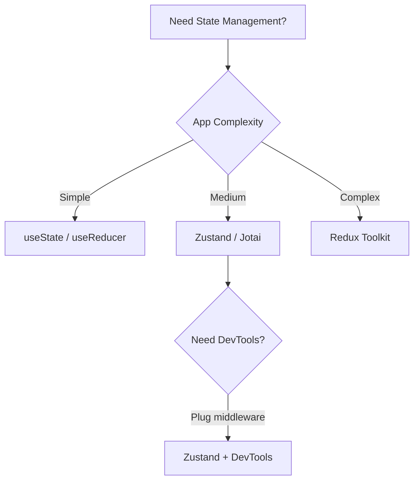

# Zustand

Zustand is a small, fast, and scalable state management library. It provides a hook-based API with no boilerplate.

## Creating a Store

```js
import { create } from 'zustand';

const useStore = create((set, get) => ({
  // State
  count: 0,
  todos: [],

  // Actions
  increment: () => set((state) => ({ count: state.count + 1 })),
  decrement: () => set((state) => ({ count: state.count - 1 })),
  addTodo: (text) =>
    set((state) => ({
      todos: [...state.todos, { id: Date.now(), text, done: false }],
    })),
  toggleTodo: (id) =>
    set((state) => ({
      todos: state.todos.map((t) => (t.id === id ? { ...t, done: !t.done } : t)),
    })),
  reset: () => set({ count: 0, todos: [] }),
}));
```

## Selectors for Performance

Zustand uses reference equality to determine re-renders. Use selectors to subscribe to only the needed slices.

```jsx
// Without selector — re-renders on ANY state change
function BadComponent() {
  const count = useStore((state) => state.count);
  return <div>{count}</div>;
}

// With multiple selectors
function TodoStats() {
  const total = useStore((state) => state.todos.length);
  const done = useStore((state) => state.todos.filter((t) => t.done).length);
  return (
    <div>
      {done}/{total} completed
    </div>
  );
}

// Shallow comparison for objects
import { shallow } from 'zustand/shallow';

function UserInfo() {
  const { name, email } = useStore(
    (state) => ({ name: state.user.name, email: state.user.email }),
    shallow
  );
  return <div>{name} ({email})</div>;
}
```

## Subscriptions

Subscribe outside of React (e.g., in event handlers, middleware):

```js
const unsubscribe = useStore.subscribe(
  (state) => state.todos,
  (todos, prevTodos) => {
    console.log('Todos changed:', todos);
    localStorage.setItem('todos', JSON.stringify(todos));
  },
  { equalityFn: shallow }
);

// Cleanup
unsubscribe();
```

## Immer Integration

```js
import { create } from 'zustand';
import { immer } from 'zustand/middleware/immer';

const useStore = create(
  immer((set) => ({
    users: [],
    updateUser: (id, updates) =>
      set((state) => {
        const user = state.users.find((u) => u.id === id);
        if (user) Object.assign(user, updates);
      }),
    addUser: (user) =>
      set((state) => {
        state.users.push(user);
      }),
  }))
);
```

## DevTools Integration

```js
import { create } from 'zustand';
import { devtools } from 'zustand/middleware';

const useStore = create(
  devtools(
    (set) => ({
      bears: 0,
      increase: () => set((state) => ({ bears: state.bears + 1 })),
    }),
    { name: 'BearStore' }
  )
);
```

The store will appear in Redux DevTools under the "BearStore" tab.

## Simplicity vs Redux

### Comparison Table



| Feature | Zustand | Redux Toolkit |
|---------|---------|---------------|
| **Bundle size** | ~1 KB | ~11 KB (+ React-Redux) |
| **Boilerplate** | Minimal — one function | Moderate — slices, store config |
| **Learning curve** | Low | Medium |
| **Selector model** | Explicit per-component | connect / useSelector |
| **Middleware** | Plugin-based | Built-in thunk, customizable |
| **DevTools** | Via middleware (Redux DevTools compatible) | Built-in |
| **Context-free** | Yes (runs outside React tree) | Requires Provider |
| **Async** | Manual (or external library) | createAsyncThunk / RTK Query |
| **TypeScript** | Excellent inference | Excellent inference |
| **Ecosystem** | Growing (middleware, tools) | Mature (large ecosystem) |

## Real-World Scenario: Shopping Cart

```js
import { create } from 'zustand';
import { persist } from 'zustand/middleware';

const useCartStore = create(
  persist(
    (set, get) => ({
      items: [],
      totalItems: 0,
      totalPrice: 0,

      addItem: (product) =>
        set((state) => {
          const existing = state.items.find((i) => i.id === product.id);
          let newItems;
          if (existing) {
            newItems = state.items.map((i) =>
              i.id === product.id ? { ...i, quantity: i.quantity + 1 } : i
            );
          } else {
            newItems = [...state.items, { ...product, quantity: 1 }];
          }
          return {
            items: newItems,
            totalItems: newItems.reduce((sum, i) => sum + i.quantity, 0),
            totalPrice: newItems.reduce((sum, i) => sum + i.price * i.quantity, 0),
          };
        }),

      removeItem: (id) =>
        set((state) => {
          const newItems = state.items.filter((i) => i.id !== id);
          return {
            items: newItems,
            totalItems: newItems.reduce((sum, i) => sum + i.quantity, 0),
            totalPrice: newItems.reduce((sum, i) => sum + i.price * i.quantity, 0),
          };
        }),

      clearCart: () =>
        set({ items: [], totalItems: 0, totalPrice: 0 }),
    }),
    { name: 'cart-storage' }
  )
);

function CartItem({ item }) {
  const removeItem = useCartStore((s) => s.removeItem);
  return (
    <div>
      <span>{item.name} × {item.quantity}</span>
      <button onClick={() => removeItem(item.id)}>Remove</button>
    </div>
  );
}
```

## When to Choose Zustand Over Redux

**Choose Zustand when:**
- Application is small to medium
- Team is small or unfamiliar with Redux patterns
- You need state outside React (e.g., vanilla JS modules)
- Bundle size is critical
- You want minimal configuration

**Choose Redux when:**
- Application is large with complex state interactions
- Multiple teams contribute to the same codebase
- You need RTK Query's advanced caching
- Rich middleware ecosystem is required
- Time-travel debugging is essential

## Summary

Zustand fills the gap between useState and Redux. It provides Redux-like patterns with minimal code and no providers. For most medium-sized apps, Zustand is the sweet spot between simplicity and capability.
