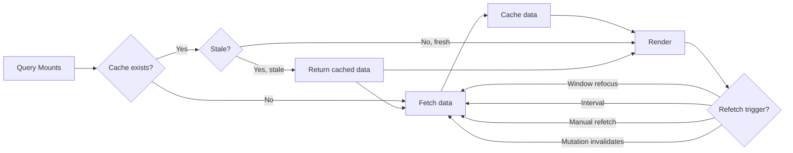

# TanStack Query (React Query)

TanStack Query manages **server state** — data fetched from or synchronized with a remote server. It handles caching, background refetching, pagination, and optimistic updates.

## Server State vs Client State

| Client State | Server State |
|-------------|--------------|
| UI toggles, form inputs | Database records |
| Synchronous | Asynchronous |
| Local only | Shared across users |
| No caching needed | Cache with stale-while-revalidate |
| useState, Context, Zustand | TanStack Query, SWR, RTK Query |

## Queries

```jsx
import { useQuery } from '@tanstack/react-query';

function ProductList({ category }) {
  const { data, isLoading, error, isFetching, refetch } = useQuery({
    queryKey: ['products', { category }],
    queryFn: async () => {
      const res = await fetch(`/api/products?category=${category}`);
      if (!res.ok) throw new Error('Network error');
      return res.json();
    },
    staleTime: 5 * 60 * 1000,   // Data considered fresh for 5 minutes
    gcTime: 30 * 60 * 1000,     // Keep in cache for 30 minutes (formerly cacheTime)
    refetchOnWindowFocus: true,
    retry: 3,
    retryDelay: (attempt) => Math.min(1000 * 2 ** attempt, 10000),
  });

  if (isLoading) return <Skeleton />;
  if (error) return <ErrorMessage error={error} />;

  return (
    <div>
      {isFetching && <Spinner />}
      {data.map((product) => (
        <ProductCard key={product.id} product={product} />
      ))}
      <button onClick={refetch}>Refresh</button>
    </div>
  );
}
```

## Mutations

```jsx
import { useMutation, useQueryClient } from '@tanstack/react-query';

function AddProductForm() {
  const queryClient = useQueryClient();

  const mutation = useMutation({
    mutationFn: (newProduct) =>
      fetch('/api/products', {
        method: 'POST',
        body: JSON.stringify(newProduct),
        headers: { 'Content-Type': 'application/json' },
      }).then((res) => res.json()),

    onSuccess: (data) => {
      // Invalidate and refetch products query
      queryClient.invalidateQueries({ queryKey: ['products'] });
      // Show success toast
      toast.success('Product added!');
    },
    onError: (error) => {
      toast.error(error.message);
    },
    onSettled: () => {
      // Always runs (success or error)
    },
  });

  const handleSubmit = (formData) => {
    mutation.mutate(formData);
  };

  return (
    <form onSubmit={handleSubmit}>
      {/* form fields */}
      <button type="submit" disabled={mutation.isPending}>
        {mutation.isPending ? 'Adding...' : 'Add Product'}
      </button>
    </form>
  );
}
```

## Caching and Stale Time



### Cache Lifecycle

1. **Query mounts** → check cache for key `['products', { category }]`
2. **Cache hit, fresh** (within `staleTime`) → return cached data, no fetch
3. **Cache hit, stale** → return cached data immediately, fetch in background
4. **Cache miss** → show loading, fetch, cache result
5. **Unmount** → data retained in cache for `gcTime`
6. **gcTime expires** → garbage collected

## Pagination

```jsx
function ProductsPage() {
  const [page, setPage] = useState(1);

  const { data, isPreviousData } = useQuery({
    queryKey: ['products', page],
    queryFn: () => fetch(`/api/products?page=${page}&limit=20`).then(r => r.json()),
    keepPreviousData: true,  // Show previous page's data while next loads
  });

  return (
    <div>
      {data.products.map(p => <ProductCard key={p.id} product={p} />)}
      
      <Pagination>
        <button
          onClick={() => setPage(p => Math.max(1, p - 1))}
          disabled={page === 1}
        >
          Previous
        </button>
        <span>Page {page} of {data.totalPages}</span>
        <button
          onClick={() => setPage(p => data.hasNextPage ? p + 1 : p)}
          disabled={isPreviousData || !data.hasNextPage}
        >
          Next
        </button>
      </Pagination>
    </div>
  );
}
```

## Infinite Queries

```jsx
import { useInfiniteQuery } from '@tanstack/react-query';

function InfiniteProducts() {
  const {
    data,
    fetchNextPage,
    hasNextPage,
    isFetchingNextPage,
    status,
  } = useInfiniteQuery({
    queryKey: ['products'],
    queryFn: ({ pageParam = 1 }) =>
      fetch(`/api/products?page=${pageParam}&limit=10`).then(r => r.json()),
    getNextPageParam: (lastPage, pages) =>
      lastPage.hasMore ? pages.length + 1 : undefined,
    initialPageParam: 1,
  });

  return (
    <div>
      {data.pages.map((page, i) => (
        <Fragment key={i}>
          {page.products.map(p => <ProductCard key={p.id} product={p} />)}
        </Fragment>
      ))}
      <button
        onClick={() => fetchNextPage()}
        disabled={!hasNextPage || isFetchingNextPage}
      >
        {isFetchingNextPage ? 'Loading more...' : hasNextPage ? 'Load More' : 'Nothing more'}
      </button>
    </div>
  );
}
```

## Optimistic Updates

Update the UI immediately before the mutation completes, then revert on error.

```jsx
const mutation = useMutation({
  mutationFn: (updatedTodo) =>
    fetch(`/api/todos/${updatedTodo.id}`, {
      method: 'PATCH',
      body: JSON.stringify(updatedTodo),
    }).then(r => r.json()),

  onMutate: async (updatedTodo) => {
    // Cancel outgoing refetches
    await queryClient.cancelQueries({ queryKey: ['todos'] });

    // Snapshot previous value
    const previousTodos = queryClient.getQueryData(['todos']);

    // Optimistically update
    queryClient.setQueryData(['todos'], (old) =>
      old.map((todo) =>
        todo.id === updatedTodo.id ? { ...todo, ...updatedTodo } : todo
      )
    );

    return { previousTodos };
  },

  onError: (err, newTodo, context) => {
    // Rollback on error
    queryClient.setQueryData(['todos'], context.previousTodos);
    toast.error('Update failed — reverted');
  },

  onSettled: () => {
    // Always refetch after error or success
    queryClient.invalidateQueries({ queryKey: ['todos'] });
  },
});
```

## QueryClient Configuration

```js
import { QueryClient } from '@tanstack/react-query';

const queryClient = new QueryClient({
  defaultOptions: {
    queries: {
      staleTime: 1000 * 60 * 5,       // 5 minutes
      gcTime: 1000 * 60 * 60,         // 1 hour
      retry: 2,
      refetchOnWindowFocus: true,
      refetchOnReconnect: true,
    },
  },
});
```

## Real-World Scenario: Dashboard with Auto-Refresh

```jsx
function Dashboard() {
  const { data: stats } = useQuery({
    queryKey: ['dashboard', 'stats'],
    queryFn: fetchStats,
    refetchInterval: 30_000,      // Poll every 30 seconds
    refetchIntervalInBackground: false,
  });

  const { data: recentOrders } = useQuery({
    queryKey: ['orders', 'recent'],
    queryFn: fetchRecentOrders,
    staleTime: 0,                 // Always refetch on mount
  });

  const mutation = useMutation({
    mutationFn: updateOrderStatus,
    onSuccess: () => {
      queryClient.invalidateQueries({ queryKey: ['orders'] });
      queryClient.invalidateQueries({ queryKey: ['dashboard'] });
    },
  });

  return (
    <div>
      <StatsPanel data={stats} />
      <OrdersTable orders={recentOrders} onStatusChange={mutation.mutate} />
    </div>
  );
}
```

## Summary

| Feature | TanStack Query v5 |
|---------|-------------------|
| Caching | Automatic with stale/gc config |
| Background refetch | On mount, window focus, reconnect, interval |
| Pagination | Offset-based, cursor-based, infinite |
| Optimistic updates | Built-in with rollback |
| DevTools | Separate package, excellent |
| Bundle size | ~13 KB gzipped |
| Framework | React, Solid, Vue, Svelte |
