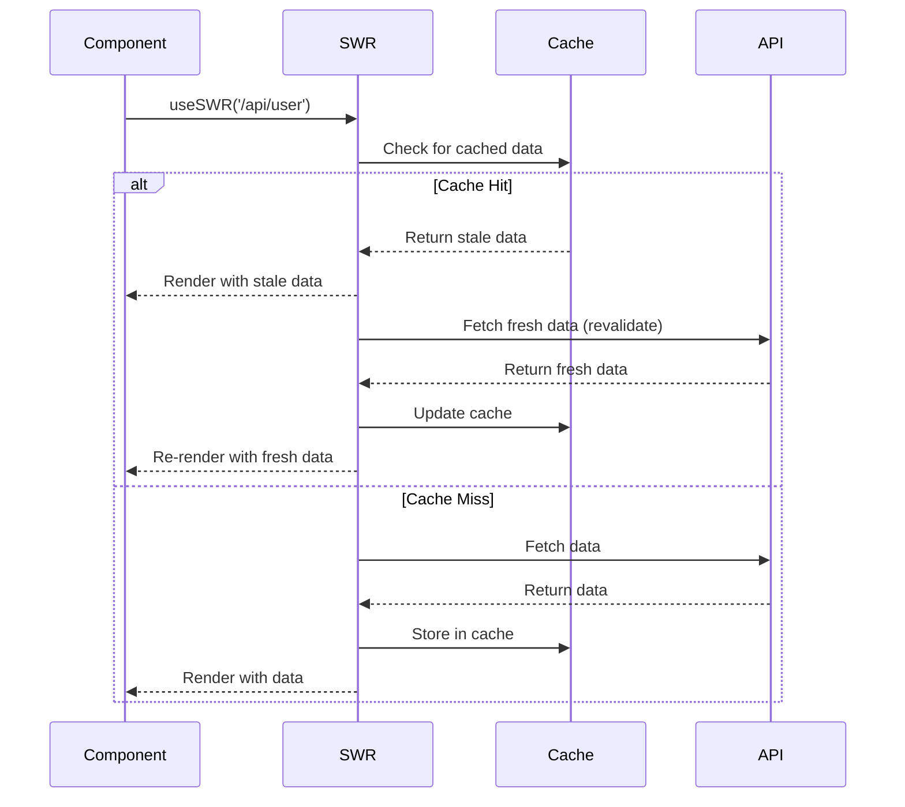

# SWR

SWR (stale-while-revalidate) is a React Hooks library for data fetching created by Vercel. The name is derived from HTTP's `stale-while-revalidate` cache-control strategy.

## Core Features

- **Lightweight** (~4 KB gzipped)
- **Stale-while-revalidate** — returns cached data first, then revalidates in background
- **Automatic revalidation** on focus, reconnect, and interval
- **Pagination** and **scroll recovery**
- **Optimistic UI** with rollback
- **Deduplication** — multiple components sharing the same key share one request

## Basic Usage

```jsx
import useSWR from 'swr';

const fetcher = (...args) => fetch(...args).then(res => res.json());

function Profile() {
  const { data, error, isLoading, isValidating, mutate } = useSWR(
    '/api/user',
    fetcher,
    {
      revalidateOnFocus: true,
      revalidateOnReconnect: true,
      refreshInterval: 0,
      dedupingInterval: 2000,
      focusThrottleInterval: 5000,
      errorRetryCount: 3,
      loadingTimeout: 3000,
    }
  );

  if (error) return <div>Failed to load</div>;
  if (isLoading) return <div>Loading...</div>;

  return (
    <div>
      <h1>{data.name}</h1>
      <p>{data.email}</p>
      {isValidating && <Spinner />}
    </div>
  );
}
```

## Stale-While-Revalidate Strategy



## Mutation (SWR Mutation)

SWR provides `mutate` for both global and bound mutations.

```jsx
import useSWR, { useSWRConfig } from 'swr';

function AddTodo() {
  const { mutate } = useSWRConfig();

  const handleSubmit = async (event) => {
    event.preventDefault();
    const formData = new FormData(event.target);
    const newTodo = { title: formData.get('title'), completed: false };

    // Optimistically update the local cache
    await mutate(
      '/api/todos',
      async (todos) => {
        // Send API request
        const res = await fetch('/api/todos', {
          method: 'POST',
          body: JSON.stringify(newTodo),
          headers: { 'Content-Type': 'application/json' },
        });
        const created = await res.json();

        // Return updated list (will replace cache)
        return [...todos, created];
      },
      {
        optimisticData: (todos) => [...todos, { ...newTodo, id: 'temp-id' }],
        rollbackOnError: true,
        populateCache: (created, todos) => [...todos, created],
        revalidate: false,  // Don't refetch — we updated locally
      }
    );
  };

  return <form onSubmit={handleSubmit}>...</form>;
}
```

### Bound Mutate

```jsx
function TodoItem({ todo }) {
  const { data, mutate } = useSWR('/api/todos');

  const toggleComplete = async () => {
    const updated = { ...todo, completed: !todo.completed };

    // Optimistic update local
    mutate(
      data.map(t => t.id === todo.id ? updated : t),
      false  // Don't revalidate
    );

    // Send API request
    await fetch(`/api/todos/${todo.id}`, {
      method: 'PATCH',
      body: JSON.stringify(updated),
    });

    // Revalidate to ensure consistency
    mutate();
  };

  return <li onClick={toggleComplete}>{todo.title}</li>;
}
```

## Pagination

```jsx
import useSWR from 'swr';

function PaginatedProducts() {
  const [page, setPage] = useState(1);
  const [pageIndex, setPageIndex] = useState(0);

  const { data, error, isLoading } = useSWR(
    `/api/products?page=${page}&limit=10`,
    fetcher,
    { keepPreviousData: true }
  );

  const handleNext = () => {
    setPage(p => p + 1);
    setPageIndex(i => i + 1);
  };

  const handlePrev = () => {
    setPage(p => Math.max(1, p - 1));
    setPageIndex(i => Math.max(0, i - 1));
  };

  return (
    <div>
      {data?.products.map(p => <ProductCard key={p.id} product={p} />)}
      <PaginationActions
        onNext={handleNext}
        onPrev={handlePrev}
        hasNext={data?.hasMore}
        hasPrev={page > 1}
        isLoading={isLoading}
      />
    </div>
  );
}
```

### Infinite Loading with useSWRInfinite

```jsx
import useSWRInfinite from 'swr/infinite';

function InfiniteFeed() {
  const getKey = (pageIndex, previousPageData) => {
    if (previousPageData && !previousPageData.length) return null;
    return `/api/feed?page=${pageIndex + 1}&limit=10`;
  };

  const { data, size, setSize, isValidating, isLoading } = useSWRInfinite(
    getKey,
    fetcher
  );

  const feed = data ? data.flat() : [];

  return (
    <div>
      {feed.map(item => <FeedItem key={item.id} item={item} />)}
      <button onClick={() => setSize(size + 1)} disabled={isValidating}>
        {isValidating ? 'Loading...' : 'Load more'}
      </button>
    </div>
  );
}
```

## Prefetching

```jsx
import useSWR, { preload } from 'swr';

// Prefetch data before component mounts
preload('/api/user', fetcher);

// Or with router event
router.events.on('routeChangeStart', (url) => {
  if (url === '/dashboard') {
    preload('/api/dashboard/stats', fetcher);
  }
});

function Dashboard() {
  // Will already have cached data
  const { data } = useSWR('/api/dashboard/stats', fetcher);
  return <div>{/* render */}</div>;
}
```

## Global Configuration (SWRConfig)

```jsx
import { SWRConfig } from 'swr';

function App() {
  return (
    <SWRConfig
      value={{
        fetcher,
        revalidateOnFocus: true,
        revalidateOnReconnect: true,
        dedupingInterval: 5000,
        errorRetryCount: 5,
        onError: (error, key) => {
          console.error(`SWR error for ${key}:`, error);
        },
        onErrorRetry: (error, key, config, revalidate, { retryCount }) => {
          if (retryCount >= 3) return;
          if (error.status === 404) return;
          setTimeout(() => revalidate({ retryCount }), 5000);
        },
      }}
    >
      <MainApp />
    </SWRConfig>
  );
}
```

## Comparison: SWR vs TanStack Query

| Feature | SWR | TanStack Query |
|---------|-----|----------------|
| **Bundle size** | ~4 KB | ~13 KB |
| **Caching** | Automatic (stale-while-revalidate) | Automatic (stale/gc configurable) |
| **Stale time** | `dedupingInterval` | `staleTime` |
| **Garbage collection** | Manual or `provider` | `gcTime` (built-in) |
| **Pagination** | `useSWRInfinite` | `useInfiniteQuery` |
| **Optimistic updates** | Via `mutate` with `optimisticData` | Via `onMutate` + rollback |
| **Background refetch** | Focus, reconnect, interval | Focus, reconnect, interval |
| **DevTools** | No official (third-party) | Excellent official DevTools |
| **React Suspense** | Yes | Yes |
| **TypeScript** | Good | Excellent |
| **Framework** | Primarily React | React, Vue, Solid, Svelte |
| **Creator** | Vercel | Tanner Linsley / TLK |
| **Maturity** | Mature (v2) | Mature (v5) |

### When to Choose SWR

- You want minimal bundle size
- You are building a Next.js app (built by Vercel, great integration)
- You need simple caching with automatic revalidation
- You prefer conventions over configuration

### When to Choose TanStack Query

- You need advanced caching policies (staleTime, gcTime separately)
- You want DevTools for debugging queries
- You need framework-agnostic solution
- You need complex optimistic update patterns
- You're building data-heavy applications with complex cache interactions

## Real-World Scenario: Real-Time Collaborative Document

```jsx
function DocumentEditor({ documentId }) {
  const { data, mutate, error } = useSWR(
    `/api/documents/${documentId}`,
    fetcher,
    { refreshInterval: 3000 }
  );

  const updateContent = async (newContent) => {
    // Optimistic update
    mutate({ ...data, content: newContent }, false);

    // Send to server
    await fetch(`/api/documents/${documentId}`, {
      method: 'PATCH',
      body: JSON.stringify({ content: newContent }),
    });

    // Revalidate
    mutate();
  };

  if (error) return <ErrorState />;
  if (!data) return <LoadingEditor />;

  return (
    <Editor
      initialContent={data.content}
      onChange={debounce(updateContent, 1000)}
    />
  );
}
```

## Summary

SWR excels at server state synchronization with minimal configuration. Its strengths are bundle size, simplicity, and seamless Next.js integration. For apps that need more cache control or debugging tools, TanStack Query is the better choice.
