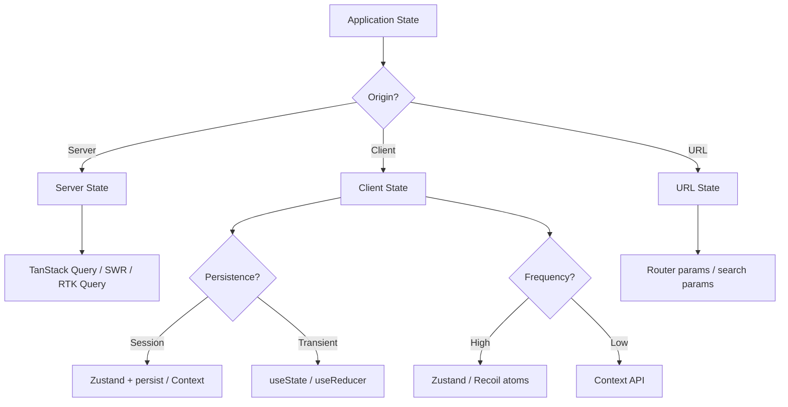
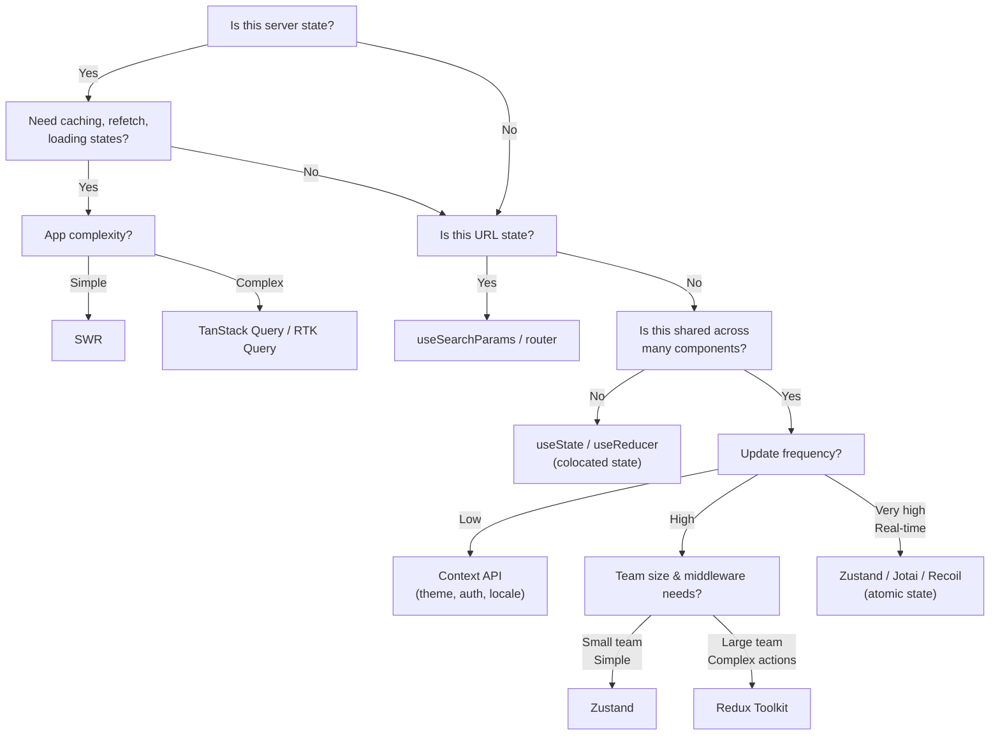

# State Management Architecture

## Types of State

### 1. Client State

Data that exists only on the client and has no server equivalent.

**Examples:**
- UI theme (dark/light mode)
- Sidebar open/closed
- Form input values (before submit)
- Selected tab, active modal
- Scroll position
- Animation state

**Tools:** useState, useReducer, Context, Zustand

### 2. Server State

Data fetched from or synchronized with a remote server. Must handle loading, error, caching, and stale data.

**Examples:**
- User profile data
- Product listings
- Order history
- Notifications
- Dashboard analytics

**Tools:** TanStack Query, SWR, RTK Query

### 3. URL State

State stored in the URL — query parameters, path segments, hash fragments.

**Examples:**
- `?page=2&sort=price` — pagination and sorting
- `/products/123` — selected product
- `#section-3` — scroll anchor
- Filter parameters
- Search queries

**Tools:** react-router (useSearchParams), Next.js (useSearchParams, params)

### 4. Derived State

Computed from existing state, not stored independently.

**Examples:**
- `fullName = `${firstName} ${lastName}``
- `isOver18 = age >= 18`
- Cart totals (sum of item prices)
- Filtered list from a master list

**Tools:** useMemo, reselect (for Redux)

## State Classification Diagram



## State Management Decision Tree



## When to Use Which Tool

| Tool | Best For | Don't Use For |
|------|----------|---------------|
| **useState** | Local component state, form fields | Global state, cross-component sharing |
| **useReducer** | Complex local state with multiple transitions | Server state, simple toggles |
| **Context** | Low-frequency global state (theme, auth, locale) | High-frequency updates, deeply nested provider hell |
| **Zustand** | Medium-complexity global state, state outside React | Advanced cache invalidation |
| **Redux Toolkit** | Large apps with complex state interactions, team scaling | Simple apps, one-off features |
| **TanStack Query** | Server data with caching, pagination, infinite scroll | UI-only state, non-fetch data |
| **SWR** | Simple server state fetching, Next.js apps | Complex cache interactions |
| **URL/Params** | Shareable state, page-level configuration | Private state, large data |

## Architecture Example: E-Commerce App

```
State Architecture:
├── Server State (TanStack Query)
│   ├── Products — useQuery with pagination
│   ├── Product Detail — useQuery with id key
│   ├── User Profile — useQuery with session
│   └── Orders — useInfiniteQuery
│
├── Client State (Zustand)
│   ├── Cart Store — persists to localStorage
│   ├── UI Store — sidebar, modals, toasts
│   └── Filter Store — category, sort, price range
│
├── URL State (next/navigation)
│   ├── Product ID — /products/[id]
│   ├── Search Query — ?q=keyword
│   ├── Page Number — ?page=2
│   └── Sort Order — ?sort=price_asc
│
└── Component State (useState/useReducer)
    ├── Form inputs
    ├── Accordion open/close
    ├── Tooltip visibility
    └── Animation controllers
```

## Performance Implications

```
State Layer        Re-render Scope    Memoization Needed
─────────────────────────────────────────────────────
Context            All consumers      Essential
Zustand            Individual         Via selectors
Redux              Via connect/mapState/useSelector
TanStack Query     Per-query hooks    Via selectors
Local useState     Single component   Rarely
```

## Anti-Patterns to Avoid

1. **Storing server data in Redux/Zustand** — Let TanStack Query own server cache; sync issues arise otherwise.
2. **Over-globalizing** — Not every state needs to be in global store. Start local, lift only when needed.
3. **Putting everything in Context** — Every value change re-renders all consumers. Split contexts.
4. **Ignoring URL state** — Filters and pagination belong in the URL for shareability and back button support.
5. **Storing derived state** — Compute it with useMemo or selectors instead of storing it redundantly.

## Summary

Good state architecture separates concerns by state type, chooses tools based on frequency and scope, and avoids over-engineering. The golden rule: **start with the simplest solution** (useState for local, URL for shareable, TanStack Query for server) and **escalate only when the pain is real**.
