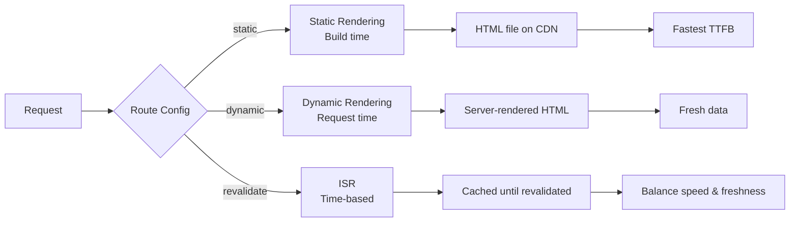

# Introduction to Next.js

## What is Next.js?

Next.js is a React framework for production-grade applications. It provides file-based routing, server-side rendering, static site generation, API routes, and optimizations out of the box.

## Key Features

```mermaid
flowchart TD
    NEXT[Next.js] --> R[Routing]
    NEXT --> REN[Rendering]
    NEXT --> DF[Data Fetching]
    NEXT --> CSS[Styling]
    NEXT --> OPT[Optimizations]
    NEXT --> TYP[TypeScript Support]
    
    R --> FR[File-based Routing]
    R --> LR[Layouts & Nested Routes]
    R --> LG[Loading UI & Streaming]
    R --> ERR[Error Handling]
    
    REN --> SSR[Server-Side Rendering]
    REN --> SSG[Static Site Generation]
    REN --> ISR[Incremental Static Regeneration]
    REN --> CSR[Client-Side Rendering]
    
    DF --> RSC[React Server Components]
    DF --> API[API Routes / Route Handlers]
    DF --> SERVER[Server Actions]
    DF --> DB[Direct Database Access]
    
    OPT --> IMG[Image Optimization]
    OPT --> FONT[Font Optimization]
    OPT --> BUNDLE[Code Splitting]
    OPT --> PRETCH[Prefetching]
```



## Pages Router vs App Router

| Feature | Pages Router | App Router |
|---------|-------------|------------|
| **Introduced** | Next.js 9+ | Next.js 13+ (stable in 14) |
| **Routing** | `pages/` directory | `app/` directory |
| **Components** | All client components | Server + Client components |
| **Layouts** | Manual per-page | Nested layouts (`layout.tsx`) |
| **Loading** | Manual | `loading.tsx` with Suspense |
| **Data Fetching** | `getServerSideProps`, `getStaticProps` | Server Components, `fetch` with caching |
| **Streaming** | No | Yes (Suspense boundaries) |
| **Server Actions** | No | Yes |
| **Middleware** | Limited | Edge runtime, full request control |

## File-Based Routing (App Router)

```
app/
  page.tsx         →  /
  layout.tsx       →  Root layout
  about/
    page.tsx       →  /about
  blog/
    page.tsx       →  /blog
    [slug]/
      page.tsx     →  /blog/:slug
  dashboard/
    layout.tsx     →  /dashboard layout
    page.tsx       →  /dashboard
    settings/
      page.tsx     →  /dashboard/settings
  api/
    products/
      route.ts     →  /api/products
```

## Project Setup

### Create a New Project

```bash
npx create-next-app@latest my-app
# or
pnpm create next-app my-app
```

### What You Get

```
my-app/
├── app/
│   ├── layout.tsx        # Root layout
│   ├── page.tsx          # Home page
│   └── globals.css       # Global styles
├── public/               # Static assets
├── next.config.ts        # Next.js configuration
├── tsconfig.json
└── package.json
```

### Interactive Setup Prompts

```
? Would you like to use TypeScript? Yes
? Would you like to use ESLint? Yes
? Would you like to use Tailwind CSS? Yes
? Would you like to use `src/` directory? Yes
? Would you like to use App Router? Yes
? Would you like to customize the import alias? No
```

## Rendering Strategies at a Glance



## Summary

Next.js is the most popular React framework because it eliminates the need to make decisions about routing, rendering, data fetching, and optimization. The App Router represents a fundamental shift toward server-first React with Server Components.
