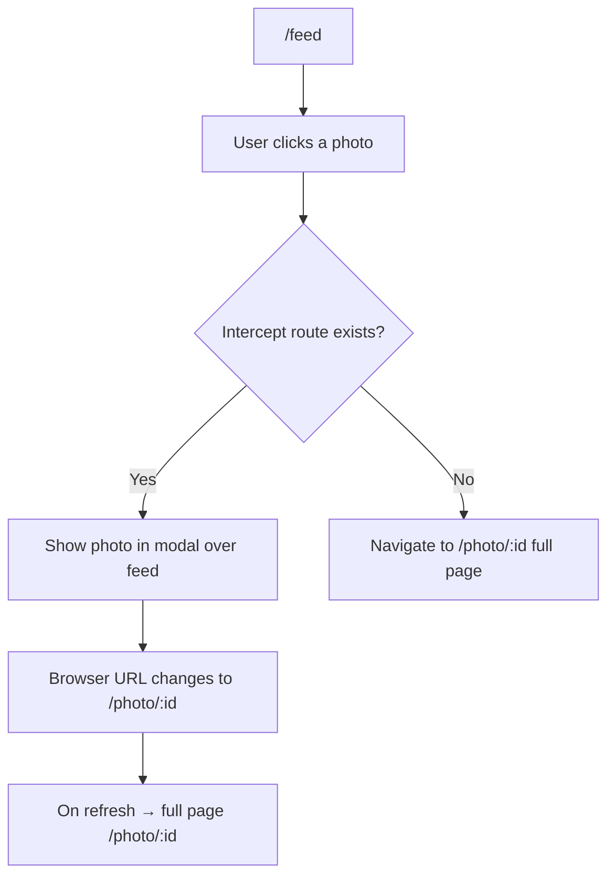

# App Router

## Architecture

The App Router (Next.js 13+) uses a file-system based router where folders define routes and files define UI segments.

```
app/
├── layout.tsx              # Root layout (required)
├── page.tsx                # Home page (/)
├── loading.tsx             # Root loading UI
├── error.tsx               # Root error boundary
├── not-found.tsx           # 404 page
├── global-error.tsx        # Global error (catches root layout errors)
├── template.tsx            # Template (re-mounts on navigation)
│
├── about/
│   ├── page.tsx            # /about
│   └── layout.tsx          # About section layout
│
├── blog/
│   ├── page.tsx            # /blog
│   ├── [slug]/
│   │   ├── page.tsx        # /blog/:slug
│   │   └── loading.tsx     # Loading for single post
│   └── (marketing)/
│       ├── page.tsx        # /marketing (route group, no URL prefix)
│       └── layout.tsx
│
├── dashboard/
│   ├── page.tsx            # /dashboard
│   ├── layout.tsx          # Dashboard layout (with sidebar nav)
│   ├── loading.tsx         # Dashboard loading
│   ├── error.tsx           # Dashboard error
│   └── settings/
│       └── page.tsx        # /dashboard/settings
│
├── api/
│   └── products/
│       └── route.ts        # /api/products (Route Handler)
│
└── @modal/                 # Parallel route
    └── default.tsx
```

## Special Files

| File | Purpose |
|------|---------|
| `layout.tsx` | Shared UI wrapping children; persists across navigations |
| `page.tsx` | Unique UI for the route; required for public access |
| `loading.tsx` | Loading UI shown while page and its children load |
| `error.tsx` | Error UI (catches errors in child segments) |
| `not-found.tsx` | 404 UI for the segment |
| `template.tsx` | Like layout but re-mounts on every navigation |
| `default.tsx` | Fallback for parallel routes |

### layout.tsx

```tsx
// app/layout.tsx — Root layout
export default function RootLayout({
  children,
}: {
  children: React.ReactNode;
}) {
  return (
    <html lang="en">
      <body className={inter.className}>
        <Header />
        <main>{children}</main>
        <Footer />
      </body>
    </html>
  );
}
```

### page.tsx

```tsx
// app/products/[id]/page.tsx
export default async function ProductPage({
  params,
  searchParams,
}: {
  params: Promise<{ id: string }>;
  searchParams: Promise<{ variant?: string }>;
}) {
  const { id } = await params;
  const { variant } = await searchParams;

  const product = await getProduct(id);

  return (
    <div>
      <h1>{product.name}</h1>
      <ProductImage src={product.images[variant || 'default']} />
      <p>{product.description}</p>
    </div>
  );
}
```

### loading.tsx

```tsx
// app/products/loading.tsx
export default function Loading() {
  return (
    <div className="grid grid-cols-3 gap-4">
      {Array.from({ length: 6 }).map((_, i) => (
        <Skeleton key={i} className="h-64" />
      ))}
    </div>
  );
}
```

### error.tsx

```tsx
// app/products/error.tsx
'use client';

export default function Error({
  error,
  reset,
}: {
  error: Error & { digest?: string };
  reset: () => void;
}) {
  return (
    <div className="error-container">
      <h2>Something went wrong!</h2>
      <p>{error.message}</p>
      <button onClick={() => reset()}>Try again</button>
    </div>
  );
}
```

### not-found.tsx

```tsx
// app/not-found.tsx
export default function NotFound() {
  return (
    <div className="flex flex-col items-center justify-center min-h-screen">
      <h1 className="text-4xl font-bold">404</h1>
      <p className="text-lg">Page not found</p>
      <Link href="/">Go home</Link>
    </div>
  );
}
```

## Route Groups

Group routes without affecting URL paths. Wrap folder name in parentheses.

```
app/
├── (marketing)/
│   ├── layout.tsx          # Marketing layout (no sidebars)
│   ├── page.tsx            # /
│   └── blog/
│       └── page.tsx        # /blog
│
└── (dashboard)/
    ├── layout.tsx          # Dashboard layout (sidebar + auth check)
    ├── dashboard/
    │   └── page.tsx        # /dashboard
    └── settings/
        └── page.tsx        # /settings
```

## Parallel Routes

Render multiple pages simultaneously in the same layout using named slots (prefixed with `@`).

```
app/
├── layout.tsx
├── page.tsx
├── @analytics/
│   ├── page.tsx            # /analytics
│   └── views/
│       └── page.tsx        # /analytics/views
├── @team/
│   ├── page.tsx            # /team
│   └── [memberId]/
│       └── page.tsx        # /team/:memberId
└── @dashboard/
    └── page.tsx            # /dashboard
```

```tsx
// app/layout.tsx — using parallel routes
export default function Layout({
  children,
  analytics,
  team,
  dashboard,
}: {
  children: React.ReactNode;
  analytics: React.ReactNode;
  team: React.ReactNode;
  dashboard: React.ReactNode;
}) {
  return (
    <div className="grid grid-cols-3 gap-4">
      <aside>{analytics}</aside>
      <main>{children}</main>
      <aside>{team}</aside>
      <footer>{dashboard}</footer>
    </div>
  );
}
```

## Intercepting Routes

Show a route from another segment in the current layout. Prefix folder with `(.)` to match the same level, `(..)` for one level up, `(..)(..)` for two levels up, or `(...)` from root.

```
app/
├── feed/
│   ├── page.tsx            # /feed
│   └── (..)photo/
│       └── [id]/
│           └── page.tsx    # Intercept /photo/:id from /feed
└── photo/
    └── [id]/
        └── page.tsx        # /photo/:id
```



## Route Handler (API Routes)

```tsx
// app/api/products/route.ts
export async function GET(request: Request) {
  const { searchParams } = new URL(request.url);
  const category = searchParams.get('category');

  const products = await db.products.findMany({
    where: category ? { category } : {},
  });

  return Response.json(products);
}

export async function POST(request: Request) {
  const body = await request.json();
  const product = await db.products.create({ data: body });

  return Response.json(product, { status: 201 });
}
```

## Summary

The App Router provides a powerful file-system convention that covers layouts, loading states, error boundaries, parallel routes, and route interception without any configuration. This makes complex routing patterns trivial to implement.
